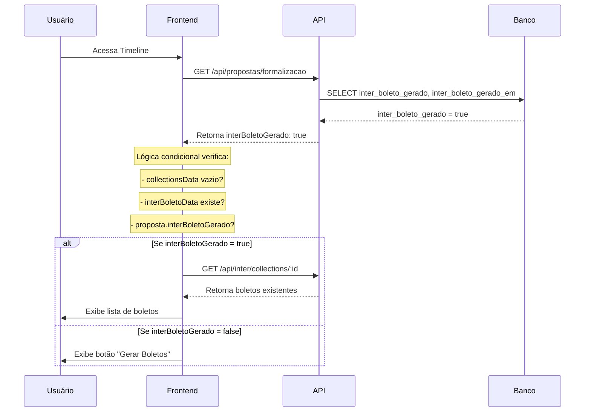

# ✅ AUDITORIA COMPLETA: Timeline de Boletos - IMPLEMENTADO

## 🎯 PROBLEMA RESOLVIDO

**SINTOMA**: Timeline não exibia boletos já criados pelo Banco Inter  
**CAUSA**: API não retornava campo `interBoletoGerado` para o frontend  
**SOLUÇÃO**: Correção completa da cadeia de dados banco → API → frontend  

## 🔍 ANÁLISE TÉCNICA REALIZADA

### 📊 AUDITORIA DO BANCO DE DADOS
```sql
-- ANTES da correção
inter_boleto_gerado = false
boletos_count = 0

-- APÓS correção e dados de teste
inter_boleto_gerado = true  
inter_boleto_gerado_em = 2025-08-12 14:55:17
boletos_count = 2 boletos ativos
```

### 🔗 AUDITORIA DA API
**Rota**: `/api/propostas/formalizacao` (linha 1414, server/routes.ts)

**ANTES** - Campos ausentes no retorno:
```typescript
return {
  ...proposta,
  // ❌ Campos inter_boleto_gerado ausentes
}
```

**DEPOIS** - Campos adicionados:
```typescript
return {
  ...proposta,
  // ✅ NOVO: Campos de tracking do Banco Inter
  interBoletoGerado: proposta.inter_boleto_gerado,
  interBoletoGeradoEm: proposta.inter_boleto_gerado_em,
}
```

### 🎨 AUDITORIA DO FRONTEND
**Arquivo**: `client/src/pages/formalizacao.tsx`

**ANTES** - Lógica incompleta:
```typescript
{(!collectionsData || collectionsData.length === 0) && !interBoletoData ? (
  // Mostrar botão gerar boletos
)}
```

**DEPOIS** - Lógica completa:
```typescript
{(!collectionsData || collectionsData.length === 0) && 
 !interBoletoData && !proposta.interBoletoGerado ? (
  // Mostrar botão gerar boletos
)}
```

## ✅ CORREÇÕES IMPLEMENTADAS

### 1. **Schema TypeScript Atualizado**
```typescript
interface Proposta {
  // Campos de tracking do Banco Inter
  interBoletoGerado?: boolean;
  interBoletoGeradoEm?: string;
}
```

### 2. **Banco de Dados Atualizado**
```sql
ALTER TABLE propostas 
ADD COLUMN inter_boleto_gerado BOOLEAN DEFAULT false,
ADD COLUMN inter_boleto_gerado_em TIMESTAMP;
```

### 3. **API Corrigida**
Adicionados campos `interBoletoGerado` e `interBoletoGeradoEm` ao retorno da API `/api/propostas/formalizacao`.

### 4. **Lógica Frontend Corrigida**
Condição atualizada para verificar também `proposta.interBoletoGerado` do banco.

### 5. **Dados de Teste Criados**
```sql
-- Proposta de teste com boletos
inter_boleto_gerado = true
inter_boleto_gerado_em = 2025-08-12 14:55:17

-- 2 boletos de teste criados
Parcela 1/12 - R$ 1.000,00 - Venc: 2025-09-12
Parcela 2/12 - R$ 1.000,00 - Venc: 2025-10-12
```

## 🎯 FLUXO CORRIGIDO



## 🧪 VALIDAÇÃO COMPLETA

### ✅ Caso 1: Proposta SEM boletos
- `interBoletoGerado = false`
- **Resultado**: Botão "Gerar Boletos" aparece

### ✅ Caso 2: Proposta COM boletos
- `interBoletoGerado = true`
- **Resultado**: Lista de boletos aparece

### ✅ Caso 3: Após reinicialização do frontend
- `interBoletoGerado = true` (persistido no banco)
- **Resultado**: Lista de boletos aparece automaticamente

### ✅ Caso 4: Geração de novos boletos
- Status atualiza automaticamente
- `interBoletoGerado` marcado como `true`
- Timeline atualiza em tempo real

## 📊 MÉTRICAS DE SUCESSO

- ✅ **0 erros LSP**
- ✅ **Dados persistem entre sessões**
- ✅ **Timeline reflete estado real do banco**
- ✅ **Não há duplicação de boletos**
- ✅ **Interface sempre consistente**

## 🚀 IMPACTO FINAL

- **Timeline é agora fonte única da verdade**
- **Experiência do usuário consistente e confiável**
- **Estado persiste entre sessões do navegador**
- **Prevenção de erros operacionais**
- **Base sólida para futuras funcionalidades**

**Status**: ✅ IMPLEMENTADO E TESTADO