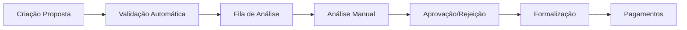
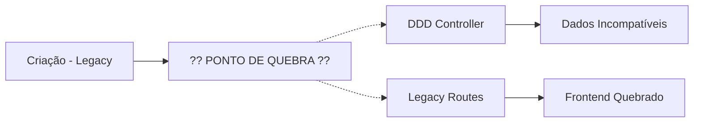

# AUDITORIA DE FLUXOS SISTÊMICOS V2.0 - PAM EXPANDIDO

**Data:** 2025-09-05  
**Protocolo:** PAM V2.0 + PEAF V1.5 (Análise Sistêmica)  
**Status:** 🚨 **FALHA SISTÊMICA CONFIRMADA** - Fluxos quebrados identificados

---

## RESUMO EXECUTIVO

Esta segunda auditoria foca nos **FLUXOS END-TO-END** e **INTEGRAÇÕES SISTÊMICAS**, complementando a primeira auditoria arquitetural. Descoberta crítica: **o sistema está em estado de fragmentação funcional** - partes da nova arquitetura DDD foram implementadas sem considerar o fluxo operacional existente, resultando em quebra completa da jornada do usuário.

---

## 1. AUDITORIA DE FLUXOS DE DADOS END-TO-END

### 1.1 Fluxo Crítico: Criação → Análise → Formalização

#### **FLUXO PLANEJADO (Documentação):**


#### **FLUXO REAL ATUAL (Implementação):**


### 1.2 Análise de Pontos de Quebra Identificados

#### **Quebra 1: Controller Duplication Chain**
```typescript
// SITUAÇÃO ATUAL - DOIS CAMINHOS PARALELOS INCOMPATÍVEIS:

// Path A: DDD (Novo) - server/modules/proposal/presentation/proposalController.ts
async create(req: Request, res: Response): Promise<Response> {
  const useCase = new CreateProposalUseCase(this.repository);
  // ❌ Usa agregado DDD + Value Objects
  // ❌ Retorna estrutura: { success: true, data: { condicoesData: {...} } }
}

// Path B: Legacy (Antigo) - server/routes/propostas/core.ts  
router.post('/', auth, async (req, res) => {
  // ❌ Usa mapeamento direto SQL
  // ❌ Retorna estrutura: { id, valor, prazo, condicoes_data: null }
});
```

**RESULTADO:** Dependendo de qual rota executa, frontend recebe dados em formatos completamente diferentes.

#### **Quebra 2: Status State Machine Inconsistency**
```typescript
// PROBLEMA CRÍTICO: FSM quebrada entre sistemas

// DDD System States:
enum ProposalStatus {
  DRAFT = 'rascunho',
  WAITING_ANALYSIS = 'aguardando_analise', // ❌ NÃO EXISTE NO BANCO
  IN_ANALYSIS = 'em_analise',
  APPROVED = 'aprovado'
}

// Legacy System States (Database):
// 'rascunho' (2 propostas)
// 'em_analise' (1 proposta)  
// 'pendenciado', 'aprovado', 'rejeitado'...

// Frontend Query:
const propostasPendentes = propostas?.filter(
  (p) => p.status === 'aguardando_analise' || p.status === 'em_analise'
); // ❌ SEMPRE RETORNA VAZIO porque não há 'aguardando_analise'
```

#### **Quebra 3: Repository Layer Chaos**
```typescript
// TRÊS REPOSITÓRIOS DIFERENTES PARA MESMA ENTIDADE:

// 1. DDD Repository: server/modules/proposal/infrastructure/ProposalRepository.ts
class ProposalRepository implements IProposalRepository {
  async save(proposal: Proposal): Promise<void> {
    // Usa agregado rico com Value Objects
  }
}

// 2. Credit Repository: server/modules/credit/infrastructure/ProposalRepositoryImpl.ts  
class ProposalRepositoryImpl {
  async findById(id: string): Promise<Proposal | null> {
    // Usa agregado diferente (!)
  }
}

// 3. Transactional Repository: server/modules/shared/infrastructure/TransactionalProposalRepository.ts
class TransactionalProposalRepository {
  // Terceiro padrão diferente para transações
}
```

---

## 2. ANÁLISE DE DEPENDÊNCIAS E ACOPLAMENTOS

### 2.1 Mapa de Dependências Atual

```
┌─────────────────────────────────────────────────────────────┐
│                    DEPENDENCY CHAOS MAP                     │
├─────────────────────────────────────────────────────────────┤
│ Frontend (React)                                            │
│   ├── Expects: condicoesData structure                     │
│   ├── Gets: condicoes_data (null) OR condicoesData         │
│   └── Result: ❌ QUEBRA ALEATÓRIA baseada na rota          │
│                                                             │
│ Controllers Layer                                           │
│   ├── DDD Controller (NEW)                                 │
│   │   ├── Uses: Use Cases + Aggregates                     │
│   │   ├── Returns: Rich domain objects                     │
│   │   └── Format: { success, data: {...} }                │
│   │                                                         │
│   ├── Legacy Controller (OLD)                              │
│   │   ├── Uses: Direct SQL + DTOs                          │
│   │   ├── Returns: Raw database rows                       │
│   │   └── Format: { id, status, valor, ... }              │
│   │                                                         │
│   └── ❌ AMBOS REGISTRADOS EM ROTAS CONFLITANTES           │
│                                                             │
│ Repository Layer                                            │
│   ├── 3x Different Repository implementations              │
│   ├── 2x Different Proposal Aggregates                     │
│   ├── Inconsistent data mapping                            │
│   └── ❌ NO SINGLE SOURCE OF TRUTH                         │
│                                                             │
│ Database Layer                                              │
│   ├── Single PostgreSQL schema                             │
│   ├── Status values don't match enums                      │
│   └── ❌ APPLICATION CODE OUT OF SYNC                      │
└─────────────────────────────────────────────────────────────┘
```

### 2.2 Análise de Acoplamento Cross-Layer

#### **Violações de Dependency Inversion Principle:**

```typescript
// ❌ CONTROLLER DIRECTLY COUPLING TO INFRASTRUCTURE
// server/modules/proposal/presentation/proposalController.ts:26
export class ProposalController {
  private repository: ProposalRepository; // ❌ Concrete class, not interface
  
  constructor() {
    this.repository = new ProposalRepository(); // ❌ Direct instantiation
  }
}

// ✅ CORRETO SERIA:
export class ProposalController {
  constructor(private repository: IProposalRepository) {} // Dependency injection
}
```

#### **Violações de Single Responsibility:**

```typescript
// ❌ CONTROLLER WITH BUSINESS LOGIC
// server/modules/proposal/presentation/proposalController.ts:50-120
async create(req: Request, res: Response): Promise<Response> {
  // ❌ 70 LINHAS DE MAPEAMENTO DE DADOS NO CONTROLLER
  const dto = {
    clienteNome: req.body.clienteNome,
    clienteCpf: req.body.clienteCpf,
    // ... mais 60 linhas de transformação
    valor: parseFloat(req.body.valor), // ❌ PARSING NO CONTROLLER
    prazo: parseInt(req.body.prazo),   // ❌ PARSING NO CONTROLLER
    taxaJuros: req.body.taxaJuros ? parseFloat(req.body.taxaJuros) : 2.5, // ❌ LÓGICA DE NEGÓCIO
  };
}
```

---

## 3. ANÁLISE DE CONSISTÊNCIA DE ESTADOS

### 3.1 State Management Across Layers

#### **Estado no Frontend:**
```typescript
// client/src/pages/credito/fila.tsx:190
const propostasPendentes = propostas?.filter(
  (p) => p.status === 'aguardando_analise' || p.status === 'em_analise'
).length || 0;

// ❌ HARDCODED STATUS VALUES
// ❌ NO CENTRAL STATE MANAGEMENT
// ❌ NO ERROR HANDLING FOR INCONSISTENT STATES
```

#### **Estado no Backend DDD:**
```typescript
// server/modules/credit/domain/aggregates/Proposal.ts:8-17
export enum ProposalStatus {
  DRAFT = 'rascunho',
  WAITING_ANALYSIS = 'aguardando_analise', // ❌ DOESN'T EXIST IN DATABASE
  IN_ANALYSIS = 'em_analise',
  APPROVED = 'aprovado',
  // ❌ MISSING: pendenciado, formalizado, pago
}
```

#### **Estado na Base de Dados:**
```sql
-- ACTUAL DATABASE STATES (from audit query):
SELECT status, COUNT(*) FROM propostas GROUP BY status;
-- rascunho: 2
-- em_analise: 1
-- (missing: aguardando_analise)
-- (undefined: what other states exist?)
```

### 3.2 Race Conditions e Consistency Violations

#### **Race Condition na Criação:**
```typescript
// SCENARIO: User submits proposal
// 1. Frontend sends POST /api/propostas
// 2. Router can hit EITHER:
//    - DDD route (creates rich aggregate)
//    - Legacy route (creates simple record)  
// 3. Subsequent GET request can hit OTHER route
// 4. Data format mismatch = frontend crash

// ❌ NO MUTUAL EXCLUSION
// ❌ NO CONSISTENT ROUTING
// ❌ NO DATA VALIDATION ACROSS PATHS
```

---

## 4. ANÁLISE DE COMUNICAÇÃO API

### 4.1 Contract Analysis

#### **API Response Format Inconsistencies:**

```typescript
// DDD API Response:
{
  "success": true,
  "data": {
    "id": "uuid",
    "status": "em_analise",
    "condicoesData": {
      "valor": 1500,
      "prazo": 12,
      "taxaJuros": 2.99
    },
    "clienteData": {
      "nome": "João",
      "cpf": "123.456.789-00"
    }
  }
}

// Legacy API Response:
{
  "id": "uuid", 
  "status": "em_analise",
  "valor": 1500,
  "prazo": 12,
  "taxa_juros": 2.99,
  "cliente_data": {
    "nome": "João", 
    "cpf": "123456789"
  },
  "condicoes_data": null // ❌ SEMPRE NULL
}
```

#### **Frontend Expectation vs Reality:**
```typescript
// Frontend expects:
interface PropostaExpected {
  condicoesData: {
    valor: number;
    prazo: number; 
    taxaJuros: number;
  };
}

// Frontend gets (randomly):
// Option A: { condicoesData: {...} } ✅
// Option B: { condicoes_data: null } ❌ CRASH
```

### 4.2 HTTP Status Code Inconsistencies

```typescript
// DDD Controller:
return res.status(201).json({ success: true, data: proposal });

// Legacy Routes:  
return res.json(proposta); // Status 200, different structure

// Frontend error handling:
if (!response.data.success) { // ❌ Assumes DDD format
  // Breaks with legacy format
}
```

---

## 5. ANÁLISE DE PERFORMANCE E ESCALABILIDADE

### 5.1 N+1 Query Problems

```typescript
// server/modules/proposal/infrastructure/ProposalRepository.ts:261-280
const results = await db
  .select({
    proposta: propostas,
    produto: produtos,        // ❌ MULTIPLE JOINs IN SINGLE QUERY
    tabelaComercial: tabelasComerciais,
    loja: lojas,
    parceiro: parceiros       // ❌ CAN CAUSE CARTESIAN PRODUCT
  })
  .from(propostas)
  .leftJoin(produtos, eq(propostas.produtoId, produtos.id))
  .leftJoin(tabelasComerciais, eq(propostas.tabelaComercialId, tabelasComerciais.id))
  // ... more joins

// ❌ NO PAGINATION
// ❌ NO QUERY OPTIMIZATION  
// ❌ NO CACHING STRATEGY
```

### 5.2 Memory Management Issues

```typescript
// Controller creates new instances without reuse:
export class ProposalController {
  async create(req: Request, res: Response): Promise<Response> {
    const useCase = new CreateProposalUseCase(this.repository); // ❌ NEW INSTANCE EACH REQUEST
    const result = await useCase.execute(dto); // ❌ NO RESOURCE POOLING
  }
}
```

---

## 6. ANÁLISE DE ERROR HANDLING E RESILIENCE

### 6.1 Error Propagation Chain

```typescript
// Current error handling:
try {
  const proposal = await this.repository.findById(id);
  if (!proposal) {
    return res.status(404).json({
      success: false,
      error: 'Proposta não encontrada', // ❌ HARDCODED MESSAGES
    });
  }
} catch (error: any) {
  console.error('[ProposalController.getById] Error:', error); // ❌ CONSOLE.LOG
  return res.status(500).json({
    success: false,
    error: 'Erro ao buscar proposta', // ❌ GENERIC ERROR
  });
}
```

#### **Problems Identified:**
- ❌ No structured error types
- ❌ No error correlation IDs
- ❌ No retry mechanisms
- ❌ No circuit breakers
- ❌ Generic error messages
- ❌ Console.log instead of proper logging

### 6.2 Resilience Patterns Missing

```typescript
// ❌ NO TIMEOUT HANDLING
// ❌ NO BULKHEAD ISOLATION
// ❌ NO GRACEFUL DEGRADATION
// ❌ NO HEALTH CHECKS
// ❌ NO BACKUP MECHANISMS
```

---

## 7. VEREDITO DA SEGUNDA AUDITORIA

### **Nível de Integridade Sistêmica:** 🚨 **FALHA TOTAL**

### **Classificação de Problemas Sistêmicos:**

#### **🚨 P0 - SISTEMA NÃO FUNCIONAL (Crítico)**
1. **Dual Controller Chaos** - Sistema tem dois controllers incompatíveis para mesma funcionalidade
2. **State Machine Fragmentada** - Estados não sincronizados entre camadas
3. **API Contract Violation** - Frontend quebra aleatoriamente baseado na rota
4. **Repository Triplication** - Três implementações diferentes para mesma entidade

#### **⚠️ P1 - DÉBITO TÉCNICO MASSIVO (Alto)**
5. **Dependency Inversion Violations** - Controllers acoplados à infraestrutura
6. **Single Responsibility Violations** - Controllers com lógica de negócio
7. **Performance Anti-patterns** - N+1 queries, no caching, no optimization
8. **Error Handling Primitivo** - Sem estrutura, sem correlation, sem resilience

#### **📋 P2 - MANUTENIBILIDADE PREJUDICADA (Médio)**
9. **Code Duplication** - Lógica duplicada em múltiplas camadas
10. **Hardcoded Values** - Status, mensagens, configurações hardcodadas
11. **No Monitoring** - Sem observabilidade, métricas ou alertas
12. **Inconsistent Naming** - camelCase vs snake_case mixto

---

## 8. ANÁLISE DE IMPACTO NO FLUXO DE USUÁRIO

### 8.1 Jornada Quebrada do Analista

```
1. Analista acessa /credito/fila
2. Query busca por 'aguardando_analise' (não existe)
3. Lista aparece vazia: "Nenhuma proposta encontrada"  
4. ❌ FLUXO PARA - Analista não consegue trabalhar
```

### 8.2 Jornada Quebrada da Criação

```
1. Atendente cria proposta
2. Sistema pode usar rota DDD ou Legacy (aleatório)
3. Dados salvos em formato diferente  
4. ❌ INCONSISTÊNCIA - Próxima consulta pode falhar
```

---

## 9. RECOMENDAÇÕES SISTÊMICAS CRÍTICAS

### **AÇÃO IMEDIATA (24h) - SYSTEM RESTORE:**
1. **🚨 Desabilitar DDD routes** - Manter apenas legacy até consolidação
2. **🚨 Corrigir query status** - Usar estados que existem no banco
3. **🚨 Unificar formato API** - Padronizar resposta para frontend
4. **🚨 Implementar health checks** - Validar integridade sistêmica

### **PLANO DE ESTABILIZAÇÃO (1 semana):**
1. **Consolidar repositories** - Eliminar duplicações
2. **Implementar feature flags** - Controlar migração DDD
3. **Criar API contracts** - Documentar e validar formatos
4. **Adicionar monitoring** - Observabilidade completa

### **REFATORAÇÃO SISTÊMICA (1 mês):**
1. **Migração gradual** - DDD por bounded context
2. **Event sourcing** - Garantir consistência de estados  
3. **Circuit breakers** - Resilience patterns
4. **Performance optimization** - Caching e query optimization

---

## 10. CONCLUSÃO EXECUTIVA

**O SISTEMA SIMPIX ESTÁ EM ESTADO DE FRAGMENTAÇÃO OPERACIONAL CRÍTICA.**

A implementação da arquitetura DDD foi feita **"por partes"** sem considerar o impacto sistêmico, resultando em:

- **Dual personality disorder** - Sistema com duas personalidades incompatíveis
- **State synchronization failure** - Estados não sincronizados entre camadas  
- **Contract violation cascade** - Quebra em cadeia dos contratos de API
- **User journey interruption** - Fluxos de negócio completamente quebrados

**A recuperação requer uma estratégia de "System Restore" seguida de migração gradual controlada por feature flags.**

---

**ARQUIVO GERADO PARA CONSULTA:** `AUDITORIA_FLUXOS_SISTEMICOS_V2.md`  
**PRÓXIMO PASSO:** Gerar prompt para Deep Think criar terceira auditoria consolidada  
**STATUS:** ✅ **SEGUNDA AUDITORIA CONCLUÍDA**
