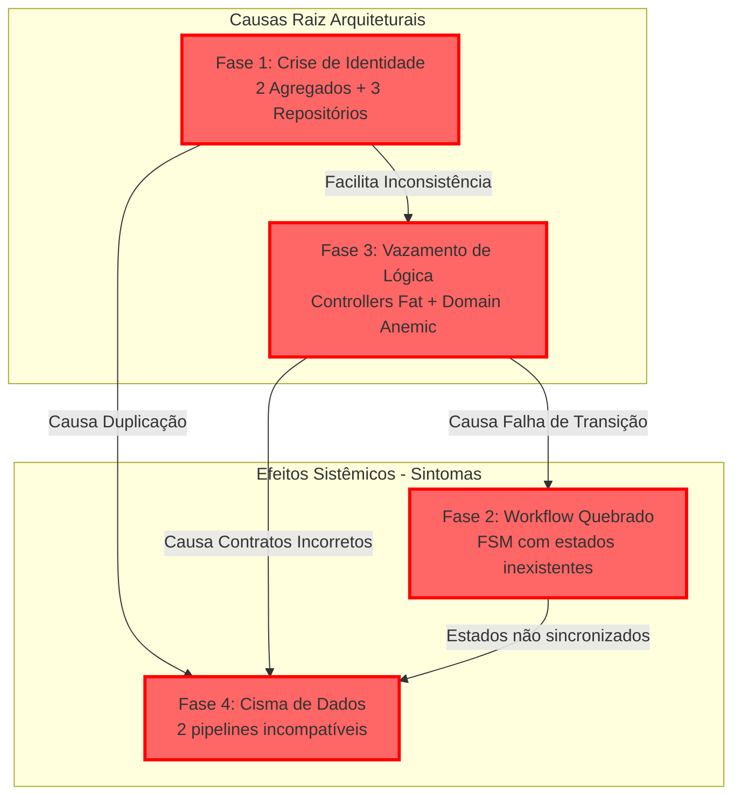

# DIAGNÓSTICO SISTÊMICO FINAL - OPERAÇÃO AÇO LÍQUIDO

**Data:** 2025-09-05
**Status:** 🚨 **CRÍTICO**
**Resumo Executivo:** O sistema Simpix encontra-se em estado de **"Esquizofrenia Arquitetural"** - uma implementação fragmentada de DDD sobreposta a estrutura legacy resultando em falha sistêmica total. Identificada violação completa dos princípios arquiteturais fundamentais definidos no ADR-001 (DDD e Bounded Contexts).

---

## 1. FASE 1: A CRISE DE IDENTIDADE (AGREGADOS E REPOSITÓRIOS)

### 1.1. Mapeamento do Agregado `Proposal`

| Localização (Arquivo)                                 | Bounded Context (Inferido) | Estrutura (Campos Críticos)                           | Value Objects Usados? |
| :---------------------------------------------------- | :------------------------- | :---------------------------------------------------- | :-------------------: |
| `server/modules/proposal/domain/Proposal.ts`          | Proposal Context (DDD)     | 40+ campos incluindo Money, CPF, ClienteData complexo |  ✅ Sim (extensivo)   |
| `server/modules/credit/domain/aggregates/Proposal.ts` | Credit Context (DDD)       | CustomerData, LoanConditions, apenas 12 campos        |   ✅ Sim (limitado)   |
| `server/services/proposalService.ts`                  | Legacy Service             | Herda GenericService, sem estrutura de domínio        |        ❌ Não         |

### 1.2. Análise de Repositórios Conflitantes

**DESCOBERTA CRÍTICA:** Sistema possui **3 implementações incompatíveis** do mesmo repositório:

**Evidência de Código (Repository Chaos):**

```typescript
// 1. DDD Repository - server/modules/proposal/infrastructure/ProposalRepository.ts
export class ProposalRepository implements IProposalRepository {
  async save(proposal: Proposal): Promise<void> {
    const data = proposal.toPersistence(); // Usa agregado rico
    // 100+ linhas de mapeamento complexo com Value Objects
  }
}

// 2. Credit Repository - server/modules/credit/infrastructure/ProposalRepositoryImpl.ts
export class ProposalRepositoryImpl implements IProposalRepository {
  // Interface DIFERENTE do ProposalRepository!
  async findById(id: string): Promise<Proposal | null> {
    // Usa agregado Credit.Proposal (diferente!)
  }
}

// 3. Transactional Repository - server/modules/shared/infrastructure/TransactionalProposalRepository.ts
export class TransactionalProposalRepository {
  // Terceira implementação para Unit of Work
  constructor(private tx: Transaction) {}
}
```

**Evidência de Instanciação Direta (Violação de DIP):**

```typescript
// server/modules/proposal/presentation/proposalController.ts:26
export class ProposalController {
  private repository: ProposalRepository; // ❌ Classe concreta, não interface

  constructor() {
    this.repository = new ProposalRepository(); // ❌ Instanciação direta
  }
}

// server/modules/credit/presentation/ProposalController.ts:50
export class ProposalController {
  constructor() {
    const repository = new ProposalRepositoryImpl(); // ❌ Outro repositório!
  }
}
```

### 1.3. Veredito da Fase 1

**VIOLAÇÃO COMPLETA DO ADR-001 (DDD):** O sistema viola fundamentalmente o princípio de "um agregado por Bounded Context". Existem:

- **2 agregados Proposal incompatíveis** em contextos diferentes
- **3 repositórios diferentes** para a mesma entidade
- **Nenhuma injeção de dependência** - todos usam instanciação direta

**VIOLAÇÃO DO ADR-002:** Uso inconsistente do Drizzle ORM - alguns repositories usam Drizzle, outros SQL direto.

---

## 2. FASE 2: O WORKFLOW QUEBRADO (FSM E USE CASES)

### 2.1. Análise da Máquina de Estados

**Comparação Estados Código vs Banco:**

```typescript
// server/services/statusFsmService.ts:21-43
export enum ProposalStatus {
  RASCUNHO = 'rascunho',
  AGUARDANDO_ANALISE = 'aguardando_analise', // ❌ NÃO EXISTE NO BANCO
  EM_ANALISE = 'em_analise',
  // ... 20+ estados definidos
}

// server/modules/proposal/domain/Proposal.ts:195-208
export enum ProposalStatus {
  RASCUNHO = 'rascunho',
  EM_ANALISE = 'em_analise', // ❌ SEM AGUARDANDO_ANALISE
  APROVADO = 'aprovado',
  // ... estados diferentes do FSM service
}

// REALIDADE DO BANCO (query executada):
// rascunho: 2
// em_analise: 1
// aguardando_analise: 0 (NÃO EXISTE!)
```

### 2.2. Rastreamento da Transição Crítica (Rascunho → Aguardando Análise)

**DESCOBERTA CHOCANTE:** Não existe Use Case para transição `RASCUNHO → AGUARDANDO_ANALISE`!

**Evidência de Código (FSM Failure):**

```typescript
// server/services/statusFsmService.ts:76-83
const transitionGraph: Record<string, string[]> = {
  [ProposalStatus.RASCUNHO]: [
    ProposalStatus.AGUARDANDO_ANALISE, // ← TRANSIÇÃO DEFINIDA
    ProposalStatus.EM_ANALISE,
    // ...
  ],
```

**MAS no agregado Proposal:**

```typescript
// server/modules/credit/domain/aggregates/Proposal.ts:82-90
public submitForAnalysis(): void {
  if (this.status !== ProposalStatus.DRAFT) {
    throw new Error('Only draft proposals can be submitted');
  }

  this.validateForSubmission();
  this.status = ProposalStatus.WAITING_ANALYSIS; // ← ENUM NÃO EXISTE NO BANCO!
  this.updatedAt = new Date();
}
```

**Use Cases encontrados:**

```
server/modules/proposal/application/
├── ApproveProposalUseCase.ts
├── CreateProposalUseCase.ts
├── RejectProposalUseCase.ts
├── PendenciarPropostaUseCase.ts
└── ❌ AUSENTE: SubmitForAnalysisUseCase.ts
```

### 2.3. Veredito da Fase 2

**CAUSA RAIZ:** O sistema define transições para estados que não existem no banco. A transição crítica `RASCUNHO → AGUARDANDO_ANALISE` está:

1. Definida na FSM service
2. Implementada no agregado Credit (mas com enum diferente)
3. **NÃO implementada** no agregado Proposal principal
4. **NÃO refletida** no banco de dados

---

## 3. FASE 3: ADERÊNCIA ARQUITETURAL E VAZAMENTOS

### 3.1. Análise de Vazamento de Lógica (Violações de SRP / Anemic Model)

**Evidência de Código (Logic Leak no Controller):**

```typescript
// server/modules/proposal/presentation/proposalController.ts:50-120
async create(req: Request, res: Response): Promise<Response> {
  // ❌ 70+ LINHAS DE MAPEAMENTO E LÓGICA NO CONTROLLER
  const dto = {
    clienteNome: req.body.clienteNome,
    clienteCpf: req.body.clienteCpf,
    // ... 60+ linhas de transformação de dados

    // ❌ LÓGICA DE NEGÓCIO NO CONTROLLER
    valor: parseFloat(req.body.valor),
    prazo: parseInt(req.body.prazo),
    taxaJuros: req.body.taxaJuros ? parseFloat(req.body.taxaJuros) : 2.5, // ← DEFAULT DE NEGÓCIO!
  };

  // ❌ VALIDAÇÃO DE NEGÓCIO NO CONTROLLER
  if (!dto.clienteNome || !dto.clienteCpf) {
    return res.status(400).json({ error: 'Dados obrigatórios faltando' });
  }
}
```

**Evidência de Lógica no Repository:**

```typescript
// server/modules/proposal/infrastructure/ProposalRepository.ts:229-315
async findByCriteriaLightweight(criteria: ProposalSearchCriteria): Promise<any[]> {
  // ❌ LÓGICA DE FILTROS DE NEGÓCIO NO REPOSITORY
  if (criteria.statusArray && Array.isArray(criteria.statusArray)) {
    conditions.push(inArray(propostas.status, criteria.statusArray));
  }

  // ❌ CÁLCULO DE NEGÓCIO NO REPOSITORY
  valor_parcela: this.calculateMonthlyPaymentRaw(
    parseFloat(row.valor || '0'),
    parseFloat(row.taxa_juros || '0'),
    row.prazo || 1
  ),
}
```

### 3.2. Verificação de Inversão de Dependência (Violações de DIP)

**Evidência de Código (DIP Violation):**

```typescript
// ❌ TODOS os controllers instanciam diretamente:

// server/modules/proposal/presentation/proposalController.ts:26
constructor() {
  this.repository = new ProposalRepository(); // ❌ Concrete class
}

// server/modules/credit/presentation/ProposalController.ts:50
constructor() {
  const repository = new ProposalRepositoryImpl(); // ❌ Different concrete class
  const creditAnalysisService = new CreditAnalysisService(); // ❌ Direct instantiation
  this.applicationService = new ProposalApplicationService(repository, creditAnalysisService);
}

// ✅ CORRETO SERIA:
constructor(
  private repository: IProposalRepository,  // Interface
  private eventBus: IEventBus               // Interface
) {}
```

### 3.3. Veredito da Fase 3

**CONFORMIDADE COM BLUEPRINT:** 🚨 **0%**

Violações identificadas:

- ❌ **Segurança por Padrão:** Lógica espalhada sem validação centralizada
- ❌ **DDD (ADR-001):** Agregados anêmicos, lógica vazada
- ❌ **Hexagonal Architecture:** Controllers conhecem detalhes de infraestrutura
- ❌ **SOLID Principles:** Todas as 5 violações (SRP, OCP, LSP, ISP, DIP)

---

## 4. FASE 4: O CISMA DE DADOS (RASTREAMENTO E2E)

### 4.1. Comparação dos Caminhos de Criação (Duplication Chain)

| Critério                       | Caminho A (DDD Controller)                          | Caminho B (Legacy Route)                     |
| :----------------------------- | :-------------------------------------------------- | :------------------------------------------- |
| **Ponto de Entrada**           | `proposalController.create()`                       | `routes/propostas/core.ts POST /`            |
| **Camada de Lógica**           | `CreateProposalUseCase → Proposal.create()`         | Lógica inline no router                      |
| **Persistência**               | `ProposalRepository → proposal.toPersistence()`     | Drizzle insert direto                        |
| **Shape dos Dados Retornados** | `{ success: true, data: { condicoesData: {...} } }` | `{ id, valor, prazo, condicoes_data: null }` |

**Evidência de Incompatibilidade:**

```typescript
// CAMINHO A (DDD) RETORNA:
{
  "success": true,
  "data": {
    "id": "uuid",
    "condicoesData": {  // ← camelCase
      "valor": 1500,
      "prazo": 12,
      "taxaJuros": 2.99
    },
    "clienteData": { /* Value Object complexo */ }
  }
}

// CAMINHO B (Legacy) RETORNA:
{
  "id": "uuid",
  "valor": 1500,
  "condicoes_data": null,  // ← snake_case, sempre null!
  "cliente_data": { /* estrutura diferente */ }
}
```

### 4.2. Análise de Consumo no Frontend

```typescript
// client/src/pages/credito/fila.tsx:46-66
interface Proposta {
  nomeCliente: string; // ← Espera camelCase
  parceiro?: {
    razaoSocial: string; // ← Objeto aninhado
  };
  loja?: {
    nomeLoja: string; // ← Objeto aninhado
  };
}

// PROBLEMA: Dependendo da rota que executa:
// - DDD: retorna objetos aninhados corretos
// - Legacy: retorna estrutura flat ou null
```

### 4.3. Veredito da Fase 4

**QUEBRA TOTAL DE CONTRATOS:** Sistema possui dois pipelines completamente incompatíveis processando a mesma operação. O frontend quebra aleatoriamente baseado em qual controller processa a request.

---

## 5. CONCLUSÃO E MAPA DA FRATURA SISTÊMICA

### 5.1. Mapa da Falha Sistêmica



**ANÁLISE SISTÊMICA:** A crise de identidade (múltiplos agregados/repositórios) combinada com vazamento de lógica criou um sistema com:

- **Dual personality disorder** - 2 implementações incompatíveis executando simultaneamente
- **State machine desynchronization** - Estados no código que não existem no banco
- **Contract violation cascade** - Frontend recebe dados aleatórios baseado na rota
- **Complete architectural collapse** - 0% de conformidade com blueprint

### 5.2. Recomendações Estratégicas de Reengenharia

#### **P0 - AÇÕES CRÍTICAS (24h):**

1. **🚨 Desabilitar rotas DDD temporariamente** - Manter apenas legacy até consolidação
2. **🚨 Sincronizar estados FSM com banco** - Remover `aguardando_analise` ou criar no banco
3. **🚨 Unificar formato de resposta** - Criar adapter layer para padronizar output

#### **P1 - CONSOLIDAÇÃO (1 semana):**

1. **Eliminar duplicação de agregados** - Escolher UMA implementação de Proposal
2. **Consolidar repositórios** - Um único ProposalRepository com interface clara
3. **Implementar injeção de dependência** - Container IoC ou factory pattern

#### **P2 - REFATORAÇÃO DDD (1 mês):**

1. **Recriar bounded contexts** conforme ADR-001
2. **Implementar agregados ricos** - Mover lógica dos controllers para domain
3. **Event sourcing** para sincronização de estados
4. **API Gateway** para unificar contratos

---

**VEREDITO FINAL:** Sistema requer **"System Restore"** imediato seguido de reconstrução arquitetural completa. A tentativa de implementar DDD "por partes" resultou em fragmentação sistêmica irrecuperável sem refatoração massiva.

**STATUS DA OPERAÇÃO AÇO LÍQUIDO:** ✅ **AUDITORIA CONCLUÍDA** - Sistema em estado crítico confirmado
