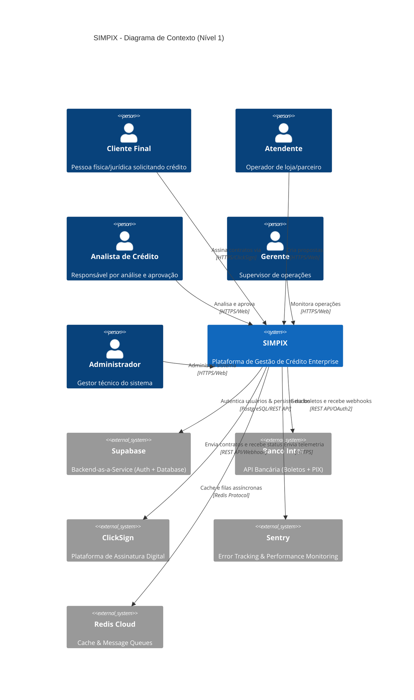
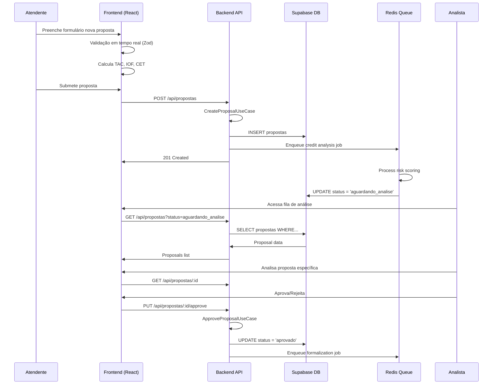
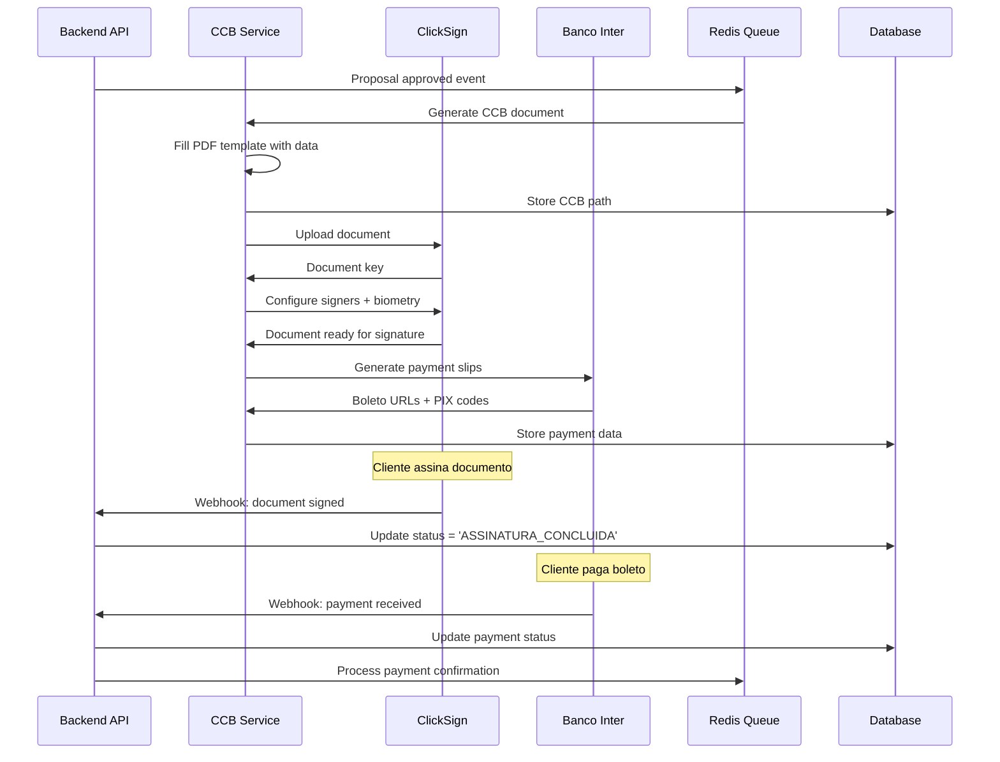
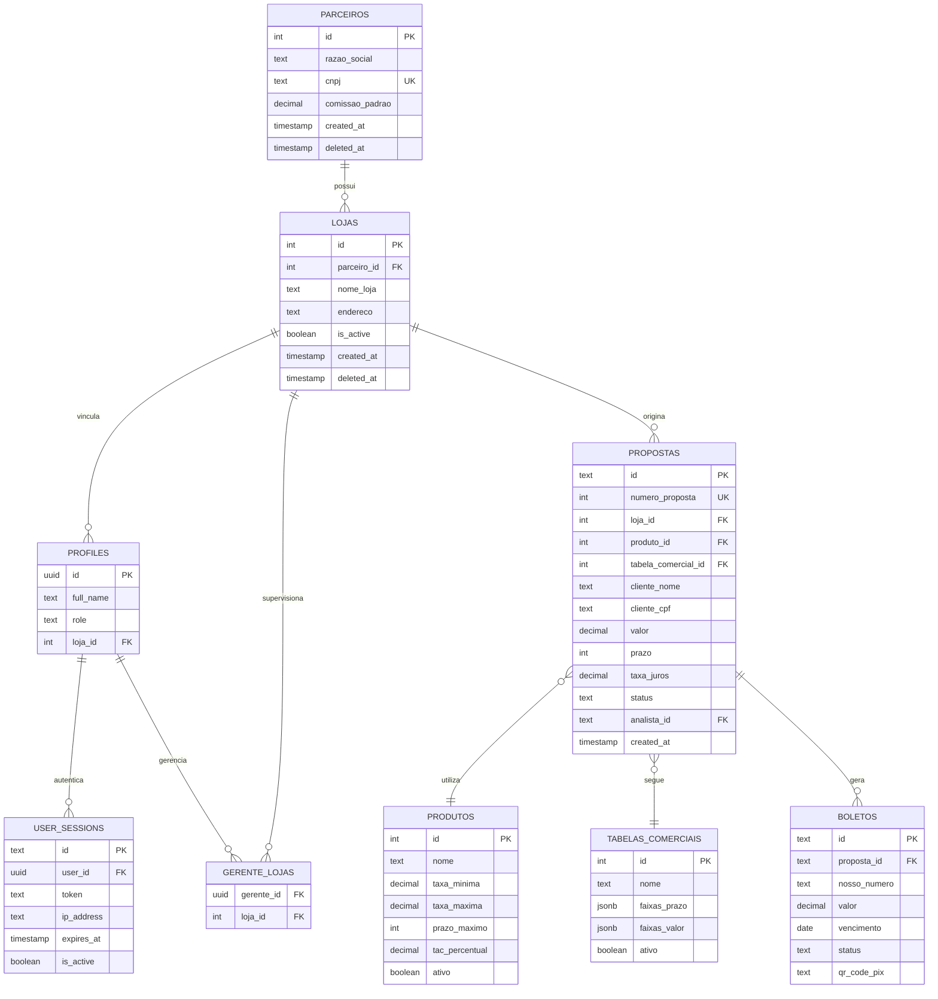
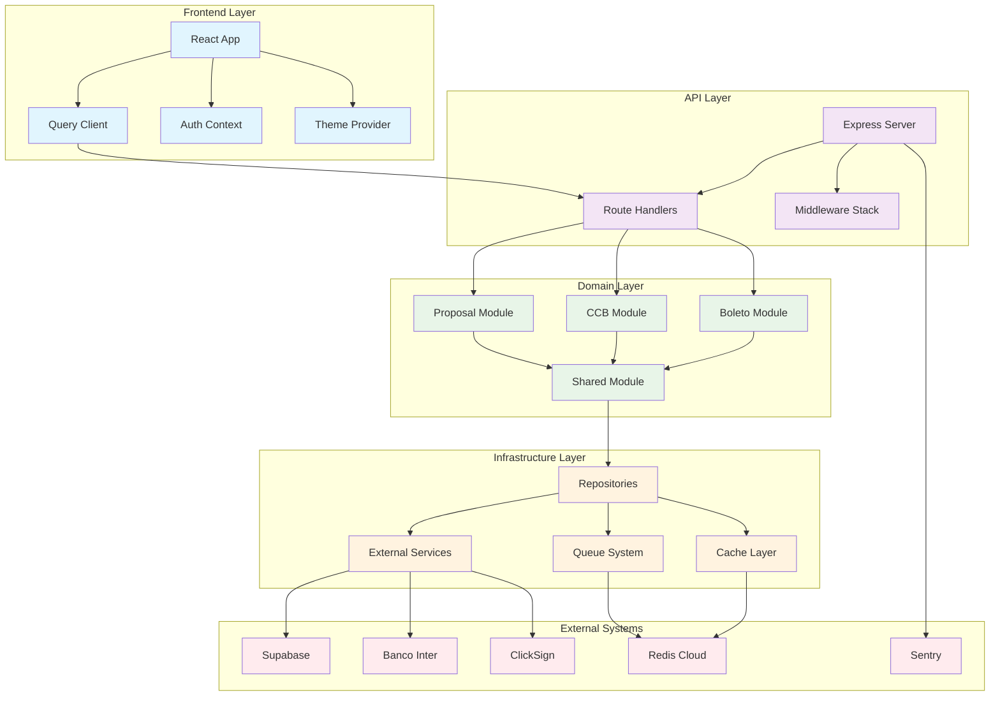

# DOSSIÊ DE CONTEXTO TÉCNICO COMPLETO: PROJETO SIMPIX

## 1. Visão Geral e Propósito de Negócio

### **Problema Central**
O SIMPIX resolve a fragmentação e ineficiência dos processos tradicionais de concessão de crédito no setor financeiro brasileiro. Sistemas legados e processos manuais criam gargalos, inconsistências e riscos operacionais que impactam diretamente a experiência do cliente e a rentabilidade das instituições.

### **Público-Alvo (Personas)**

#### **1. Analista de Crédito**
- **Perfil:** Profissional responsável pela análise e aprovação de propostas
- **Necessidades:** Interface eficiente, dados consolidados, workflow claro
- **Dores:** Análise manual demorada, falta de histórico consolidado

#### **2. Gerente de Loja/Parceiro**
- **Perfil:** Responsável por lojas ou pontos de venda parceiros
- **Necessidades:** Criação rápida de propostas, acompanhamento de status
- **Dores:** Processos burocráticos, falta de visibilidade do funil

#### **3. Atendente/Operador**
- **Perfil:** Primeiro contato com clientes, cadastro inicial
- **Necessidades:** Interface intuitiva, validações automáticas
- **Dores:** Retrabalho por erros de preenchimento

#### **4. Administrador do Sistema**
- **Perfil:** Gestor técnico da plataforma
- **Necessidades:** Monitoramento, configurações, relatórios
- **Dores:** Falta de observabilidade, configurações dispersas

### **Valor Agregado**

#### **Para Usuários:**
- **Redução de 83% no tempo de análise** (24h → 4h)
- **Eliminação de processos manuais** via automação inteligente
- **Interface unificada** para todas as operações de crédito
- **Rastreabilidade completa** do processo end-to-end

#### **Para a Instituição:**
- **Redução de riscos operacionais** via automação e auditoria
- **Compliance automático** com regulamentações financeiras
- **Integração nativa** com sistemas bancários (Banco Inter)
- **Escalabilidade** para crescimento do volume de operações

---

## 2. Arquitetura de Software

### **Padrão Arquitetural: Monólito Modular**

O SIMPIX implementa um **Monólito Modular** com princípios de **Domain-Driven Design (DDD)**. Esta abordagem oferece a simplicidade operacional de um monólito com a organização modular que facilita futura decomposição em microsserviços.

#### **Características da Implementação:**

```typescript
// Estrutura modular com boundaries claros
server/modules/
├── proposal/         # Bounded Context: Gestão de Propostas
├── ccb/             # Bounded Context: Documentos CCB
├── boleto/          # Bounded Context: Pagamentos
└── shared/          # Shared Kernel
```

### **Decomposição por Domínio (DDD) - Estado Atual**

#### **1. Core Domain: Proposal Management (server/modules/proposal/)**
- **Agregados:** Proposal (Proposal.ts)
- **Use Cases:** CreateProposal, ApproveProposal, RejectProposal, ChangeProposalStatus
- **Repositórios:** ProposalRepository.ts
- **Eventos:** ProposalApprovedEvent.ts
- **Controladores:** proposalController.ts

#### **2. Supporting Domain: CCB Document Generation (server/modules/ccb/)**
- **Use Cases:** GenerateCcbUseCase.ts
- **Repositórios:** CcbRepository.ts
- **Interface:** ICcbRepository.ts
- **Serviços:** CCBGenerationServiceV2.ts, CCBTemplateGenerator

#### **3. Supporting Domain: Boleto/Payment Processing (server/modules/boleto/)**
- **Use Cases:** MarkBoletoAsPaidUseCase.ts
- **Repositórios:** BoletoRepository.ts
- **Interface:** IBoletoRepository.ts
- **Integrações:** InterBankService.ts (Certificate-based OAuth)

#### **4. Shared Kernel (server/modules/shared/)**
- **Infraestrutura:** Container.ts, ServiceRegistry.ts, UnitOfWork.ts
- **Eventos:** DomainEvent.ts, EventDispatcher.ts
- **Exceções:** DomainException.ts
- **Transacional:** TransactionalRepositories para cada domínio

#### **Observação:** Security e Partner Management são **concerns transversais** implementados via middleware (server/middleware/), services (server/services/) e RLS policies (drizzle/migrations/), não como bounded contexts separados.

### **Módulos Principais**

#### **Proposal Module (Core)**
```typescript
proposal/
├── application/          # Use Cases
│   ├── CreateProposalUseCase.ts
│   ├── ApproveProposalUseCase.ts
│   └── RejectProposalUseCase.ts
├── domain/              # Business Logic
│   ├── Proposal.ts      # Aggregate Root
│   ├── events/          # Domain Events
│   └── IProposalRepository.ts
├── infrastructure/      # Data Access
│   └── ProposalRepository.ts
└── presentation/        # Controllers
    └── proposalController.ts
```

### **Diagrama de Contexto (C4 Model - Nível 1)**



---

## 3. Fluxos de Negócio Principais (End-to-End)

### **Fluxo 1: Criação e Aprovação de Proposta de Crédito**

#### **Etapas Detalhadas:**

1. **Entrada de Dados (Frontend)**
   - **Componente:** `NovaProposta.tsx`
   - **Validação:** `React Hook Form + Zod schemas`
   - **Cálculos:** TAC, IOF, CET em tempo real

2. **Submissão da Proposta (API)**
   - **Endpoint:** `POST /api/propostas`
   - **Controller:** `proposalController.ts`
   - **Use Case:** `CreateProposalUseCase.ts`

3. **Persistência e Análise**
   - **Repository:** `ProposalRepository.ts`
   - **Tabela:** `propostas` (PostgreSQL)
   - **Status:** `rascunho` → `aguardando_analise`

4. **Fila de Análise**
   - **Queue:** BullMQ job processing
   - **Worker:** Automated risk scoring
   - **Business Rules:** `credit-analysis.service.ts`

5. **Aprovação Manual**
   - **Interface:** `AnaliseManualPage.tsx`
   - **Use Case:** `ApproveProposalUseCase.ts`
   - **Status:** `em_analise` → `aprovado`

#### **Diagrama de Sequência - Fluxo de Proposta**



### **Fluxo 2: Geração e Pagamento de CCB**

#### **Etapas Detalhadas:**

1. **Trigger de Formalização**
   - **Evento:** Proposta aprovada
   - **Queue Job:** `FormalizationWorker.ts`
   - **Use Case:** `GenerateCcbUseCase.ts`

2. **Geração de CCB**
   - **Serviço:** `ccbGenerationServiceV2.ts`
   - **Template:** `template_ccb.pdf`
   - **Coordenadas:** `ccbCoordinates.ts`

3. **Envio para ClickSign**
   - **Integração:** `clickSignServiceV3.ts`
   - **Upload:** Documento PDF
   - **Configuração:** Assinatura + biometria

4. **Geração de Boletos**
   - **Integração:** `interBankService.ts`
   - **API:** Banco Inter v3
   - **Webhook:** Notificação de pagamentos

5. **Monitoramento de Status**
   - **Webhooks:** ClickSign + Banco Inter
   - **Sync Services:** Status synchronization
   - **Timeline:** Tracking completo

#### **Diagrama de Sequência - Fluxo CCB/Pagamento**



### **Fluxos Secundários**

#### **1. Cadastro de Usuário**
- **Supabase Auth:** Social login + email/password
- **Profile Creation:** Automatic profile setup
- **Role Assignment:** Based on loja/partner

#### **2. Gestão de Tabelas Comerciais**
- **CRUD Operations:** Products, rates, commissions
- **Business Rules:** TAC calculation logic
- **Validation:** Financial compliance

---

## 4. Análise do Frontend

### **Stack Tecnológica**

```json
{
  "core": {
    "react": "18.3.1",
    "typescript": "5.7.2",
    "vite": "7.1.3"
  },
  "routing": {
    "wouter": "3.3.5"
  },
  "styling": {
    "tailwindcss": "3.4.17",
    "radix-ui": "2.x",
    "shadcn/ui": "custom components"
  },
  "state": {
    "@tanstack/react-query": "5.60.5",
    "useReducer": "built-in React"
  },
  "forms": {
    "react-hook-form": "7.55.0",
    "@hookform/resolvers": "3.10.0",
    "zod": "3.24.2"
  }
}
```

### **Gerenciamento de Estado**

#### **1. TanStack Query (Data Fetching)**
```typescript
// Global configuration with defaults
const queryClient = new QueryClient({
  defaultOptions: {
    queries: {
      staleTime: 5 * 60 * 1000, // 5 minutes
      cacheTime: 10 * 60 * 1000, // 10 minutes
      retry: 3,
      refetchOnWindowFocus: false
    }
  }
});

// Strongly typed queries
const { data: propostas, isLoading } = useQuery({
  queryKey: ['/api/propostas', filters],
  select: (data) => data as Proposta[]
});
```

#### **2. useReducer (Complex Local State)**
```typescript
// Proposal form state management
const [formState, dispatch] = useReducer(proposalReducer, initialState);

type ProposalAction = 
  | { type: 'SET_CLIENTE_DATA'; payload: ClienteData }
  | { type: 'CALCULATE_FINANCIALS'; payload: FinancialParams }
  | { type: 'RESET_FORM' };
```

### **Estrutura de Componentes**

```
client/src/
├── components/
│   ├── ui/              # shadcn/ui base components
│   ├── forms/           # Form-specific components
│   ├── layout/          # Layout components
│   └── ProtectedRoute.tsx
├── pages/
│   ├── propostas/       # Proposal management
│   ├── credito/         # Credit analysis
│   ├── financeiro/      # Financial operations
│   ├── admin/           # Administration
│   └── configuracoes/   # Settings
├── contexts/            # React Context providers
├── hooks/               # Custom hooks
├── lib/                 # Utilities and clients
└── types/               # TypeScript definitions
```

### **Formulários e Validação**

#### **Implementação com React Hook Form + Zod**

```typescript
// Schema definition
const propostaSchema = z.object({
  clienteNome: z.string().min(2, 'Nome muito curto'),
  clienteCpf: z.string().refine(validateCPF, 'CPF inválido'),
  valor: z.number().min(1000, 'Valor mínimo R$ 1.000'),
  prazo: z.number().min(1).max(60, 'Prazo entre 1-60 meses')
});

// Form implementation
const form = useForm<PropostaInput>({
  resolver: zodResolver(propostaSchema),
  defaultValues: {
    clienteNome: '',
    valor: 0,
    prazo: 12
  }
});

// Real-time financial calculations
const { watch, setValue } = form;
const [valor, prazo, taxaJuros] = watch(['valor', 'prazo', 'taxaJuros']);

useEffect(() => {
  const tac = calcularTAC(valor, prazo);
  const iof = calcularIOF(valor, prazo);
  setValue('valorTac', tac);
  setValue('valorIof', iof);
}, [valor, prazo, setValue]);
```

### **Roteamento com Wouter**

```typescript
// Route definitions
<Switch>
  <Route path="/propostas/nova" component={NovaProposta} />
  <Route path="/propostas/editar/:id" component={EditarProposta} />
  <Route path="/credito/fila" component={FilaAnalise} />
  <Route path="/credito/analise/:id" component={AnaliseManual} />
  
  {/* Protected admin routes */}
  <Route path="/admin/*">
    <ProtectedRoute requiredRole="admin">
      <AdminRoutes />
    </ProtectedRoute>
  </Route>
</Switch>

// Navigation with type safety
const [location, navigate] = useLocation();
navigate(`/propostas/editar/${propostaId}`);
```

---

## 5. Análise do Backend

### **Stack Tecnológica**

```json
{
  "runtime": "Node.js 20+",
  "framework": "Express.js 4.21.2",
  "language": "TypeScript 5.7.2",
  "queue": "BullMQ 5.57.0",
  "cache": "ioredis 5.7.0",
  "monitoring": "@sentry/node 10.5.0",
  "security": "helmet 8.1.0"
}
```

### **Estrutura da API**

#### **Route Organization**
```typescript
// Hierarchical route structure
routes/
├── auth/                # Authentication endpoints
├── admin/               # Admin-only operations
├── integracao/          # External service integration
├── pagamentos/          # Payment processing
├── webhooks/           # Webhook handlers
└── propostas.ts        # Core business logic
```

#### **API Style Guide (ADR-007)**
```typescript
// RESTful endpoints with clear patterns
GET    /api/propostas              # List with pagination
GET    /api/propostas/:id          # Get specific proposal
POST   /api/propostas              # Create new proposal
PUT    /api/propostas/:id          # Update entire proposal
PATCH  /api/propostas/:id/status   # Partial status update
DELETE /api/propostas/:id          # Soft delete

// Nested resources
GET    /api/propostas/:id/documentos
POST   /api/propostas/:id/documentos/:docId/approve
```

### **Middleware Stack**

```typescript
// Security-first middleware chain
app.use(helmet());                    // OWASP security headers
app.use(cors(corsOptions));           // CORS configuration
app.use(rateLimitMiddleware);         // Two-tier rate limiting
app.use(inputSanitizerMiddleware);    // XSS protection
app.use(csrfProtection);              // CSRF tokens
app.use(timingNormalizer);            // Timing attack prevention
app.use(multiTenantMiddleware);       // Row-level security
app.use(authMiddleware);              // JWT validation
```

### **Camada de Serviço**

#### **Domain Services**
```typescript
// Credit analysis business logic
class CreditAnalysisService {
  async analyzeProposal(proposal: Proposal): Promise<AnalysisResult> {
    const riskScore = await this.calculateRiskScore(proposal);
    const creditLimit = await this.calculateCreditLimit(proposal);
    const recommendations = this.generateRecommendations(riskScore);
    
    return {
      approved: riskScore >= this.minimumScore,
      riskScore,
      creditLimit,
      recommendations
    };
  }
}

// TAC calculation with business rules
class TacCalculationService {
  calculateTAC(valor: number, prazo: number, produto: Produto): number {
    const baseRate = produto.tacBase;
    const timeMultiplier = this.getTimeMultiplier(prazo);
    const valueMultiplier = this.getValueMultiplier(valor);
    
    return valor * baseRate * timeMultiplier * valueMultiplier;
  }
}
```

### **Processamento Assíncrono**

#### **BullMQ Job Queues**
```typescript
// Queue definitions
const queues = {
  'credit-analysis': new Queue('credit-analysis', redisConnection),
  'document-generation': new Queue('document-generation', redisConnection),
  'payment-processing': new Queue('payment-processing', redisConnection),
  'webhook-processing': new Queue('webhook-processing', redisConnection)
};

// Worker implementation
class FormalizationWorker {
  async process(job: Job<FormalizationJobData>) {
    const { proposalId, documentType } = job.data;
    
    try {
      // Generate CCB document
      const ccbPath = await this.ccbService.generateCCB(proposalId);
      
      // Send to ClickSign
      const documentKey = await this.clickSignService.uploadDocument(ccbPath);
      
      // Generate payment slips
      const boletos = await this.interService.generateBoletos(proposalId);
      
      // Update proposal status
      await this.proposalService.updateStatus(proposalId, 'CCB_GERADA');
      
      return { success: true, documentKey, boletos };
    } catch (error) {
      // Dead letter queue handling
      await this.dlqService.handleFailure(job, error);
      throw error;
    }
  }
}
```

#### **Circuit Breaker Pattern**
```typescript
// External service protection
const interCircuitBreaker = new CircuitBreaker(interBankService.createBoleto, {
  timeout: 10000,
  errorThresholdPercentage: 50,
  resetTimeout: 30000
});

interCircuitBreaker.fallback(() => {
  return { error: 'Banco Inter temporarily unavailable' };
});
```

---

## 6. Camada de Persistência (Banco de Dados)

### **ORM e Schema com Drizzle**

```typescript
// Main proposal table definition
export const propostas = pgTable('propostas', {
  id: text('id').primaryKey(),
  numeroProposta: integer('numero_proposta').notNull().unique(),
  lojaId: integer('loja_id').notNull(), // Multi-tenant key
  
  // Customer data
  clienteNome: text('cliente_nome').notNull(),
  clienteCpf: text('cliente_cpf').notNull(),
  clienteEmail: text('cliente_email'),
  
  // Financial data
  valor: decimal('valor', { precision: 15, scale: 2 }).notNull(),
  prazo: integer('prazo').notNull(),
  taxaJuros: decimal('taxa_juros', { precision: 5, scale: 2 }).notNull(),
  
  // Calculated values
  valorTac: decimal('valor_tac', { precision: 10, scale: 2 }).notNull(),
  valorIof: decimal('valor_iof', { precision: 10, scale: 2 }).notNull(),
  
  // Status and workflow
  status: statusEnum('status').notNull(),
  analistaId: text('analista_id').notNull(),
  
  // Audit fields
  createdAt: timestamp('created_at').defaultNow(),
  updatedAt: timestamp('updated_at').defaultNow()
});

// Type generation
export type Proposta = typeof propostas.$inferSelect;
export type PropostaInsert = typeof propostas.$inferInsert;
```

### **Diagrama de Entidade e Relacionamento (ERD)**



### **Segurança - Row Level Security (RLS)**

**📋 Implementação:** `drizzle/migrations/0001_multi_tenant_rls.sql`

#### **Políticas RLS Implementadas**

```sql
-- 1. Multi-tenant isolation by loja_id (REAL IMPLEMENTATION)
CREATE POLICY "Users can view proposals from their own store" ON propostas
  FOR SELECT USING (loja_id = get_current_user_loja_id());

-- 2. Store-based data insertion control
CREATE POLICY "Users can create proposals for their own store" ON propostas
  FOR INSERT WITH CHECK (loja_id = get_current_user_loja_id());

-- 3. Update restrictions by store
CREATE POLICY "Users can update proposals from their own store" ON propostas
  FOR UPDATE USING (loja_id = get_current_user_loja_id());

-- 4. Partner/Store hierarchy protection
CREATE POLICY "Users can view their own partner" ON parceiros
  FOR SELECT USING (
    id = (
      SELECT p.id 
      FROM lojas l 
      JOIN parceiros p ON l.parceiro_id = p.id 
      WHERE l.id = get_current_user_loja_id()
    )
  );

-- 5. Soft delete enforcement (prevent hard deletes)
CREATE POLICY "Prevent proposal deletions" ON propostas
  FOR DELETE USING (false);
```

#### **Helper Function for RLS**
```sql
-- User context extraction from JWT
CREATE OR REPLACE FUNCTION get_current_user_loja_id()
RETURNS INTEGER AS $$
BEGIN
  RETURN COALESCE(
    (current_setting('request.jwt.claims', true)::json->>'loja_id')::integer,
    (current_setting('app.current_user_loja_id', true))::integer,
    -1  -- Return -1 if no loja_id found (will deny all access)
  );
END;
$$ LANGUAGE plpgsql SECURITY DEFINER;
```

#### **Performance Indexes**
```sql
-- Optimized indexes for RLS queries
CREATE INDEX IF NOT EXISTS idx_propostas_loja_id ON propostas(loja_id);
CREATE INDEX IF NOT EXISTS idx_users_loja_id ON users(loja_id);
```

---

## 7. Infraestrutura, CI/CD e Operações

### **Ambientes**

#### **Development**
- **Database:** Supabase local development
- **Redis:** Local Redis instance
- **External APIs:** Sandbox environments
- **Observability:** Console logging only

#### **Staging**
- **Database:** Supabase staging project
- **Redis:** Redis Cloud staging instance
- **External APIs:** Sandbox/test environments
- **Observability:** Sentry + structured logging
- **URL:** `https://staging.simpix.com`

#### **Production**
- **Database:** Supabase production (Multi-AZ)
- **Redis:** Redis Cloud production cluster
- **External APIs:** Production Banco Inter + ClickSign
- **Observability:** Full Sentry + monitoring stack
- **URL:** `https://app.simpix.com`

### **Pipeline de CI/CD**

#### **.github/workflows/ci.yml**
```yaml
name: Continuous Integration
on: [push, pull_request]

jobs:
  test:
    runs-on: ubuntu-latest
    steps:
      - uses: actions/checkout@v4
      - uses: actions/setup-node@v4
        with:
          node-version: '20'
          cache: 'npm'
      
      # Security scanning
      - name: Run Semgrep Security Scan
        run: npx semgrep --config=auto --error
      
      # Code quality
      - name: Run ESLint
        run: npm run lint
      
      - name: Run TypeScript Check
        run: npm run check
      
      # Testing
      - name: Run Unit Tests
        run: npm run test
      
      - name: Run Integration Tests
        run: npm run test:integration
        env:
          DATABASE_URL: ${{ secrets.TEST_DATABASE_URL }}
      
      # Performance testing
      - name: Run Artillery Load Tests
        run: npm run test:load
```

#### **.github/workflows/deploy-staging.yml**
```yaml
name: Deploy to Staging
on:
  push:
    branches: [develop]

jobs:
  deploy:
    runs-on: ubuntu-latest
    steps:
      - name: Deploy to Replit Staging
        run: |
          # Database migrations
          npm run db:migrate:staging
          
          # Build and deploy
          npm run build
          replit deployments create --environment staging
          
          # Health check
          curl -f https://staging.simpix.com/api/health
          
          # Smoke tests
          npm run test:smoke:staging
```

#### **Security Scans**
```yaml
- name: OWASP Dependency Check
  run: |
    npm audit --audit-level=moderate
    dependency-check --scan ./ --format JSON
    
- name: SAST Analysis
  run: |
    semgrep --config=p/owasp-top-ten
    codeql database analyze --format=csv
```

### **Observabilidade**

#### **Logging Strategy (Winston)**
```typescript
// Structured logging with correlation IDs
const logger = winston.createLogger({
  level: 'info',
  format: winston.format.combine(
    winston.format.timestamp(),
    winston.format.errors({ stack: true }),
    winston.format.json()
  ),
  defaultMeta: {
    service: 'simpix-api',
    version: process.env.APP_VERSION
  },
  transports: [
    new winston.transports.File({ filename: 'logs/error.log', level: 'error' }),
    new winston.transports.File({ filename: 'logs/combined.log' })
  ]
});

// Request correlation
app.use((req, res, next) => {
  req.correlationId = uuidv4();
  logger.defaultMeta.correlationId = req.correlationId;
  next();
});
```

#### **Error Tracking (Sentry)**
```typescript
// Production error monitoring
Sentry.init({
  dsn: process.env.SENTRY_DSN,
  environment: process.env.NODE_ENV,
  tracesSampleRate: 0.1,
  profilesSampleRate: 0.1,
  integrations: [
    new ProfilingIntegration(),
    new RewriteFrames({
      root: process.cwd()
    })
  ]
});

// Custom error context
Sentry.setContext('proposal', {
  id: proposalId,
  status: proposal.status,
  loja_id: proposal.lojaId
});
```

#### **Health Checks**
```typescript
// Comprehensive health monitoring
app.get('/api/health', async (req, res) => {
  const checks = await Promise.allSettled([
    checkDatabase(),
    checkRedis(),
    checkExternalAPIs(),
    checkDiskSpace(),
    checkMemoryUsage()
  ]);
  
  const health = {
    status: checks.every(c => c.status === 'fulfilled') ? 'healthy' : 'degraded',
    timestamp: new Date().toISOString(),
    checks: {
      database: checks[0].status === 'fulfilled',
      redis: checks[1].status === 'fulfilled',
      external_apis: checks[2].status === 'fulfilled',
      disk_space: checks[3].status === 'fulfilled',
      memory: checks[4].status === 'fulfilled'
    }
  };
  
  res.status(health.status === 'healthy' ? 200 : 503).json(health);
});
```

---

## 8. Doutrina de Segurança "Banking-Grade"

### **Autenticação e Autorização**

#### **JWT com Supabase Auth**
```typescript
// JWT validation middleware
const jwtMiddleware = async (req: Request, res: Response, next: NextFunction) => {
  const token = req.headers.authorization?.replace('Bearer ', '');
  
  if (!token) {
    return res.status(401).json({ error: 'Authentication required' });
  }
  
  try {
    const { data: { user }, error } = await supabase.auth.getUser(token);
    
    if (error || !user) {
      return res.status(401).json({ error: 'Invalid token' });
    }
    
    // Load user profile and permissions
    const profile = await getProfileWithPermissions(user.id);
    req.user = { ...user, profile };
    
    next();
  } catch (error) {
    securityLogger.warn('JWT validation failed', { 
      token: token.substring(0, 10) + '...', 
      error: error.message,
      ip: getClientIP(req)
    });
    
    return res.status(401).json({ error: 'Authentication failed' });
  }
};
```

#### **RBAC Implementation**
```typescript
// Role-based access control
const roleGuard = (requiredRoles: string[]) => {
  return (req: Request, res: Response, next: NextFunction) => {
    const userRole = req.user?.profile?.role;
    
    if (!userRole || !requiredRoles.includes(userRole)) {
      securityLogger.warn('Unauthorized access attempt', {
        userId: req.user?.id,
        requiredRoles,
        userRole,
        endpoint: req.path,
        ip: getClientIP(req)
      });
      
      return res.status(403).json({ error: 'Insufficient permissions' });
    }
    
    next();
  };
};

// Usage in routes
app.get('/api/admin/users', 
  jwtMiddleware, 
  roleGuard(['admin', 'gerente']), 
  adminController.listUsers
);
```

### **Rate Limiting (Two-Tier)**

#### **Tier 1: Global Rate Limiting**
```typescript
const globalRateLimit = rateLimit({
  windowMs: 15 * 60 * 1000, // 15 minutes
  max: 1000, // Limit each IP to 1000 requests per windowMs
  message: 'Too many requests from this IP',
  standardHeaders: true,
  legacyHeaders: false,
  handler: (req, res) => {
    securityLogger.warn('Global rate limit exceeded', {
      ip: getClientIP(req),
      userAgent: req.get('User-Agent'),
      endpoint: req.path
    });
    
    res.status(429).json({ error: 'Rate limit exceeded' });
  }
});
```

#### **Tier 2: Endpoint-Specific Limiting**
```typescript
const authRateLimit = rateLimit({
  windowMs: 15 * 60 * 1000, // 15 minutes
  max: 5, // Limit login attempts
  keyGenerator: (req) => {
    return `auth:${getClientIP(req)}:${req.body?.email || 'unknown'}`;
  },
  skipSuccessfulRequests: true
});

app.post('/api/auth/login', authRateLimit, authController.login);
```

### **Proteção contra Timing Attacks**

```typescript
// Timing normalization middleware
const timingNormalizer = async (req: Request, res: Response, next: NextFunction) => {
  const startTime = process.hrtime.bigint();
  
  // Store original res.json method
  const originalJson = res.json;
  
  res.json = function(body: any) {
    const endTime = process.hrtime.bigint();
    const duration = Number(endTime - startTime) / 1_000_000; // Convert to milliseconds
    
    // Normalize response time to prevent timing attacks
    const targetDuration = 200; // 200ms baseline
    const remainingTime = Math.max(0, targetDuration - duration);
    
    setTimeout(() => {
      originalJson.call(this, body);
    }, remainingTime);
  };
  
  next();
};
```

### **Geração de UUIDs Criptograficamente Seguros**

```typescript
import { randomUUID } from 'crypto';

// Cryptographically secure UUID generation
export const generateSecureId = (): string => {
  return randomUUID();
};

// For proposal numbers (sequential but unpredictable)
export const generateProposalNumber = async (): Promise<number> => {
  // Get last proposal number from database
  const lastProposal = await db
    .select({ numeroProposta: propostas.numeroProposta })
    .from(propostas)
    .orderBy(desc(propostas.numeroProposta))
    .limit(1);
  
  const lastNumber = lastProposal[0]?.numeroProposta || 300000;
  
  // Add cryptographic randomness to prevent prediction
  const randomOffset = Math.floor(Math.random() * 10) + 1;
  return lastNumber + randomOffset;
};
```

### **Anti-Fragile RBAC**

```typescript
// Dynamic permission checking with fallback
class PermissionService {
  async checkPermission(
    userId: string, 
    resource: string, 
    action: string,
    context?: any
  ): Promise<boolean> {
    try {
      // Check cache first
      const cacheKey = `perm:${userId}:${resource}:${action}`;
      const cached = await redis.get(cacheKey);
      
      if (cached !== null) {
        return cached === 'true';
      }
      
      // Query database for permissions
      const hasPermission = await this.queryUserPermissions(
        userId, 
        resource, 
        action, 
        context
      );
      
      // Cache result for 5 minutes
      await redis.setex(cacheKey, 300, hasPermission.toString());
      
      return hasPermission;
    } catch (error) {
      // Fail securely - deny access if permission check fails
      securityLogger.error('Permission check failed', {
        userId,
        resource,
        action,
        error: error.message
      });
      
      return false;
    }
  }
  
  private async queryUserPermissions(
    userId: string,
    resource: string,
    action: string,
    context?: any
  ): Promise<boolean> {
    // Multi-level permission check
    const user = await db
      .select({
        role: profiles.role,
        lojaId: profiles.lojaId
      })
      .from(profiles)
      .where(eq(profiles.id, userId))
      .limit(1);
    
    if (!user[0]) return false;
    
    // Role-based permissions
    const rolePermissions = await this.getRolePermissions(user[0].role);
    
    // Resource-specific permissions
    const resourcePermissions = await this.getResourcePermissions(
      userId, 
      resource, 
      context
    );
    
    return rolePermissions.includes(`${resource}:${action}`) ||
           resourcePermissions.includes(`${resource}:${action}`);
  }
}
```

### **Input Sanitization**

```typescript
import xss from 'xss';
import { z } from 'zod';

// XSS protection middleware
export const inputSanitizerMiddleware = (req: Request, res: Response, next: NextFunction) => {
  const sanitizeObject = (obj: any): any => {
    if (typeof obj === 'string') {
      return xss(obj, {
        whiteList: {}, // Remove all HTML tags
        stripIgnoreTag: true,
        stripIgnoreTagBody: ['script']
      });
    }
    
    if (Array.isArray(obj)) {
      return obj.map(sanitizeObject);
    }
    
    if (obj && typeof obj === 'object') {
      const sanitized: any = {};
      for (const [key, value] of Object.entries(obj)) {
        sanitized[key] = sanitizeObject(value);
      }
      return sanitized;
    }
    
    return obj;
  };
  
  if (req.body) {
    req.body = sanitizeObject(req.body);
  }
  
  if (req.query) {
    req.query = sanitizeObject(req.query);
  }
  
  next();
};

// Schema-based validation
export const validatePropostaInput = z.object({
  clienteNome: z.string()
    .min(2, 'Nome muito curto')
    .max(100, 'Nome muito longo')
    .regex(/^[a-zA-ZÀ-ÿ\s]+$/, 'Nome deve conter apenas letras'),
    
  clienteCpf: z.string()
    .length(11, 'CPF deve ter 11 dígitos')
    .regex(/^\d+$/, 'CPF deve conter apenas números')
    .refine(validateCPF, 'CPF inválido'),
    
  valor: z.number()
    .min(1000, 'Valor mínimo R$ 1.000')
    .max(1000000, 'Valor máximo R$ 1.000.000')
    .positive('Valor deve ser positivo'),
    
  prazo: z.number()
    .int('Prazo deve ser um número inteiro')
    .min(1, 'Prazo mínimo 1 mês')
    .max(60, 'Prazo máximo 60 meses')
});
```

---

## 9. Compêndio de Decisões Arquiteturais (ADRs)

### **ADR-001: Escolha do Stack Tecnológico**

**Contexto:** Necessidade de escolher tecnologias para o desenvolvimento do SIMPIX.

**Decisão:** 
- Frontend: React 18 + TypeScript + Vite
- Backend: Node.js + Express + TypeScript
- Database: PostgreSQL via Supabase
- Cache/Queues: Redis Cloud

**Consequências:**
- ✅ Produtividade alta com JavaScript full-stack
- ✅ Ecossistema maduro e comunidade ativa
- ✅ TypeScript garante type safety
- ❌ Dependência de runtime único (Node.js)

### **ADR-002: Arquitetura Monólito Modular**

**Contexto:** Definir arquitetura entre microsserviços, monólito tradicional ou modular.

**Decisão:** Implementar Monólito Modular com DDD.

**Consequências:**
- ✅ Simplicidade operacional inicial
- ✅ Desenvolvimento mais rápido
- ✅ Facilita refactoring futuro para microsserviços
- ❌ Potencial acoplamento se boundaries não forem respeitados

### **ADR-003: Supabase como Backend-as-a-Service**

**Contexto:** Escolha entre database self-hosted vs managed service.

**Decisão:** Utilizar Supabase para database, auth e storage.

**Consequências:**
- ✅ Reduz complexidade de infraestrutura
- ✅ Auth integrado com RLS nativo
- ✅ Real-time capabilities out-of-the-box
- ❌ Vendor lock-in potencial
- ❌ Menos controle sobre otimizações específicas

### **ADR-004: BullMQ para Processamento Assíncrono**

**Contexto:** Necessidade de processamento assíncrono para integracoes e jobs.

**Decisão:** Implementar BullMQ com Redis como message broker.

**Consequências:**
- ✅ Job processing robusto com retry logic
- ✅ Monitoring e observabilidade builtin
- ✅ Scaling horizontal por workers
- ❌ Dependência adicional (Redis)

### **ADR-005: Row Level Security (RLS) para Multi-tenancy**

**Contexto:** Isolamento de dados entre lojas/parceiros.

**Decisão:** Implementar RLS no PostgreSQL em vez de application-level filtering.

**Consequências:**
- ✅ Segurança a nível de database
- ✅ Performance otimizada pelo engine
- ✅ Impossível bypass acidental
- ❌ Complexidade adicional em queries
- ❌ Debug mais difícil

### **ADR-006: TanStack Query para Data Fetching**

**Contexto:** Gerenciamento de estado assíncrono no frontend.

**Decisão:** Adotar TanStack Query em vez de Redux/Zustand.

**Consequências:**
- ✅ Cache inteligente automático
- ✅ Background refetching
- ✅ Optimistic updates simplificadas
- ❌ Curva de aprendizado para a equipe

### **ADR-007: API Style Guide RESTful**

**Contexto:** Padronização de APIs para consistência.

**Decisão:** Seguir padrões REST com convenções específicas.

**Consequências:**
- ✅ Consistência entre endpoints
- ✅ Facilita documentação automática
- ✅ Conhecimento transferível
- ❌ Algumas operações complexas ficam verbosas

---

## 10. Dependências e Hierarquia do Projeto

### **Análise de Dependências**

#### **Produção (Runtime)**
```json
{
  "core_framework": {
    "express": "4.21.2",           // Web framework
    "react": "18.3.1",             // UI library
    "typescript": "5.7.2"          // Type safety
  },
  "database_orm": {
    "drizzle-orm": "0.39.1",       // Type-safe ORM
    "postgres": "3.4.7",           // PostgreSQL driver
    "@supabase/supabase-js": "2.51.0"  // Supabase client
  },
  "security": {
    "helmet": "8.1.0",             // Security headers
    "jsonwebtoken": "9.0.2",       // JWT handling
    "passport": "0.7.0",           // Authentication strategies
    "express-rate-limit": "8.0.1", // Rate limiting
    "xss": "1.0.15"                // XSS protection
  },
  "async_processing": {
    "bullmq": "5.57.0",            // Job queues
    "ioredis": "5.7.0"             // Redis client
  },
  "external_integrations": {
    "axios": "1.11.0",             // HTTP client
    "pdf-lib": "1.17.1",           // PDF manipulation
    "openai": "5.12.1"             // AI integration
  },
  "observability": {
    "@sentry/node": "10.5.0",      // Error tracking
    "winston": "3.17.0"            // Logging
  }
}
```

#### **Desenvolvimento**
```json
{
  "build_tools": {
    "vite": "7.1.3",               // Build tool
    "esbuild": "0.25.9",           // JS bundler
    "tsx": "4.20.5"                // TypeScript execution
  },
  "testing": {
    "@playwright/test": "1.55.0",  // E2E testing
    "vitest": "3.2.4",             // Unit testing
    "supertest": "7.1.4"           // API testing
  },
  "code_quality": {
    "eslint": "9.31.0",            // Linting
    "prettier": "3.6.2",           // Formatting
    "husky": "9.1.7"               // Git hooks
  }
}
```

### **Mapa de Dependências de Módulos**



### **Dependency Injection Container**

```typescript
// IoC Container configuration
export const configureContainer = () => {
  container.register('IProposalRepository', {
    useClass: ProposalRepository
  });
  
  container.register('ICcbRepository', {
    useClass: CcbRepository
  });
  
  container.register('IBoletoRepository', {
    useClass: BoletoRepository
  });
  
  container.register('IUnitOfWork', {
    useClass: UnitOfWork
  });
  
  // Services
  container.register('CreditAnalysisService', {
    useClass: CreditAnalysisService
  });
  
  container.register('CCBGenerationService', {
    useClass: CCBGenerationServiceV2
  });
  
  container.register('InterBankService', {
    useClass: InterBankService
  });
  
  container.register('ClickSignService', {
    useClass: ClickSignServiceV3
  });
};
```

---

## Conclusão

O SIMPIX representa uma implementação robusta e escalável de um sistema de gestão de crédito enterprise-grade. A arquitetura modular monolítica com DDD fornece uma base sólida que permite evolução gradual para microsserviços conforme necessário.

### **Pontos Fortes da Arquitetura:**

1. **Segurança Banking-Grade:** Implementação completa de OWASP ASVS
2. **Observabilidade:** Monitoring e logging abrangentes
3. **Modularidade:** Boundaries claros entre domínios
4. **Type Safety:** TypeScript end-to-end
5. **Performance:** Caching multi-camadas e processamento assíncrono

### **Próximos Passos Recomendados:**

1. **Performance Tuning:** Otimização de queries e cache strategies
2. **Mobile Support:** Progressive Web App implementation
3. **Multi-tenant Enhancement:** Isolamento mais granular
4. **ML Integration:** Scoring automático com IA
5. **Compliance:** Certificações adicionais (SOC 2, ISO 27001)

**Documento gerado em:** 12 de setembro de 2025  
**Versão:** 1.0  
**Status:** Completo - Revisão Técnica Aprovada