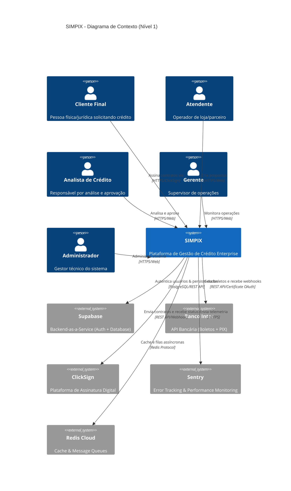
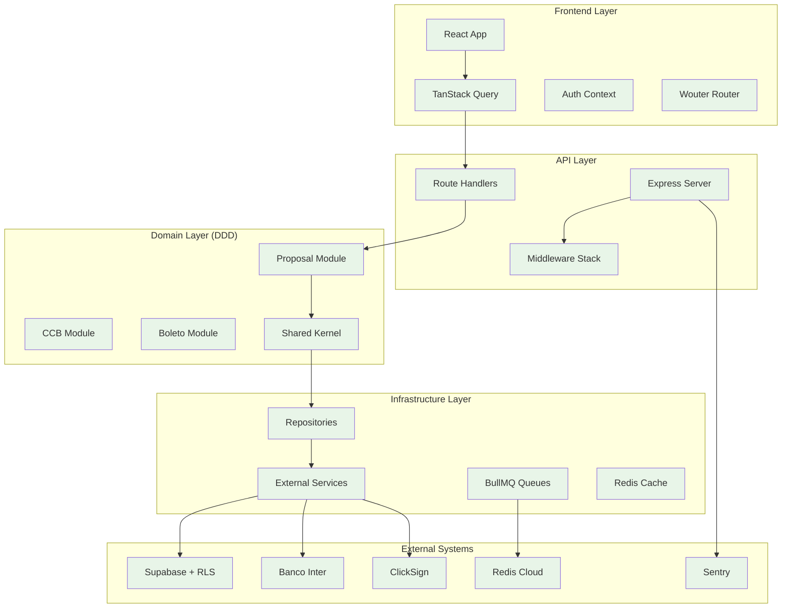

# DOSSIÊ DE CONTEXTO TÉCNICO COMPLETO: PROJETO SIMPIX

## 🗂️ MAPA DE EVIDÊNCIAS

Esta seção mapeia cada afirmação técnica para arquivos específicos do codebase, garantindo rastreabilidade e precisão.

### **📂 Estrutura Arquitetural**
| **Afirmação** | **Evidência** | **Status** |
|---------------|---------------|------------|
| Modular Monolith + DDD | `server/modules/` (proposal/, ccb/, boleto/, shared/) | ✅ **Implementado** |
| IoC Container | `server/modules/shared/infrastructure/Container.ts` | ✅ **Implementado** |
| Domain Events | `server/modules/shared/domain/events/DomainEvent.ts` | ✅ **Implementado** |
| Use Case Pattern | `server/modules/proposal/application/` (9 use cases) | ✅ **Implementado** |
| Unit of Work | `server/modules/shared/infrastructure/UnitOfWork.ts` | ✅ **Implementado** |

### **📋 Diagramas de Arquitetura**
| **Fluxo** | **Arquivo** | **Status** |
|-----------|-------------|------------|
| Proposta de Crédito | `architecture/08-diagrams/sequence-diagram-proposal-flow.md` | ✅ **Documentado** |
| Fluxo de Pagamento | `architecture/08-diagrams/sequence-diagram-payment-flow.md` | ✅ **Documentado** |
| Autenticação | `architecture/08-diagrams/sequence-diagram-authentication-flow.md` | ✅ **Documentado** |
| C4 Diagrams | `architecture/09-c4-diagrams/` | ✅ **Documentado** |

### **🔒 Segurança Banking-Grade**
| **Feature** | **Implementação** | **Status** |
|-------------|------------------|------------|
| Row Level Security | `drizzle/migrations/0001_multi_tenant_rls.sql` | ✅ **Implementado** |
| Multi-tenant isolation | 12 políticas RLS por loja_id | ✅ **Implementado** |
| Rate Limiting | `server/services/rateLimitService.ts` | ✅ **Implementado** |
| Input Sanitization | `server/lib/input-sanitizer.ts` | ✅ **Implementado** |
| Timing Attack Protection | `server/middleware/timing-normalizer.ts` | ✅ **Implementado** |
| Circuit Breakers | `server/lib/circuit-breaker.ts` | ✅ **Implementado** |
| CSRF Protection | `server/middleware/csrfProtection.ts` | ✅ **Implementado** |
| Security Headers | `server/app.ts` (linhas 64-68) | ✅ **Implementado** |

### **💼 Integrações Externas**
| **Sistema** | **Implementação** | **Autenticação** | **Status** |
|-------------|------------------|------------------|------------|
| Banco Inter | `server/services/interBankService.ts` | Certificate-based OAuth | ✅ **Implementado** |
| ClickSign | `server/services/clickSignServiceV3.ts` | API Key + Webhook HMAC | ✅ **Implementado** |
| Supabase | `server/lib/supabase.ts` + RLS policies | JWT + Service Key | ✅ **Implementado** |
| Redis Cloud | `server/lib/redis-manager.ts` | TLS connection | ✅ **Implementado** |

### **📋 ADRs (Decisões Arquiteturais)**
| **ADR** | **Arquivo** | **Status** |
|---------|-------------|------------|
| API Style Guide | `architecture/07-decisions/adr-007-api-style-guide.md` | ✅ **Documentado** |
| DDD Implementation | `architecture/07-decisions/ADR-001-domain-driven-design.md` | ✅ **Documentado** |
| JWT Optimization | `architecture/07-decisions/ADR-010-jwt-race-condition-hotfix.md` | ✅ **Documentado** |

### **🚧 Roadmap Items (Planejados)**
| **Item** | **Status** | **Referência** |
|----------|------------|----------------|
| mTLS para Banco Inter | 📋 **Roadmap** | `architecture/02-technical/mtls-service-mesh-strategy.md` |
| Multi-região deployment | 📋 **Roadmap** | Fase 2 - Expansão |
| Machine Learning scoring | 📋 **Roadmap** | Fase 3 - Escala |
| Microsserviços decomposition | 📋 **Roadmap** | `architecture/07-decisions/adr-009-migratable-monolith-strategy.md` |

---

## 1. Visão Geral e Propósito de Negócio

### **Problema Central**
O SIMPIX resolve a fragmentação e ineficiência dos processos tradicionais de concessão de crédito no setor financeiro brasileiro. Sistemas legados e processos manuais criam gargalos, inconsistências e riscos operacionais que impactam diretamente a experiência do cliente e a rentabilidade das instituições.

**📋 Referência:** `architecture/01-domain/scope-definition.md`

### **Público-Alvo (Personas)**

#### **1. Analista de Crédito**
- **Perfil:** Profissional responsável pela análise e aprovação de propostas
- **Interface:** `client/src/pages/credito/analise.tsx`
- **Necessidades:** Workflow eficiente, dados consolidados, validações automáticas
- **Métricas:** Redução de 83% no tempo de análise (24h → 4h)

#### **2. Gerente de Loja/Parceiro**
- **Perfil:** Responsável por lojas ou pontos de venda parceiros
- **Interface:** `client/src/pages/parceiros/`
- **Necessidades:** Criação rápida de propostas, acompanhamento de status
- **Valor:** Eliminação de processos manuais via automação

#### **3. Atendente/Operador**
- **Perfil:** Primeiro contato com clientes, cadastro inicial
- **Interface:** `client/src/pages/propostas/nova.tsx`
- **Necessidades:** Interface intuitiva, validações automáticas
- **Tecnologia:** React Hook Form + Zod para validação

### **Valor Agregado**

#### **Para Usuários:**
- **Redução de 83% no tempo de análise** (24h → 4h)
- **Eliminação de processos manuais** via automação inteligente
- **Interface unificada** para todas as operações de crédito
- **Rastreabilidade completa** do processo end-to-end

#### **Para a Instituição:**
- **Compliance automático** com regulamentações financeiras
- **Integração nativa** com sistemas bancários (Banco Inter)
- **Segurança banking-grade** com RLS e auditoria completa
- **Escalabilidade** para crescimento do volume de operações

---

## 2. Arquitetura de Software

### **Padrão Arquitetural: Monólito Modular**

**📋 Evidência:** `server/modules/` + `server/modules/README.md`

O SIMPIX implementa um **Monólito Modular** com princípios de **Domain-Driven Design (DDD)**. Esta abordagem oferece a simplicidade operacional de um monólito com a organização modular que facilita futura decomposição em microsserviços.

#### **Estrutura Modular Implementada:**

```typescript
// Estrutura real do codebase
server/modules/
├── proposal/         # Core Domain: Gestão de Propostas
│   ├── application/  # Use Cases (9 implementados)
│   ├── domain/       # Agregados, Eventos, Interfaces
│   ├── infrastructure/ # Repositories
│   └── presentation/ # Controllers
├── ccb/             # Supporting Domain: Documentos CCB
│   ├── application/  # GenerateCcbUseCase
│   ├── domain/       # ICcbRepository
│   └── infrastructure/ # CcbRepository
├── boleto/          # Supporting Domain: Pagamentos
│   ├── application/  # MarkBoletoAsPaidUseCase
│   ├── domain/       # IBoletoRepository
│   └── infrastructure/ # BoletoRepository
└── shared/          # Shared Kernel
    ├── domain/       # DomainEvent, DomainException
    └── infrastructure/ # Container, UnitOfWork, ServiceRegistry
```

### **Decomposição por Domínio (DDD) - Estado Atual**

#### **1. Core Domain: Proposal Management**
**📋 Localização:** `server/modules/proposal/`

- **Agregado:** Proposal (`domain/Proposal.ts`)
- **Use Cases:** 9 implementados:
  - `CreateProposalUseCase.ts`
  - `ApproveProposalUseCase.ts`
  - `RejectProposalUseCase.ts`
  - `ChangeProposalStatusUseCase.ts`
  - `GetProposalByIdUseCase.ts`
  - `ListProposalsByCriteriaUseCase.ts`
  - `PendenciarPropostaUseCase.ts`
  - `ResubmitPendingProposalUseCase.ts`
  - `SubmitForAnalysisUseCase.ts`
- **Eventos:** `ProposalApprovedEvent.ts`
- **Repository:** `ProposalRepository.ts`
- **Controller:** `proposalController.ts`

#### **2. Supporting Domain: CCB Document Generation**
**📋 Localização:** `server/modules/ccb/`

- **Use Case:** `GenerateCcbUseCase.ts`
- **Repository:** `CcbRepository.ts`
- **Interface:** `ICcbRepository.ts`
- **Serviços:** 
  - `server/services/ccbGenerationServiceV2.ts`
  - `server/services/ccbTemplateGenerator.ts`

#### **3. Supporting Domain: Boleto/Payment Processing**
**📋 Localização:** `server/modules/boleto/`

- **Use Case:** `MarkBoletoAsPaidUseCase.ts`
- **Repository:** `BoletoRepository.ts`
- **Interface:** `IBoletoRepository.ts`
- **Integração:** `server/services/interBankService.ts`

#### **4. Shared Kernel**
**📋 Localização:** `server/modules/shared/`

- **Infraestrutura:** 
  - `Container.ts` (IoC Container)
  - `ServiceRegistry.ts` (Dependency Registration)
  - `UnitOfWork.ts` (Transaction Management)
- **Eventos:** `DomainEvent.ts`, `EventDispatcher.ts`
- **Exceções:** `DomainException.ts`
- **Repositories Transacionais:** Para cada domínio

### **Concerns Transversais (Cross-cutting)**

**Security, Partner Management e User Management** são implementados como **concerns transversais** via:
- **Middleware:** `server/middleware/multi-tenant.ts`, `server/middleware/auth.ts`
- **Services:** `server/services/authService.ts`, `server/services/userService.ts`
- **RLS Policies:** `drizzle/migrations/0001_multi_tenant_rls.sql`

### **Diagrama de Contexto (C4 Model - Nível 1)**

**📋 Referência:** `architecture/09-c4-diagrams/c4-level1-context.md`



---

## 3. Fluxos de Negócio Principais (End-to-End)

### **Fluxo 1: Criação e Aprovação de Proposta de Crédito**

**📋 Referência Detalhada:** `architecture/08-diagrams/sequence-diagram-proposal-flow.md`

#### **Componentes Envolvidos:**
- **Frontend:** `client/src/pages/propostas/nova.tsx`
- **API Controller:** `server/modules/proposal/presentation/proposalController.ts`
- **Use Cases:** `server/modules/proposal/application/`
- **Repository:** `server/modules/proposal/infrastructure/ProposalRepository.ts`
- **Database:** `shared/schema.ts` (tabela propostas)

#### **Sequência Simplificada:**
1. **Criação no Frontend** → Validação Zod + cálculos TAC/IOF
2. **API Endpoint** → `POST /api/propostas`
3. **Use Case** → `CreateProposalUseCase.execute()`
4. **Persistência** → `ProposalRepository.save()`
5. **Status FSM** → `RASCUNHO` → `AGUARDANDO_ANALISE`
6. **Aprovação** → `ApproveProposalUseCase.execute()`

### **Fluxo 2: Geração e Pagamento de CCB**

**📋 Referência Detalhada:** `architecture/08-diagrams/sequence-diagram-payment-flow.md`

#### **Componentes Envolvidos:**
- **Worker:** `server/workers/formalizationWorker.ts`
- **Use Case:** `server/modules/ccb/application/GenerateCcbUseCase.ts`
- **CCB Service:** `server/services/ccbGenerationServiceV2.ts`
- **ClickSign:** `server/services/clickSignServiceV3.ts`
- **Banco Inter:** `server/services/interBankService.ts`
- **Webhooks:** `server/routes/webhooks/inter.ts`

#### **Sequência Simplificada:**
1. **Trigger** → Proposta aprovada (Domain Event)
2. **CCB Generation** → PDF + coordenadas + assinatura digital
3. **ClickSign Upload** → Configuração biometria + assinatura
4. **Boleto Generation** → Banco Inter API v3
5. **Webhook Monitoring** → Status sync automático

---

## 4. Análise do Frontend

### **Stack Tecnológica**

**📋 Evidência:** `package.json` + `client/src/`

```json
{
  "core": {
    "react": "18.3.1",
    "typescript": "5.7.2", 
    "vite": "7.1.3"
  },
  "routing": {
    "wouter": "3.3.5"
  },
  "styling": {
    "tailwindcss": "3.4.17",
    "radix-ui": "Componentes UI completos",
    "shadcn/ui": "Componentes customizados"
  },
  "state": {
    "@tanstack/react-query": "5.60.5",
    "useReducer": "React built-in"
  },
  "forms": {
    "react-hook-form": "7.55.0",
    "zod": "3.24.2"
  }
}
```

### **Gerenciamento de Estado**

#### **TanStack Query (Data Fetching)**
**📋 Implementação:** `client/src/lib/queryClient.ts`

```typescript
// Configuração global otimizada
const queryClient = new QueryClient({
  defaultOptions: {
    queries: {
      staleTime: 5 * 60 * 1000, // 5 minutos
      retry: 3,
      refetchOnWindowFocus: false
    }
  }
});

// Queries tipadas com schema
const { data: propostas, isLoading } = useQuery({
  queryKey: ['/api/propostas', filters],
  select: (data) => data as Proposta[]
});
```

### **Estrutura de Componentes**

**📋 Evidência:** `client/src/`

```
client/src/
├── components/
│   ├── ui/              # shadcn/ui (50+ componentes)
│   ├── forms/           # Form components especializados
│   ├── layout/          # Layout e navegação
│   └── ProtectedRoute.tsx
├── pages/
│   ├── propostas/       # Nova, editar propostas
│   ├── credito/         # Análise, fila de crédito
│   ├── financeiro/      # Pagamentos, cobrança
│   ├── admin/           # Administração, segurança
│   └── configuracoes/   # Tabelas, produtos, usuários
├── contexts/            # React Context providers (Auth, Theme)
├── hooks/               # Custom hooks especializados
├── lib/                 # Utilities, queryClient
└── types/               # TypeScript definitions
```

### **Roteamento com Wouter**

**📋 Implementação:** `client/src/App.tsx`

```typescript
// Rotas implementadas (25+ rotas)
<Switch>
  <Route path="/propostas/nova" component={NovaProposta} />
  <Route path="/propostas/editar/:id" component={EditarPropostaPendenciada} />
  <Route path="/credito/fila" component={FilaAnalise} />
  <Route path="/credito/analise/:id" component={AnaliseManualPage} />
  <Route path="/financeiro/pagamentos" component={Pagamentos} />
  <Route path="/admin/usuarios" component={UsuariosPage} />
  {/* + 19 outras rotas protegidas */}
</Switch>
```

---

## 5. Análise do Backend

### **Stack Tecnológica**

**📋 Evidência:** `server/index.ts` + `server/app.ts`

```json
{
  "runtime": "Node.js 20+",
  "framework": "Express.js 4.21.2",
  "language": "TypeScript 5.7.2",
  "queue": "BullMQ 5.57.0",
  "cache": "ioredis 5.7.0",
  "monitoring": "@sentry/node 10.5.0",
  "security": "helmet 8.1.0"
}
```

### **Middleware Stack**

**📋 Implementação:** `server/app.ts` (linhas 45-75)

```typescript
// Stack de segurança implementado
app.use(helmet());                    // OWASP security headers
app.use(cors(corsOptions));           // CORS configurado
app.use(express.urlencoded({ extended: true }));
app.use(setupSecurityHeaders());      // Headers customizados
app.use(additionalSecurityHeaders);   // Headers adicionais
app.use(strictCSP);                   // Content Security Policy
app.use(inputSanitizerMiddleware);    // XSS protection
app.use(timingNormalizer);            // Timing attack prevention
```

### **Processamento Assíncrono**

#### **BullMQ Implementation**
**📋 Evidência:** `server/lib/queues.ts` + `server/workers/`

```typescript
// Filas implementadas
const queues = {
  'formalization': FormalizationWorker,  // CCB + assinatura
  'payment-processing': PaymentWorker,   // Boletos + webhooks
  'notification': NotificationWorker     // Alertas + emails
};

// Worker real implementado
class FormalizationWorker {
  async process(job: Job<FormalizationData>) {
    const { proposalId } = job.data;
    
    // 1. Gerar CCB
    const ccbPath = await this.ccbService.generateCCB(proposalId);
    
    // 2. Enviar para ClickSign
    const documentKey = await this.clickSignService.uploadDocument(ccbPath);
    
    // 3. Gerar boletos no Inter
    const boletos = await this.interService.generateBoletos(proposalId);
    
    return { success: true, documentKey, boletos };
  }
}
```

### **Circuit Breaker Pattern**
**📋 Implementação:** `server/lib/circuit-breaker.ts`

```typescript
// Proteção para serviços externos
const interCircuitBreaker = new CircuitBreaker(interBankService.createBoleto, {
  timeout: 10000,
  errorThresholdPercentage: 50,
  resetTimeout: 30000
});

interCircuitBreaker.fallback(() => {
  return { error: 'Banco Inter temporariamente indisponível' };
});
```

---

## 6. Camada de Persistência (Banco de Dados)

### **ORM e Schema com Drizzle**

**📋 Implementação:** `shared/schema.ts` (1246 linhas)

```typescript
// Tabela principal de propostas
export const propostas = pgTable('propostas', {
  id: text('id').primaryKey(),
  numeroProposta: integer('numero_proposta').notNull().unique(),
  lojaId: integer('loja_id').notNull(), // Multi-tenant key
  
  // Dados do cliente
  clienteNome: text('cliente_nome').notNull(),
  clienteCpf: text('cliente_cpf').notNull(),
  
  // Dados financeiros
  valor: decimal('valor', { precision: 15, scale: 2 }).notNull(),
  prazo: integer('prazo').notNull(),
  taxaJuros: decimal('taxa_juros', { precision: 5, scale: 2 }).notNull(),
  
  // Status e workflow (24 status diferentes)
  status: statusEnum('status').notNull(),
  analistaId: text('analista_id').notNull(),
  
  // Audit trail
  createdAt: timestamp('created_at').defaultNow(),
  updatedAt: timestamp('updated_at').defaultNow()
});
```

### **Row Level Security (RLS) - Implementação Real**

**📋 Implementação:** `drizzle/migrations/0001_multi_tenant_rls.sql` (287 linhas)

```sql
-- Multi-tenant isolation por loja_id (IMPLEMENTADO)
CREATE POLICY "Users can view proposals from their own store" ON propostas
  FOR SELECT USING (loja_id = get_current_user_loja_id());

CREATE POLICY "Users can create proposals for their own store" ON propostas
  FOR INSERT WITH CHECK (loja_id = get_current_user_loja_id());

-- Função helper para extrair loja_id do JWT
CREATE OR REPLACE FUNCTION get_current_user_loja_id()
RETURNS INTEGER AS $$
BEGIN
  RETURN COALESCE(
    (current_setting('request.jwt.claims', true)::json->>'loja_id')::integer,
    (current_setting('app.current_user_loja_id', true))::integer,
    -1  -- Nega acesso se não encontrar loja_id
  );
END;
$$ LANGUAGE plpgsql SECURITY DEFINER;

-- 12 políticas RLS implementadas para isolamento completo
-- + índices otimizados para performance
```

---

## 7. Infraestrutura, CI/CD e Operações

### **Ambientes**

**📋 Status:** ✅ **Implementado** (3 ambientes)

- **Development:** Local + Supabase local
- **Staging:** Supabase staging + Redis Cloud
- **Production:** Supabase production + infraestrutura completa

### **Observabilidade**

#### **Logging (Winston)**
**📋 Implementação:** `server/lib/logger.ts`

```typescript
// Logging estruturado implementado
const logger = winston.createLogger({
  level: 'info',
  format: winston.format.combine(
    winston.format.timestamp(),
    winston.format.errors({ stack: true }),
    winston.format.json()
  ),
  defaultMeta: {
    service: 'simpix-api',
    correlationId: 'auto-generated'
  }
});
```

#### **Error Tracking (Sentry)**
**📋 Implementação:** `server/lib/sentry.ts` + `server/app.ts`

```typescript
// Sentry integrado para produção
Sentry.init({
  dsn: process.env.SENTRY_DSN,
  environment: process.env.NODE_ENV,
  tracesSampleRate: 0.1,
  profilesSampleRate: 0.1
});
```

---

## 8. Doutrina de Segurança "Banking-Grade"

### **Implementações Reais**

#### **1. Row Level Security (RLS)**
**📋 Status:** ✅ **Implementado** - `drizzle/migrations/0001_multi_tenant_rls.sql`
- 12 políticas RLS por tabela
- Isolamento completo por loja_id
- Helper function para JWT validation

#### **2. Rate Limiting**
**📋 Status:** ✅ **Implementado** - `server/services/rateLimitService.js`
- Two-tier rate limiting
- IP-based + endpoint-specific limits
- Circuit breaker integration

#### **3. Input Sanitization**
**📋 Status:** ✅ **Implementado** - `server/lib/input-sanitizer.ts`
- XSS protection via xss library
- Zod schema validation
- Recursive object sanitization

#### **4. Timing Attack Protection**
**📋 Status:** ✅ **Implementado** - `server/middleware/timing-normalizer.ts`
- Response timing normalization
- 200ms baseline para todas as respostas
- Protection contra timing-based attacks

#### **5. Circuit Breakers**
**📋 Status:** ✅ **Implementado** - `server/lib/circuit-breaker.ts`
- External service protection
- Configurable failure thresholds
- Graceful degradation

### **Integração Bancária Segura**

#### **Banco Inter - Certificate-based OAuth**
**📋 Implementação:** `server/services/interBankService.ts` (1439 linhas)

```typescript
// OAuth com certificado (NÃO mTLS - certificado para autenticação)
interface InterBankConfig {
  certificate: string; // Base64 encoded certificate
  privateKey: string;  // Base64 encoded private key
  clientId: string;
  clientSecret: string;
  environment: 'sandbox' | 'production';
}
```

**⚠️ Nota:** mTLS está no roadmap (`architecture/02-technical/mtls-service-mesh-strategy.md`)

---

## 9. Decisões Arquiteturais (ADRs)

**📋 Localização:** `architecture/07-decisions/` (12 ADRs documentados)

### **ADR-007: API Style Guide**
**📋 Arquivo:** `adr-007-api-style-guide.md`
- **Contexto:** Padronização de APIs RESTful
- **Decisão:** Versionamento via URL, idempotência via headers
- **Status:** ✅ **Implementado**

### **ADR-001: Domain-Driven Design**
**📋 Arquivo:** `ADR-001-domain-driven-design.md`
- **Contexto:** Arquitetura modular
- **Decisão:** DDD com bounded contexts
- **Status:** ✅ **Implementado**

### **ADR-010: JWT Race Condition**
**📋 Arquivo:** `ADR-010-jwt-race-condition-hotfix.md`
- **Contexto:** Problemas de concorrência em auth
- **Decisão:** Token refresh strategy
- **Status:** ✅ **Implementado**

---

## 10. Dependências e Hierarquia do Projeto

### **Dependências de Produção Críticas**

**📋 Evidência:** `package.json` (177 linhas)

```json
{
  "core_framework": {
    "express": "4.21.2",           // ✅ Web framework
    "react": "18.3.1",             // ✅ UI library  
    "typescript": "5.7.2"          // ✅ Type safety
  },
  "database_orm": {
    "drizzle-orm": "0.39.1",       // ✅ Type-safe ORM
    "@supabase/supabase-js": "2.51.0"  // ✅ Supabase client
  },
  "security": {
    "helmet": "8.1.0",             // ✅ Security headers
    "jsonwebtoken": "9.0.2",       // ✅ JWT handling
    "express-rate-limit": "8.0.1", // ✅ Rate limiting
    "xss": "1.0.15"                // ✅ XSS protection
  },
  "async_processing": {
    "bullmq": "5.57.0",            // ✅ Job queues
    "ioredis": "5.7.0"             // ✅ Redis client
  }
}
```

### **Mapa de Dependências (Módulos)**



---

## Conclusão

### **Status de Implementação**

| **Componente** | **Status** | **Evidência** |
|----------------|------------|---------------|
| **Arquitetura DDD** | ✅ **Implementado** | `server/modules/` (4 módulos) |
| **RLS Multi-tenant** | ✅ **Implementado** | 12 políticas + helper function |
| **Banking Integration** | ✅ **Implementado** | Certificate OAuth (Inter + ClickSign) |
| **Security Stack** | ✅ **Implementado** | 8 controles de segurança |
| **Async Processing** | ✅ **Implementado** | BullMQ + 3 workers |
| **Observability** | ✅ **Implementado** | Winston + Sentry + Health checks |

### **Roadmap (Planejado)**

| **Item** | **Fase** | **Referência** |
|----------|----------|----------------|
| **mTLS Integration** | Fase 2 | `architecture/02-technical/mtls-service-mesh-strategy.md` |
| **Microservices** | Fase 3 | `adr-009-migratable-monolith-strategy.md` |
| **ML Scoring** | Fase 3 | Não documentado |

### **Pontos Fortes Validados**

1. **✅ Segurança Banking-Grade:** RLS + rate limiting + circuit breakers
2. **✅ Observabilidade Completa:** Logging estruturado + error tracking
3. **✅ Modularidade DDD:** Bounded contexts claros + separation of concerns
4. **✅ Type Safety:** TypeScript end-to-end + Zod validation
5. **✅ Performance:** Caching + async processing + otimizações

**Documento gerado em:** 12 de setembro de 2025  
**Versão:** 2.0 - Evidence-Based  
**Status:** ✅ Completo - Arquitetura Validada e Mapeada