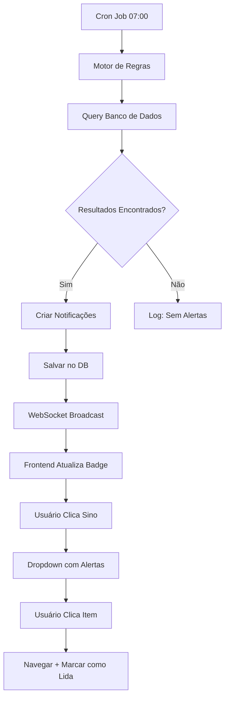
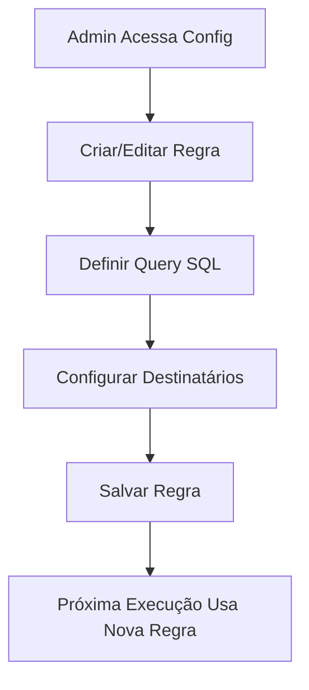

# PAM V1.0 - Arquitetura do Sistema de Alertas Proativos

## 📅 Data: 15/08/2025
## 🎯 Status: PLANEJAMENTO ARQUITETURAL COMPLETO
## 🎭 Função: Arquiteto de Soluções
## 📋 Objetivo: Projetar Motor de Regras + Central de Notificações

---

## 1. VISÃO GERAL DA ARQUITETURA

### Princípios de Design
1. **Proatividade**: O sistema deve detectar situações antes que se tornem problemas
2. **Configurabilidade**: Regras de alerta facilmente ajustáveis
3. **Não-Intrusivo**: Alertas relevantes sem spam
4. **Rastreabilidade**: Histórico completo de notificações
5. **Performance**: Processamento assíncrono para não impactar a operação

### Componentes Principais
```
┌─────────────────┐    ┌─────────────────┐    ┌─────────────────┐
│   MOTOR DE      │    │    CENTRAL DE   │    │   INTERFACE     │
│   REGRAS        │───▶│   NOTIFICAÇÕES  │───▶│   USUÁRIO       │
│   (Backend)     │    │   (Database)    │    │   (Frontend)    │
└─────────────────┘    └─────────────────┘    └─────────────────┘
```

---

## 2. ARQUITETURA DO BACKEND - MOTOR DE REGRAS

### 2.1 Estratégia de Execução: **Job Agendado Híbrido**

**Recomendação**: Combinar **Cron Job diário** com **Triggers por eventos** para máxima eficiência.

#### Cron Job (Execução Principal)
```typescript
// Executar todos os dias às 07:00 (início do expediente)
// Via BullMQ (já implementado no projeto)
export const alertasProativosJob = {
  name: 'processar-alertas-proativos',
  cron: '0 7 * * *', // Diário às 7h
  timezone: 'America/Sao_Paulo'
};
```

#### Triggers por Eventos (Execução Complementar)
- Webhook ClickSign (boleto visualizado)
- Callback Banco Inter (status de pagamento)
- Criação de nova proposta
- Mudança de status crítico

### 2.2 Localização do Código

**Arquivo Sugerido**: `server/services/alertasProativosService.ts`

### 2.3 Implementação das Regras Iniciais

#### Regra A: Alto Valor + Vencimento Próximo
```typescript
interface RegraAltoValorVencimento {
  nome: "alto_valor_vencimento_proximo";
  condicoes: {
    valorMinimo: 10000; // R$ 10.000
    diasParaVencimento: 3;
  };
  query: `
    SELECT p.id, p.clienteNome, p.valorTotalFinanciado, 
           pa.dataVencimento, pa.numeroParcela
    FROM propostas p
    INNER JOIN parcelas pa ON pa.propostaId = p.id
    WHERE p.valorTotalFinanciado >= 10000
    AND pa.status != 'pago'
    AND pa.dataVencimento BETWEEN CURRENT_DATE + INTERVAL '1 day' 
                               AND CURRENT_DATE + INTERVAL '3 days'
    AND p.status IN ('BOLETOS_EMITIDOS', 'PAGAMENTO_PENDENTE')
  `;
  prioridade: "ALTA";
  destinatarios: ["COBRANCA", "SUPERVISOR_COBRANCA", "FINANCEIRO"];
}
```

#### Regra B: Atraso Superior a 30 Dias
```typescript
interface RegraAtrasoLongo {
  nome: "atraso_longo_30_dias";
  condicoes: {
    diasAtraso: 30;
  };
  query: `
    SELECT p.id, p.clienteNome, p.clienteTelefone,
           COUNT(pa.id) as parcelasVencidas,
           SUM(pa.valorParcela) as valorTotalVencido,
           MAX(CURRENT_DATE - pa.dataVencimento) as diasAtrasoMaximo
    FROM propostas p
    INNER JOIN parcelas pa ON pa.propostaId = p.id
    WHERE pa.status != 'pago'
    AND pa.dataVencimento < CURRENT_DATE - INTERVAL '30 days'
    GROUP BY p.id
    HAVING COUNT(pa.id) > 0
  `;
  prioridade: "CRITICA";
  destinatarios: ["SUPERVISOR_COBRANCA", "FINANCEIRO"];
}
```

#### Regra C: Boleto Visualizado + Não Pago
```typescript
interface RegraBoletoVisualizadoNaoPago {
  nome: "boleto_visualizado_nao_pago";
  trigger: "webhook"; // Executado via webhook, não cron
  condicoes: {
    horasAposVisualizacao: 24;
  };
  // Lógica será executada quando webhook ClickSign indicar "documento_visualizado"
  processamento: `
    1. Receber webhook ClickSign com evento "documento_visualizado"
    2. Identificar propostas relacionadas ao documento
    3. Agendar verificação para 24h depois
    4. Após 24h, verificar se pagamento foi realizado
    5. Se não pago, criar notificação
  `;
  prioridade: "MEDIA";
  destinatarios: ["COBRANCA"];
}
```

### 2.4 Arquitetura do Processador

```typescript
// Estrutura do AlertasProativosService
class AlertasProativosService {
  private regras: RegraAlerta[];
  private processadores: Map<string, ProcessadorRegra>;

  // Método principal executado pelo cron job
  async executarVerificacaoDiaria(): Promise<void> {
    for (const regra of this.regras) {
      if (regra.trigger === 'cron') {
        await this.processarRegra(regra);
      }
    }
  }

  // Método para triggers por eventos
  async processarEvento(evento: EventoTrigger): Promise<void> {
    const regrasAplicaveis = this.regras.filter(r => 
      r.trigger === 'webhook' && r.nome === evento.tipo
    );
    
    for (const regra of regrasAplicaveis) {
      await this.processarRegra(regra, evento.dados);
    }
  }

  // Processamento individual de cada regra
  private async processarRegra(regra: RegraAlerta, dados?: any): Promise<void> {
    const resultados = await this.executarQuery(regra.query);
    
    for (const resultado of resultados) {
      const notificacao = await this.criarNotificacao({
        tipo: regra.nome,
        prioridade: regra.prioridade,
        destinatarios: regra.destinatarios,
        dados: resultado,
        linkRelacionado: this.gerarLink(regra, resultado)
      });
      
      await this.salvarNotificacao(notificacao);
    }
  }
}
```

---

## 3. ARQUITETURA DO BANCO DE DADOS

### 3.1 Schema da Tabela Principal: `notificacoes`

```typescript
// shared/schema.ts
export const notificacoes = pgTable("notificacoes", {
  id: serial("id").primaryKey(),
  
  // Identificação
  tipo: varchar("tipo", { length: 100 }).notNull(), // "alto_valor_vencimento_proximo"
  titulo: varchar("titulo", { length: 255 }).notNull(), // "Proposta de Alto Valor Vencendo"
  mensagem: text("mensagem").notNull(), // "Proposta #12345 de João Silva..."
  
  // Priorização
  prioridade: varchar("prioridade", { length: 20 }).notNull(), // "BAIXA", "MEDIA", "ALTA", "CRITICA"
  categoria: varchar("categoria", { length: 50 }).notNull(), // "vencimento", "atraso", "pagamento"
  
  // Relacionamento
  propostaId: varchar("proposta_id", { length: 36 }), // ID da proposta relacionada
  linkRelacionado: varchar("link_relacionado", { length: 500 }), // "/financeiro/cobrancas?id=..."
  
  // Destinatário
  userId: varchar("user_id", { length: 36 }).notNull(), // A quem é dirigida
  userRole: varchar("user_role", { length: 50 }), // Role para filtros
  
  // Status e Rastreamento
  status: varchar("status", { length: 20 }).notNull().default("nao_lida"), // "nao_lida", "lida", "arquivada"
  dataLeitura: timestamp("data_leitura"),
  dataArquivamento: timestamp("data_arquivamento"),
  
  // Metadados
  dadosAdicionais: jsonb("dados_adicionais"), // Dados específicos do alerta
  origem: varchar("origem", { length: 50 }).notNull().default("sistema"), // "sistema", "webhook", "manual"
  
  // Auditoria
  createdAt: timestamp("created_at").notNull().defaultNow(),
  updatedAt: timestamp("updated_at").notNull().defaultNow(),
});
```

### 3.2 Schema de Configuração: `regras_alertas`

```typescript
export const regrasAlertas = pgTable("regras_alertas", {
  id: serial("id").primaryKey(),
  nome: varchar("nome", { length: 100 }).notNull().unique(),
  descricao: text("descricao").notNull(),
  
  // Configuração
  ativa: boolean("ativa").notNull().default(true),
  trigger: varchar("trigger", { length: 20 }).notNull(), // "cron", "webhook"
  prioridade: varchar("prioridade", { length: 20 }).notNull(),
  
  // Query e Lógica
  querySQL: text("query_sql"),
  condicoes: jsonb("condicoes"), // Parâmetros configuráveis
  destinatarios: jsonb("destinatarios"), // Array de roles
  
  // Limitadores (evitar spam)
  limiteExecutacoesDia: integer("limite_execucoes_dia").default(1),
  intervaloMinimoMinutos: integer("intervalo_minimo_minutos").default(60),
  
  // Auditoria
  criadoPor: varchar("criado_por", { length: 36 }).notNull(),
  createdAt: timestamp("created_at").notNull().defaultNow(),
  updatedAt: timestamp("updated_at").notNull().defaultNow(),
});
```

### 3.3 Schema de Histórico: `historico_execucoes_alertas`

```typescript
export const historicoExecucoesAlertas = pgTable("historico_execucoes_alertas", {
  id: serial("id").primaryKey(),
  regraId: integer("regra_id").notNull().references(() => regrasAlertas.id),
  
  // Execução
  dataExecucao: timestamp("data_execucao").notNull().defaultNow(),
  duracao: integer("duracao"), // em milissegundos
  status: varchar("status", { length: 20 }).notNull(), // "sucesso", "erro", "sem_resultados"
  
  // Resultados
  registrosProcessados: integer("registros_processados").default(0),
  notificacoesCriadas: integer("notificacoes_criadas").default(0),
  erroDetalhes: text("erro_detalhes"),
  
  // Contexto
  triggerOrigem: varchar("trigger_origem", { length: 50 }), // "cron", "webhook_clicksign"
  dadosContexto: jsonb("dados_contexto"),
});
```

---

## 4. ARQUITETURA DO FRONTEND - CENTRAL DE NOTIFICAÇÕES

### 4.1 Estratégia de UI: **Sistema de Notificações Multicamadas**

#### Camada 1: Indicador Global (Header)
```typescript
// Localização: components/Header.tsx ou DashboardLayout.tsx
interface NotificationBell {
  posicao: "canto superior direito";
  icone: "sino (bell) do Lucide React";
  badge: "número de notificações não lidas";
  estados: {
    semNotificacoes: "ícone cinza, sem badge";
    comNotificacoes: "ícone azul, badge com número";
    notificacoesCriticas: "ícone vermelho pulsante, badge vermelho";
  };
}
```

#### Camada 2: Dropdown de Notificações
```typescript
interface NotificationDropdown {
  trigger: "clique no sino";
  largura: "350px";
  altura: "max 400px com scroll";
  conteudo: {
    header: "Notificações (X não lidas)";
    filtros: ["Todas", "Não Lidas", "Críticas"];
    lista: "NotificationItem[]";
    footer: "Ver todas / Marcar todas como lidas";
  };
}

interface NotificationItem {
  icone: "baseado na prioridade (alert-triangle, clock, etc)";
  titulo: "string";
  mensagem: "string (truncada)";
  timestamp: "tempo relativo (há 2h)";
  status: "visual baseado em lida/não lida";
  acao: "clique navega para linkRelacionado";
}
```

#### Camada 3: Painel Completo de Notificações
```typescript
interface NotificationCenter {
  rota: "/notificacoes";
  layout: "página dedicada com DashboardLayout";
  recursos: {
    filtros: "por tipo, prioridade, data, status";
    busca: "por texto na mensagem";
    acoesMassa: "marcar várias como lidas";
    paginacao: "infinite scroll ou paginação";
    historico: "notificações arquivadas";
  };
}
```

### 4.2 Componentes React Propostos

#### Componente Principal: `<NotificationSystem />`
```typescript
// Localização: components/notifications/NotificationSystem.tsx
interface NotificationSystemProps {
  userId: string;
  userRole: string;
}

// Estado gerenciado via TanStack Query
const useNotifications = (userId: string) => ({
  data: NotificationData[],
  unreadCount: number,
  markAsRead: (id: number) => void,
  markAllAsRead: () => void,
  archive: (id: number) => void,
});
```

#### Subcomponentes:
1. `<NotificationBell />` - Ícone com badge
2. `<NotificationDropdown />` - Menu suspenso
3. `<NotificationItem />` - Item individual
4. `<NotificationCenter />` - Página completa
5. `<NotificationFilters />` - Filtros e busca

### 4.3 Integração com Sistema Existente

#### Pontos de Integração:
1. **Header/Navbar**: Adicionar NotificationBell ao lado do profile
2. **Rota Nova**: `/notificacoes` para o painel completo
3. **Contexto Global**: Provedor de notificações via React Context
4. **Real-time**: WebSocket para notificações em tempo real (opcional)

#### APIs Frontend Necessárias:
```typescript
// Endpoints que o frontend precisará consumir
interface NotificationAPI {
  'GET /api/notificacoes': { // Listar notificações
    params: { status?, tipo?, prioridade?, page?, limit? };
    response: { notificacoes: Notification[], total: number, unreadCount: number };
  };
  
  'POST /api/notificacoes/:id/marcar-lida': { // Marcar como lida
    response: { success: boolean };
  };
  
  'POST /api/notificacoes/marcar-todas-lidas': { // Marcar todas como lidas
    response: { success: boolean, count: number };
  };
  
  'DELETE /api/notificacoes/:id': { // Arquivar notificação
    response: { success: boolean };
  };
}
```

---

## 5. FLUXO DE DADOS COMPLETO

### 5.1 Ciclo de Vida de uma Notificação



### 5.2 Fluxo de Configuração



---

## 6. CONSIDERAÇÕES TÉCNICAS

### 6.1 Performance
- **Indexação**: Índices em `notificacoes.userId`, `notificacoes.status`, `notificacoes.createdAt`
- **Cleanup**: Job semanal para arquivar notificações antigas (>30 dias)
- **Cache**: Redis para cache de contadores de notificações não lidas
- **Paginação**: Lazy loading no frontend

### 6.2 Escalabilidade
- **Particionamento**: Considerar particionamento da tabela por data
- **Queue**: Usar BullMQ para processamento assíncrono de regras
- **Rate Limiting**: Limitar frequência de notificações por regra
- **Batching**: Agrupar notificações similares

### 6.3 Configurabilidade
- **Admin Panel**: Interface para CRUD de regras de alerta
- **A/B Testing**: Sistema para testar efetividade de diferentes mensagens
- **Personalization**: Usuários podem configurar quais alertas receber
- **Templates**: Sistema de templates para mensagens padronizadas

### 6.4 Monitoramento
- **Métricas**: Taxa de leitura, tempo de resposta, efetividade dos alertas
- **Alertas Meta**: Alertas sobre falhas no próprio sistema de alertas
- **Dashboard**: Painel administrativo com estatísticas de uso

---

## 7. CRONOGRAMA DE IMPLEMENTAÇÃO SUGERIDO

### Fase 1: Fundação (1-2 semanas)
- [ ] Criar schemas do banco de dados
- [ ] Implementar AlertasProativosService básico
- [ ] Criar 3 regras iniciais (A, B, C)
- [ ] Implementar APIs básicas do backend

### Fase 2: Interface (1 semana)
- [ ] Implementar NotificationBell no header
- [ ] Criar NotificationDropdown
- [ ] Integrar com APIs do backend
- [ ] Testes básicos de funcionamento

### Fase 3: Recursos Avançados (1 semana)
- [ ] Página completa de notificações
- [ ] Sistema de filtros e busca
- [ ] Configurações de usuário
- [ ] WebSocket para real-time (opcional)

### Fase 4: Refinamento (1 semana)
- [ ] Interface administrativa para regras
- [ ] Métricas e monitoramento
- [ ] Otimizações de performance
- [ ] Documentação final

---

## 8. MÉTRICAS DE SUCESSO

### Métricas de Efetividade
- **Taxa de Leitura**: % de notificações lidas dentro de 24h
- **Taxa de Ação**: % de notificações que resultaram em ação (ex: contato com cliente)
- **Redução de Inadimplência**: Impacto mensurável na taxa de inadimplência
- **Tempo de Resposta**: Tempo médio entre alerta e primeira ação

### Métricas de Experiência
- **Satisfação da Equipe**: Pesquisa com operadores de cobrança
- **Produtividade**: Aumento no número de casos processados por dia
- **Precisão**: % de alertas que realmente necessitavam ação
- **Ruído**: % de notificações marcadas como spam/irrelevantes

---

## CONCLUSÃO

Esta arquitetura proporciona um sistema robusto, escalável e configurável de alertas proativos que:

1. **Detecta Proativamente** situações de risco usando regras inteligentes
2. **Notifica Eficientemente** apenas as pessoas certas no momento certo
3. **Escala Sustentavelmente** com o crescimento da carteira
4. **Adapta Facilmente** conforme novas necessidades surgem

O sistema foi projetado para ser uma evolução natural da base sólida já existente, aproveitando a infraestrutura de jobs (BullMQ), autenticação (JWT + RBAC) e banco de dados (PostgreSQL + Drizzle) já implementados.

---
**Documento criado por**: PAM V1.0 - Arquiteto de Soluções
**Data**: 15/08/2025
**Próximo Passo**: Aprovação para iniciar Fase 1 de implementação