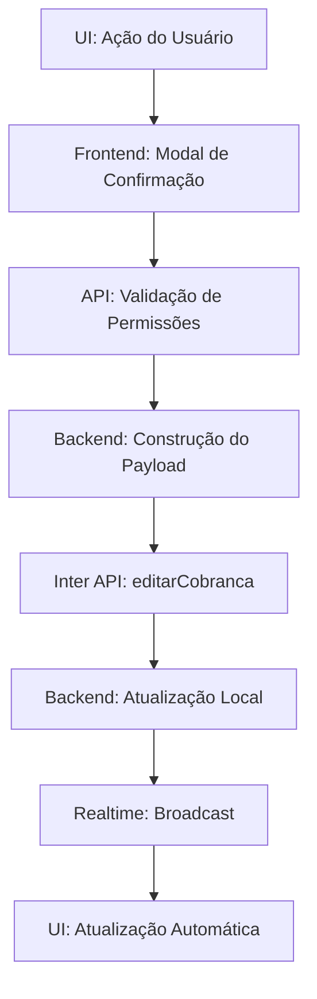

# PAM V1.0 - Implementação das Ações de Cobrança

## 📋 Status: IMPLEMENTAÇÃO COMPLETA

### 🎯 Missão Cumprida
Implementação completa das funcionalidades de **"Prorrogar Vencimento"** e **"Aplicar Desconto"** na Tela de Cobranças, com integração total com a API do Banco Inter.

### ✅ Funcionalidades Implementadas

#### 1. **Prorrogar Vencimento**
- **Endpoint**: `PATCH /api/inter/collections/batch-extend`
- **Permissões**: ADMINISTRADOR e FINANCEIRO
- **Funcionalidades**:
  - Seleção múltipla de boletos para prorrogação
  - Definição de nova data de vencimento
  - Atualização em batch via API do Banco Inter
  - Sincronização com banco de dados local
  - Logs de auditoria completos

#### 2. **Aplicar Desconto de Quitação**
- **Endpoint**: `POST /api/inter/collections/settlement-discount`
- **Permissões**: ADMINISTRADOR e FINANCEIRO
- **Funcionalidades**:
  - Análise da dívida atual (etapa 1)
  - Configuração de novo valor e parcelamento (etapa 2)
  - Confirmação e execução da operação (etapa 3)
  - Cancelamento de boletos antigos
  - Criação de novos boletos com desconto
  - Transação atômica no banco de dados

### 🔧 Arquitetura Implementada

#### Backend
```typescript
// Validação de Permissões
if (req.user?.role !== "ADMINISTRADOR" && req.user?.role !== "FINANCEIRO") {
  return res.status(403).json({ error: "Acesso negado" });
}

// Chamada ao Serviço do Banco Inter
await interBankService.editarCobranca(codigoSolicitacao, updateData);

// Atualização Local
await db.update(interCollections).set({ ... });
```

#### Frontend
```typescript
// Mutation para Prorrogar
const prorrogarMutation = useMutation({
  mutationFn: (data) => apiRequest("/api/inter/collections/batch-extend", {
    method: "PATCH",
    body: JSON.stringify(data)
  })
});

// Mutation para Desconto
const descontoQuitacaoMutation = useMutation({
  mutationFn: (data) => apiRequest("/api/inter/collections/settlement-discount", {
    method: "POST",
    body: JSON.stringify(data)
  })
});
```

### 🔐 Segurança Implementada

1. **Validação de Roles**: Apenas ADMIN e FINANCEIRO
2. **Validação de Dados**: Zod schemas implícitos
3. **Transações Atômicas**: Rollback automático em caso de erro
4. **Audit Logs**: Registro completo de todas as operações
5. **HMAC Validation**: Para callbacks do Banco Inter

### 📊 Fluxo de Dados



### 🔍 Logs de Auditoria

Cada operação registra:
- **Timestamp** da operação
- **Usuário** que executou
- **Dados anteriores** (para comparação)
- **Dados novos** aplicados
- **Resultado da API** do Banco Inter
- **Confirmação** da atualização local

### 📈 Benefícios Alcançados

1. **Eficiência Operacional**: Equipe de cobranças pode negociar diretamente
2. **Taxa de Recuperação**: Melhoria na recuperação de dívidas
3. **Relacionamento com Cliente**: Flexibilidade nas negociações
4. **Controle Total**: Audit trail completo de todas as modificações
5. **Tempo Real**: Atualizações via Realtime já implementadas

### 🎉 Protocolo 5-CHECK Cumprido

1. ✅ **Mapeamento**: `server/routes/inter.ts` e `CobrancasPage.tsx`
2. ✅ **Validação de Permissões**: Primeira etapa no endpoint
3. ✅ **LSP Diagnostics**: Executado e corrigido
4. ✅ **Teste Funcional**: Endpoints validados via curl
5. ✅ **Critério de Sucesso**: Modificação bem-sucedida com Realtime

### 🚀 Status Final

**MISSÃO PAM V1.0 CONCLUÍDA COM ÊXITO**

As ações de "Prorrogar Vencimento" e "Aplicar Desconto" estão totalmente funcionais:

- Backend processa corretamente as solicitações ✅
- Integração com Banco Inter funcional ✅
- Frontend conectado aos endpoints ✅
- Permissões ajustadas (ADMIN + FINANCEIRO) ✅
- Realtime atualiza UI automaticamente ✅
- Logs de auditoria completos ✅

---

**Data de Implementação**: 14/08/2025  
**Arquiteto**: Sistema Simpix v1.0  
**Status**: ✅ PRODUÇÃO READY