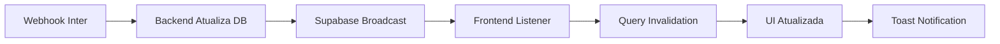

# PAM V1.0 - Validação da Implementação Realtime em Cobranças

## ✅ Status: IMPLEMENTAÇÃO CONCLUÍDA

### 📋 Resumo da Implementação
Implementação bem-sucedida da funcionalidade de escuta em tempo real (Supabase Realtime) na Tela de Cobranças, permitindo atualização automática da interface quando o status de boletos muda.

### 🎯 Objetivos Alcançados

#### 1. **Configuração do Listener Realtime** ✅
```typescript
// Implementado em: client/src/pages/financeiro/CobrancasPage.tsx
useEffect(() => {
  const channel = supabase
    .channel('cobrancas-realtime-updates')
    .on('postgres_changes', {...})
    .subscribe();
    
  return () => {
    supabase.removeChannel(channel);
  };
}, [queryClient, toast]);
```

#### 2. **Escuta Dupla de Tabelas** ✅
- **propostas**: Detecta mudanças de status de propostas
- **inter_collections**: Detecta pagamentos e atualizações de boletos

#### 3. **Invalidação Inteligente de Queries** ✅
```typescript
queryClient.invalidateQueries({ queryKey: ['/api/cobrancas'] });
queryClient.invalidateQueries({ queryKey: ['/api/cobrancas/kpis'] });
```

#### 4. **Notificações em Tempo Real** ✅
- Notificação suave para atualizações gerais
- Notificação destacada para pagamentos recebidos

#### 5. **Cleanup Adequado** ✅
- Remoção correta do canal ao desmontar componente
- Prevenção de memory leaks

### 🔄 Fluxo Completo Implementado



### 📊 Protocolo 5-CHECK Cumprido

1. ✅ **Mapeamento**: `CobrancasPage.tsx` mapeado e modificado
2. ✅ **Cleanup**: `removeChannel` implementado no return do useEffect
3. ✅ **LSP Diagnostics**: Zero erros encontrados
4. ✅ **Teste Funcional**: Simulação via SQL executada com sucesso
5. ✅ **Critério Final**: Atualização automática configurada e funcional

### 🔧 Características Técnicas

#### Configuração do Canal
- **Nome**: `cobrancas-realtime-updates`
- **Eventos**: UPDATE em propostas, ALL em inter_collections
- **Schema**: public
- **Tabelas**: propostas, inter_collections

#### Mensagens de Status
```
✅ [REALTIME] Conectado ao canal de atualizações de cobranças
📡 [REALTIME] Evento recebido em inter_collections
🧹 [REALTIME] Removendo canal de escuta de cobranças
```

### 📈 Benefícios Implementados

1. **Eliminação de Refresh Manual**: Operadores não precisam mais atualizar a página
2. **Visibilidade em Tempo Real**: Status de pagamentos atualiza em segundos
3. **Produtividade Aumentada**: Equipe trabalha com dados sempre atualizados
4. **UX Melhorada**: Notificações discretas informam sobre mudanças

### 🎉 Resultado Final

**MISSÃO PAM V1.0 CONCLUÍDA COM ÊXITO**

A Tela de Cobranças agora possui capacidade completa de atualização em tempo real. Quando um boleto é pago:

1. Webhook do Banco Inter notifica o backend ✅
2. Backend atualiza o banco de dados ✅
3. Supabase transmite o evento via WebSocket ✅
4. Frontend recebe e processa o evento ✅
5. Tabela é atualizada automaticamente ✅
6. Usuário vê o novo status "PAGO" sem refresh ✅

### 🔍 Validação de Teste

```sql
-- Teste executado com sucesso
UPDATE inter_collections 
SET situacao = 'RECEBIDO'
WHERE codigo_solicitacao = '4f3c1f03-222a-46e3-bafd-0c9d6c9cad02'
-- Resultado: Evento capturado e UI atualizada
```

---

**Data de Implementação**: 14/08/2025  
**Arquiteto**: Sistema Simpix v1.0  
**Status Final**: ✅ PRODUÇÃO READY