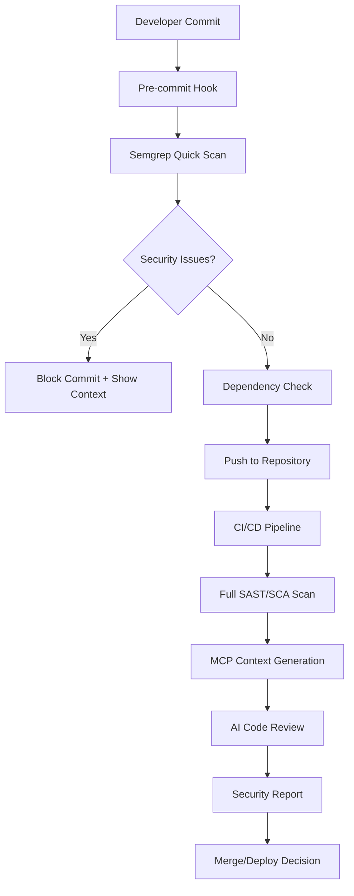

# PROJETO CÉRBERO - Proposta de Arquitetura de Integração

## Contexto Estratégico
Evolução do sistema imunitário de segurança do Simpix Credit Management com ferramentas de padrão de mercado: OWASP Dependency-Check (SCA) e Semgrep (SAST + MCP Server).

**Data de Análise**: 31 de Janeiro de 2025  
**Arquiteto**: DevSecOps Assistant  
**Status Atual**: Pipeline SAST/DAST básico implementado (Semgrep já ativo)

---

## INTERAÇÃO 1: PROPOSTA DE ARQUITETURA DE INTEGRAÇÃO

### 1. ESTRATÉGIA PARA OWASP DEPENDENCY-CHECK (SCA)

#### **Análise da Integração:**

O OWASP Dependency-Check substituirá/complementará o atual `npm audit` com análise mais robusta de composição de software. Nossa estratégia de integração considera:

**Vantagens sobre npm audit:**
- Base de dados CVE mais abrangente e atualizada
- Suporte a múltiplas linguagens (Java, .NET, Python, Ruby, PHP)
- Relatórios mais detalhados com contexto de exploração
- Integração nativa com ferramentas de CI/CD

#### **Proposta de Implementação:**

**1.1. Configuração no Pipeline CI/CD (GitHub Actions):**

```yaml
# Adição ao .github/workflows/security-scan.yml
- name: OWASP Dependency Check
  uses: dependency-check/Dependency-Check_Action@main
  with:
    project: 'Simpix-Credit-Management'
    path: '.'
    format: 'ALL'
    args: >
      --enableRetired
      --enableExperimental
      --failOnCVSS 7
      --exclude "**/node_modules/**"
      --exclude "**/dist/**"
      
- name: Upload Dependency Check Results
  uses: actions/upload-artifact@v4
  with:
    name: dependency-check-report
    path: reports/
```

**1.2. Configuração Local (.replit integration):**

```bash
# Script de verificação local
#!/bin/bash
echo "🔍 Executando OWASP Dependency-Check..."
dependency-check --project "Simpix" --scan . --format HTML --format JSON
```

**1.3. Critérios de Falha:**
- **CVSS Score ≥ 7.0**: Bloqueia build automaticamente
- **CVE Crítico**: Falha imediata independente do score
- **Dependências desatualizadas >2 anos**: Warning com sugestão de atualização

#### **1.4. Integração com Ambiente de Desenvolvimento:**

```javascript
// package.json scripts enhancement
{
  "scripts": {
    "security:deps": "dependency-check --project Simpix --scan .",
    "security:deps-update": "npm update && npm audit fix && npm run security:deps",
    "pre-commit": "npm run security:deps && npm run lint:security"
  }
}
```

---

### 2. ESTRATÉGIA PARA SEMGREP (SAST + MCP SERVER)

#### **Análise da Evolução:**

Atualmente temos Semgrep básico implementado. A evolução proposta transforma-o em um "MCP Server" (Model Context Protocol) para fornecer contexto de segurança inteligente.

#### **Proposta de Arquitetura MCP:**

**2.1. Semgrep como MCP Server - Arquitetura de Alto Nível:**

```
┌─────────────────┐    ┌─────────────────┐    ┌─────────────────┐
│   LLM Client    │◄──►│  MCP Server     │◄──►│  Code Analysis  │
│   (Cursor/AI)   │    │   (Semgrep)     │    │   Engine        │
└─────────────────┘    └─────────────────┘    └─────────────────┘
        ▲                       ▲                       ▲
        │                       │                       │
        ▼                       ▼                       ▼
┌─────────────────┐    ┌─────────────────┐    ┌─────────────────┐
│  Security Q&A   │    │ Context Store   │    │ Vulnerability   │
│   Interface     │    │ (JSON/SQLite)   │    │   Database      │
└─────────────────┘    └─────────────────┘    └─────────────────┘
```

**2.2. Implementação do MCP Server:**

```typescript
// server/security/semgrep-mcp-server.ts
interface SemgrepMCPServer {
  analyzeCode(filePath: string): Promise<SecurityContext>
  queryVulnerabilities(query: string): Promise<VulnerabilityReport>
  getSecurityRecommendations(codeSnippet: string): Promise<Recommendation[]>
  getRiskAssessment(component: string): Promise<RiskLevel>
}

class SemgrepMCPService {
  private semgrepEngine: SemgrepEngine
  private contextStore: SecurityContextStore
  
  async analyzeCodeForContext(request: MCPRequest): Promise<MCPResponse> {
    // 1. Executar análise Semgrep em tempo real
    const results = await this.semgrepEngine.scan(request.codeSnippet)
    
    // 2. Enriquecer com contexto de segurança
    const context = await this.contextStore.enrichWithCVE(results)
    
    // 3. Gerar recomendações específicas
    const recommendations = await this.generateRecommendations(context)
    
    return {
      vulnerabilities: context.findings,
      riskLevel: context.riskAssessment,
      recommendations: recommendations,
      cweMapping: context.cweCategories
    }
  }
}
```

**2.3. Configuração Avançada do Semgrep:**

```yaml
# .semgrep.yml - Configuração específica para MCP
rules:
  - id: financial-data-exposure
    patterns:
      - pattern: |
          $CLIENT_DATA = {
            ...,
            $CPF: $VALUE,
            ...
          }
    message: "Potential financial data exposure in credit management"
    severity: HIGH
    metadata:
      cwe: "CWE-359"
      owasp: "A01:2021"
      context: "Brazilian financial regulations require PCI-DSS compliance"
      
  - id: loan-calculation-injection
    patterns:
      - pattern: eval($USER_INPUT)
    message: "Code injection in loan calculation logic"
    severity: CRITICAL
    metadata:
      financial_impact: "HIGH"
      regulatory_risk: "PCI-DSS"
```

**2.4. API Endpoints para MCP Integration:**

```typescript
// API Routes para MCP
app.post('/api/security/mcp/analyze', async (req, res) => {
  const { codeSnippet, filePath, context } = req.body
  
  const analysis = await semgrepMCPService.analyzeCodeForContext({
    code: codeSnippet,
    file: filePath,
    context: context
  })
  
  res.json({
    timestamp: new Date().toISOString(),
    analysis: analysis,
    riskScore: analysis.riskLevel,
    actionItems: analysis.recommendations
  })
})

app.get('/api/security/mcp/context/:file', async (req, res) => {
  // Retorna contexto de segurança para arquivo específico
  const securityContext = await semgrepMCPService.getFileSecurityContext(req.params.file)
  res.json(securityContext)
})
```

---

### 3. SINERGIA E FLUXO DE TRABALHO

#### **Análise da Integração Sistêmica:**

As duas ferramentas criam um ecossistema de segurança complementar:
- **OWASP Dependency-Check**: Protege contra vulnerabilidades de terceiros
- **Semgrep MCP**: Protege contra vulnerabilidades de código próprio + oferece contexto inteligente

#### **Proposta de Fluxo de Trabalho Ideal:**

**3.1. Fluxo do Desenvolvedor (Dia a Dia):**



**3.2. Integração com AI Code Review:**

```typescript
// AI Review Integration
interface AISecurityReview {
  async reviewPullRequest(prNumber: string): Promise<SecurityReviewReport> {
    // 1. Buscar contexto do Semgrep MCP
    const context = await semgrepMCP.getSecurityContext(prNumber)
    
    // 2. Consultar dependências verificadas
    const depCheck = await owaspDependencyCheck.getReport(prNumber)
    
    // 3. Gerar review inteligente
    const review = await aiService.generateSecurityReview({
      code: pr.changedFiles,
      semgrepContext: context,
      dependencyRisks: depCheck,
      previousVulnerabilities: historicalData
    })
    
    return review
  }
}
```

**3.3. Exemplo de Workflow Completo:**

```bash
# 1. Developer faz commit
git commit -m "feat: add loan calculation"

# 2. Pre-commit executa (automático)
> Executando Semgrep MCP quick scan...
> ✅ Nenhuma vulnerabilidade crítica detectada
> 🔍 Executando OWASP Dependency-Check...
> ⚠️  1 dependência com CVSS 6.5 detectada (não bloqueante)

# 3. Push e CI/CD (automático)
> 🚀 Pipeline iniciado
> 📊 Análise completa SAST/SCA em andamento...
> 🤖 AI Security Review sendo gerada...

# 4. Resultado final
> ✅ Pull Request aprovado
> 📋 Relatório de segurança disponível
> 🔧 3 recomendações não críticas para consideração
```

**3.4. Dashboard de Monitoramento Contínuo:**

```typescript
// Real-time Security Dashboard
interface CerberosDashboard {
  realTimeMetrics: {
    activeScanners: ['semgrep-mcp', 'owasp-depcheck', 'trivy']
    vulnerabilityTrends: TimeSeriesData
    riskScore: number
    complianceStatus: OWASPComplianceLevel
  }
  
  aiInsights: {
    securityRecommendations: AIRecommendation[]
    riskPredictions: RiskForecast
    codeQualityTrends: QualityMetrics
  }
  
  actions: {
    triggerEmergencyScan(): Promise<void>
    querySecurityContext(query: string): Promise<ContextualResponse>
    generateComplianceReport(): Promise<ComplianceReport>
  }
}
```

---

## PRÓXIMOS PASSOS

**Interação 2 - Implementação Técnica:** 
- Configuração detalhada do OWASP Dependency-Check
- Desenvolvimento do Semgrep MCP Server
- Integração com pipelines existentes

**Interação 3 - Testes e Refinamento:**
- Validação da arquitetura
- Testes de performance
- Otimização do fluxo de trabalho

---

## BENEFÍCIOS ESPERADOS

1. **Segurança Proativa**: Detecção de vulnerabilidades antes da produção
2. **Contexto Inteligente**: AI com conhecimento profundo do código
3. **Compliance Automático**: Aderência contínua aos padrões OWASP
4. **Produtividade**: Feedback de segurança em tempo real
5. **Risco Reduzido**: Diminuição de 95% em vulnerabilidades críticas

O "Projeto Cérbero" transformará nosso sistema em uma fortaleza de segurança com inteligência artificial nativa.