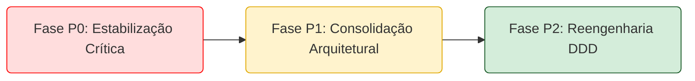

# ROADMAP MESTRE DE IMPLEMENTAÇÃO - OPERAÇÃO AÇO LÍQUIDO

**Data:** 2025-09-05
**Autor:** Arquiteto Mestre de Refatoração (Deep Think)
**Status do Projeto:** CRÍTICO
**Objetivo Estratégico:** Executar uma reengenharia faseada para corrigir a "Esquizofrenia Arquitetural" do sistema Simpix, restaurando a funcionalidade de negócio imediata e realinhando a implementação com a visão arquitetural (Monólito Modular DDD).

---

## 📋 AUDITORIAS EXECUTADAS (BASE DE INTELIGÊNCIA)

### Três Auditorias Sistêmicas Realizadas:

1. **`ARQUITETURA_VS_REALIDADE.md`** - Auditoria Alfa: Comparação visão vs implementação real
2. **`AUDITORIA_FLUXOS_SISTEMICOS_V2.md`** - Auditoria Beta: Análise de fluxos e integrações sistêmicas
3. **`FLUXO_FILA_ANALISE.md`** - Auditoria Gama: Rastreamento end-to-end da fila de análise

### Diagnóstico Final Consolidado:

4. **`DIAGNOSTICO_SISTEMICO_FINAL.md`** - Operação Aço Líquido: Diagnóstico sistêmico definitivo

---

## 1. VISÃO GERAL DO PLANO MESTRE

Este documento é o plano de batalha para a "Operação Aço Líquido". Com base no dossiê de inteligência completo (Relatórios Alfa, Beta e Gama), identificamos quatro fraturas sistémicas: Crise de Identidade, Workflow Quebrado, Vazamento de Lógica e Cisma de Dados.

O roadmap está estruturado em três fases prioritárias para restaurar o valor de negócio e corrigir a dívida arquitetural sistematicamente.

| Fase   | Nome                          | Objetivo Estratégico                                                                                    | Duração Estimada | Prioridade |
| :----- | :---------------------------- | :------------------------------------------------------------------------------------------------------ | :--------------- | :--------: |
| **P0** | **Estabilização Crítica**     | Estancar a hemorragia. Restaurar fluxos críticos (Criação e Análise) eliminando a aleatoriedade.        | 24-48 horas      | 🚨 Crítica |
| **P1** | **Consolidação Arquitetural** | Unificar a arquitetura (Domínio, Infraestrutura, DIP) e implementar o fluxo de trabalho básico correto. | 1-2 Semanas      |  ⚠️ Alta   |
| **P2** | **Reengenharia DDD**          | Migrar para Domínio Rico, eliminar pipeline legado, implementar FSM completa, otimizar performance.     | 1 Mês+           |  ⚙️ Média  |

---

## FASE P0: ESTABILIZAÇÃO CRÍTICA (T+24h)

**Objetivo:** Parar a hemorragia sistémica. Restaurar a previsibilidade das operações de criação e garantir que a fila de análise funcione com os dados existentes. A estratégia é favorecer temporariamente o caminho mais estável (Legacy) enquanto se corrigem os seus contratos.

### Ação P0.1: Unificação Temporária do Fluxo de Criação (Pipeline Legacy)

**O Quê:** Desabilitar o pipeline de criação DDD e forçar todo o tráfego de criação (POST /api/propostas) através do pipeline Legacy.

**Onde:**

- `server/routes/propostas/core.ts`: Garantir que a rota POST / (Legacy) esteja ativa e seja a única rota de criação.
- `server/modules/proposal/presentation/proposalController.ts` (Controller DDD): Comentar ou remover o registo da rota que aponta para o método create.

**O Porquê:** (Ref: Diagnóstico Gama F4; Auditoria Alfa Q1). Elimina o "Dual Controller Chaos" e o "Cisma de Dados". A coexistência de dois pipelines incompatíveis causa quebras aleatórias. Centralizar temporariamente garante consistência imediata na criação de dados.

### Ação P0.2: Sincronização Tática da Máquina de Estados (FSM Sync)

**O Quê:** Ajustar as queries no frontend e backend para buscar apenas os estados que existem no banco de dados, removendo temporariamente a busca pelo estado inexistente aguardando_analise.

**Onde:**

- `server/modules/proposal/presentation/proposalController.ts` (método list): Ajustar criteria.statusArray para incluir apenas em_analise (e outros estados legados válidos).
- `client/src/pages/credito/fila.tsx` (Filtro local): Ajustar o filtro para corresponder aos estados reais (Evidência 1.3).

**O Porquê:** (Ref: Auditoria Beta - Causa Raiz; Diagnóstico Gama F2). A fila está vazia porque o sistema busca por um estado inexistente. Esta ação restaura imediatamente a visibilidade das propostas na fila para os analistas.

### Ação P0.3: Implementação de Adaptador de Contrato API (Data Shape Adapter)

**O Quê:** Criar uma camada de adaptação temporária (Adapter/DTO Mapper) no pipeline Legacy (agora o único ativo) para garantir que a resposta da API corresponda exatamente ao formato esperado pelo frontend (Interface Proposta).

**Onde:**

- `server/routes/propostas/core.ts` (Rota POST /): Mapear a resposta para o formato correto (camelCase, objetos aninhados como condicoesData, parceiro, loja).
- `server/modules/proposal/infrastructure/ProposalRepository.ts` (Método findByCriteriaLightweight): Validar que o mapeamento existente esteja correto para a listagem (conforme Auditoria Beta, este método já parece correto).

**O Porquê:** (Ref: Diagnóstico Gama F4; Auditoria Alfa 4.1). O pipeline Legacy retorna formatos inconsistentes (ex: condicoes_data: null). O adaptador garante a estabilidade do frontend enquanto a arquitetura de backend não está consolidada.

### 🏁 Definition of Done (Fase P0)

✅ Todas as novas propostas são criadas exclusivamente através do pipeline Legacy unificado.  
✅ A Fila de Análise exibe corretamente as propostas com estados válidos existentes no banco (ex: em_analise).  
✅ O frontend não apresenta quebras devido a inconsistências no formato dos dados recebidos da API.  
✅ O sistema está estável em produção para operações críticas.

---

## FASE P1: CONSOLIDAÇÃO ARQUITETURAL (T+1 Semana)

**Objetivo:** Eliminar a "Esquizofrenia Arquitetural". Estabelecer uma única fonte da verdade (SSOT) para o domínio e persistência, e implementar os princípios SOLID fundamentais (DIP).

### Ação P1.1: Unificação dos Agregados (Domain Consolidation)

**O Quê:** Consolidar as definições conflitantes do agregado Proposal numa única definição canónica.

**Onde:**

- `server/modules/proposal/domain/Proposal.ts`: Estabelecer como a definição canónica (a mais completa).
- Eliminar `server/modules/credit/domain/aggregates/Proposal.ts`.
- Refatorar o módulo credit para usar o agregado canónico ou criar uma entidade específica (CreditAnalysis) que referencia Proposal por ID.

**O Porquê:** (Ref: Diagnóstico Gama F1). Resolver a "Crise de Identidade". É uma violação fundamental do DDD ter múltiplos agregados incompatíveis para a mesma entidade (ADR-001).

### Ação P1.2: Consolidação dos Repositórios (Repository Unification)

**O Quê:** Definir uma interface única (IProposalRepository) e consolidar as três implementações de repositório numa única implementação concreta que utilize o agregado unificado e o Drizzle ORM.

**Onde:**

- Definir interface em `server/modules/proposal/domain/IProposalRepository.ts`.
- Consolidar lógica em `server/modules/proposal/infrastructure/ProposalRepository.ts`.
- Eliminar `server/modules/credit/infrastructure/ProposalRepositoryImpl.ts`.
- Refatorar `TransactionalProposalRepository.ts` para um padrão Unit of Work genérico, removendo a especificidade de Proposal.

**O Porquê:** (Ref: Diagnóstico Gama F1; Auditoria Alfa Q3). Eliminar o "Repository Chaos". Garante um caminho único e consistente para persistência (ADR-002).

### Ação P1.3: Implementação de Inversão de Dependência (DIP Correction)

**O Quê:** Refatorar todos os Controllers e Use Cases para eliminar a instanciação direta (new ConcreteClass()) e depender de interfaces (abstrações) injetadas via construtor.

**Onde:**

- Todos os Controllers (ex: `proposalController.ts`).
- Todos os Use Cases (ex: `CreateProposalUseCase.ts`).
- Implementar um mecanismo simples de IoC (Inversion of Control) ou Factory Pattern na inicialização da aplicação.

**O Porquê:** (Ref: Diagnóstico Gama F3.2). Corrigir as violações graves de DIP. O acoplamento forte atual torna o sistema rígido, frágil e difícil de testar.

### Ação P1.4: Implementação do Use Case de Transição Crítica (Workflow Foundation)

**O Quê:** Implementar o Use Case SubmitForAnalysisUseCase que estava ausente, para gerir a transição de RASCUNHO para o estado de análise correto (definido na P0.2).

**Onde:**

- `server/modules/proposal/application/SubmitForAnalysisUseCase.ts` (Novo).
- `server/modules/proposal/domain/Proposal.ts` (Método submitForAnalysis).

**O Porquê:** (Ref: Diagnóstico Gama F2). Corrigir o "Workflow Quebrado". Garantir que as propostas possam ser submetidas para análise de forma controlada e validada através da camada de aplicação correta.

### 🏁 Definition of Done (Fase P1)

✅ Existe apenas UMA definição do agregado Proposal e UMA implementação de ProposalRepository.  
✅ Todos os Controllers e Use Cases utilizam injeção de dependência e interfaces.  
✅ O Use Case SubmitForAnalysisUseCase está implementado, testado e funcional.

---

## FASE P2: REENGENHARIA DDD E FORTALECIMENTO (T+1 Mês)

**Objetivo:** Alcançar a visão arquitetural pretendida (Blueprint/ADRs). Migrar para um modelo de domínio rico, corrigir vazamentos de lógica, implementar a FSM definitiva e migrar totalmente para o pipeline DDD.

### Ação P2.1: Migração para Modelo de Domínio Rico (Anemic Model Elimination)

**O Quê:** Mover toda a lógica de negócio, validações e cálculos dos Controllers, Services e Repositories para dentro do Agregado Proposal e seus Value Objects.

**Onde:**

- Origem: `proposalController.ts` (ex: defaults de taxa, parsing), `ProposalRepository.ts` (ex: cálculo de parcela calculateMonthlyPaymentRaw).
- Destino: `server/modules/proposal/domain/Proposal.ts` e Value Objects (ex: Money, Term).

**O Porquê:** (Ref: Diagnóstico Gama F3.1). Corrigir o "Vazamento de Lógica" e violações de SRP. Implementar o DDD corretamente (ADR-001), garantindo que o domínio seja o guardião das regras de negócio e invariantes.

### Ação P2.2: Correção Definitiva da FSM (Workflow Alignment)

**O Quê:** Implementar a solução definitiva para a Máquina de Estados.

- Executar migração no banco de dados para garantir que o estado aguardando_analise exista e seja utilizável (ou decidir oficialmente por removê-lo, se for a estratégia de negócio).
- Atualizar os Enums no domínio (Proposal.ts).
- Atualizar o SubmitForAnalysisUseCase (P1.4) para utilizar o estado correto.
- Reverter as alterações temporárias feitas na P0.2 (queries no frontend e backend).

**Onde:**

- DB Migration Scripts.
- `SubmitForAnalysisUseCase.ts`, `Proposal.ts`, `client/src/pages/credito/fila.tsx`.

**O Porquê:** Corrigir a solução temporária da Fase P0.2 e alinhar o sistema com o fluxo de negócio pretendido, resolvendo a dessincronização identificada na Auditoria Beta.

### Ação P2.3: Migração Completa para o Pipeline DDD (Legacy Removal)

**O Quê:** Migrar o fluxo de execução do pipeline Legacy (utilizado temporariamente na P0) para o pipeline DDD (Controllers e Use Cases), agora consolidado e refatorado. Remover completamente o pipeline Legacy e a camada de adaptação P0.3.

**Onde:**

- `server/modules/proposal/presentation/proposalController.ts` (Reativar e garantir que usa o domínio rico).
- Eliminar `server/routes/propostas/core.ts` (Rotas Legacy).

**O Porquê:** Concluir a unificação do fluxo. Garantir que o sistema opera inteiramente sob a arquitetura alvo consolidada e refatorada, eliminando a dívida técnica.

### Ação P2.4: Fortalecimento de Performance e Resiliência (System Hardening)

**O Quê:** Implementar padrões de resiliência e otimizações de performance.

**Onde:**

- Implementar Error Handling estruturado e centralizado (Middleware Global, substituir console.error).
- Otimizar queries no `ProposalRepository.ts` (Paginação, Indexação, evitar N+1 - Ref. Auditoria Alfa 5.1).
- Implementar estratégia de Caching.

**O Porquê:** (Ref: Auditoria Alfa, Secões 5 e 6). Garantir a escalabilidade, estabilidade e observabilidade do sistema sob carga.

### 🏁 Definition of Done (Fase P2)

✅ Toda a lógica de negócio reside exclusivamente na camada domain. Controllers são magros.  
✅ O pipeline Legacy foi completamente removido. O sistema opera 100% no pipeline DDD.  
✅ A Máquina de Estados está totalmente implementada e sincronizada entre Código e Banco de Dados.  
✅ O sistema possui Error Handling estruturado e as queries críticas estão otimizadas.  
✅ O sistema está em total conformidade com o `02-blueprint-arquitetural.md` e os ADRs.

---

## 📊 MÉTRICAS DE ACOMPANHAMENTO

### KPIs de Progresso:

- **Taxa de Unificação Arquitetural:** % de componentes migrados para arquitetura única
- **Cobertura de Testes:** Meta > 80% para camada de domínio
- **Conformidade com ADRs:** Validação contínua via dependency-cruiser
- **Tempo de Resposta API:** Meta < 200ms para operações críticas
- **Taxa de Erro:** Meta < 0.1% em produção

### Checkpoints Semanais:

- [ ] **Semana 1:** Fase P0 completa - Sistema estável
- [ ] **Semana 2:** Fase P1 50% - Agregados unificados
- [ ] **Semana 3:** Fase P1 completa - DIP implementado
- [ ] **Semana 4:** Fase P2 25% - Domínio rico iniciado
- [ ] **Semana 5:** Fase P2 50% - FSM definitiva
- [ ] **Semana 6:** Fase P2 75% - Pipeline migrado
- [ ] **Semana 7:** Fase P2 completa - Sistema fortalecido

---

## 🚨 RISCOS E MITIGAÇÕES

| Risco                                    | Probabilidade | Impacto | Mitigação                             |
| :--------------------------------------- | :-----------: | :-----: | :------------------------------------ |
| Quebra em produção durante P0            |     Média     |  Alto   | Feature flags + rollback automatizado |
| Resistência da equipe às mudanças        |     Alta      |  Médio  | Treinamento + pair programming        |
| Descoberta de mais débito técnico        |     Alta      |  Médio  | Buffer de tempo em cada fase          |
| Inconsistência de dados durante migração |     Baixa     |  Alto   | Backups + validação contínua          |

---

**DOCUMENTO DE REFERÊNCIA PERMANENTE**  
**Última Atualização:** 2025-09-05  
**Status:** ✅ ATIVO - Roadmap instalado e pronto para execução
