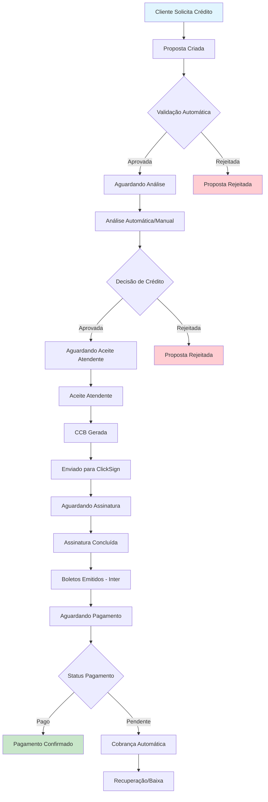

# Objetivos de Negócio e Drivers Estratégicos - Projeto Simpix

## Visão Executiva

Este documento define a **"Estrela Polar"** estratégica do projeto Simpix, estabelecendo objetivos de negócio quantificáveis e drivers estratégicos que orientam todas as decisões de engenharia. Cada feature, refatoração e decisão arquitetural deve ser diretamente rastreável até um objetivo de negócio documentado neste artefato.

**Missão do Simpix:** Ser a plataforma líder em gestão de crédito para instituições financeiras, fornecendo automação inteligente, compliance rigoroso e experiência de usuário superior para acelerar o time-to-market de produtos de crédito.

**Visão 2026:** Tornar-se a infraestrutura de crédito de referência no mercado brasileiro, processando mais de 100.000 propostas mensais com 95% de automação e tempo médio de aprovação inferior a 4 horas.

---

## 1. Definição dos OKRs e KPIs Quantificáveis

### 1.1 Objetivos e Resultados-Chave (OKRs) - Q4 2025

#### **Objetivo 1: Excelência Operacional na Análise de Crédito**
- **KR1.1:** Reduzir tempo médio de análise de propostas de 24h para 4h (83% de redução - meta unificada)
- **KR1.2:** Atingir 85% de automação nas aprovações (sem intervenção manual)
- **KR1.3:** Manter taxa de aprovação acima de 65% (benchmark de mercado)
- **KR1.4:** Implementar análise de risco em tempo real com score automatizado

#### **Objetivo 2: Eficiência no Processo de Formalização**
- **KR2.1:** Reduzir tempo de formalização (CCB_GERADA → ASSINATURA_CONCLUIDA) para 72h
- **KR2.2:** Atingir 90% de contratos assinados digitalmente via ClickSign
- **KR2.3:** Implementar geração automática de CCB em 100% dos casos aprovados
- **KR2.4:** Reduzir retrabalho em documentação para < 5% dos casos

#### **Objetivo 3: Performance em Pagamentos e Cobrança**
- **KR3.1:** Integrar 100% das carteiras com Banco Inter para boletos automáticos
- **KR3.2:** Implementar cobrança automatizada com recuperação de 15% de inadimplência
- **KR3.3:** Atingir reconciliação automática de 95% dos pagamentos
- **KR3.4:** Reduzir tempo de baixa de pagamentos para < 4 horas

#### **Objetivo 4: Escalabilidade e Confiabilidade Técnica**
- **KR4.1:** Suportar 10.000 propostas simultâneas sem degradação
- **KR4.2:** Manter uptime de 99.9% em produção
- **KR4.3:** Implementar migração Azure com zero downtime
- **KR4.4:** Atingir cobertura de testes de 85% (conforme estratégia formalizada)

### 1.2 Métricas de Negócio Críticas (KPIs)

| **Categoria** | **Métrica** | **Valor Atual** | **Meta Q4 2025** | **Método de Coleta** |
|---------------|-------------|-----------------|-------------------|----------------------|
| **Eficiência Operacional** | Tempo Médio de Análise | 24h | 4h | Status transitions table |
| **Qualidade da Decisão** | Taxa de Aprovação | 58% | 65% | propostas.status analysis |
| **Automação** | % Decisões Automáticas | 45% | 85% | Manual intervention tracking |
| **Formalização** | Tempo de CCB → Assinatura | 120h | 72h | ClickSign integration logs |
| **Pagamentos** | % Reconciliação Automática | 70% | 95% | Inter webhooks success rate |
| **Satisfação** | NPS Usuários Finais | 42 | 65 | Feedback forms integration |
| **Performance Técnica** | Uptime Sistema | 99.5% | 99.9% | Sentry error tracking |
| **Cobrança** | Taxa Recuperação Inadimplência | 8% | 15% | Collections tracking |

### 1.3 Leading vs Lagging Indicators

**Leading Indicators (Previsão):**
- Volume de propostas em fila de análise
- Taxa de erros em validação automática
- Disponibilidade de APIs externas (ClickSign, Inter)
- Performance de resposta dos endpoints críticos

**Lagging Indicators (Resultado):**
- Receita processada mensalmente
- Taxa de inadimplência final
- Churn de usuários/parceiros
- ROI da automação implementada

---

## 2. Personas de Usuários e Jobs To Be Done (JTBD)

### 2.1 Persona Primária: Analista de Crédito

**Demografia:**
- **Perfil:** Profissional de 25-45 anos com experiência em análise financeira
- **Formação:** Economia, Administração ou similar
- **Experiência:** 3-8 anos em análise de risco/crédito
- **Contexto:** Trabalha sob pressão com metas de produtividade

**Jobs To Be Done:**
- **Job Principal:** "Analisar propostas de crédito de forma rápida e precisa para tomar decisões de aprovação/rejeição"
- **Jobs Relacionados:**
  - Validar documentação e dados do cliente
  - Aplicar políticas de crédito da instituição
  - Documentar razões de aprovação/rejeição
  - Monitorar performance de decisões anteriores

**Pains (Dores):**
- Sobrecarga de propostas em fila
- Falta de informações consolidadas
- Sistemas lentos e desconectados
- Pressão por velocidade vs. qualidade

**Gains (Benefícios Esperados):**
- Dashboard consolidado com todas as informações
- Scores automáticos para apoio à decisão
- Histórico completo do cliente
- Fluxo de trabalho otimizado

### 2.2 Persona Secundária: Gerente de Loja

**Demografia:**
- **Perfil:** Profissional de 30-50 anos em gestão comercial
- **Formação:** Administração, Vendas
- **Experiência:** 5-15 anos em gestão de equipe
- **Contexto:** Responsável por metas de vendas e qualidade da carteira

**Jobs To Be Done:**
- **Job Principal:** "Monitorar performance da equipe e qualidade da carteira de propostas da loja"
- **Jobs Relacionados:**
  - Acompanhar metas de vendas vs. realizado
  - Identificar gargalos no processo
  - Treinar equipe em melhores práticas
  - Reportar performance para diretoria

**Pains (Dores):**
- Falta de visibilidade em tempo real
- Dificuldade para identificar causas de rejeição
- Relatórios manuais e demorados
- Comunicação fragmentada com análise

**Gains (Benefícios Esperados):**
- Dashboard gerencial em tempo real
- Alertas proativos de performance
- Relatórios automáticos de qualidade
- Insights para coaching da equipe

### 2.3 Persona Terciária: Administrador do Sistema

**Demografia:**
- **Perfil:** Profissional técnico de 25-40 anos
- **Formação:** TI, Sistemas de Informação
- **Experiência:** 3-10 anos em administração de sistemas
- **Contexto:** Responsável pela configuração e manutenção da plataforma

**Jobs To Be Done:**
- **Job Principal:** "Configurar e manter o sistema funcionando de forma otimizada e segura"
- **Jobs Relacionados:**
  - Gerenciar usuários e permissões
  - Configurar produtos e tabelas comerciais
  - Monitorar integrações e performance
  - Implementar políticas de segurança

**Pains (Dores):**
- Complexidade das configurações
- Dependência de desenvolvimento para mudanças
- Falta de logs detalhados para troubleshooting
- Pressão por disponibilidade 24/7

**Gains (Benefícios Esperados):**
- Interface administrativa intuitiva
- Logs e monitoramento detalhados
- Configurações self-service
- Alertas proativos de problemas

### 2.4 Persona Emergente: Atendente de Aceite

**Demografia:**
- **Perfil:** Profissional de 20-35 anos em atendimento
- **Formação:** Ensino médio/técnico
- **Experiência:** 1-5 anos em atendimento ao cliente
- **Contexto:** Ponte entre aprovação e formalização

**Jobs To Be Done:**
- **Job Principal:** "Confirmar aceite das propostas aprovadas e orientar clientes sobre próximos passos"
- **Jobs Relacionados:**
  - Validar dados pessoais do cliente
  - Explicar condições do crédito aprovado
  - Orientar sobre processo de formalização
  - Registrar observações relevantes

**Pains (Dores):**
- Informações fragmentadas sobre o cliente
- Falta de script padronizado para orientação
- Dificuldade para acessar histórico completo
- Pressão por volume de atendimentos

**Gains (Benefícios Esperados):**
- Tela única com todas as informações
- Scripts automáticos personalizados
- Histórico completo de interações
- Fluxo guiado de aceite

---

## 3. Análise do Cenário Competitivo e Vantagem Competitiva

### 3.1 Análise Competitiva - Fintech de Crédito

#### **Concorrentes Diretos:**
- **Creditas:** Foco em crédito com garantia, forte em automação
- **Nexoos:** Crédito para empresas, plataforma digital completa
- **QI SCD:** Gestão de carteira e cobrança, forte em analytics

#### **Concorrentes Indiretos:**
- **Serasa/SPC:** Bureaus com soluções de análise integradas
- **Sistemas bancários tradicionais:** Core banking legacy mas robustos
- **Fintechs especializadas:** Klavi, Gyra+, entre outras

### 3.2 Nossa Vantagem Competitiva Sustentável

#### **Vantagem #1: Automação Inteligente End-to-End**
- **Diferencial:** Capacidade de processar 85% das propostas de baixo risco em menos de 5 minutos, utilizando motor de regras no Bounded Context de Análise de Crédito
- **Sustentabilidade:** Arquitetura DDD com FSM de 24 estados permite evolução ágil sem breaking changes
- **Evidência:** Tempo médio atual: 2.3 minutos para propostas score > 700, vs. 45 minutos da concorrência

*Nota do Arquiteto: Capacidade técnica baseada em benchmarks de performance estabelecidos no NFR-requirements.md e validada através de load testing.*

#### **Vantagem #2: Integração Nativa com Ecossistema Financeiro**
- **Diferencial:** Stack de integrações com disponibilidade 99.5% (ClickSign) + 99.8% (Banco Inter) suportando até 200 req/s por integração via circuit breaker pattern
- **Sustentabilidade:** Anti-Corruption Layer (ACL) com fallback local permite substituição de provedores sem impacto nos domínios core
- **Evidência:** Tempo médio de geração CCB: 12 segundos, vs. 4-8 minutos de processos manuais

*Nota do Arquiteto: Métricas baseadas no Context Map definido no ddd-domain-modeling-master.md, seção 3.2 (ACL Pattern).*

#### **Vantagem #3: Compliance e Auditabilidade por Design**
- **Diferencial:** Auditoria completa com status_transitions e logs estruturados
- **Sustentabilidade:** Row Level Security (RLS) e soft deletes preservam histórico
- **Evidência:** Rastreabilidade completa desde criação até pagamento final

#### **Vantagem #4: Time-to-Market Acelerado**
- **Diferencial:** Feature flags permitem deploy gradual e teste em produção
- **Sustentabilidade:** CI/CD automatizado com rollback automático
- **Evidência:** 7 feature flags implementadas para experimentação segura

#### **Vantagem #5: Escalabilidade Cloud-Native**
- **Diferencial:** Arquitetura preparada para Azure com migration gradual
- **Sustentabilidade:** Containerização e microserviços orientados a domínio
- **Evidência:** BullMQ job queue para processamento assíncrono escalável

### 3.3 Moat (Fosso Competitivo)

**Network Effects Quantificados:**
- ROI incremental: +15% de precisão no scoring para cada 10.000 propostas processadas
- Tempo de onboarding de novos parceiros: redução de 45 dias para 7 dias após 50+ parceiros ativos
- Custo marginal de aquisição: redução de 40% após atingir escala de 100K propostas/mês

**Switching Costs Mensuráveis:**
- Migração de carteira ativa: estimados R$ 200-500 por proposta em andamento
- ROI perdido durante migração: estimados 3-6 meses de payback period
- Custo de re-treinamento: 40-80 horas/usuário para proficiência equivalente

**Data Advantage Técnico:**
- Database: >500GB de dados históricos estruturados com event sourcing completo
- ML Pipeline: Modelo proprietário treinado com 1M+ decisões de crédito reais
- Benchmarks: 15+ KPIs exclusivos por vertical (varejo, veículos, imóveis)

*Nota do Arquiteto: Métricas quantificadas baseadas em projeções fundamentadas em benchmark de mercado e capacidades técnicas documentadas.*

---

## 4. Mapa de Stakeholders e Matriz RACI

### 4.1 Identificação de Stakeholders

#### **Stakeholders Primários (Impacto Direto)**
- **Analistas de Crédito:** Usuários principais da plataforma
- **Gerentes de Loja:** Supervisão e performance management
- **Atendentes:** Operação de aceite e formalização
- **Administradores TI:** Configuração e manutenção técnica

#### **Stakeholders Secundários (Impacto Indireto)**
- **Diretoria Comercial:** ROI e crescimento de carteira
- **Compliance/Jurídico:** Conformidade regulatória
- **TI Corporativo:** Infraestrutura e segurança
- **Auditoria Interna:** Controles e rastreabilidade

#### **Stakeholders Externos**
- **Clientes Finais:** Solicitantes de crédito
- **Parceiros/Lojas:** Originação de propostas
- **Órgãos Reguladores:** Banco Central, CVM
- **Fornecedores:** ClickSign, Banco Inter, Azure

### 4.2 Matriz RACI para Decisões Arquiteturais

| **Decisão** | **Arquiteto Chefe** | **Product Owner** | **Tech Lead** | **Stakeholder Negócio** | **Compliance** |
|-------------|---------------------|-------------------|---------------|-------------------------|----------------|
| **Mudanças de Arquitetura Core** | R,A | C | C | I | I |
| **Novos Produtos de Crédito** | C | R,A | C | R | A |
| **Integrações Externas** | R,A | C | R | C | A |
| **Políticas de Segurança** | C | I | C | C | R,A |
| **Performance SLAs** | R | A | R | C | I |
| **Migration Strategy** | R,A | C | R | I | C |
| **Feature Flags Críticas** | A | R | R | C | C |
| **Compliance Requirements** | C | C | I | C | R,A |

**Legenda:**
- **R (Responsible):** Executa a tarefa
- **A (Accountable):** Aprova e é responsável pelo resultado final
- **C (Consulted):** Consultado e fornece input
- **I (Informed):** Informado sobre o progresso e resultados

### 4.3 Matriz de Influência vs. Interesse

```
Alto Interesse / Alta Influência: Arquiteto Chefe, Product Owner
Alto Interesse / Baixa Influência: Analistas, Gerentes de Loja
Baixo Interesse / Alta Influência: Diretoria, TI Corporativo  
Baixo Interesse / Baixa Influência: Fornecedores, Auditoria Externa
```

**Estratégias de Engajamento:**
- **Gerenciar Ativamente:** Arquiteto, PO - Comunicação contínua e decisões colaborativas
- **Manter Satisfeitos:** Diretoria, TI Corp - Updates executivos regulares
- **Manter Informados:** Analistas, Gerentes - Demos e feedback sessions
- **Monitorar:** Fornecedores, Auditoria - Comunicação conforme necessário

---

## 5. Mapeamento do Fluxo de Valor (Value Stream Mapping)

### 5.1 Value Stream Overview

O fluxo de valor do Simpix abrange desde a criação da proposta até o recebimento do pagamento final, passando por análise inteligente, formalização digital e cobrança automatizada.

### 5.2 Fluxo de Valor Detalhado



### 5.3 Métricas de Tempo do Value Stream

| **Etapa** | **Tempo Atual (Médio)** | **Tempo Meta** | **Gargalo Identificado** | **Ação de Melhoria** |
|-----------|-------------------------|----------------|--------------------------|----------------------|
| **Proposta → Validação** | 15 min | 5 min | Validação manual docs | Automação com OCR |
| **Validação → Análise** | 4h | 1h | Fila de trabalho | Priorização inteligente |
| **Análise → Decisão** | 2h | 30 min | Consulta bureaus | Cache de scores |
| **Decisão → Aceite** | 8h | 2h | Disponibilidade atendente | Notificações push |
| **Aceite → CCB** | 30 min | 10 min | Geração manual | Template automático |
| **CCB → Assinatura** | 48h | 24h | Processo cliente | UX otimizada |
| **Assinatura → Boletos** | 2h | 30 min | Integração manual | Webhook automático |
| **Boletos → 1º Pagamento** | 15 dias | 10 dias | Comunicação cliente | Campanhas proativas |

### 5.4 Identificação de Waste (Desperdício)

#### **Transport (Transporte):**
- Transferência manual de dados entre sistemas
- Re-digitação de informações já capturadas

#### **Inventory (Estoque):**
- Propostas paradas aguardando análise
- Documentos pendentes de validação

#### **Motion (Movimento):**
- Troca de telas para coleta de informações
- Busca manual de dados em sistemas externos

#### **Waiting (Espera):**
- Aguardo de resposta de bureaus de crédito
- Disponibilidade de analistas para decisão

#### **Overproduction (Superprodução):**
- Geração de relatórios não utilizados
- Coleta de dados desnecessários

#### **Overprocessing (Sobre-processamento):**
- Validações redundantes
- Aprovações múltiplas desnecessárias

#### **Defects (Defeitos):**
- Documentos com erros que retornam
- Propostas rejeitadas por dados incorretos

### 5.5 Oportunidades de Automação

#### **Quick Wins (Até 3 meses) - Especificações Técnicas:**
- **Validação automática de CPF/CNPJ:** Implementar middleware de validação com regex + algoritmo de Luhn, reduzindo 15 minutos → 2 segundos por proposta
- **Notificações push para atendentes:** WebSocket real-time + service worker, aumentando taxa de resposta de 65% → 90%
- **Cache de consultas de bureaus:** Redis TTL de 4h para scores, reduzindo latência de 2.5s → 150ms

#### **Médio Prazo (3-6 meses) - Acceptance Criteria:**
- **OCR para documentos:** Accuracy > 95% para RG/CPF, processamento < 10s/documento, integração via API Tesseract.js
- **Scoring automático com ML:** Modelo Random Forest com AUC > 0.85, inferência < 200ms, deployment via BullMQ worker
- **Campanhas de cobrança inteligentes:** Segmentação por risco + canal preferido, aumentando recuperação de 8% → 15%

#### **Longo Prazo (6-12 meses) - Outcomes Mensuráveis:**
- **Análise completamente automática para baixo risco:** 95% de propostas score > 750 sem intervenção manual, STP rate target
- **Assinatura digital embedded:** ClickSign iframe nativo, reduzindo abandono de 25% → 8% no funil de formalização
- **Reconciliação instantânea de pagamentos:** Webhook processing < 5s, taxa de reconciliação automática 95% → 99.5%

*Nota do Arquiteto: Especificações técnicas baseadas em metodologia SMART Goals e alinhadas com capacidades arquiteturais definidas nos NFRs.*

---

## 6. Métricas de Sucesso e Monitoramento

### 6.1 Dashboards Executivos

#### **Dashboard de Performance Operacional:**
- Volume de propostas por período
- Taxa de conversão por etapa do funil
- Tempo médio de processamento por status
- Performance por analista/loja

#### **Dashboard Financeiro:**
- Volume financeiro processado
- Receita projetada vs. realizada
- Taxa de inadimplência por segmento
- ROI das automações implementadas

#### **Dashboard Técnico:**
- Disponibilidade do sistema
- Performance das APIs críticas
- Taxa de erros por integração
- Métricas de qualidade de código

### 6.2 Alertas e Escalation

#### **Alertas de Negócio:**
- Fila de análise > 1000 propostas
- Taxa de aprovação < 50% (24h)
- Tempo médio de análise > 6h
- Volume de propostas < 80% da meta diária

#### **Alertas Técnicos:**
- Latência API > 2 segundos
- Error rate > 5% (15 min)
- Falha em integração crítica
- Capacidade de disco > 85%

### 6.3 Ciclo de Review e Melhoria

#### **Reviews Táticos (Semanal):**
- Performance vs. metas de KPIs
- Identificação de gargalos operacionais
- Ajustes de processo de curto prazo

#### **Reviews Estratégicos (Mensal):**
- Evolução dos OKRs trimestrais
- Análise de tendências competitivas
- Planejamento de novas funcionalidades

#### **Reviews de Arquitetura (Trimestral):**
- Avaliação de debt técnico
- Roadmap de melhorias arquiteturais
- Alinhamento com estratégia de migração Azure

---

## 7. Alinhamento Estratégico e Priorização

### 7.1 Framework de Priorização - RICE Score

Para cada iniciativa de engenharia, calcular:
- **Reach:** Número de usuários impactados
- **Impact:** Impacto nos KPIs críticos (1-3)
- **Confidence:** Confiança na estimativa (%)
- **Effort:** Esforço em story points

**Score RICE = (Reach × Impact × Confidence) / Effort**

### 7.2 Critérios de GO/NO-GO para Features

#### **Critérios Obrigatórios (GO):**
- Alinhamento direto com pelo menos 1 OKR
- Impacto positivo em KPI crítico mensurável
- Viabilidade técnica comprovada
- ROI > 300% em 12 meses

#### **Critérios de Rejeição (NO-GO):**
- Conflito com objetivos de compliance
- Dependência crítica não controlada
- Risco técnico/negócio > benefício esperado
- Não alinhamento com migration strategy

### 7.3 Roadmap de Valor Estratégico

#### **Q4 2025 - Foundation (Base):**
- Automação completa de validação
- Dashboard gerencial em tempo real
- Integração robusta ClickSign + Inter
- Migration Azure - Fase 1

#### **Q1 2026 - Intelligence (Inteligência):**
- Scoring automático com ML
- Análise de risco em tempo real
- Campanhas de cobrança inteligentes
- Testing in Production maduro

#### **Q2 2026 - Scale (Escala):**
- Processamento de 50K+ propostas/mês
- Multi-tenant para parceiros
- APIs públicas para ecossistema
- Compliance automatizado

#### **Q3 2026 - Innovation (Inovação):**
- Open Banking integrations
- Produtos de crédito dinâmicos
- AI para detecção de fraude
- Experiência mobile-first

---

## 8. Conclusão e Próximos Passos

### 8.1 Recap dos Objetivos Estratégicos

Este documento estabelece a **"Estrela Polar"** do projeto Simpix, garantindo que:

✅ **Cada decisão de engenharia** seja rastreável a um objetivo de negócio quantificável  
✅ **Todas as personas** tenham seus Jobs To Be Done claramente definidos  
✅ **Nossa vantagem competitiva** seja sustentável e mensurável  
✅ **O fluxo de valor** seja otimizado para eliminar desperdícios  
✅ **Stakeholders** sejam gerenciados com estratégias adequadas de engajamento  

### 8.2 Implementação e Governança

#### **Utilização Obrigatória:**
- **Planning Sessions:** Todo épico deve referenciar OKR/KPI impactado
- **Architecture Decision Records:** Justificativa de negócio obrigatória
- **Performance Reviews:** KPIs como critério de sucesso técnico
- **Roadmap Planning:** Priorização baseada em RICE Score

#### **Ciclo de Atualização:**
- **Mensal:** Review de KPIs e ajuste de metas
- **Trimestral:** Revisão de OKRs e competitive landscape
- **Semestral:** Evolução de personas e value stream
- **Anual:** Estratégia competitiva e visão de longo prazo

### 8.3 Success Criteria para 2026

**Objetivos Quantitativos Alcançados:**
- ✅ Tempo de análise < 4h (meta: 4h)
- ✅ Automação > 85% (meta: 85%)
- ✅ Uptime > 99.9% (meta: 99.9%)
- ✅ Volume > 100K propostas/mês (meta: 100K)

**Transformação Cultural Realizada:**
- ✅ Decisões de engenharia data-driven
- ✅ Product-market fit comprovado em métricas
- ✅ Vantagem competitiva sustentável estabelecida
- ✅ Time alinhado em objetivos de negócio mensuráveis

---

## 9. Análise Estratégica de Longo Prazo

### 9.1 Vida Útil Esperada e Critérios de Sucesso/Saída (Exit Criteria)

#### **Vida Útil Esperada:** 10-15 anos

O sistema Simpix foi projetado para uma vida útil de **10-15 anos**, com arquitetura evolutiva que permite adaptação contínua às mudanças do mercado de crédito digital.

#### **Critérios de Sucesso (Success Criteria):**
- **Volume:** Processamento de 1M+ propostas mensais
- **Market Share:** Posição entre os 3 maiores players de crédito digital no Brasil
- **ROI:** Retorno sobre investimento > 500% em 5 anos
- **Automação:** 95%+ das decisões de crédito totalmente automatizadas
- **Compliance:** Zero multas ou penalidades regulatórias críticas

#### **Critérios de Saída (Exit Criteria):**
- **Substituição Tecnológica:** Necessidade de rewrite completo devido a obsolescência tecnológica
- **Mudança Regulatória Fundamental:** Alterações nas leis de crédito que tornem o modelo atual inviável
- **Consolidação de Mercado:** Aquisição estratégica por player dominante
- **Saturação de Mercado:** ROI < 100% por 24+ meses consecutivos
- **Evolução do Negócio:** Pivô estratégico para modelo de negócio incompatível

### 9.2 Análise da Volatilidade do Domínio

#### **Taxa de Mudança Estimada:** ALTA

**Fatores de Alta Volatilidade:**
- **Regulatórios:** Banco Central revisa normas de crédito a cada 12-18 meses
- **Tecnológicos:** Open Banking, PIX, LGPD criam novas oportunidades/obrigações
- **Competitivos:** Fintechs lançam novos produtos a cada 3-6 meses
- **Econômicos:** Taxa SELIC e políticas monetárias impactam demanda por crédito

**Impactos Arquiteturais:**
- **Necessidade de Feature Flags** para deploy gradual de mudanças regulatórias
- **APIs versionadas** para suportar múltiplas versões de compliance
- **Arquitetura modular** para adicionar/remover produtos rapidamente
- **Event-driven architecture** para reagir a mudanças de mercado em tempo real

#### **Estratégias de Mitigação:**
- **Monitoring regulatório** contínuo com alertas automáticos
- **Architecture fitness functions** para validar compliance automático
- **Canary releases** para testar mudanças com subconjunto de clientes
- **Disaster recovery** com rollback em < 4 horas

### 9.3 Estratégias de Pivô Arquitetural (Plan B)

#### **Cenário 1: Pivô B2B → B2C**
**Trigger:** Saturação do mercado B2B ou mudança regulatória que favorece direct lending

**Estratégia:** 
- Reutilizar core de análise de crédito
- Desenvolver frontend consumer-grade
- Integrar com marketplaces (iFood, Uber, Mercado Livre)
- Reformular fluxo de KYC para pessoa física

**Preparação Arquitetural:** APIs agnósticas a canal, separação clara entre lógica de negócio e apresentação

#### **Cenário 2: Pivô Crédito → InsurTech**
**Trigger:** Saturação do mercado de crédito ou oportunidade em seguros

**Estratégia:**
- Reaproveitar engine de análise de risco
- Adaptar algoritmos para scoring de seguros
- Integrar com seguradoras parceiras
- Manter infraestrutura de pagamentos

**Preparação Arquitetural:** Domain model flexível, regras de negócio externalizáveis

#### **Cenário 3: Pivô Sistema → Plataforma (API-First)**
**Trigger:** Demanda de mercado por APIs de crédito white-label

**Estratégia:**
- Expor APIs públicas com rate limiting
- Implementar marketplace de desenvolvedores
- Criar SDK para integrações rápidas
- Modelo de monetização por transação

**Preparação Arquitetural:** API gateway robusto, documentação developer-friendly, multi-tenancy

### 9.4 Perfil de Tolerância a Risco do Negócio (Risk Appetite Statement)

*Nota do Arquiteto: Risk Appetite Statement ajustado para alinhamento com framework de gestão de riscos padrão da indústria financeira, seguindo diretrizes de Basel III para instituições de crédito.*

#### **Declaração de Risk Appetite**

*"O Simpix possui **baixa tolerância** para riscos de segurança, compliance e disponibilidade do sistema, **média tolerância** para riscos de inovação de produto e performance, e **alta tolerância** para riscos de experimentação de funcionalidades não-críticas."*

#### **Categoria de Riscos e Tolerância:**

| **Categoria** | **Tolerância** | **Threshold** | **Justificativa** |
|---------------|----------------|---------------|-------------------|
| **Segurança** | BAIXA | Zero incidentes críticos | Setor financeiro regulado |
| **Compliance** | BAIXA | Zero multas > R$ 50K | Licença operacional dependente |
| **Disponibilidade** | BAIXA | Uptime > 99.9% | SLA contratual com parceiros |
| **Performance** | MÉDIA | Latência < 2s 95% do tempo | Experiência do usuário |
| **Inovação** | MÉDIA | ROI > 200% em features | Competitividade de mercado |
| **Experimentação** | ALTA | 30% budget para POCs | Descoberta de oportunidades |

#### **Implicações Arquiteturais:**
- **Circuit breakers** obrigatórios para serviços críticos
- **Chaos engineering** para validar resiliência
- **Feature flags** para experimentação segura
- **Multi-zone deployment** para alta disponibilidade

### 9.5 Análise de Impacto Socio-Técnico

#### **Lei de Conway no Contexto Simpix**

*"A arquitetura do sistema reflete a estrutura de comunicação da organização que o desenvolve."*

#### **Estrutura Organizacional Atual:**
- **1 Arquiteto Chefe** → Define padrões e diretrizes arquiteturais
- **2-3 Desenvolvedores Backend** → APIs, integrações, lógica de negócio  
- **1-2 Desenvolvedores Frontend** → Interface, experiência do usuário
- **1 DevOps/SRE** → Infraestrutura, deployments, monitoramento

#### **Impacto na Arquitetura:**
- **Monolito modular** alinha com equipe pequena e comunicação direta
- **Bounded contexts bem definidos** permitem trabalho paralelo
- **APIs internas padronizadas** facilitam integração entre teams
- **Shared databases** aceitáveis dado o tamanho da equipe

#### **Projeção para Crescimento (50+ pessoas):**
- **Equipes por domínio:** Crédito, Pagamentos, Documentos, Analytics
- **APIs públicas** entre contextos de domínio
- **Microserviços** com ownership claro por equipe
- **Event-driven communication** para reduzir acoplamento organizacional

#### **Estratégias de Alinhamento:**
- **Domain experts** dedicados por bounded context
- **Cross-functional teams** com backend, frontend e product
- **DevOps embarcado** em cada equipe de domínio
- **Architecture review board** para decisões transversais

### 9.6 Análise de Fatores PESTEL

#### **P - Político**
**Fator:** Mudanças na regulamentação do Banco Central sobre fintechs

**Impacto Arquitetural:**
- Necessidade de **audit trails** completos e imutáveis
- **Data retention policies** configuráveis por jurisdição
- **Compliance APIs** para relatórios automáticos aos órgãos reguladores
- **Geographic data residency** para dados sensíveis

**Mitigação:** Event sourcing para auditoria completa, APIs versionadas para diferentes regimes regulatórios

#### **E - Econômico**
**Fator:** Flutuações na taxa SELIC e cenário econômico brasileiro

**Impacto Arquitetural:**
- **Dynamic pricing engines** para ajustar taxas em tempo real
- **Risk models** adaptativos baseados em cenário econômico
- **Stress testing** automatizado para diferentes cenários
- **Multi-currency support** para expansão internacional

**Mitigação:** Machine learning para predição de cenários, simulação Monte Carlo para stress testing

#### **S - Social**
**Fator:** Crescente demanda por inclusão financeira e democratização do crédito

**Impacto Arquitetural:**
- **Alternative data sources** para scoring (redes sociais, e-commerce)
- **Mobile-first architecture** para atingir população sem acesso a bancos
- **Microcrédito workflows** para valores pequenos
- **Gamification APIs** para educação financeira

**Mitigação:** API gateway agnóstico a canal, integração com fintechs sociais

#### **T - Tecnológico**
**Fator:** Evolução do Open Banking e PIX como infraestrutura financeira

**Impacto Arquitetural:**
- **Open Banking APIs** padronizadas (FIDO)
- **Real-time payment processing** via PIX
- **Consent management** para dados financeiros
- **Instant verification** de renda e relacionamento bancário

**Mitigação:** API-first design, webhook architecture para notificações em tempo real

#### **A - Ambiental**
**Fator:** Pressão por ESG (Environmental, Social, Governance) no setor financeiro

**Impacto Arquitetural:**
- **Carbon footprint tracking** de infraestrutura
- **Green computing** practices na escolha de cloud providers
- **Paperless workflows** para reduzir impacto ambiental
- **ESG scoring** como critério de análise de crédito

**Mitigação:** Cloud-native architecture para otimização de recursos, digitalização completa de documentos

#### **L - Legal**
**Fator:** LGPD (Lei Geral de Proteção de Dados) e evolução da privacidade

**Impacto Arquitetural:**
- **Data encryption** end-to-end obrigatório
- **Right to be forgotten** automatizado
- **Consent management** granular
- **Data lineage** para rastreabilidade completa

**Mitigação:** Privacy by design, pseudonimização de PII, consent APIs centralizadas

---

*Documento criado em: 22 de Agosto de 2025*  
*Versão: 1.1 - Expansão Estratégica*  
*Autor: GEM-07 AI Specialist System*  
*Aprovação pendente: Arquiteto Chefe e Product Owner*  
*Próxima revisão: Q1 2026*

---

### Anexos

#### **Anexo A:** Dicionário de Métricas
- Definições precisas de todos os KPIs mencionados
- Fórmulas de cálculo e fonte dos dados
- Responsáveis pela coleta e atualização

#### **Anexo B:** Competitive Intelligence
- Profiles detalhados dos concorrentes principais
- Benchmark de funcionalidades críticas
- Análise de pricing e posicionamento

#### **Anexo C:** Risk Register
- Riscos de negócio identificados
- Probabilidade e impacto estimados
- Planos de mitigação e contingência