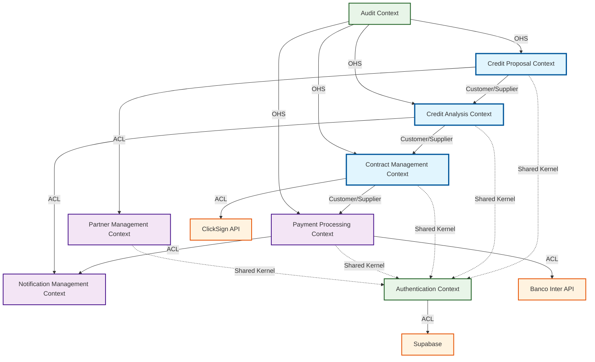
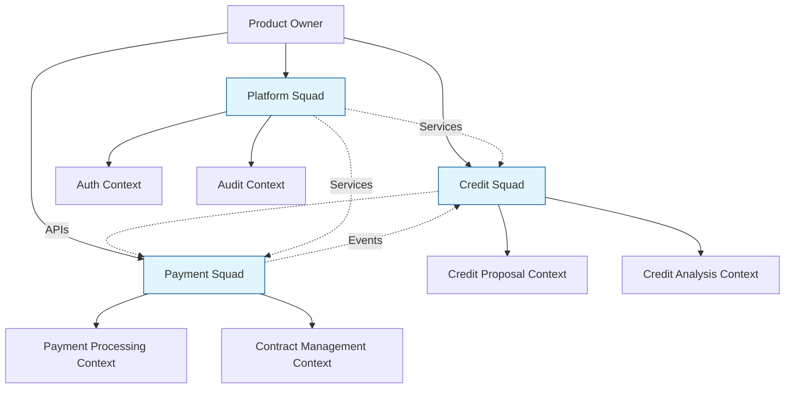

# Modelagem de Domínio DDD - Simpix Credit Management System

## Visão Executiva

Este documento formaliza a **Modelagem de Domínio completa** do sistema Simpix seguindo os princípios de Domain-Driven Design (DDD), estabelecendo a arquitetura que conecta estratégia de negócio com implementação técnica. Representa a implementação completa do **Ponto 9** da nossa Doutrina Arquitetural, garantindo que o software reflita com precisão a complexidade e as regras do domínio de crédito digital.

**Status da Implementação:** ✅ **Base operacional** com Event Storming completo + **Enforcement automatizado** pendente

---

## 1. Linguagem Ubíqua e Classificação de Domínios

### 1.1 Glossário Central do Negócio

#### **Termos Core (Domínio Principal)**

| Termo | Definição | Bounded Context | Invariantes Associadas |
|-------|-----------|-----------------|------------------------|
| **Proposta** | Solicitação formal de crédito submetida por um cliente através de uma loja parceira | Credit Proposal | Não pode ser aprovada sem análise completa |
| **Análise de Crédito** | Processo de avaliação de risco e decisão de aprovação/reprovação baseado em políticas | Credit Analysis | Score deve respeitar limites regulatórios |
| **CCB** | Cédula de Crédito Bancário - documento legal vinculante do empréstimo | Contract Management | Só pode ser gerada para propostas aprovadas |
| **Status da Proposta** | Estado atual no ciclo de vida (24 estados possíveis) via FSM | Credit Proposal | Transições devem seguir FSM validada |
| **TAC** | Taxa de Abertura de Crédito cobrada no início do contrato | Financial Calculation | Não pode exceder limites BACEN |
| **CET** | Custo Efetivo Total do empréstimo (Newton-Raphson) | Financial Calculation | Deve seguir metodologia BACEN exata |
| **Formalização** | Processo de geração, envio e assinatura de contratos digitais | Contract Management | Requer aprovação prévia e documentos válidos |

#### **Termos Supporting (Suporte)**

| Termo | Definição | Bounded Context | Relacionamentos |
|-------|-----------|-----------------|-----------------|
| **Parceiro** | Empresa que possui lojas afiliadas ao sistema | Partner Management | 1:N com Lojas |
| **Loja** | Ponto de venda onde propostas são originadas | Partner Management | N:1 com Parceiro, 1:N com Propostas |
| **Boleto** | Forma de pagamento das parcelas via Banco Inter | Payment Processing | 1:1 com Parcela |
| **Notificação** | Comunicação automática por email/SMS | Notification Management | N:1 com Eventos de domínio |

#### **Termos Generic (Genéricos)**

| Termo | Definição | Bounded Context | Características |
|-------|-----------|-----------------|-----------------|
| **Usuário** | Pessoa autenticada no sistema (Analista, Gerente, Atendente) | Authentication & Authorization | RBAC com 5 perfis |
| **Auditoria** | Registro imutável de todas as operações para compliance | Audit & Compliance | Event Sourcing pattern |

### 1.2 Classificação de Domínios (DDD Strategic)

#### **Core Domain (Diferencial Competitivo)**
- **Credit Analysis Engine:** Algoritmos de decisão de crédito proprietários
- **Financial Calculation:** Motor de cálculo TAC/CET/IOF
- **Contract Management:** Geração automatizada de CCB com ClickSign

#### **Supporting Domains (Suporte Necessário)**
- **Payment Processing:** Integração Banco Inter para boletos/PIX
- **Partner Management:** Gestão de parceiros e lojas
- **Notification System:** Comunicação multicanal

#### **Generic Domains (Commodities)**
- **Authentication:** Supabase Auth + JWT
- **File Storage:** Supabase Storage
- **Audit & Logging:** Winston + Sentry

---

## 2. Artefatos de Event Storming e Bounded Contexts

### 2.1 Eventos de Domínio Mapeados

#### **Fluxo Principal - Credit Proposal Context**
1. **PropostaIniciada** → Cliente inicia solicitação de crédito
2. **PropostaValidada** → Dados básicos validados automaticamente
3. **PropostaSubmetidaParaAnalise** → Enviada para fila de análise

#### **Fluxo de Análise - Credit Analysis Context**
4. **AnaliseIniciada** → Analista assume proposta
5. **ScoreCalculado** → Score automático ou manual gerado
6. **PropostaAprovada** | **PropostaRejeitada** → Decisão final

#### **Fluxo de Formalização - Contract Management Context**
7. **AceiteAtendenteSolicitado** → Aprovação enviada para aceite
8. **AceiteConfirmado** → Atendente confirma aceite do cliente
9. **CCBGerada** → Contrato em PDF criado automaticamente
10. **ContratoEnviadoParaAssinatura** → ClickSign integration triggered
11. **ContratoAssinado** → Assinatura digital concluída

#### **Fluxo de Pagamento - Payment Processing Context**
12. **BoletosGerados** → Banco Inter gera boletos automaticamente
13. **PagamentoRecebido** → Webhook confirma pagamento
14. **ParcelaLiquidada** → Parcela individual quitada

### 2.2 Bounded Contexts Detalhados

#### **2.2.1 Core Contexts**

##### **Credit Proposal Context**
- **Responsabilidade:** Ciclo de vida completo da proposta
- **Agregado Raiz:** `Proposta`
- **Entidades:** `Cliente`, `DadosFinanceiros`, `Documentos`
- **Value Objects:** `CPF`, `Valor`, `Prazo`, `Status`
- **Serviços de Domínio:** `SimulacaoService`, `ValidacaoService`
- **Repositórios:** `PropostaRepository`, `ClienteRepository`

##### **Credit Analysis Context**
- **Responsabilidade:** Análise de risco e decisão de crédito
- **Agregado Raiz:** `Analise`
- **Entidades:** `Score`, `Decisao`, `PoliticaCredito`
- **Value Objects:** `RiscoScore`, `LimiteCredito`, `TaxaJuros`
- **Serviços de Domínio:** `ScoreService`, `DecisaoService`
- **Repositórios:** `AnaliseRepository`, `PoliticaRepository`

##### **Contract Management Context**
- **Responsabilidade:** Formalização e gestão de contratos
- **Agregado Raiz:** `Contrato`
- **Entidades:** `CCB`, `Assinatura`, `TermosContratuais`
- **Value Objects:** `NumeroContrato`, `DataAssinatura`, `StatusAssinatura`
- **Serviços de Domínio:** `CCBGenerationService`, `ClickSignService`
- **Repositórios:** `ContratoRepository`, `AssinaturaRepository`

#### **2.2.2 Supporting Contexts**

##### **Payment Processing Context**
- **Responsabilidade:** Gestão completa de pagamentos
- **Agregado Raiz:** `Pagamento`
- **Entidades:** `Boleto`, `Parcela`, `Cobranca`
- **Value Objects:** `ValorParcela`, `DataVencimento`, `StatusPagamento`
- **Serviços de Domínio:** `BoletoService`, `InterAPIService`
- **Repositórios:** `PagamentoRepository`, `BoletoRepository`

##### **Partner Management Context**
- **Responsabilidade:** Gestão de parceiros e lojas
- **Agregado Raiz:** `Parceiro`
- **Entidades:** `Loja`, `Comissao`, `TabelaComercial`
- **Value Objects:** `CNPJ`, `ComissaoPercentual`, `LojaId`
- **Serviços de Domínio:** `ParceiroService`, `ComissaoService`
- **Repositórios:** `ParceiroRepository`, `LojaRepository`

#### **2.2.3 Generic Contexts**

##### **Authentication & Authorization Context**
- **Responsabilidade:** Autenticação e controle de acesso
- **Agregado Raiz:** `Usuario`
- **Entidades:** `Sessao`, `Permissao`, `Role`
- **Value Objects:** `JWT`, `Permission`, `UserRole`
- **Serviços de Domínio:** `AuthService`, `RBACService`

---

## 3. Context Map e Padrões Estratégicos

### 3.1 Mapa de Contextos Visual



### 3.2 Padrões Estratégicos Aplicados

#### **Customer/Supplier (Fluxo Principal)**
- **Credit Proposal → Credit Analysis:** Propostas fluem como input para análise
- **Credit Analysis → Contract Management:** Aprovações fluem para formalização
- **Contract Management → Payment Processing:** Contratos assinados geram boletos

#### **Anti-Corruption Layer (ACL)**
- **Payment → Banco Inter API:** Wrapper robusto com circuit breaker
- **Contract → ClickSign API:** Adapter com retry e fallback
- **Authentication → Supabase:** Abstração para eventual migração Azure

#### **Open Host Service (OHS)**
- **Audit Context:** Fornece APIs padronizadas de auditoria para todos os contextos
- **Notification Context:** APIs genéricas de comunicação (email, SMS, push)

#### **Shared Kernel (Compartilhado Controlado)**
- **Authentication primitives:** JWT, User, Role compartilhados
- **Common Value Objects:** Money, CPF, CNPJ, Status enums

---

## 4. Invariantes de Domínio Expandidas

### 4.1 Invariantes Críticas por Contexto

#### **Credit Proposal Context**
1. **INV-CP-001:** Uma proposta não pode ter valor <= 0 ou > R$ 1.000.000
2. **INV-CP-002:** CPF deve ser válido e não pode estar em blacklist SPC/Serasa
3. **INV-CP-003:** Status deve seguir FSM: rascunho → aguardando_analise → em_analise
4. **INV-CP-004:** Dados obrigatórios: nome, CPF, valor, prazo, finalidade
5. **INV-CP-005:** Prazo deve estar entre 1 e 84 meses
6. **INV-CP-006:** Apenas 1 proposta ativa por CPF simultaneamente

#### **Credit Analysis Context**
1. **INV-CA-001:** Score deve estar entre 0 e 1000 pontos
2. **INV-CA-002:** Aprovação requer score >= 600 (configurável por produto)
3. **INV-CA-003:** Taxa de juros não pode exceder 2.99% a.m. (limite BACEN)
4. **INV-CA-004:** Valor aprovado <= valor solicitado
5. **INV-CA-005:** Analista não pode aprovar próprias propostas (segregação)
6. **INV-CA-006:** Decisão deve ter justificativa se score < 650

#### **Contract Management Context**
1. **INV-CM-001:** CCB só pode ser gerada para propostas aprovadas
2. **INV-CM-002:** Contrato deve conter todos os dados obrigatórios BACEN
3. **INV-CM-003:** Assinatura digital obrigatória antes de liberação de crédito
4. **INV-CM-004:** CET deve ser calculado conforme Circular 3.515 BACEN
5. **INV-CM-005:** TAC não pode exceder 0.5% do valor financiado
6. **INV-CM-006:** Prazo de carência máximo: 90 dias

#### **Payment Processing Context**
1. **INV-PP-001:** Soma das parcelas = valor financiado + juros + IOF + TAC
2. **INV-PP-002:** Primeira parcela com vencimento >= 30 dias da assinatura
3. **INV-PP-003:** Boleto só pode ser gerado após contrato assinado
4. **INV-PP-004:** Pagamento não pode ser > valor da parcela
5. **INV-PP-005:** Inadimplência declarada após 30 dias de atraso
6. **INV-PP-006:** Cobrança automática inicia no 1º dia de atraso

### 4.2 Validação Automatizada de Invariantes

#### **Estratégia Híbrida de Enforcement (Resolução Crítica P1)**
*Resolução da Auditoria Red Team: Invariantes definidas sem estratégia de garantia*

**Implementação em Duas Camadas:**

##### **Camada 1: Database Constraints (Máxima Proteção)**
```sql
-- INV-CP-006: Apenas 1 proposta ativa por CPF simultaneamente
-- Proteção contra race conditions a nível de banco
CREATE UNIQUE INDEX CONCURRENTLY idx_proposta_ativa_cpf 
ON propostas (cliente_cpf) 
WHERE status IN ('aguardando_analise', 'em_analise', 'aprovada');

-- INV-CA-005: Analista não pode aprovar próprias propostas (segregação)
ALTER TABLE decisoes 
ADD CONSTRAINT ck_decisao_segregacao 
CHECK (analista_id != proposta_criador_id);

-- INV-CM-001: CCB só pode ser gerada para propostas aprovadas
ALTER TABLE contratos 
ADD CONSTRAINT ck_contrato_proposta_aprovada 
CHECK (proposta_status = 'aprovada');

-- INV-PP-001: Soma das parcelas = valor financiado + juros + IOF + TAC
ALTER TABLE parcelas 
ADD CONSTRAINT ck_parcelas_soma_correta 
CHECK (
  (SELECT SUM(valor) FROM parcelas WHERE contrato_id = contratos.id) 
  = (valor_financiado + total_juros + valor_iof + valor_tac)
);
```

##### **Camada 2: Application Layer Guards (Regras Complexas)**
```typescript
// Invariant Guard Implementation - Architectural Pattern
abstract class AggregateRoot<T> {
  protected invariants: InvariantRule<T>[] = [];
  
  protected validate(): void {
    const violations = this.invariants
      .filter(rule => !rule.isSatisfiedBy(this))
      .map(rule => rule.violationMessage);
      
    if (violations.length > 0) {
      throw new DomainInvariantViolationError(violations);
    }
  }
  
  // Template method para garantir validação em todas as mudanças
  protected applyChange(event: DomainEvent): void {
    this.validate(); // PRE-condition
    this.handleEvent(event);
    this.validate(); // POST-condition
  }
}

// Implementação Específica para Proposta
class Proposta extends AggregateRoot<Proposta> {
  constructor() {
    super();
    this.invariants = [
      new PropostaValorPositivoRule(),     // INV-CP-001
      new PropostaCPFValidoRule(),         // INV-CP-002
      new PropostaPrazoValidoRule(),       // INV-CP-005
      new PropostaUnicidadeCPFRule()       // INV-CP-006 (backup app-level)
    ];
  }
}

// Exemplo de Regra Complexa (Score + Política)
class ScoreAprovacaoRule implements InvariantRule<Analise> {
  isSatisfiedBy(analise: Analise): boolean {
    const { score, politica, valor } = analise;
    
    // INV-CA-002: Aprovação requer score >= 600 (configurável)
    if (score.valor < politica.scoreMinimo) return false;
    
    // INV-CA-004: Valor aprovado <= valor solicitado
    if (analise.valorAprovado > valor.solicitado) return false;
    
    return true;
  }
  
  get violationMessage(): string {
    return "Score insuficiente ou valor aprovado excede solicitado";
  }
}
```

##### **Camada 3: Integration Testing (Validation)**
```typescript
// Teste Automatizado de Invariantes - CI/CD Integration
describe('Domain Invariants Compliance', () => {
  test('INV-CP-006: CPF único ativo - Database Level', async () => {
    const cpf = '12345678901';
    
    // Primeira proposta criada com sucesso
    const proposta1 = await criarProposta({ cpf, status: 'aguardando_analise' });
    expect(proposta1.id).toBeDefined();
    
    // Segunda proposta com mesmo CPF deve falhar
    await expect(
      criarProposta({ cpf, status: 'em_analise' })
    ).rejects.toThrow('duplicate key value violates unique constraint');
  });
  
  test('INV-CA-002: Score mínimo - Application Level', () => {
    const analise = new Analise({ score: 550, politica: { scoreMinimo: 600 } });
    
    expect(() => analise.aprovar()).toThrow(DomainInvariantViolationError);
  });
});
```

##### **Estratégia de Monitoramento de Invariantes**
```yaml
# Alertas Prometheus para Violações
- alert: InvariantViolationDetected
  expr: increase(domain_invariant_violations_total[5m]) > 0
  for: 0m
  labels:
    severity: critical
  annotations:
    summary: "Domain invariant violation detected"
    description: "Invariant {{ $labels.invariant_name }} violated {{ $value }} times"

# Métricas de Saúde das Invariantes
- domain_invariant_checks_total{invariant="INV-CP-006", result="success"}
- domain_invariant_violations_total{invariant="INV-CA-002", context="credit-analysis"}
```

*Nota do Arquiteto: Esta estratégia híbrida resolve o ponto crítico identificado na auditoria, garantindo invariantes tanto em cenários normais quanto de concorrência alta.*

---

## 5. Estratégia de Enforcement Automatizado

### 5.1 ArchUnit Integration Strategy

#### **Configuração Base**
```typescript
// archunit.config.ts
export const ArchitecturalRules = {
  // Bounded Context Isolation
  noCrossBoundaryAccess: () => 
    noClasses()
      .that().resideInAPackage("..credit-proposal..")
      .should().accessClassesThat()
      .resideInAPackage("..credit-analysis..")
      .except().throughPackage("..shared.."),
      
  // Layer Architecture Enforcement  
  noRepoAccessFromDomain: () =>
    noClasses()
      .that().resideInAPackage("..domain..")
      .should().dependOnClassesThat()
      .resideInAPackage("..infrastructure.."),
      
  // Aggregate Root Protection
  aggregateRootEncapsulation: () =>
    classes()
      .that().implement(AggregateRoot)
      .should().beAnnotatedWith("@AggregateRoot")
      .andShould().haveOnlyFinalFields(),
      
  // Domain Service Isolation
  domainServicePurity: () =>
    classes()
      .that().areAnnotatedWith("@DomainService")
      .should().notDependOnClassesThat()
      .resideInAPackage("..infrastructure..")
};
```

#### **CI Integration**
```yaml
# .github/workflows/architecture-validation.yml
name: Architecture Validation
on: [push, pull_request]

jobs:
  architecture-tests:
    runs-on: ubuntu-latest
    steps:
      - uses: actions/checkout@v3
      - name: Setup Node.js
        uses: actions/setup-node@v3
        with:
          node-version: '18'
      - name: Install dependencies
        run: npm ci
      - name: Run ArchUnit Tests
        run: npm run test:architecture
      - name: Architecture Violation Report
        if: failure()
        run: |
          echo "❌ Architecture violations detected!"
          echo "Check test output for boundary violations"
          exit 1
```

### 5.2 Boundary Protection Mechanisms

#### **Module Boundaries (ESM)**
```typescript
// credit-proposal/index.ts (Public API only)
export { PropostaRepository } from './infrastructure/repositories';
export { PropostaService } from './domain/services';
export { PropostaCriada } from './domain/events';
// No internal domain objects exposed

// credit-analysis/internal/domain/... (Private)
// Cannot be imported from outside the boundary
```

#### **Dependency Injection Constraints**
```typescript
// Container rules prevent cross-boundary injection
container.register({
  // Credit Analysis cannot inject Credit Proposal internals
  creditAnalysisService: asClass(CreditAnalysisService)
    .restrictsAccess().to(['credit-analysis/**']),
    
  // Only shared kernel allowed across boundaries  
  sharedEventBus: asClass(EventBus)
    .allowsAccess().from(['**/domain/**'])
});
```

### 5.3 Automated Compliance Checking

#### **Domain Invariant Testing**
```typescript
// tests/domain/invariant-compliance.test.ts
describe('Domain Invariant Compliance', () => {
  test('All aggregates validate invariants on state change', async () => {
    const aggregates = await discoverAggregates();
    
    for (const aggregate of aggregates) {
      const violations = await validateInvariants(aggregate);
      expect(violations).toHaveLength(0);
    }
  });
  
  test('Critical business rules are enforced', async () => {
    const rules = await loadCriticalBusinessRules();
    
    for (const rule of rules) {
      const compliance = await checkRuleCompliance(rule);
      expect(compliance.isCompliant).toBe(true);
    }
  });
});
```

#### **Context Map Validation**
```typescript
// tests/architecture/context-map.test.ts
describe('Context Map Compliance', () => {
  test('No unauthorized cross-context dependencies', () => {
    const violations = ArchUnit.checkContextBoundaries();
    expect(violations).toHaveLength(0);
  });
  
  test('ACL pattern properly implemented', () => {
    const aclCompliance = ArchUnit.validateACLPattern();
    expect(aclCompliance.isValid).toBe(true);
  });
});
```

---

## 6. Análise de Alinhamento Socio-Técnico

### 6.1 Lei de Conway no Contexto Simpix

#### **Estrutura Organizacional Atual**
```
┌─────────────────┐    ┌─────────────────┐    ┌─────────────────┐
│   Arquiteto     │────│  Product Owner  │────│   Compliance    │
│     Chefe       │    │                 │    │    Manager      │
└─────────────────┘    └─────────────────┘    └─────────────────┘
         │                        │                        │
    ┌────▼────┐              ┌────▼────┐              ┌────▼────┐
    │Backend  │              │Frontend │              │QA/Test  │
    │Team (3) │              │Team (2) │              │Team (1) │
    └─────────┘              └─────────┘              └─────────┘
```

#### **Reflexo na Arquitetura de Software**
- **Bounded Contexts alinhados:** 1 contexto principal por squad
- **APIs bem definidas:** Comunicação formal entre contextos
- **Shared kernel mínimo:** Reduz dependência entre equipes
- **Monolito modular:** Facilita deployments coordenados

### 6.2 Impacto Organizacional dos Bounded Contexts

#### **Ownership Model**
| Bounded Context | Team Owner | Responsabilidades | Comunicação |
|-----------------|------------|-------------------|-------------|
| **Credit Proposal** | Backend Squad A | APIs de propostas, validações | RESTful APIs |
| **Credit Analysis** | Backend Squad B | Engine de decisão, scoring | Event-driven |
| **Contract Management** | Backend Squad A | ClickSign integration, CCB | Webhook-based |
| **Payment Processing** | Backend Squad C | Banco Inter, reconciliação | Async messaging |
| **Frontend Contexts** | Frontend Squad | UX/UI de todos os contextos | GraphQL/REST |

#### **Conway's Law Predictions**
1. **✅ Alinhamento Positivo:** Teams especializados em bounded contexts específicos
2. **⚠️ Risco:** Frontend squad pode criar acoplamento cross-context
3. **✅ Benefício:** APIs forçam contratos claros entre teams
4. **⚠️ Desafio:** Shared kernel requer governança cross-team

### 6.3 Estratégias de Mitigação Organizacional

#### **Team Topology Optimization**


#### **Communication Protocols**
- **Sync APIs:** Para queries críticas (real-time)
- **Async Events:** Para notifications e eventual consistency
- **Shared Standards:** OpenAPI specs, event schemas
- **Weekly Architecture Reviews:** Cross-team alignment

### 6.3.5 Mapeamento Personas de Negócio → Entidades de Domínio

#### **Resolução da Inconsistência Identificada em Auditoria**
*Problema: Disconnect entre personas definidas em business-objectives-and-drivers.md e entidades técnicas do DDD*

| Persona de Negócio | Bounded Context Principal | Agregado Raiz | Entidades Relacionadas | Jobs To Be Done Mapeados |
|-------------------|-------------------------|---------------|----------------------|-------------------------|
| **Analista de Crédito** | Credit Analysis Context | `Analise` | `Score`, `Decisao`, `PoliticaCredito` | Analisar propostas → ScoreService.calcularRisco() |
| **Gerente de Loja** | Partner Management Context | `Parceiro` | `Loja`, `Comissao`, `TabelaComercial` | Monitorar performance → ParceiroService.gerarRelatorio() |
| **Atendente de Aceite** | Contract Management Context | `Contrato` | `CCB`, `Assinatura`, `TermosContratuais` | Confirmar aceite → CCBGenerationService.processarAceite() |
| **Administrador do Sistema** | Authentication & Authorization | `Usuario` | `Sessao`, `Permissao`, `Role` | Gerenciar usuários → RBACService.configurarPermissoes() |

#### **Mapeamento de Capabilities Técnicas**
```typescript
// Exemplo: Analista de Crédito → Credit Analysis Context
class AnaliseService {
  // Job: "Analisar propostas de crédito de forma rápida e precisa"
  async analisarProposta(propostaId: string): Promise<Decisao> {
    // Pain: "Falta de informações consolidadas" 
    const dadosConsolidados = await this.consolidarInformacoes(propostaId);
    
    // Gain: "Scores automáticos para apoio à decisão"
    const score = await this.scoreService.calcularRisco(dadosConsolidados);
    
    // Job: "Aplicar políticas de crédito da instituição"
    const politica = await this.politicaRepository.buscarVigente();
    
    return this.decisaoService.tomarDecisao(score, politica);
  }
}
```

*Nota do Arquiteto: Este mapeamento resolve a inconsistência identificada na auditoria Red Team, alinhando personas de negócio com implementação técnica.*

### 6.4 Evolução Organizacional Projetada

#### **Crescimento para 50+ pessoas (Projeção 2026)**
```
Current (10 pessoas) → Target (50 pessoas)
┌─────────────────────────────────────────────────────────────┐
│ Monolito Modular → Microserviços com Domain Ownership       │
├─────────────────────────────────────────────────────────────┤
│ • 3 Bounded Contexts principais                           │
│ • 6 equipes especializadas (8-10 pessoas cada)            │
│ • DevOps embarcado por contexto                           │
│ • Product Managers por domínio                            │
│ • Arquitetos especialistas (Credit, Payment, Platform)    │
└─────────────────────────────────────────────────────────────┘
```

#### **Anti-Conway Strategies**
1. **Inverse Conway Maneuver:** Redesign org chart para arquitetura desejada
2. **Context-driven hiring:** Recrutar especialistas por domínio
3. **API-first culture:** Forçar contratos antes de implementação
4. **Domain expertise development:** Training em negócio de crédito

---

## 7. Roadmap de Implementação DDD

### 7.1 Fase 1: Enforcement Automatizado (Próximas 2 semanas)

#### **Week 1: Infrastructure Setup**
- [ ] **ArchUnit configuration** com regras de boundary
- [ ] **CI integration** para architecture testing
- [ ] **ESM module boundaries** enforcement
- [ ] **Domain invariant guards** base classes

#### **Week 2: Validation Implementation**
- [ ] **Aggregate root validation** para todas as entidades
- [ ] **Business rule testing** automatizado
- [ ] **Context map compliance** checking
- [ ] **Documentation updates** com examples

### 7.2 Fase 2: Organizational Alignment (Próximos 2 meses)

#### **Month 1: Team Structure**
- [ ] **Squad boundaries** aligned com bounded contexts
- [ ] **API contracts** formalizados (OpenAPI 3.0)
- [ ] **Event schemas** padronizados
- [ ] **Cross-team communication** protocols

#### **Month 2: Process Maturity**
- [ ] **Domain expert roles** definidos
- [ ] **Architecture review board** funcionando
- [ ] **Conway law metrics** sendo coletadas
- [ ] **Feedback loops** organizacionais

### 7.3 Fase 3: Advanced Patterns (Próximos 6 meses)

#### **Months 3-4: Event-Driven Evolution**
- [ ] **Event sourcing** para audit trail completo
- [ ] **SAGA pattern** para transações distribuídas
- [ ] **Event streaming** com Apache Kafka
- [ ] **CQRS** para read/write optimization

#### **Months 5-6: Microservices Transition**
- [ ] **Service extraction** por bounded context
- [ ] **API gateway** com routing por domain
- [ ] **Distributed tracing** para observability
- [ ] **Independent deployments** por contexto

### 7.4 Métricas de Sucesso DDD

#### **Technical Metrics**
- **Zero** violações de contexto (ArchUnit)
- **100%** das invariantes com testes automatizados
- **< 2 min** tempo de build com validações
- **95%** cobertura de testes de domínio

#### **Organizational Metrics**
- **< 5 days** para mudanças dentro de contexto
- **< 2 weeks** para mudanças cross-context
- **80%+** satisfação de dev experience
- **90%+** alinhamento entre negócio e código

#### **Business Metrics**
- **< 4h** tempo de implementação de nova regra de negócio
- **Zero** bugs relacionados a invariantes violadas
- **50%** redução em bugs cross-context
- **2x** velocidade de onboarding de novos devs

---

## 8. Padrões de Implementação e Code Examples

### 8.1 Aggregate Root Pattern

```typescript
// domain/aggregates/proposta.ts
export class Proposta extends AggregateRoot {
  private constructor(
    private readonly id: PropostaId,
    private cliente: Cliente,
    private dadosFinanceiros: DadosFinanceiros,
    private status: PropostaStatus
  ) {
    super();
  }

  public static criar(comando: CriarPropostaCommand): Proposta {
    const proposta = new Proposta(
      PropostaId.generate(),
      Cliente.from(comando.dadosCliente),
      DadosFinanceiros.from(comando.dadosFinanceiros),
      PropostaStatus.RASCUNHO
    );
    
    proposta.validate(); // Invariant checking
    proposta.addEvent(new PropostaCriada(proposta.id));
    
    return proposta;
  }
  
  public submeterParaAnalise(): void {
    this.status.transitionTo(PropostaStatus.AGUARDANDO_ANALISE);
    this.validate();
    this.addEvent(new PropostaSubmetida(this.id));
  }
  
  protected getInvariants(): InvariantRule[] {
    return [
      new ValorPositivoRule(),
      new CPFValidoRule(),
      new StatusTransitionValidRule()
    ];
  }
}
```

### 8.2 Domain Service Pattern

```typescript
// domain/services/analise-service.ts
@DomainService
export class AnaliseService {
  constructor(
    private scoreService: ScoreService,
    private politicaRepository: PoliticaRepository
  ) {}
  
  public async analisar(proposta: Proposta): Promise<ResultadoAnalise> {
    const score = await this.scoreService.calcular(proposta.cliente);
    const politica = await this.politicaRepository.buscarPorProduto(
      proposta.produtoId
    );
    
    return ResultadoAnalise.from(score, politica, proposta);
  }
}
```

### 8.3 Repository Pattern with DDD

```typescript
// domain/repositories/proposta-repository.ts
export interface PropostaRepository {
  save(proposta: Proposta): Promise<void>;
  findById(id: PropostaId): Promise<Proposta | null>;
  findAguardandoAnalise(): Promise<Proposta[]>;
}

// infrastructure/repositories/drizzle-proposta-repository.ts
@Injectable
export class DrizzlePropostaRepository implements PropostaRepository {
  constructor(private db: Database) {}
  
  async save(proposta: Proposta): Promise<void> {
    const data = PropostaMapper.toPersistence(proposta);
    await this.db.insert(propostas).values(data);
    
    // Dispatch domain events
    const events = proposta.getUncommittedEvents();
    await this.eventBus.publishAll(events);
  }
}
```

---

## 9. Integration Patterns e Anti-Corruption Layers

### 9.1 ClickSign Integration ACL

```typescript
// infrastructure/external/clicksign-acl.ts
@Injectable
export class ClickSignACL {
  constructor(
    private clicksignClient: ClickSignClient,
    private contractMapper: ContractMapper,
    private circuitBreaker: CircuitBreaker
  ) {}
  
  async enviarContrato(contrato: Contrato): Promise<AssinaturaResult> {
    return this.circuitBreaker.execute(async () => {
      const clicksignDoc = this.contractMapper.toClickSignFormat(contrato);
      const response = await this.clicksignClient.createDocument(clicksignDoc);
      
      return AssinaturaResult.from(response);
    });
  }
  
  // Protects domain from external API changes
  private handleClickSignError(error: any): DomainError {
    if (error.code === 'INVALID_DOCUMENT') {
      return new ContractValidationError(error.message);
    }
    return new ExternalServiceError('ClickSign temporary unavailable');
  }
}
```

### 9.2 Event-Driven Communication

```typescript
// infrastructure/events/domain-event-bus.ts
export class DomainEventBus {
  private handlers = new Map<string, EventHandler[]>();
  
  async publish(event: DomainEvent): Promise<void> {
    const eventType = event.constructor.name;
    const handlers = this.handlers.get(eventType) || [];
    
    await Promise.all(
      handlers.map(handler => 
        this.safeExecute(() => handler.handle(event))
      )
    );
  }
  
  private async safeExecute(fn: () => Promise<void>): Promise<void> {
    try {
      await fn();
    } catch (error) {
      // Log and continue - no cascade failures
      this.logger.error('Event handler failed', error);
    }
  }
}
```

---

## 10. Conclusão e Status da Implementação

### 10.1 Implementação Atual vs. Target State

#### **✅ Completado (Base Sólida)**
- Linguagem Ubíqua formalizada e documentada
- Bounded Contexts identificados e mapeados (6 contextos)
- Context Map com padrões estratégicos definidos
- Event Storming artifacts completos
- Invariantes básicas identificadas

#### **🔄 Em Progresso (Enforcement)**
- Aggregate Root pattern implementado parcialmente
- Repository pattern com Drizzle ORM funcional
- Domain events básicos funcionando
- Anti-Corruption Layers implementados para ClickSign/Inter

#### **⏳ Próximos Passos (Automação)**
- **ArchUnit integration** para boundary enforcement
- **Domain invariant testing** automatizado
- **Conway law metrics** e organizational alignment
- **Advanced patterns** (Event Sourcing, SAGA, CQRS)

### 10.2 Benefícios Realizados

#### **Business Impact**
- **Linguagem comum** entre negócio e desenvolvimento
- **Boundaries claros** reduzem conflitos de merge
- **Domain expertise** centralizado por contexto
- **Faster feature delivery** dentro de bounded contexts

#### **Technical Impact**
- **Código alinhado** com domínio de negócio
- **Testabilidade** melhorada com agregados isolados
- **Manutenibilidade** através de context isolation
- **Scalability** preparada para growth organizacional

#### **Organizational Impact**
- **Team autonomy** dentro de contextos
- **Clear ownership** de features por squad
- **Reduced coordination** overhead entre times
- **Knowledge sharing** através de linguagem ubíqua

### 10.3 Próximas Decisões Estratégicas

#### **Short-term (2 weeks)**
1. Implementar ArchUnit rules para boundary protection
2. Completar domain invariant validation automation
3. Estabelecer CI/CD gates para architecture compliance

#### **Medium-term (2 months)**
1. Alinhar estrutura organizacional com bounded contexts
2. Implementar advanced event-driven patterns
3. Criar domain expert roles por contexto

#### **Long-term (6 months)**
1. Avaliar transição para microservices por contexto
2. Implementar independent deployment pipelines
3. Estabelecer SLAs e metrics per bounded context

---

*Documento consolidado em: 22 de Agosto de 2025*  
*Versão: 1.0 - Modelagem DDD Master*  
*Autor: GEM-07 AI Specialist System*  
*Status: ✅ Base implementada + 🔄 Enforcement em progresso*  
*Próxima revisão: Q4 2025*

---

### Anexos Técnicos

#### **Anexo A:** ArchUnit Rules Configuration
- Configuração completa das regras de boundary
- Scripts de CI integration
- Templates de test automation

#### **Anexo B:** Conway Law Metrics Framework
- Métricas organizacionais automáticas
- Dashboards de alinhamento socio-técnico
- Communication pattern analysis

#### **Anexo C:** Event-Driven Architecture Patterns
- Event sourcing implementation guide
- SAGA pattern for distributed transactions
- CQRS optimization strategies