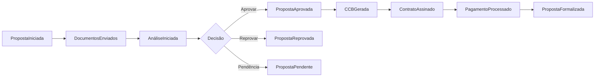
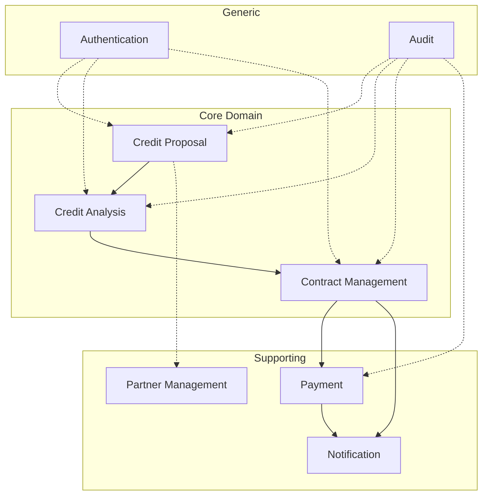

# 📋 Event Storming Session - Sistema Simpix
**Facilitador:** GEM 07 (AI Specialist)  
**Data:** 2025-08-21  
**Fase:** 1 - Desenvolvimento Contínuo  
**Objetivo:** Estabelecer Linguagem Ubíqua e identificar Bounded Contexts

---

## 1. LINGUAGEM UBÍQUA - GLOSSÁRIO DO DOMÍNIO

### **Termos Centrais do Negócio**

| Termo | Definição | Contexto |
|-------|-----------|----------|
| **Proposta** | Solicitação formal de crédito submetida por um cliente através de uma loja parceira | Core |
| **Análise de Crédito** | Processo de avaliação de risco e aprovação/reprovação de uma proposta | Core |
| **Formalização** | Processo de geração e assinatura de contratos após aprovação | Core |
| **CCB** | Cédula de Crédito Bancário - documento legal do empréstimo | Core |
| **Parceiro** | Empresa que possui lojas afiliadas ao sistema | Suporte |
| **Loja** | Ponto de venda onde propostas são originadas | Suporte |
| **Produto Financeiro** | Tipo de crédito oferecido (ex: CDC, Crediário) | Core |
| **Tabela Comercial** | Conjunto de taxas e prazos para um produto | Core |
| **TAC** | Taxa de Abertura de Crédito | Core |
| **CET** | Custo Efetivo Total do empréstimo | Core |
| **Boleto** | Forma de pagamento das parcelas | Suporte |
| **Status da Proposta** | Estado atual no ciclo de vida (24 estados possíveis) | Core |
| **Parcela** | Prestação mensal do empréstimo | Core |
| **Analista** | Usuário responsável pela análise de crédito | Core |
| **Atendente** | Usuário da loja que origina propostas | Suporte |

---

## 2. EVENTOS DE DOMÍNIO IDENTIFICADOS

### **Eventos do Ciclo Principal**

### **Lista Completa de Eventos**

#### **Originação (Loja Context)**
- `PropostaIniciada`
- `DadosClienteCapturados`
- `DocumentosAnexados`
- `SimulacaoRealizada`
- `PropostaSubmetida`

#### **Análise de Crédito (Credit Analysis Context)**
- `AnáliseIniciada`
- `ScoreCalculado`
- `RiscoAvaliado`
- `DocumentosVerificados`
- `PropostaAprovada`
- `PropostaReprovada`
- `PropostaPendente`
- `PendênciaResolvida`

#### **Formalização (Contract Management Context)**
- `CCBGerada`
- `ContratoEnviadoParaAssinatura`
- `ContratoAssinado`
- `ContratoRecusado`
- `FormalizaçãoConcluída`

#### **Pagamento (Payment Context)**
- `BoletoGerado`
- `PIXGerado`
- `PagamentoRecebido`
- `PagamentoAtrasado`
- `ParcelaPaga`
- `EmpréstimQuitado`

#### **Notificação (Notification Context)**
- `NotificaçãoEnviada`
- `AlertaGerado`
- `LembreteAgendado`

---

## 3. COMANDOS IDENTIFICADOS

| Comando | Evento Resultante | Agregado |
|---------|-------------------|----------|
| `IniciarProposta` | `PropostaIniciada` | Proposta |
| `EnviarDocumentos` | `DocumentosEnviados` | Proposta |
| `AprovarProposta` | `PropostaAprovada` | Proposta |
| `ReprovarProposta` | `PropostaReprovada` | Proposta |
| `GerarCCB` | `CCBGerada` | Contrato |
| `AssinarContrato` | `ContratoAssinado` | Contrato |
| `ProcessarPagamento` | `PagamentoProcessado` | Pagamento |
| `GerarBoleto` | `BoletoGerado` | Cobrança |

---

## 4. BOUNDED CONTEXTS IDENTIFICADOS

### **4.1 Core Contexts (Domínio Principal)**

#### **Credit Proposal Context**
- **Responsabilidade:** Gerenciar o ciclo de vida das propostas
- **Agregados:** Proposta, Cliente, Documentos
- **Serviços:** PropostaService, SimulacaoService
- **Eventos:** PropostaIniciada, PropostaSubmetida

#### **Credit Analysis Context**
- **Responsabilidade:** Análise de risco e decisão de crédito
- **Agregados:** Análise, Score, Decisão
- **Serviços:** AnaliseService, ScoreService
- **Eventos:** PropostaAprovada, PropostaReprovada

#### **Contract Management Context**
- **Responsabilidade:** Geração e gestão de contratos
- **Agregados:** Contrato, CCB, Assinatura
- **Serviços:** CCBService, ClickSignService
- **Eventos:** CCBGerada, ContratoAssinado

### **4.2 Supporting Contexts (Suporte)**

#### **Payment Context**
- **Responsabilidade:** Gestão de pagamentos e cobranças
- **Agregados:** Pagamento, Boleto, Parcela
- **Serviços:** BoletoService, InterAPIService
- **Eventos:** BoletoGerado, PagamentoRecebido

#### **Partner Management Context**
- **Responsabilidade:** Gestão de parceiros e lojas
- **Agregados:** Parceiro, Loja, Usuario
- **Serviços:** ParceiroService, LojaService
- **Eventos:** LojaAtivada, ParceiroDesativado

#### **Notification Context**
- **Responsabilidade:** Comunicação e alertas
- **Agregados:** Notificação, Template, Destinatário
- **Serviços:** EmailService, SMSService
- **Eventos:** NotificaçãoEnviada, AlertaGerado

### **4.3 Generic Contexts**

#### **Authentication Context**
- **Responsabilidade:** Autenticação e autorização
- **Agregados:** Usuario, Sessão, Permissão
- **Serviços:** AuthService, JWTService

#### **Audit Context**
- **Responsabilidade:** Auditoria e compliance
- **Agregados:** LogAuditoria, Evento, Mudança
- **Serviços:** AuditService, ComplianceService

---

## 5. CONTEXT MAP (Mapa de Contextos)

### **Padrões de Integração Entre Contextos**

| De | Para | Padrão | Tipo |
|----|------|--------|------|
| Credit Proposal | Credit Analysis | Shared Kernel | Síncrono |
| Credit Analysis | Contract Management | Published Language | Assíncrono |
| Contract Management | Payment | Anti-Corruption Layer | Assíncrono |
| Payment | Notification | Event-Driven | Assíncrono |
| All Contexts | Authentication | Open Host Service | Síncrono |
| All Contexts | Audit | Event Sourcing | Assíncrono |

---

## 6. INVARIANTES DE DOMÍNIO

### **Invariantes Críticas**

1. **Proposta:** Uma proposta não pode ser aprovada sem análise completa
2. **Contrato:** CCB só pode ser gerada para propostas aprovadas
3. **Pagamento:** Boleto só pode ser gerado após contrato assinado
4. **Status:** Transições de status devem seguir a FSM definida
5. **Parcelas:** Soma das parcelas deve igualar valor total + juros
6. **TAC:** Não pode exceder limites regulatórios
7. **CET:** Deve ser calculado segundo regulação BACEN

---

## 7. PLANO DE IMPLEMENTAÇÃO

### **Fase 1.1 - Enforcement Automatizado (Próximas 2 semanas)**

1. **Configurar ArchUnit** para validar limites de contexto
2. **Criar testes de invariantes** para cada agregado
3. **Implementar Event Bus** local para comunicação entre contextos
4. **Definir contratos de API** entre contextos (OpenAPI)

### **Fase 1.2 - Refatoração Incremental (Próximos 2 meses)**

1. **Isolar Credit Proposal Context** como módulo independente
2. **Extrair Payment Context** para serviço dedicado
3. **Implementar Saga Pattern** para transações distribuídas
4. **Criar Adapters** para integrações externas (ACL)

### **Métricas de Sucesso**

- Zero violações de contexto detectadas pelo ArchUnit
- 100% das invariantes com testes automatizados
- Redução de 50% no acoplamento entre módulos
- Tempo de build < 2 minutos

---

## 8. PRÓXIMOS PASSOS IMEDIATOS

1. **Validar linguagem ubíqua** com stakeholders
2. **Criar ADR** para decisões de contextos
3. **Configurar ArchUnit** no CI/CD
4. **Iniciar refatoração** do Credit Proposal Context

---

**Status:** Pronto para revisão e implementação
**Confiança:** 95% - Baseado na análise completa do código atual