# 🔒 Constraints Arquiteturais - Sistema Simpix

**Documento Técnico:** Architectural Constraints  
**Versão:** 1.0  
**Data:** 25 de Janeiro de 2025  
**Status:** Oficial - Fonte da Verdade das Restrições do Sistema  
**Aprovação:** Pendente Ratificação do Arquiteto Chefe  
**Criticidade:** P0 - CRÍTICA

---

## 📋 **SUMÁRIO EXECUTIVO**

Este documento formaliza todas as restrições (constraints) arquiteturais que governam o Sistema Simpix, estabelecendo os limites técnicos, orçamentários, temporais e legais dentro dos quais todas as decisões arquiteturais devem operar. Serve como "fonte da verdade" única para garantir que nossas decisões sejam pragmáticas, realistas e alinhadas com a realidade do negócio.

**Ponto de Conformidade:** Remediação do Ponto 8 - Constraints Arquiteturais  
**Impacto:** Todas as decisões de design e implementação devem respeitar estas restrições  
**Revisão:** Trimestral ou mediante mudança significativa de contexto

---

## 🎯 **1. RESTRIÇÕES DOCUMENTADAS**

### 1.1 **Restrições Técnicas**

#### **RT-01: Stack Tecnológica Herdada**
- **Descrição:** Sistema desenvolvido originalmente no Replit com stack pré-definida
- **Impacto:** Limitações de performance e escalabilidade inerentes à plataforma
- **Detalhes:**
  - Node.js + Express.js (não negociável até migração completa)
  - React 18 + TypeScript (frontend estabelecido)
  - PostgreSQL via Supabase (migração para Azure planejada)
  - Drizzle ORM (substituição custosa, manter)

#### **RT-02: Monolito Modular como Arquitetura Base**
- **Descrição:** Arquitetura monolítica com decomposição progressiva
- **Impacto:** Microserviços adiados até atingir 1000+ usuários
- **Justificativa:** Complexidade prematura evitada, time to market prioritário

#### **RT-03: Limitações de Infraestrutura Atual**
- **Descrição:** Replit como plataforma de hospedagem temporária
- **Impacto:**
  - Sem controle sobre runtime environment
  - Limitações de CPU/memória (2GB RAM máx)
  - Sem suporte a containers nativos
  - Cold starts frequentes (>3s)

#### **RT-04: Dependências de Terceiros Críticas**
- **Descrição:** Integrações externas não substituíveis
- **Sistemas:**
  - Supabase (Auth + Database + Storage)
  - Banco Inter API (pagamentos)
  - ClickSign (assinatura digital)
- **Impacto:** Vendor lock-in parcial, SLAs externos

#### **RT-05: Débito Técnico Acumulado**
- **Descrição:** ~5% de cobertura de testes, código legado
- **Impacto:** Refatorações arriscadas, bugs em produção
- **Áreas Críticas:**
  - Camada de storage sem abstração adequada
  - Lógica de negócio espalhada entre routes e services
  - Estado global não gerenciado adequadamente

### 1.2 **Restrições Orçamentárias**

#### **RO-01: Budget Mensal de Infraestrutura - RECONCILIADO**

**⚠️ AUDITORIA 2025-08-26: DISCREPÂNCIA CRÍTICA DETECTADA E CORRIGIDA**

- **Limite Original Inconsistente:** R$ 2.000/mês (incompatível com sistema crítico)
- **Limite Reconciliado Realístico:** R$ 4.800/mês
- **Atual:** R$ 100/mês (Replit temporário)

**Breakdown Realístico para Sistema de Crédito Crítico:**

**TIER 1: Azure Cloud Services - R$ 2.100/mês**
- **Azure App Service Premium P2V3**: R$ 720/mês
  - 8GB RAM, 4 vCPUs, SSL/TLS automático
  - Auto-scaling 2-10 instâncias
  - 99.95% SLA garantido
- **Azure Database for PostgreSQL Flexible**: R$ 850/mês
  - General Purpose, 4 vCores, 32GB RAM
  - 2TB storage SSD com backup automático
  - High Availability + Read Replicas
- **Azure Redis Cache Premium**: R$ 320/mês
  - 6GB cache para sessions + BullMQ
  - Clustering + Persistência
- **Azure Storage Account**: R$ 120/mês
  - Blob Storage Hot Tier 1TB
  - CDN para assets estáticos
- **Application Insights Premium**: R$ 90/mês
  - Monitoramento APM completo

**TIER 2: Serviços Externos Críticos - R$ 1.500/mês**
- **ClickSign API Enterprise**: R$ 600/mês
  - 5.000 assinaturas/mês incluídas
  - SLA 99.9% + suporte prioritário
  - Webhook reliability garantido
- **Banco Inter Open Banking**: R$ 400/mês
  - PIX + boleto generation
  - 10k transações/mês incluídas
  - Anti-fraud premium
- **SendGrid Pro Plan**: R$ 300/mês
  - 1M emails/mês
  - Dedicated IP + authentication
- **Twilio Flex**: R$ 200/mês
  - SMS notifications críticas
  - 2FA + alertas de sistema

**TIER 3: DevOps e Observabilidade - R$ 800/mês**
- **GitHub Copilot Business**: R$ 350/mês
  - 5 desenvolvedores
  - Security features + audit logs
- **Sentry Business**: R$ 200/mês
  - Error tracking + performance
  - 1M events/mês
- **Unleash Pro**: R$ 150/mês
  - Feature flags enterprise
  - A/B testing + gradual rollouts
- **Azure Monitor + Log Analytics**: R$ 100/mês
  - Centralized logging + alerting

**TIER 4: Compliance e Segurança - R$ 400/mês**
- **Azure Key Vault Premium**: R$ 100/mês
  - HSM-backed key management
  - Certificate management
- **Azure Security Center**: R$ 150/mês
  - Threat protection
  - Compliance scanning
- **Backup e DR**: R$ 150/mês
  - Cross-region backup
  - Point-in-time recovery

**Impacto:** Migração completa Azure + infrastructure as code obrigatório
**Justificativa:** Sistema crítico processando 100k+ propostas/mês com integração bancária
**Crescimento Projetado:** Q2: R$ 6.200/mês | Q3: R$ 8.500/mês | Q4: R$ 11.000/mês

#### **RO-02: Equipe de Desenvolvimento**
- **Tamanho:** 2-3 desenvolvedores
- **Estrutura:** Sem DevOps dedicado, sem DBA
- **Impacto:** Automação obrigatória, self-service infrastructure

#### **RO-03: Ferramentas e Licenças**
- **Restrição:** Preferência por open source
- **Exceções Aprovadas:**
  - DataDog (observability) - máx $100/mês
  - Sentry (error tracking) - free tier
- **Impacto:** Sem ferramentas enterprise (New Relic, Dynatrace)

#### **RO-04: Custos de Migração**
- **Budget Único:** R$ 10.000 para migração Azure
- **Inclusos:** Setup inicial, treinamento, consultoria
- **Impacto:** Migração faseada obrigatória

### 1.3 **Restrições de Prazo**

#### **RP-01: Timeline de Migração para Produção**
- **Deadline:** Q2 2025 (máximo 4 meses)
- **Milestones Obrigatórios:**
  - Fase 0: 2 semanas (fundação imediata)
  - Fase 1: 4 semanas (Azure staging)
  - Fase 2: 8 semanas (produção completa)
- **Impacto:** Features novas congeladas durante migração

#### **RP-02: Janelas de Manutenção**
- **Disponível:** Domingos 00:00-06:00 BRT
- **Frequência:** Máximo 1x/mês
- **Impacto:** Zero-downtime deployments obrigatórios

#### **RP-03: Time to Market para Features**
- **Expectativa:** 2-4 semanas por feature major
- **Impacto:** MVP-first approach, iterações rápidas

#### **RP-04: SLA de Resposta a Incidentes**
- **SEV1:** < 15 minutos
- **SEV2:** < 30 minutos
- **SEV3:** < 4 horas
- **Impacto:** On-call rotation necessária

### 1.4 **Restrições Legais e Regulatórias**

#### **RL-01: Conformidade LGPD**
- **Obrigatoriedade:** Total compliance
- **Requisitos:**
  - Criptografia de PII em repouso e trânsito
  - Direito ao esquecimento implementado
  - Consentimento explícito para coleta
  - DPO nomeado
- **Impacto:** Arquitetura privacy-by-design

#### **RL-02: Regulação BACEN/SCR**
- **Aplicabilidade:** Sistema de crédito
- **Requisitos:**
  - Auditoria completa de transações
  - Retenção de dados por 5 anos
  - Segregação de funções
- **Impacto:** Logs imutáveis, audit trail completo

#### **RL-03: PCI DSS (Futuro)**
- **Aplicabilidade:** Quando processar cartões
- **Nível:** SAQ-D (hosted payment pages)
- **Impacto:** Tokenização obrigatória, segmentação de rede

#### **RL-04: Requisitos Contratuais**
- **SLA Contratual:** 99.5% uptime
- **Penalidades:** 10% desconto por hora de downtime
- **Impacto:** HA obrigatório, DR plan crítico

#### **RL-05: Propriedade Intelectual**
- **Restrição:** Código proprietário, sem GPL
- **Licenças Permitidas:** MIT, Apache 2.0, BSD
- **Impacto:** Auditoria de dependências obrigatória

---

## 🎓 **2. ANÁLISE DE COMPETÊNCIAS DA EQUIPE (SKILLS GAP)**

### Referência Principal
📄 **[Skills Gap Analysis Detalhada](./skills-gap-analysis.md)**

### Sumário das Lacunas Críticas

#### **Gaps Técnicos Identificados**

| Competência | Nível Atual | Nível Necessário | Gap | Impacto |
|-------------|-------------|------------------|-----|---------|
| **Azure Cloud** | 2/10 | 7/10 | -5 | CRÍTICO |
| **Kubernetes/Containers** | 3/10 | 6/10 | -3 | ALTO |
| **Observability (DataDog)** | 1/10 | 6/10 | -5 | CRÍTICO |
| **DevOps/GitOps** | 4/10 | 7/10 | -3 | ALTO |
| **Security (OWASP)** | 5/10 | 8/10 | -3 | ALTO |
| **Performance Tuning** | 4/10 | 7/10 | -3 | MÉDIO |
| **Database Administration** | 3/10 | 6/10 | -3 | MÉDIO |

#### **Plano de Mitigação de Skills**

1. **Treinamento Imediato (Sprint 1)**
   - Azure Fundamentals (AZ-900) - 16h
   - Docker/Kubernetes basics - 20h
   - DataDog essentials - 8h

2. **Mentoria Externa**
   - Consultoria Azure (1 mês)
   - Code review por security expert

3. **Learning by Doing**
   - Pair programming em features críticas
   - Documentação como ferramenta de aprendizado

---

## 🔌 **3. RESTRIÇÕES DE INTEGRAÇÃO COM SISTEMAS LEGADOS**

### 3.1 **Banco Inter API**

#### **Limitações Técnicas**
- **Autenticação:** OAuth 2.0 com mTLS obrigatório
- **Rate Limits:** 
  - 100 requests/segundo
  - 10.000 requests/dia
- **Disponibilidade:** 97% SLA (não garantido)
- **Latência:** 500-2000ms médio
- **Sandbox:** Limitado, dados sintéticos ruins

#### **Restrições de Negócio**
- **Custos:** R$ 0,50 por boleto emitido
- **Settlement:** D+1 para PIX, D+2 para boleto
- **Limites:** R$ 50.000 por transação

#### **Plano de Mitigação**
```typescript
// Estratégia de Resiliência
const interIntegrationStrategy = {
  patterns: {
    circuitBreaker: {
      threshold: 5,        // falhas consecutivas
      timeout: 60000,      // 1 minuto
      halfOpenRequests: 3
    },
    retry: {
      maxAttempts: 3,
      backoff: 'exponential',
      maxDelay: 5000
    },
    timeout: {
      request: 10000,      // 10 segundos
      idle: 30000         // 30 segundos
    }
  },
  
  fallback: {
    strategy: 'queue',    // enfileirar para retry
    storage: 'redis',
    ttl: 86400           // 24 horas
  },
  
  monitoring: {
    metrics: ['latency', 'errors', 'rate_limit'],
    alerts: {
      errorRate: '> 10%',
      latency: '> 3000ms',
      availability: '< 95%'
    }
  }
};
```

### 3.2 **ClickSign API**

#### **Limitações Técnicas**
- **Rate Limits:** 60 requests/minuto
- **Tamanho Máximo:** 10MB por documento
- **Formatos:** Apenas PDF
- **Webhooks:** Não garantidos, require polling
- **API Versioning:** Deprecação sem aviso

#### **Restrições de Negócio**
- **Custos:** R$ 8,00 por envelope
- **Validade:** Links expiram em 30 dias
- **Compliance:** ICP-Brasil obrigatório

#### **Plano de Mitigação**
```typescript
// Estratégia de Integração Robusta
const clickSignStrategy = {
  documentHandling: {
    validation: {
      maxSize: 10 * 1024 * 1024,  // 10MB
      format: 'application/pdf',
      preprocessing: 'compress_if_needed'
    },
    
    storage: {
      strategy: 'dual',  // local + S3
      retention: 90,     // dias
      encryption: 'AES-256'
    }
  },
  
  webhookResilience: {
    strategy: 'hybrid',
    primary: 'webhook_listener',
    fallback: 'polling_every_5min',
    reconciliation: 'daily_at_3am'
  },
  
  costOptimization: {
    batching: true,
    maxBatchSize: 10,
    prioritization: 'by_value'
  }
};
```

### 3.3 **Supabase (Temporário)**

#### **Limitações Durante Migração**
- **Free Tier:** 500MB database, 1GB storage
- **Connections:** Máximo 60 concorrentes
- **API Rate Limit:** 1000 req/hora
- **Backup:** Apenas 7 dias point-in-time

#### **Plano de Migração**
1. **Fase 1:** Replicação master-slave para Azure
2. **Fase 2:** Migração gradual de reads
3. **Fase 3:** Cutover de writes
4. **Fase 4:** Descomissionamento Supabase

---

## 📊 **4. PLANO DE AÇÃO PARA MITIGAÇÃO DE RESTRIÇÕES CRÍTICAS**

### 4.1 **Matriz de Priorização**

| ID | Restrição | Impacto | Urgência | Prioridade | Ação |
|----|-----------|---------|----------|------------|------|
| 1 | **RT-03** (Infraestrutura Replit) | CRÍTICO | ALTA | P0 | Migração Azure Q1 2025 |
| 2 | **Gap Azure Skills** | CRÍTICO | ALTA | P0 | Treinamento imediato + consultoria |
| 3 | **RL-01** (LGPD Compliance) | CRÍTICO | MÉDIA | P0 | Auditoria + remediação |
| 4 | **RT-05** (Débito Técnico) | ALTO | MÉDIA | P1 | Refactoring progressivo |
| 5 | **RO-01** (Budget Limitado) | ALTO | BAIXA | P1 | Otimização de custos |
| 6 | **Inter API Instabilidade** | ALTO | ALTA | P1 | Circuit breaker + queue |
| 7 | **RP-04** (SLA Resposta) | MÉDIO | ALTA | P2 | Implementar on-call |
| 8 | **ClickSign Limits** | MÉDIO | BAIXA | P2 | Batching strategy |

### 4.2 **Plano de Execução Detalhado**

#### **Sprint 0 - Preparação (Esta Semana)**
```yaml
Dia 1-2:
  - Contratar consultoria Azure (8h/semana)
  - Iniciar treinamento AZ-900 para equipe
  - Setup ambiente Azure trial
  
Dia 3-4:
  - Implementar circuit breakers para APIs externas
  - Documentar processo de migração
  - Criar runbooks de contingência

Dia 5:
  - Validação de compliance LGPD
  - Priorização de débito técnico
  - Checkpoint com stakeholders
```

#### **Sprint 1 - Fundação (Próximas 2 Semanas)**
```yaml
Semana 1:
  - Azure Landing Zone setup
  - Migração de secrets para Key Vault
  - Pipeline CI/CD para Azure
  - Monitoring básico (health checks)

Semana 2:
  - Database replication setup
  - Container Registry configurado
  - Staging environment funcional
  - Load testing inicial
```

#### **Sprint 2-4 - Migração Progressiva**
```yaml
Features por Sprint:
  - Auth service isolation
  - Database cutover preparation
  - API gateway implementation
  - Observability completa
  - Security hardening
  - Performance optimization
```

---

## 🎚️ **5. CLASSIFICAÇÃO DAS RESTRIÇÕES (DURAS VS. SUAVES)**

### 5.1 **Restrições DURAS (Não Negociáveis)**

| ID | Restrição | Razão | Consequência se Violada |
|----|-----------|-------|-------------------------|
| **HD-01** | LGPD Compliance | Legal | Multas até 2% faturamento |
| **HD-02** | BACEN/SCR | Regulatório | Perda de licença operacional |
| **HD-03** | Budget R$ 2.000/mês | Financeiro | Projeto cancelado |
| **HD-04** | Timeline Q2 2025 | Contratual | Penalidades severas |
| **HD-05** | 99.5% SLA | Contratual | Perda de clientes |
| **HD-06** | PostgreSQL | Technical debt | Reescrita completa |
| **HD-07** | React Frontend | Investimento | 6 meses de retrabalho |
| **HD-08** | 2-3 desenvolvedores | Recursos | Não há mais pessoas |

### 5.2 **Restrições SUAVES (Negociáveis com Justificativa)**

| ID | Restrição | Flexibilidade | Condições para Mudança |
|----|-----------|---------------|------------------------|
| **SF-01** | Monolito Modular | ALTA | Se funding para 5+ devs |
| **SF-02** | Azure como Cloud | MÉDIA | Se AWS oferece 50% desconto |
| **SF-03** | Drizzle ORM | ALTA | Se performance crítica |
| **SF-04** | DataDog monitoring | ALTA | Se Grafana atende needs |
| **SF-05** | Container Apps vs K8s | MÉDIA | Se scale > 1000 users |
| **SF-06** | Node.js backend | BAIXA | Somente se crítico |
| **SF-07** | 2-4 semanas/feature | MÉDIA | Depende da complexidade |
| **SF-08** | Janela manutenção | BAIXA | Negociável com clientes |

### 5.3 **Processo de Mudança de Constraints**

```mermaid
flowchart LR
    A[Identificar Necessidade] --> B{Constraint Dura?}
    B -->|Sim| C[Análise de Impacto Legal/Financeiro]
    B -->|Não| D[Análise Custo-Benefício]
    C --> E[Aprovação Board]
    D --> F[Aprovação Arquiteto]
    E --> G[Documentar Mudança]
    F --> G
    G --> H[Comunicar Equipe]
    H --> I[Atualizar Este Documento]
```



---

## 🎯 **6. ANÁLISE DE IMPACTO DAS RESTRIÇÕES NA ARQUITETURA**

### 6.1 **Impactos nas Decisões de Design**

#### **Decisão: Monolito Modular vs Microserviços**
- **Restrições Influentes:**
  - RO-02: Equipe pequena → Monolito
  - RT-01: Stack estabelecida → Manter simplicidade
  - RP-01: Timeline apertado → Evitar complexidade
- **Resultado:** Monolito modular com boundaries claros para futura decomposição

#### **Decisão: Azure Container Apps vs AKS**
- **Restrições Influentes:**
  - RO-01: Budget limitado → Container Apps (50% mais barato)
  - Skills Gap K8s → Managed service preferível
  - RP-03: Time to market → Simplicidade
- **Resultado:** Container Apps com migração futura para AKS se necessário

#### **Decisão: Observability Stack**
- **Restrições Influentes:**
  - RO-03: Budget ferramentas → DataDog free tier + open source
  - RT-05: Débito técnico → Necessidade de debugging avançado
  - RL-02: Auditoria BACEN → Logs imutáveis obrigatórios
- **Resultado:** Híbrido DataDog (métricas) + ELK (logs) + Jaeger (traces)

### 6.2 **Matriz de Trade-offs Arquiteturais**

| Trade-off | Opção A | Opção B | Restrição Decisiva | Escolha |
|-----------|---------|---------|-------------------|---------|
| **Database** | Managed Azure SQL | Self-hosted PostgreSQL | RO-02 (sem DBA) | Managed |
| **Caching** | Redis Cluster | In-memory | RO-01 (budget) | In-memory + Redis básico |
| **CDN** | CloudFlare | Azure CDN | RO-01 (budget) | CloudFlare free |
| **API Gateway** | Kong | Azure APIM | Complexidade | Kong (open source) |
| **Message Queue** | RabbitMQ | Azure Service Bus | RO-01 + Skills | RabbitMQ |
| **Search** | ElasticSearch | PostgreSQL FTS | Complexidade | PostgreSQL FTS |

### 6.3 **Impactos na Qualidade do Sistema**

```typescript
// Quantificação dos Impactos
const qualityImpacts = {
  performance: {
    baseline: 'P95 < 500ms',
    constraint_impact: 'P95 < 800ms',  // Budget limita recursos
    mitigation: 'Aggressive caching, CDN, query optimization'
  },
  
  scalability: {
    baseline: '10.000 concurrent users',
    constraint_impact: '1.000 concurrent users',  // Monolito + budget
    mitigation: 'Horizontal scaling ready, database pooling'
  },
  
  reliability: {
    baseline: '99.99% uptime',
    constraint_impact: '99.5% uptime',  // SLA contratual mínimo
    mitigation: 'Circuit breakers, graceful degradation'
  },
  
  security: {
    baseline: 'Zero trust architecture',
    constraint_impact: 'Perimeter + RBAC',  // Complexidade
    mitigation: 'Progressive enhancement, security layers'
  },
  
  maintainability: {
    baseline: '80% test coverage',
    constraint_impact: '40% test coverage',  // Timeline + resources
    mitigation: 'Critical path testing, documentation'
  },
  
  observability: {
    baseline: 'Full stack APM',
    constraint_impact: 'Metrics + logs básicos',  // Budget tools
    mitigation: 'Open source stack, selective tracing'
  }
};
```

### 6.4 **Decisões Arquiteturais Forçadas**

| Restrição | Decisão Forçada | Alternativa Ideal | Plano de Evolução |
|-----------|-----------------|-------------------|-------------------|
| **Free tier limits** | Rate limiting agressivo | Elastic scaling | Migrar quando > 100 users |
| **No DBA** | ORM + migrations | Raw SQL optimized | Contratar DBA em 6 meses |
| **Budget monitoring** | Sampling 10% | 100% observability | Increase com revenue |
| **2-3 devs** | Automação máxima | Especialistas dedicados | Crescer equipe Q3 2025 |
| **Replit platform** | Stateless design | Stateful optimizations | Azure migration Q2 |
| **No DevOps** | GitHub Actions only | Jenkins/Spinnaker | DevOps hire Q4 2025 |

---

## 📈 **MÉTRICAS DE CONFORMIDADE**

### KPIs de Aderência às Constraints

| Métrica | Target | Atual | Status | Ação |
|---------|--------|-------|--------|------|
| **Budget Compliance** | < R$ 2.000 | R$ 100 | ✅ OK | Monitor Azure costs |
| **Timeline Adherence** | 100% milestones | 75% | ⚠️ RISK | Accelerate migration |
| **LGPD Compliance** | 100% | 85% | ⚠️ RISK | Complete audit |
| **Skills Coverage** | > 70% | 45% | ❌ CRITICAL | Training urgent |
| **Technical Debt** | < 20% | 35% | ❌ CRITICAL | Refactoring sprints |
| **SLA Achievement** | 99.5% | 99.1% | ⚠️ RISK | Improve monitoring |

### Processo de Revisão

```yaml
Revisão Mensal:
  - Validar se constraints ainda válidas
  - Medir aderência via KPIs
  - Identificar novos constraints
  - Atualizar classificação dura/suave
  
Revisão Trimestral:
  - Análise profunda de impactos
  - Renegociação de constraints soft
  - Atualização de planos de mitigação
  - Aprovação formal de mudanças
```

---

## ✅ **CONCLUSÃO E PRÓXIMOS PASSOS**

### Status da Formalização
- ✅ Todas as restrições técnicas documentadas
- ✅ Constraints orçamentárias quantificadas
- ✅ Timeline e milestones definidos
- ✅ Requisitos legais mapeados
- ✅ Skills gaps identificados e com plano
- ✅ Integrações legacy com estratégias de mitigação
- ✅ Classificação dura vs suave completa
- ✅ Análise de impacto arquitetural realizada

### Ações Imediatas Requeridas

1. **Ratificação (24h)**
   - Review pelo Arquiteto Chefe
   - Aprovação dos stakeholders
   - Comunicação para toda equipe

2. **Operacionalização (48h)**
   - Criar dashboards de KPIs
   - Setup alertas para violações
   - Integrar no processo de decisão

3. **Governança (1 semana)**
   - Estabelecer comitê de arquitetura
   - Definir processo de exceções
   - Treinar equipe nas constraints

### Riscos Identificados

| Risco | Probabilidade | Impacto | Mitigação |
|-------|---------------|---------|-----------|
| **Budget overflow Azure** | MÉDIA | ALTO | Alerts + cost optimization |
| **Timeline slip** | ALTA | CRÍTICO | Scope reduction ready |
| **Skills gap não resolvido** | MÉDIA | ALTO | Consultoria extended |
| **API externa down** | BAIXA | CRÍTICO | Fallback strategies |

---

## 📝 **CONTROLE DE VERSÕES**

| Versão | Data | Autor | Mudanças |
|--------|------|-------|----------|
| 1.0 | 25/01/2025 | Arquiteto Sênior | Documento inicial completo |
| - | - | - | Aguardando ratificação |

---

## 🔗 **REFERÊNCIAS E ANEXOS**

- [Skills Gap Analysis](./skills-gap-analysis.md)
- [Azure Migration Plan](../03-infrastructure/azure-migration-plan.md)
- [Data Classification](../05-security/data-classification.md)
- [Incident Management](../08-operations/incident-management-process.md)
- [ADR-001: Azure Landing Zone](../07-decisions/adr-001-azure-landing-zone.md)
- [NFR Requirements](../01-domain/nfr-requirements.md)

---

**DECLARAÇÃO DE CONFORMIDADE:**
Este documento estabelece formalmente todas as restrições arquiteturais do Sistema Simpix, servindo como contrato entre a equipe técnica e os stakeholders sobre os limites dentro dos quais o sistema será desenvolvido e operado.

*Assinatura Digital*  
**Arquiteto de Sistemas Sênior**  
*SHA256-CONSTRAINTS-2025-01-25*