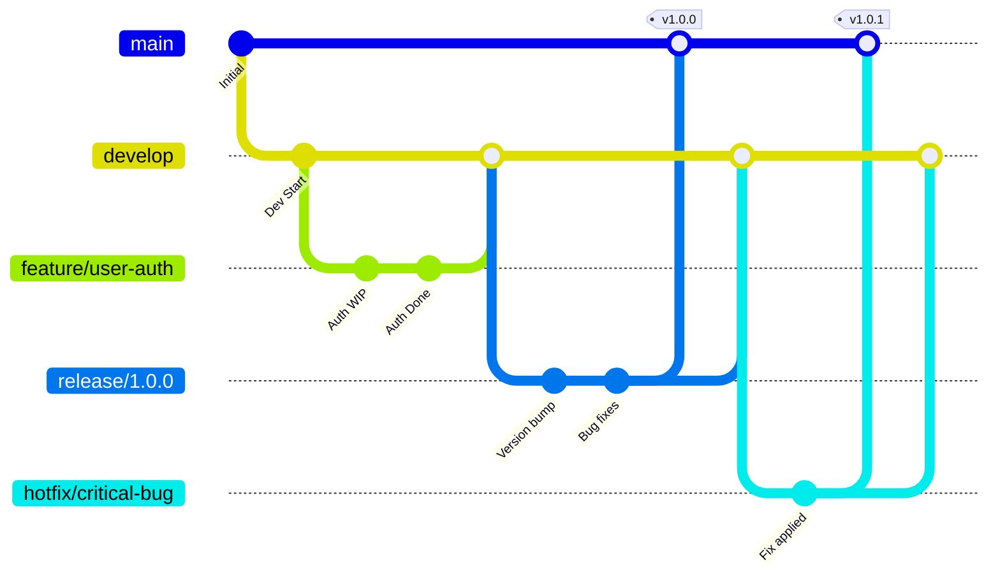
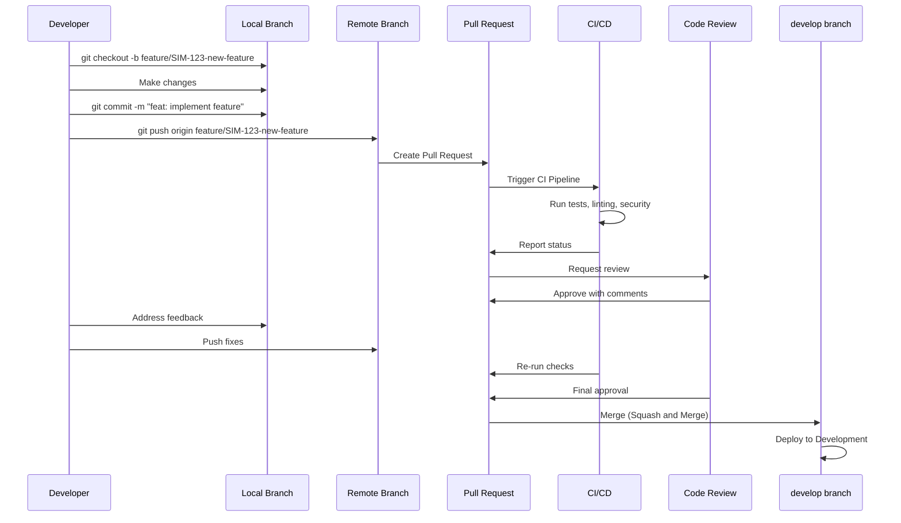
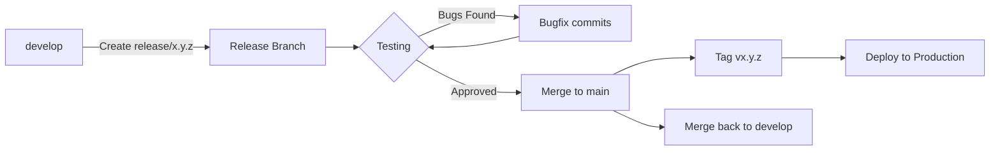

# 🌳 Estratégia de Branching - Sistema Simpix

**Documento Técnico:** Git Branching Strategy  
**Versão:** 1.0  
**Data:** 25 de Janeiro de 2025  
**Status:** Oficial - Modelo de Branching Mandatório  
**Aprovação:** Pendente Ratificação do Arquiteto Chefe  
**Criticidade:** P0 - CRÍTICA

---

## 📋 **SUMÁRIO EXECUTIVO**

Este documento formaliza a estratégia de branching Git para o Sistema Simpix, estabelecendo o modelo GitFlow adaptado com convenções claras, políticas de proteção e automações. Serve como "fonte da verdade" para garantir colaboração eficiente, releases previsíveis e manutenção de código estável.

**Ponto de Conformidade:** Remediação do Ponto 100 - Estratégia de Branching  
**Impacto:** Colaboração em equipe, qualidade de código, velocidade de entrega  
**Enforcement:** Branch protection rules + CI/CD validations

---

## 🎯 **1. MODELO DE BRANCHING: GITFLOW ADAPTADO**

### 1.1 **Visão Geral do Modelo**



### 1.2 **Branches Principais (Long-lived)**

| Branch      | Propósito              | Deploy Target | Protected | Direct Push |
| ----------- | ---------------------- | ------------- | --------- | ----------- |
| **main**    | Código em produção     | Production    | ✅ Yes    | ❌ Never    |
| **develop** | Integração de features | Development   | ✅ Yes    | ❌ Never    |
| **staging** | Release candidates     | Staging       | ✅ Yes    | ❌ Never    |

### 1.3 **Branches Temporárias (Short-lived)**

| Tipo          | Padrão                       | Origem  | Destino        | Lifecycle   |
| ------------- | ---------------------------- | ------- | -------------- | ----------- |
| **feature/**  | feature/[ticket]-description | develop | develop        | 1-2 sprints |
| **bugfix/**   | bugfix/[ticket]-description  | develop | develop        | 1-3 days    |
| **release/**  | release/[version]            | develop | main + develop | 1 week      |
| **hotfix/**   | hotfix/[ticket]-description  | main    | main + develop | 24 hours    |
| **chore/**    | chore/description            | develop | develop        | 1-2 days    |
| **docs/**     | docs/description             | develop | develop        | 1 day       |
| **test/**     | test/description             | develop | develop        | 1-2 days    |
| **refactor/** | refactor/description         | develop | develop        | 1 sprint    |

---

## 📝 **2. CONVENÇÕES DE NOMENCLATURA**

### 2.1 **Formato de Branch Names**

```typescript
// Branch naming convention
type BranchName = `${Prefix}/${TicketId}-${KebabCaseDescription}`;

interface BranchNamingRules {
  prefix: 'feature' | 'bugfix' | 'hotfix' | 'release' | 'chore' | 'docs' | 'test' | 'refactor';
  ticketId: string; // JIRA/Linear ticket: 'SIM-123'
  description: string; // kebab-case, max 50 chars

  examples: {
    valid: [
      'feature/SIM-123-user-authentication',
      'bugfix/SIM-456-fix-payment-calculation',
      'hotfix/SIM-789-critical-security-patch',
      'release/2.1.0',
      'chore/update-dependencies',
      'docs/api-documentation',
      'test/e2e-payment-flow',
      'refactor/SIM-234-optimize-queries',
    ];

    invalid: [
      'feature/user_auth', // Wrong: underscore
      'feat/SIM-123-auth', // Wrong: abbreviated prefix
      'feature/authentication', // Wrong: missing ticket
      'FEATURE/SIM-123-auth', // Wrong: uppercase
      'feature/sim-123-auth', // Wrong: lowercase ticket
      'feature/SIM-123-user-authentication-system-with-mfa', // Too long
    ];
  };
}
```

### 2.2 **Commit Message Convention**

```bash
# Conventional Commits Format
<type>(<scope>): <subject>

<body>

<footer>

# Examples:
feat(auth): implement JWT authentication

- Add JWT middleware
- Create auth service
- Add refresh token logic

Closes SIM-123

fix(payment): correct tax calculation for PIX

The calculation was using wrong rate for PIX payments.
This fixes the issue reported by finance team.

Fixes SIM-456

chore(deps): update dependencies to latest versions

- Update React to 18.3.1
- Update TypeScript to 5.3.0
- Fix breaking changes

docs(api): add OpenAPI documentation for proposals endpoint

refactor(database): optimize proposal queries

Reduce query time from 500ms to 50ms by adding indexes
```

### 2.3 **Commit Types**

| Type         | Description      | Versioning | Changelog      |
| ------------ | ---------------- | ---------- | -------------- |
| **feat**     | New feature      | Minor      | ✅ Features    |
| **fix**      | Bug fix          | Patch      | ✅ Bug Fixes   |
| **docs**     | Documentation    | None       | ❌             |
| **style**    | Code style       | None       | ❌             |
| **refactor** | Code refactoring | None       | ❌             |
| **perf**     | Performance      | Patch      | ✅ Performance |
| **test**     | Tests            | None       | ❌             |
| **chore**    | Maintenance      | None       | ❌             |
| **ci**       | CI/CD changes    | None       | ❌             |
| **build**    | Build system     | None       | ❌             |
| **revert**   | Revert commit    | Varies     | ✅ Reverts     |

---

## 🔀 **3. WORKFLOW DE DESENVOLVIMENTO**

### 3.1 **Feature Development Flow**



### 3.2 **Step-by-Step Process**

```bash
# 1. Start from updated develop
git checkout develop
git pull origin develop

# 2. Create feature branch
git checkout -b feature/SIM-123-user-authentication

# 3. Work on feature
# ... make changes ...
git add .
git commit -m "feat(auth): add login endpoint"

# 4. Keep branch updated
git fetch origin
git rebase origin/develop  # or merge if preferred

# 5. Push to remote
git push origin feature/SIM-123-user-authentication

# 6. Create Pull Request
# Use PR template (see section 4.3)

# 7. After approval and merge
git checkout develop
git pull origin develop
git branch -d feature/SIM-123-user-authentication
git push origin --delete feature/SIM-123-user-authentication
```

---

## 🚀 **4. PULL REQUEST STANDARDS**

### 4.1 **PR Requirements**

| Requirement          | Mandatory    | Automated Check |
| -------------------- | ------------ | --------------- |
| **Linked Issue**     | ✅           | GitHub Actions  |
| **Description**      | ✅           | PR Template     |
| **Tests Pass**       | ✅           | CI Pipeline     |
| **Code Coverage**    | ✅ >80% diff | Codecov         |
| **No Conflicts**     | ✅           | GitHub          |
| **Approved Reviews** | ✅ 1+        | GitHub          |
| **CI Green**         | ✅           | GitHub Actions  |
| **Security Scan**    | ✅           | Semgrep         |
| **Lint Pass**        | ✅           | ESLint          |

### 4.2 **PR Size Guidelines**

```typescript
interface PRSizeGuidelines {
  optimal: {
    files: '< 10 files';
    additions: '< 400 lines';
    deletions: 'unlimited';
    duration: '< 2 days open';
  };

  acceptable: {
    files: '10-20 files';
    additions: '400-800 lines';
    review_time: '< 4 hours';
  };

  requires_splitting: {
    files: '> 20 files';
    additions: '> 800 lines';
    action: 'Split into multiple PRs';
  };

  exceptions: {
    allowed: ['generated files', 'migrations', 'refactoring'];
    requires: 'Justification in PR description';
  };
}
```

### 4.3 **PR Template**

```markdown
## 🎯 Objetivo

[Descreva o que este PR implementa/corrige]

## 🔗 Issue Relacionada

Closes #[número da issue]

## 📝 Mudanças Realizadas

- [ ] Implementação de [funcionalidade]
- [ ] Correção de [bug]
- [ ] Atualização de [documentação]
- [ ] Adição de testes

## 📸 Screenshots (se aplicável)

[Adicione screenshots das mudanças visuais]

## ✅ Checklist

- [ ] Código segue os padrões do projeto
- [ ] Testes foram adicionados/atualizados
- [ ] Documentação foi atualizada
- [ ] Sem warnings do linter
- [ ] PR tem tamanho adequado
- [ ] Commits seguem convenção

## 🧪 Como Testar

1. Passo 1
2. Passo 2
3. Resultado esperado

## 📊 Impacto

- [ ] Breaking change
- [ ] Requer migração de dados
- [ ] Afeta performance
- [ ] Impacta segurança

## 💬 Notas Adicionais

[Qualquer contexto adicional]
```

---

## 🔒 **5. BRANCH PROTECTION RULES**

### 5.1 **Main Branch Protection**

```yaml
# .github/branch-protection/main.yml
protection_rules:
  main:
    # Prevent direct pushes
    restrict_push:
      enabled: true
      bypass_actors: [] # No one can bypass

    # Require PR
    require_pull_request:
      enabled: true
      required_approving_review_count: 2
      dismiss_stale_reviews: true
      require_code_owner_reviews: true
      required_review_from_codeowners: true
      bypass_pull_request_allowances: []

    # Status checks
    require_status_checks:
      enabled: true
      strict: true # Branch must be up to date
      contexts:
        - continuous-integration/github-actions
        - security/snyk
        - coverage/codecov
        - lint/eslint
        - test/unit
        - test/integration
        - test/e2e

    # Conversation resolution
    require_conversation_resolution: true

    # Signatures
    require_signed_commits: true

    # Linear history
    require_linear_history: false # Allow merge commits

    # Restrictions
    restrictions:
      users: []
      teams: ['simpix-admins']
      apps: ['github-actions']

    # Force pushes
    allow_force_pushes: false
    allow_deletions: false

    # Auto-delete merged branches
    delete_branch_on_merge: true
```

### 5.2 **Develop Branch Protection**

```yaml
# .github/branch-protection/develop.yml
protection_rules:
  develop:
    restrict_push:
      enabled: true
      bypass_actors: ['tech-leads']

    require_pull_request:
      enabled: true
      required_approving_review_count: 1
      dismiss_stale_reviews: true
      require_code_owner_reviews: false

    require_status_checks:
      enabled: true
      strict: false # Can be out of date
      contexts:
        - continuous-integration/github-actions
        - lint/eslint
        - test/unit

    require_conversation_resolution: false
    require_signed_commits: false
    require_linear_history: false
    allow_force_pushes: false
    allow_deletions: false
    delete_branch_on_merge: true
```

---

## 🚦 **6. MERGE STRATEGIES**

### 6.1 **Strategy by Branch Type**

| Source                | Target  | Strategy         | Rationale                     |
| --------------------- | ------- | ---------------- | ----------------------------- |
| **feature → develop** | develop | Squash and Merge | Clean history, atomic commits |
| **bugfix → develop**  | develop | Squash and Merge | Single commit per fix         |
| **develop → release** | release | Merge Commit     | Preserve feature history      |
| **release → main**    | main    | Merge Commit     | Preserve release history      |
| **release → develop** | develop | Merge Commit     | Sync changes back             |
| **hotfix → main**     | main    | Squash and Merge | Clean fix commit              |
| **hotfix → develop**  | develop | Cherry-pick      | Avoid merge conflicts         |

### 6.2 **Merge Conflict Resolution**

```bash
# Standard conflict resolution process
# 1. Update your branch
git checkout feature/your-branch
git fetch origin
git rebase origin/develop  # Preferred over merge

# 2. Resolve conflicts
# Edit conflicted files
git add <resolved-files>
git rebase --continue

# 3. Force push if rebased
git push --force-with-lease origin feature/your-branch

# Alternative: Merge strategy (for complex conflicts)
git checkout feature/your-branch
git merge origin/develop
# Resolve conflicts
git add .
git commit -m "merge: resolve conflicts with develop"
git push origin feature/your-branch
```

---

## 📦 **7. RELEASE MANAGEMENT**

### 7.1 **Release Branch Workflow**



### 7.2 **Semantic Versioning**

```typescript
interface VersioningStrategy {
  format: 'MAJOR.MINOR.PATCH'; // e.g., 2.1.3

  increment: {
    MAJOR: 'Breaking changes';
    MINOR: 'New features (backward compatible)';
    PATCH: 'Bug fixes';
  };

  preRelease: {
    format: 'x.y.z-<type>.<number>';
    types: ['alpha', 'beta', 'rc'];
    examples: ['2.1.0-alpha.1', '2.1.0-beta.3', '2.1.0-rc.1'];
  };

  branch: {
    release: 'release/2.1.0';
    tag: 'v2.1.0';

    script: `
      # Create release branch
      git checkout -b release/2.1.0 develop
      
      # Bump version
      npm version minor --no-git-tag-version
      git commit -am "chore: bump version to 2.1.0"
      
      # After testing and approval
      git checkout main
      git merge --no-ff release/2.1.0
      git tag -a v2.1.0 -m "Release version 2.1.0"
      git push origin main --tags
      
      # Merge back to develop
      git checkout develop
      git merge --no-ff release/2.1.0
      git push origin develop
    `;
  };
}
```

### 7.3 **Release Checklist**

```markdown
## Release Checklist v[X.Y.Z]

### Pre-Release

- [ ] All features for release are merged to develop
- [ ] Create release branch from develop
- [ ] Update version in package.json
- [ ] Update CHANGELOG.md
- [ ] Update documentation
- [ ] Run full test suite
- [ ] Performance testing completed
- [ ] Security scan passed
- [ ] Database migrations tested

### Release

- [ ] Merge release to main
- [ ] Create release tag
- [ ] Deploy to staging
- [ ] Smoke tests on staging
- [ ] Deploy to production
- [ ] Smoke tests on production
- [ ] Merge release back to develop

### Post-Release

- [ ] Monitor error rates
- [ ] Check performance metrics
- [ ] Announce release (Slack/Email)
- [ ] Update project board
- [ ] Archive release branch
- [ ] Plan retrospective
```

---

## 🔥 **8. HOTFIX PROCESS**

### 8.1 **Emergency Fix Workflow**

```bash
#!/bin/bash
# scripts/create-hotfix.sh

TICKET=$1
DESCRIPTION=$2

echo "🚨 Creating hotfix branch..."

# 1. Create from main
git checkout main
git pull origin main
git checkout -b hotfix/$TICKET-$DESCRIPTION

# 2. Make fix
echo "📝 Make your fixes now..."
echo "Press enter when done..."
read

# 3. Commit with proper message
git add .
git commit -m "hotfix($TICKET): $DESCRIPTION

This emergency fix addresses a critical issue in production.
Ticket: $TICKET"

# 4. Push and create PR
git push origin hotfix/$TICKET-$DESCRIPTION

echo "✅ Hotfix branch created!"
echo "📋 Next steps:"
echo "1. Create PR to main"
echo "2. Get emergency approval"
echo "3. Deploy immediately"
echo "4. Cherry-pick to develop"
```

### 8.2 **Hotfix Approval Matrix**

| Severity            | Required Approvals | Max Time to Deploy | Notification |
| ------------------- | ------------------ | ------------------ | ------------ |
| **SEV1 - Critical** | 1 (any senior dev) | 1 hour             | All teams    |
| **SEV2 - High**     | 1 (team lead)      | 4 hours            | Dev team     |
| **SEV3 - Medium**   | Normal PR process  | 24 hours           | Assignee     |

---

## 🤖 **9. AUTOMATION & HOOKS**

### 9.1 **Git Hooks Configuration**

```bash
# .husky/pre-commit
#!/bin/sh
. "$(dirname "$0")/_/husky.sh"

# Run lint-staged
npx lint-staged

# Check branch naming
BRANCH=$(git rev-parse --abbrev-ref HEAD)
VALID_PATTERN="^(main|develop|staging|(feature|bugfix|hotfix|release|chore|docs|test|refactor)\/[A-Z]{2,}-[0-9]+-.+)$"

if ! echo "$BRANCH" | grep -qE "$VALID_PATTERN"; then
  echo "❌ Branch name '$BRANCH' does not follow naming convention!"
  echo "📝 Format: <type>/<TICKET>-<description>"
  echo "📝 Example: feature/SIM-123-user-authentication"
  exit 1
fi
```

```bash
# .husky/commit-msg
#!/bin/sh
. "$(dirname "$0")/_/husky.sh"

# Validate commit message
npx commitlint --edit $1
```

### 9.2 **CI/CD Integration**

```yaml
# .github/workflows/branch-checks.yml
name: Branch Checks

on:
  pull_request:
    types: [opened, synchronize, reopened]

jobs:
  validate:
    runs-on: ubuntu-latest
    steps:
      - uses: actions/checkout@v4

      - name: Validate branch name
        run: |
          BRANCH=${GITHUB_HEAD_REF}
          PATTERN="^(feature|bugfix|hotfix|release|chore|docs|test|refactor)\/[A-Z]{2,}-[0-9]+-.+"
          if [[ ! "$BRANCH" =~ $PATTERN ]]; then
            echo "Invalid branch name: $BRANCH"
            exit 1
          fi

      - name: Check PR size
        uses: actions/github-script@v7
        with:
          script: |
            const pr = context.payload.pull_request;
            if (pr.additions > 800) {
              core.setFailed('PR too large: ' + pr.additions + ' lines added');
            }

      - name: Enforce conventional commits
        uses: wagoid/commitlint-github-action@v5

      - name: Auto-label PR
        uses: actions/labeler@v4
        with:
          repo-token: '${{ secrets.GITHUB_TOKEN }}'
```

---

## 📊 **10. METRICS & MONITORING**

### 10.1 **Branch Health Metrics**

```typescript
interface BranchMetrics {
  health_indicators: {
    max_age_days: 14;
    max_commits_behind: 50;
    max_conflicts: 0;
    min_tests_passing: 100;
  };

  monitoring: {
    stale_branches: 'Alert if > 30 days';
    failed_merges: 'Track and investigate';
    merge_time: 'Average < 2 days';
    review_time: 'Average < 4 hours';
  };

  cleanup_policy: {
    merged_branches: 'Delete immediately';
    stale_branches: 'Delete after 60 days';
    release_branches: 'Archive after 90 days';
  };
}
```

### 10.2 **Automated Branch Cleanup**

```yaml
# .github/workflows/branch-cleanup.yml
name: Branch Cleanup

on:
  schedule:
    - cron: '0 0 * * 0' # Weekly on Sunday

jobs:
  cleanup:
    runs-on: ubuntu-latest
    steps:
      - uses: actions/checkout@v4

      - name: Delete merged branches
        run: |
          git fetch --prune
          git branch -r --merged main | 
            grep -v main | 
            grep -v develop | 
            sed 's/origin\///' | 
            xargs -n 1 git push --delete origin

      - name: List stale branches
        run: |
          for branch in $(git branch -r | grep -v HEAD | grep -v main | grep -v develop); do
            last_commit=$(git log -1 --format="%cr" $branch)
            echo "$branch - $last_commit"
          done
```

---

## 🎓 **11. TEAM GUIDELINES**

### 11.1 **Best Practices**

1. **Commit Often, Push Daily**
   - Small, atomic commits
   - Push at least once per day
   - Never leave work uncommitted

2. **Keep Branches Short-Lived**
   - Maximum 2 weeks for features
   - Daily sync with develop
   - Delete after merge

3. **Write Meaningful Messages**
   - Clear commit messages
   - Detailed PR descriptions
   - Link to tickets

4. **Review Responsibly**
   - Review within 4 hours
   - Provide constructive feedback
   - Test locally if needed

5. **Clean Up After Yourself**
   - Delete merged branches
   - Update documentation
   - Close related issues

### 11.2 **Common Scenarios**

```bash
# Scenario 1: Accidentally committed to main
git reset --soft HEAD~1
git checkout -b feature/SIM-XXX-proper-branch
git commit -m "feat: move changes to feature branch"
git push origin feature/SIM-XXX-proper-branch

# Scenario 2: Need to split large PR
git checkout feature/large-feature
git checkout -b feature/SIM-XXX-part-1
git cherry-pick <commits-for-part-1>
git push origin feature/SIM-XXX-part-1

# Scenario 3: Rebase vs Merge
# Use rebase for feature branches
git rebase origin/develop

# Use merge for release/hotfix
git merge --no-ff release/2.1.0

# Scenario 4: Undo last push
git push --force-with-lease origin feature/branch

# Scenario 5: Recover deleted branch
git checkout -b recover-branch <commit-hash>
```

---

## 📚 **12. REFERENCES & TOOLS**

### 12.1 **Useful Git Aliases**

```bash
# Add to ~/.gitconfig
[alias]
    # Branch management
    nb = checkout -b
    branches = branch -a
    cleanup = "!git branch --merged | grep -v '\\*\\|main\\|develop' | xargs -n 1 git branch -d"

    # Status and logs
    s = status -s
    lg = log --graph --pretty=format:'%Cred%h%Creset -%C(yellow)%d%Creset %s %Cgreen(%cr) %C(bold blue)<%an>%Creset' --abbrev-commit

    # Commits
    cm = commit -m
    amend = commit --amend --no-edit

    # Sync
    sync = !git fetch --all && git rebase origin/develop
    update = !git pull --rebase --prune

    # Undo
    undo = reset --soft HEAD~1
    unstage = reset HEAD --
```

### 12.2 **Recommended Tools**

| Tool                     | Purpose            | URL                           |
| ------------------------ | ------------------ | ----------------------------- |
| **GitKraken**            | Visual Git client  | gitkraken.com                 |
| **Conventional Commits** | Commit standard    | conventionalcommits.org       |
| **commitizen**           | Commit CLI helper  | github.com/commitizen         |
| **husky**                | Git hooks          | github.com/typicode/husky     |
| **lint-staged**          | Pre-commit linting | github.com/okonet/lint-staged |
| **semantic-release**     | Automated releases | github.com/semantic-release   |

---

## ✅ **CONCLUSÃO**

### Conformidade Alcançada

- ✅ Modelo GitFlow adaptado e documentado
- ✅ Convenções de nomenclatura estabelecidas
- ✅ Branch protection rules definidas
- ✅ Processo de PR padronizado
- ✅ Release management formalizado
- ✅ Hotfix process documentado
- ✅ Automações configuradas
- ✅ Métricas de saúde definidas

### Implementação Imediata

1. Configurar branch protection no GitHub
2. Instalar hooks com Husky
3. Treinar equipe no modelo
4. Criar templates de PR
5. Automatizar cleanup de branches

---

**DECLARAÇÃO DE CONFORMIDADE:**
Este documento estabelece o modelo oficial de branching para o Sistema Simpix, sendo mandatório para todos os desenvolvedores e enforced através de automações.

_Assinatura Digital_  
**Arquiteto de Sistemas Sênior**  
_SHA256-BRANCHING-2025-01-25_
