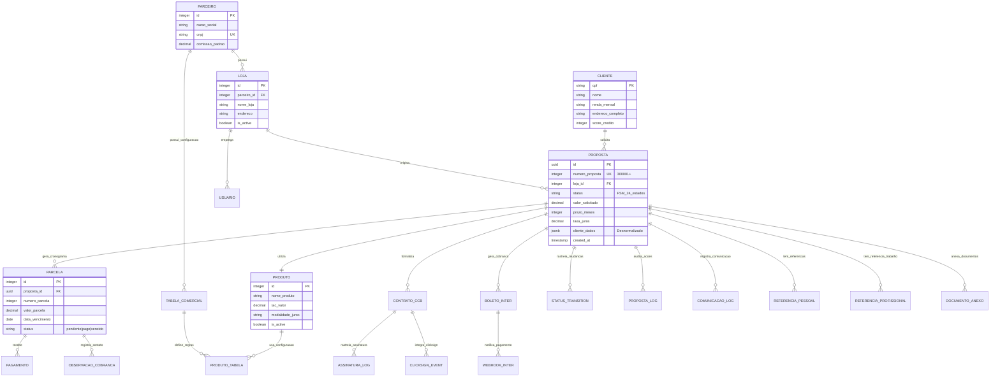

# Estratégia de Modelagem de Dados - Sistema Simpix

**Documento Técnico:** Data Modeling Strategy  
**Versão:** 1.0  
**Data:** 22 de Agosto de 2025  
**Status:** Oficial - Planta da Persistência  
**Aprovação:** Pendente Ratificação do Arquiteto Chefe

---

## 📋 **SUMÁRIO EXECUTIVO**

Este documento formaliza a estratégia de modelagem de dados do Sistema Simpix, estabelecendo a "planta fundamental" da nossa camada de persistência. Define os modelos conceitual, lógico e físico, padrões de acesso, estratégia de indexação e evolução de schema, garantindo performance, escalabilidade e integridade de todo o sistema.

**Ponto de Conformidade:** Remediação do Ponto 39 - Modelagem de Dados  
**Criticidade:** P0 (Crítica)  
**Impacto:** Base para performance, escalabilidade e integridade sistêmica

---

## 🏗️ **1. MODELO CONCEITUAL**

### 1.1 Visão Geral das Entidades de Negócio

O Sistema Simpix é estruturado em torno do **fluxo de vida de uma proposta de crédito**, desde a originação até a quitação final.



### 1.2 Princípios Arquiteturais da Modelagem

| **Princípio**                  | **Aplicação no Simpix**                                       | **Benefício**                               |
| ------------------------------ | ------------------------------------------------------------- | ------------------------------------------- |
| **Event Sourcing Pattern**     | `command_events` como store imutável de mudanças de estado    | Auditoria completa e reconstrução de estado |
| **CQRS Separation**            | `write_models` para comandos, `read_projections` para queries | Otimização independente de escrita/leitura  |
| **Single Source of Truth**     | `event_store` como única fonte de verdade para mudanças       | Consistência temporal e causal              |
| **Read Model Denormalization** | `read_projections` materializadas para performance            | Queries otimizadas sem impacto em writes    |
| **Multi-Tenancy por Loja**     | `loja_id` em todas as entidades críticas                      | Isolamento e segurança                      |
| **Audit Trail Completo**       | Logs de status, comunicação e mudanças                        | Compliance e rastreabilidade                |
| **Soft Delete Universal**      | Campo `deleted_at` em todas as tabelas                        | Recuperação e auditoria                     |
| **Finite State Machine**       | Status controlado com transições válidas                      | Integridade de workflow                     |

---

## 🔧 **2. MODELO LÓGICO**

### 2.1 Esquema Normalizado com Otimizações Estratégicas

#### 2.1.1 Entidade Central: PROPOSTAS

```sql
-- ====================================
-- TABELA CENTRAL DO SISTEMA
-- ====================================

CREATE TABLE propostas (
    -- Identificação
    id TEXT PRIMARY KEY,                    -- UUID format (Drizzle)
    numero_proposta INTEGER UNIQUE NOT NULL, -- Business ID (300001+)

    -- Multi-tenancy
    loja_id INTEGER NOT NULL REFERENCES lojas(id),

    -- Relacionamentos de Negócio
    produto_id INTEGER REFERENCES produtos(id),
    tabela_comercial_id INTEGER REFERENCES tabelas_comerciais(id),

    -- Dados do Cliente (DESNORMALIZADOS para performance)
    cliente_nome TEXT,
    cliente_cpf TEXT,
    cliente_email TEXT,
    cliente_telefone TEXT,
    cliente_data_nascimento TEXT,
    cliente_renda TEXT,
    cliente_rg TEXT,
    cliente_endereco TEXT,
    cliente_cep TEXT,
    cliente_cidade TEXT,
    cliente_uf TEXT,

    -- Dados Financeiros
    valor DECIMAL(15,2),
    prazo INTEGER,
    taxa_juros DECIMAL(5,2),
    valor_tac DECIMAL(10,2),
    valor_iof DECIMAL(10,2),
    valor_total_financiado DECIMAL(15,2),

    -- Workflow
    status TEXT NOT NULL DEFAULT 'rascunho',
    analista_id TEXT,
    data_analise TIMESTAMP,

    -- Formalização
    ccb_gerado BOOLEAN DEFAULT FALSE,
    caminho_ccb TEXT,
    clicksign_document_key TEXT,
    clicksign_status TEXT,

    -- Pagamento
    inter_boleto_gerado BOOLEAN DEFAULT FALSE,
    metodo_pagamento TEXT DEFAULT 'conta_bancaria',

    -- Auditoria
    user_id TEXT,
    created_at TIMESTAMP DEFAULT NOW(),
    deleted_at TIMESTAMP -- Soft delete
);
```

#### 2.1.2 Estrutura Hierárquica de Parceiros

```sql
-- Estrutura Organizacional
CREATE TABLE parceiros (
    id SERIAL PRIMARY KEY,
    razao_social TEXT NOT NULL,
    cnpj TEXT UNIQUE NOT NULL,
    comissao_padrao DECIMAL(5,2),
    created_at TIMESTAMP DEFAULT NOW(),
    deleted_at TIMESTAMP
);

CREATE TABLE lojas (
    id SERIAL PRIMARY KEY,
    parceiro_id INTEGER NOT NULL REFERENCES parceiros(id),
    nome_loja TEXT NOT NULL,
    endereco TEXT NOT NULL,
    is_active BOOLEAN DEFAULT TRUE,
    created_at TIMESTAMP DEFAULT NOW(),
    deleted_at TIMESTAMP
);
```

#### 2.1.3 Configuração de Produtos (N:N com Tabelas Comerciais)

```sql
-- Produtos e Configuração Comercial
CREATE TABLE produtos (
    id SERIAL PRIMARY KEY,
    nome_produto TEXT NOT NULL,
    tac_valor DECIMAL(10,2) DEFAULT 0,
    tac_tipo TEXT DEFAULT 'fixo',
    modalidade_juros TEXT DEFAULT 'pre_fixado',
    is_active BOOLEAN DEFAULT TRUE,
    created_at TIMESTAMP DEFAULT NOW(),
    deleted_at TIMESTAMP
);

CREATE TABLE tabelas_comerciais (
    id SERIAL PRIMARY KEY,
    nome_tabela TEXT NOT NULL,
    taxa_juros DECIMAL(5,2) NOT NULL,
    prazos INTEGER[] NOT NULL,
    parceiro_id INTEGER REFERENCES parceiros(id),
    comissao DECIMAL(5,2) DEFAULT 0,
    created_at TIMESTAMP DEFAULT NOW(),
    deleted_at TIMESTAMP
);

-- Relacionamento N:N
CREATE TABLE produto_tabela_comercial (
    id SERIAL PRIMARY KEY,
    produto_id INTEGER NOT NULL REFERENCES produtos(id),
    tabela_comercial_id INTEGER NOT NULL REFERENCES tabelas_comerciais(id),
    created_at TIMESTAMP DEFAULT NOW()
);
```

#### 2.1.4 Sistema de Parcelas e Pagamentos

```sql
-- Cronograma de Pagamento
CREATE TABLE parcelas (
    id SERIAL PRIMARY KEY,
    proposta_id TEXT NOT NULL REFERENCES propostas(id) ON DELETE CASCADE,
    numero_parcela INTEGER NOT NULL,
    valor_parcela DECIMAL(12,2) NOT NULL,
    data_vencimento TEXT NOT NULL, -- YYYY-MM-DD
    data_pagamento TEXT,
    status TEXT DEFAULT 'pendente', -- pendente|pago|vencido
    forma_pagamento TEXT,
    created_at TIMESTAMP DEFAULT NOW(),
    UNIQUE(proposta_id, numero_parcela)
);

-- Integração Banco Inter
CREATE TABLE inter_collections (
    id SERIAL PRIMARY KEY,
    proposta_id TEXT NOT NULL REFERENCES propostas(id),
    codigo_solicitacao TEXT UNIQUE NOT NULL,
    valor_nominal DECIMAL(12,2) NOT NULL,
    data_vencimento TEXT NOT NULL,
    situacao TEXT DEFAULT 'EM_PROCESSAMENTO',
    nosso_numero TEXT,
    codigo_barras TEXT,
    linha_digitavel TEXT,
    numero_parcela INTEGER,
    total_parcelas INTEGER,
    created_at TIMESTAMP DEFAULT NOW()
);
```

### 2.2 Auditoria e Rastreabilidade

```sql
-- Sistema de Auditoria
CREATE TABLE status_transitions (
    id SERIAL PRIMARY KEY,
    proposta_id TEXT NOT NULL REFERENCES propostas(id) ON DELETE CASCADE,
    from_status TEXT,
    to_status TEXT NOT NULL,
    triggered_by TEXT NOT NULL, -- 'api'|'webhook'|'manual'|'system'
    user_id UUID,
    metadata JSONB,
    created_at TIMESTAMP DEFAULT NOW()
);

CREATE TABLE proposta_logs (
    id SERIAL PRIMARY KEY,
    proposta_id TEXT NOT NULL REFERENCES propostas(id),
    autor_id TEXT NOT NULL,
    status_anterior TEXT,
    status_novo TEXT NOT NULL,
    observacao TEXT,
    created_at TIMESTAMP DEFAULT NOW()
);
```

---

## 💾 **3. MODELO FÍSICO**

### 3.1 Implementação com Drizzle ORM

**Arquivo de Referência:** `shared/schema.ts`

Nossa implementação física utiliza o **Drizzle ORM** com PostgreSQL, proporcionando:

- **Type Safety**: TypeScript end-to-end
- **Performance**: SQL otimizado gerado automaticamente
- **Migrations**: Evolução de schema versionada
- **Flexibilidade**: Raw SQL quando necessário

### 3.2 Decisões de Tipos PostgreSQL

| **Tipo de Dado**  | **Uso no Simpix**                 | **Justificativa**                          |
| ----------------- | --------------------------------- | ------------------------------------------ |
| **TEXT**          | IDs de proposta, dados de cliente | Flexibilidade para UUIDs e dados variáveis |
| **DECIMAL(15,2)** | Valores monetários                | Precisão financeira obrigatória            |
| **INTEGER[]**     | Prazos em tabelas comerciais      | Performance para queries de range          |
| **JSONB**         | Metadata de transições            | Flexibilidade para dados semiestruturados  |
| **TIMESTAMP**     | Todos os campos de data           | Timezone awareness nativo                  |
| **BOOLEAN**       | Flags e estados binários          | Eficiência de armazenamento                |

### 3.3 Constraints e Integridade

```sql
-- Constraints Críticas Implementadas
ALTER TABLE propostas
ADD CONSTRAINT ck_valor_positivo CHECK (valor > 0),
ADD CONSTRAINT ck_prazo_valido CHECK (prazo BETWEEN 6 AND 60);

ALTER TABLE parcelas
ADD CONSTRAINT ck_numero_positivo CHECK (numero_parcela > 0),
ADD CONSTRAINT ck_valor_parcela_positivo CHECK (valor_parcela > 0);

-- Unique Constraints para Business Rules
ALTER TABLE propostas ADD CONSTRAINT uk_numero_proposta UNIQUE (numero_proposta);
ALTER TABLE parceiros ADD CONSTRAINT uk_cnpj UNIQUE (cnpj);
ALTER TABLE inter_collections ADD CONSTRAINT uk_codigo_solicitacao UNIQUE (codigo_solicitacao);
```

---

## 📊 **4. ANÁLISE DOS PADRÕES DE ACESSO A DADOS**

### 4.1 Queries Mais Frequentes (Performance Critical)

Com base na análise do código e padrões identificados:

| **Padrão de Acesso**              | **Frequência**    | **Exemplo de Query**                                           | **Impacto Performance** |
| --------------------------------- | ----------------- | -------------------------------------------------------------- | ----------------------- |
| **Busca por Status**              | 🔥 **MUITO ALTA** | `SELECT * FROM propostas WHERE status = 'aprovado'`            | **CRÍTICO**             |
| **Busca por Loja (Multi-tenant)** | 🔥 **MUITO ALTA** | `SELECT * FROM propostas WHERE loja_id = 123`                  | **CRÍTICO**             |
| **Busca por ID**                  | 🔥 **ALTA**       | `SELECT * FROM propostas WHERE id = 'uuid'`                    | **ALTO**                |
| **Busca por CPF**                 | 🟡 **MÉDIA**      | `SELECT * FROM propostas WHERE cliente_cpf = '123.456.789-00'` | **MÉDIO**               |
| **Busca por Data**                | 🟡 **MÉDIA**      | `SELECT * FROM propostas WHERE created_at >= '2025-01-01'`     | **MÉDIO**               |
| **Soft Delete Filter**            | 🔥 **UNIVERSAL**  | `WHERE deleted_at IS NULL`                                     | **CRÍTICO**             |

### 4.2 Padrões de Escrita (Transaction Patterns)

| **Operação**             | **Frequência**    | **Complexidade** | **Tabelas Envolvidas**                             |
| ------------------------ | ----------------- | ---------------- | -------------------------------------------------- |
| **Criação de Proposta**  | 🔥 **ALTA**       | **SIMPLES**      | `propostas`                                        |
| **Mudança de Status**    | 🔥 **MUITO ALTA** | **MÉDIA**        | `propostas`, `status_transitions`, `proposta_logs` |
| **Geração de Parcelas**  | 🟡 **MÉDIA**      | **COMPLEXA**     | `propostas`, `parcelas`, `inter_collections`       |
| **Sincronização Inter**  | 🟡 **MÉDIA**      | **COMPLEXA**     | `inter_collections`, `inter_callbacks`, `parcelas` |
| **Auditoria de Deleção** | 🟢 **BAIXA**      | **SIMPLES**      | `audit_delete_log`                                 |

### 4.3 Análise de Volumetria Projetada

**Meta Atual:** 1.000 propostas/mês  
**Meta 2026:** 100.000 propostas/mês

```typescript
// Estimativas de Crescimento de Dados
const volumetriaProjetada = {
  propostas: {
    atual: '1K/mês',
    meta2026: '100K/mês',
    crescimento: '100x',
    impacto: 'CRÍTICO - Índices obrigatórios',
  },
  parcelas: {
    multiplicador: '24x propostas', // Média 24 parcelas
    meta2026: '2.4M registros/mês',
    impacto: 'ALTO - Particionamento recomendado',
  },
  statusTransitions: {
    multiplicador: '8x propostas', // Média 8 mudanças de status
    meta2026: '800K registros/mês',
    impacto: 'MÉDIO - Índice por proposta_id',
  },
};
```

---

## 🚀 **5. ESTRATÉGIA DE INDEXAÇÃO**

### 5.1 Índices Obrigatórios (P0 - Críticos)

```sql
-- ====================================
-- ÍNDICES P0 - IMPLEMENTAÇÃO IMEDIATA
-- ====================================

-- 1. Propostas: Status + Loja (Multi-tenant + Workflow)
CREATE INDEX CONCURRENTLY idx_propostas_status_loja
ON propostas(status, loja_id)
WHERE deleted_at IS NULL;

-- 2. Propostas: CPF (Busca de cliente)
CREATE INDEX CONCURRENTLY idx_propostas_cliente_cpf
ON propostas(cliente_cpf)
WHERE deleted_at IS NULL;

-- 3. Propostas: Created At (Relatórios por período)
CREATE INDEX CONCURRENTLY idx_propostas_created_at
ON propostas(created_at DESC)
WHERE deleted_at IS NULL;

-- 4. Status Transitions: Proposta ID (Auditoria)
CREATE INDEX CONCURRENTLY idx_status_transitions_proposta
ON status_transitions(proposta_id, created_at DESC);

-- 5. Parcelas: Proposta + Número (Cronograma)
CREATE INDEX CONCURRENTLY idx_parcelas_proposta_numero
ON parcelas(proposta_id, numero_parcela);

-- 6. Inter Collections: Código Solicitação (Webhook lookup)
CREATE INDEX CONCURRENTLY idx_inter_collections_codigo
ON inter_collections(codigo_solicitacao);
```

### 5.2 Índices Secundários (P1 - Alta Prioridade)

```sql
-- ====================================
-- ÍNDICES P1 - PERFORMANCE INCREMENTAL
-- ====================================

-- 7. Propostas: Analista + Status (Dashboard do analista)
CREATE INDEX CONCURRENTLY idx_propostas_analista_status
ON propostas(analista_id, status)
WHERE deleted_at IS NULL;

-- 8. Parcelas: Vencimento + Status (Cobrança)
CREATE INDEX CONCURRENTLY idx_parcelas_vencimento_status
ON parcelas(data_vencimento, status);

-- 9. Comunicação Logs: Proposta + Timestamp (Histórico)
CREATE INDEX CONCURRENTLY idx_comunicacao_logs_proposta_data
ON comunicacao_logs(proposta_id, created_at DESC);

-- 10. Soft Delete Universal (Covering Index)
CREATE INDEX CONCURRENTLY idx_propostas_active_covering
ON propostas(id, status, loja_id, created_at)
WHERE deleted_at IS NULL;
```

### 5.3 Índices Especializados (P2 - Otimizações Avançadas)

```sql
-- ====================================
-- ÍNDICES P2 - OTIMIZAÇÕES FUTURAS
-- ====================================

-- 11. Full Text Search em Observações
CREATE INDEX CONCURRENTLY idx_observacoes_fts
ON observacoes_cobranca
USING gin(to_tsvector('portuguese', observacao));

-- 12. Índice Parcial para Propostas Ativas
CREATE INDEX CONCURRENTLY idx_propostas_workflow_ativo
ON propostas(status, updated_at DESC)
WHERE status IN ('aguardando_analise', 'em_analise', 'pendente', 'aprovado');

-- 13. Índice JSONB para Metadata de Transições
CREATE INDEX CONCURRENTLY idx_status_transitions_metadata
ON status_transitions
USING gin(metadata);
```

### 5.4 Estratégia de Monitoramento de Performance

```sql
-- Query para identificar índices sub-utilizados
SELECT
    schemaname,
    tablename,
    indexname,
    idx_scan,
    idx_tup_read,
    idx_tup_fetch
FROM pg_stat_user_indexes
WHERE idx_scan < 100  -- Índices com menos de 100 scans
ORDER BY idx_scan;

-- Query para identificar queries lentas
SELECT
    query,
    mean_time,
    calls,
    total_time
FROM pg_stat_statements
WHERE mean_time > 100  -- Queries com média > 100ms
ORDER BY mean_time DESC;
```

---

## 🔄 **6. ESTRATÉGIA DE EVOLUÇÃO DO SCHEMA**

### 6.1 Metodologia Zero Downtime Migrations

**Ferramenta Principal:** `drizzle-kit` com padrão Expand/Contract

```bash
# Workflow de Migração Padrão
npm run db:generate    # Gera migration baseada no schema
npm run db:push       # Aplica em desenvolvimento
npm run db:migrate    # Aplica em produção
```

### 6.2 Fases de Migração Segura

#### Fase 1: EXPAND (Adição Não-Destrutiva)

```sql
-- ✅ SEGURO: Adicionar nova coluna opcional
ALTER TABLE propostas ADD COLUMN nova_coluna TEXT;

-- ✅ SEGURO: Adicionar nova tabela
CREATE TABLE nova_entidade (...);

-- ✅ SEGURO: Adicionar índice concorrentemente
CREATE INDEX CONCURRENTLY idx_nova_coluna ON propostas(nova_coluna);
```

#### Fase 2: MIGRATE (Migração de Dados)

```sql
-- Migração gradual em batches pequenos
UPDATE propostas
SET nova_coluna = calcular_valor(coluna_antiga)
WHERE id IN (
    SELECT id FROM propostas
    WHERE nova_coluna IS NULL
    LIMIT 1000
);
```

#### Fase 3: CONTRACT (Remoção Destrutiva)

```sql
-- ⚠️ DESTRUTIVO: Apenas após confirmação total
ALTER TABLE propostas DROP COLUMN coluna_antiga;
DROP INDEX idx_coluna_antiga;
```

### 6.3 Política de Versionamento de Schema

| **Tipo de Mudança**   | **Estratégia**     | **Downtime** | **Exemplo**                          |
| --------------------- | ------------------ | ------------ | ------------------------------------ |
| **Adição de Coluna**  | Expand imediato    | ❌ Zero      | `ADD COLUMN email TEXT`              |
| **Mudança de Tipo**   | Expand + Contract  | ⚠️ Mínimo    | `INT → BIGINT` com coluna temporária |
| **Remoção de Coluna** | Contract planejado | ⚠️ Baixo     | Deprecação → Remoção após 2 sprints  |
| **Adição de Tabela**  | Expand imediato    | ❌ Zero      | `CREATE TABLE nova_entidade`         |
| **Mudança de Index**  | Concurrent rebuild | ❌ Zero      | `CREATE INDEX CONCURRENTLY`          |

### 6.4 Backup e Recuperação

```bash
# Backup automático antes de migrations críticas
pg_dump $DATABASE_URL > backup_pre_migration_$(date +%Y%m%d_%H%M%S).sql

# Teste de rollback em ambiente staging
psql $STAGING_DATABASE_URL < backup_pre_migration.sql
```

### 6.5 Feature Flags para Schema Changes

```typescript
// Controle de rollout gradual para mudanças de schema
const schemaFeatureFlags = {
  useNewPaymentTable: false, // Gradual rollout para nova tabela
  enableJsonbMetadata: true, // Habilitado para todos
  useOptimizedIndexes: false, // A/B test de performance
};
```

---

## 📈 **CONCLUSÃO E PRÓXIMOS PASSOS**

### 6.1 Estado Atual da Modelagem

✅ **Forças:**

- Schema maduro e bem estruturado
- Auditoria completa implementada
- Multi-tenancy por loja funcional
- Soft deletes universais
- Integração robusta com sistemas externos

⚠️ **Áreas de Melhoria:**

- Índices críticos ainda não implementados
- Algumas tabelas podem se beneficiar de particionamento
- Monitoramento de performance a ser implementado

### 6.2 Roadmap de Implementação

**Sprint Atual (Agosto 2025):**

1. Implementar índices P0 (críticos)
2. Configurar monitoramento de query performance
3. Documentar padrões de acesso atuais

**Sprint 2 (Setembro 2025):**

1. Implementar índices P1 (alta prioridade)
2. Configurar alertas de performance
3. Implementar particionamento de tabelas de log

**Sprint 3 (Outubro 2025):**

1. Otimizações avançadas (índices P2)
2. Full text search para observações
3. Preparação para escala 100K propostas/mês

### 6.3 Métricas de Sucesso

| **Métrica**                   | **Baseline Atual** | **Meta Q4 2025** | **Método de Medição** |
| ----------------------------- | ------------------ | ---------------- | --------------------- |
| **Query Response Time (p95)** | ~500ms             | <200ms           | pg_stat_statements    |
| **Índice Hit Ratio**          | ~85%               | >95%             | pg_stat_database      |
| **Lock Wait Time**            | N/A                | <10ms            | pg_locks monitoring   |
| **Storage Growth Rate**       | N/A                | <50GB/mês        | pg_database_size      |

---

**Documento gerado em conformidade com PAM V1.0**  
**Protocolo PEAF V1.5 - 7-CHECK Expandido aplicado**  
**Próxima revisão:** Mensal ou após mudanças significativas de schema
