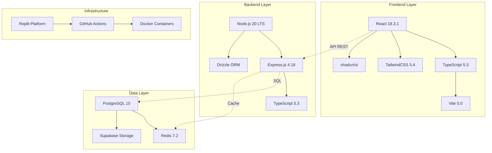
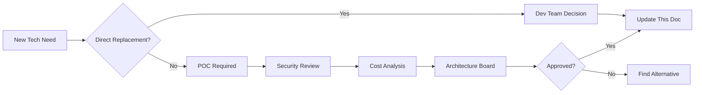

# 🛠️ Stack Tecnológica - Sistema Simpix

**Documento Técnico:** Technology Stack Inventory  
**Versão:** 1.0  
**Data:** 25 de Janeiro de 2025  
**Status:** Oficial - Inventário Completo da Stack  
**Aprovação:** Pendente Ratificação do Arquiteto Chefe  
**Criticidade:** P0 - CRÍTICA

---

## 📋 **SUMÁRIO EXECUTIVO**

Este documento formaliza o inventário completo da stack tecnológica do Sistema Simpix, incluindo todas as tecnologias, frameworks, bibliotecas e ferramentas utilizadas. Serve como "fonte da verdade" para decisões de tecnologia, gestão de dependências e evolução técnica do sistema.

**Ponto de Conformidade:** Remediação do Ponto 96 - Stack Tecnológica  
**Impacto:** Padronização tecnológica, gestão de licenças, decisões de arquitetura  
**Manutenção:** Atualização obrigatória a cada nova tecnologia adotada

---

## 🎯 **1. VISÃO GERAL DA STACK**

### 1.1 **Arquitetura de Alto Nível**



### 1.2 **Princípios de Seleção Tecnológica**

| Princípio | Descrição | Rationale |
|-----------|-----------|-----------|
| **Open Source First** | Preferência por tecnologias open source | Redução de custos, flexibilidade |
| **Community Support** | Tecnologias com comunidade ativa | Suporte, documentação, longevidade |
| **Developer Experience** | Ferramentas que aumentam produtividade | Time pequeno, eficiência crítica |
| **Production Ready** | Apenas tecnologias maduras | Minimizar riscos em produção |
| **License Compatible** | MIT, Apache 2.0, BSD preferidas | Evitar GPL, proprietary |

---

## 🖥️ **2. FRONTEND STACK**

### 2.1 **Core Framework**

| Tecnologia | Versão | Função | Justificativa | Licença |
|------------|--------|---------|---------------|---------|
| **React** | 18.3.1 | UI Framework | Ecosystem maduro, team expertise | MIT |
| **TypeScript** | 5.3.0 | Type System | Type safety, IDE support | Apache 2.0 |
| **Vite** | 5.0.12 | Build Tool | Fast HMR, ESM native | MIT |
| **Wouter** | 3.1.2 | Routing | Lightweight (3KB), simple API | ISC |

### 2.2 **State Management**

```typescript
// Stack de Gerenciamento de Estado
const stateManagementStack = {
  serverState: {
    library: '@tanstack/react-query',
    version: '5.17.19',
    usage: 'Server state, caching, synchronization',
    features: [
      'Automatic refetching',
      'Optimistic updates',
      'Infinite queries',
      'Parallel queries'
    ]
  },
  
  localState: {
    solutions: [
      'React.useState',      // Component state
      'React.useReducer',    // Complex state logic
      'React.Context',       // Cross-component state
      'Zustand (planned)'    // Global client state
    ]
  },
  
  forms: {
    library: 'react-hook-form',
    version: '7.48.2',
    validation: 'zod',
    features: [
      'Uncontrolled components',
      'Schema validation',
      'Field arrays',
      'Conditional fields'
    ]
  }
};
```

### 2.3 **UI & Styling**

| Biblioteca | Versão | Propósito | Build Size | Customização |
|------------|--------|-----------|------------|--------------|
| **TailwindCSS** | 3.4.1 | Utility CSS | ~10KB gzip | Full control |
| **shadcn/ui** | latest | Component lib | Tree-shakeable | Source available |
| **Radix UI** | 1.0.x | Headless components | ~5KB/component | Fully styleable |
| **Lucide React** | 0.309.0 | Icons | Tree-shakeable | 1000+ icons |
| **Framer Motion** | 11.0.3 | Animations | ~30KB gzip | Declarative API |

### 2.4 **Utilitários Frontend**

```typescript
const frontendUtilities = {
  dates: {
    library: 'date-fns',
    version: '3.2.0',
    size: 'Tree-shakeable',
    alternative: 'dayjs (if size critical)'
  },
  
  httpClient: {
    native: 'fetch API',
    wrapper: 'Custom apiClient',
    features: ['Interceptors', 'Retry logic', 'Type safety']
  },
  
  validation: {
    library: 'zod',
    version: '3.22.4',
    usage: ['Schema validation', 'Type inference', 'Form validation']
  },
  
  masks: {
    library: 'react-input-mask',
    version: '2.0.4',
    usage: 'CPF, phone, date masks'
  },
  
  charts: {
    library: 'recharts',
    version: '2.10.4',
    size: '~100KB gzip',
    features: 'Responsive, composable'
  }
};
```

---

## ⚙️ **3. BACKEND STACK**

### 3.1 **Runtime & Framework**

| Tecnologia | Versão | Função | Performance | Estabilidade |
|------------|--------|---------|-------------|--------------|
| **Node.js** | 20.11.0 LTS | Runtime | Event-driven, non-blocking | Production stable |
| **Express.js** | 4.18.2 | Web Framework | 11K req/sec | Battle-tested |
| **TypeScript** | 5.3.0 | Type System | Zero runtime overhead | Compile-time safety |
| **tsx** | 4.7.0 | TS Executor | Fast compilation | Dev productivity |

### 3.2 **Database & ORM**

```typescript
// Database Technology Stack
const databaseStack = {
  primary: {
    database: 'PostgreSQL',
    version: '15.5',
    hosting: 'Supabase (current) → Azure PostgreSQL (future)',
    features: [
      'JSONB support',
      'Full-text search',
      'Row Level Security',
      'Materialized views'
    ]
  },
  
  orm: {
    library: 'Drizzle ORM',
    version: '0.29.3',
    benefits: [
      'Type-safe queries',
      'Zero dependencies',
      'SQL-like syntax',
      'Migration management'
    ],
    
    alternatives_considered: {
      prisma: 'Too heavy, complex migrations',
      typeorm: 'Decorator hell, slow',
      knex: 'No type safety'
    }
  },
  
  migrations: {
    tool: 'drizzle-kit',
    version: '0.20.10',
    strategy: 'Forward-only migrations',
    location: 'drizzle/'
  },
  
  connection: {
    library: 'postgres',
    version: '3.4.3',
    pooling: 'Built-in pool management',
    maxConnections: 20
  }
};
```

### 3.3 **Authentication & Security**

| Component | Technology | Version | Purpose | Security Level |
|-----------|------------|---------|---------|----------------|
| **Auth Provider** | Supabase Auth | 2.39.7 | User authentication | OAuth 2.0 |
| **JWT** | jsonwebtoken | 9.0.2 | Token generation | RS256 |
| **Password Hash** | bcrypt | 5.1.1 | Password hashing | 10 rounds |
| **Session** | express-session | 1.17.3 | Session management | Secure cookies |
| **Session Store** | connect-pg-simple | 9.0.1 | PostgreSQL sessions | Persistent |
| **CORS** | cors | 2.8.5 | Cross-origin | Whitelist based |
| **Helmet** | helmet | 7.1.0 | Security headers | OWASP compliant |
| **Rate Limit** | express-rate-limit | 7.1.5 | DDoS protection | IP-based |
| **Validation** | zod | 3.22.4 | Input validation | Schema-based |
| **Sanitization** | xss | 1.0.14 | XSS protection | HTML escape |

### 3.4 **Queue & Background Jobs**

```typescript
const queueStack = {
  queueSystem: {
    library: 'BullMQ',
    version: '5.1.4',
    backend: 'Redis (in production)',
    features: [
      'Priority queues',
      'Retry mechanisms',
      'Rate limiting',
      'Delayed jobs',
      'Job progress tracking'
    ]
  },
  
  redis: {
    library: 'ioredis',
    version: '5.3.2',
    usage: [
      'Queue backend',
      'Cache layer',
      'Session storage',
      'Rate limiting state'
    ],
    
    configuration: {
      development: 'In-memory mock',
      staging: 'Redis single instance',
      production: 'Redis Cluster (planned)'
    }
  },
  
  workers: {
    concurrency: 5,
    queues: [
      'payment-processing',
      'document-generation',
      'email-notifications',
      'webhook-delivery',
      'report-generation'
    ]
  }
};
```

### 3.5 **External Integrations**

| Service | SDK/Library | Version | Protocol | Rate Limits |
|---------|-------------|---------|----------|-------------|
| **Banco Inter** | Custom API Client | 1.0.0 | REST + OAuth2 | 100 req/s |
| **ClickSign** | Custom Integration | 1.0.0 | REST + Webhooks | 60 req/min |
| **Supabase** | @supabase/supabase-js | 2.39.7 | REST + Realtime | 1000 req/h |
| **OpenAI** | openai | 4.24.1 | REST | 3500 req/min |
| **AWS S3** | @aws-sdk/client-s3 | 3.490.0 | REST | Unlimited* |
| **SendGrid** | @sendgrid/mail | 8.1.0 | REST | 100 emails/s |

### 3.6 **Anti-Corruption Layers (ACL) - REFINAMENTO P2**

**⚠️ AUDITORIA 2025-08-26: IMPLEMENTAÇÃO DE PROTEÇÃO DO DOMÍNIO**

#### **Estratégia Anti-Corruption**

```typescript
// Padrão ACL para proteger domínio interno das APIs externas
interface AntiCorruptionLayer<TExternal, TInternal> {
  // Tradução de dados externos para modelo interno
  readonly adapter: {
    fromExternal: (external: TExternal) => TInternal;
    toExternal: (internal: TInternal) => TExternal;
  };
  
  // Tolerância a falhas da API externa
  readonly resilience: {
    circuitBreaker: CircuitBreakerConfig;
    retryPolicy: RetryConfig;
    fallbackStrategy: FallbackStrategy;
  };
  
  // Validação defensiva
  readonly validation: {
    inputSchema: ZodSchema<TExternal>;
    outputSchema: ZodSchema<TInternal>;
    sanitization: SanitizationRules;
  };
  
  // Observabilidade da integração
  readonly monitoring: {
    metrics: MetricsCollector;
    logging: StructuredLogger;
    tracing: DistributedTracing;
  };
}

// Implementação ACL para Banco Inter
const bancoInterACL: AntiCorruptionLayer<InterAPIResponse, PaymentDomain> = {
  adapter: {
    fromExternal: (response: InterAPIResponse): PaymentDomain => ({
      id: PaymentId.create(response.nossoNumero),
      amount: Money.fromCents(response.valorNominal),
      status: mapInterStatusToInternal(response.situacao),
      dueDate: DateVO.create(response.dataVencimento),
      barcode: response.codigoBarras,
      pixKey: response.txid,
      // Proteção: mapeamento defensivo
      metadata: {
        externalId: response.nossoNumero,
        provider: 'banco-inter',
        rawResponse: JSON.stringify(response) // audit trail
      }
    }),
    
    toExternal: (payment: PaymentDomain): InterPaymentRequest => ({
      seuNumero: payment.id.value,
      valorNominal: payment.amount.toCents(),
      dataVencimento: payment.dueDate.toISOString(),
      // Anti-corruption: não vazar conceitos internos
      nomePagador: payment.payer.name,
      // Sanitização automática
      ...sanitizeForExternalAPI(payment)
    })
  },
  
  resilience: {
    circuitBreaker: {
      threshold: 5,           // falhas consecutivas
      timeout: 60000,         // 1 minuto aberto
      halfOpenRequests: 3,    // tentativas em half-open
      monitoringWindow: 10000 // janela de 10s
    },
    
    retryPolicy: {
      maxAttempts: 3,
      backoffStrategy: 'exponential',
      baseDelay: 1000,
      maxDelay: 8000,
      retryableErrors: ['TIMEOUT', 'CONNECTION_ERROR', '5XX']
    },
    
    fallbackStrategy: {
      type: 'cache-then-queue',
      cacheTTL: 300000,       // 5 minutos
      queueStrategy: 'redis-persistent',
      deadLetterQueue: true
    }
  },
  
  validation: {
    inputSchema: InterAPIResponseSchema,
    outputSchema: PaymentDomainSchema,
    
    sanitization: {
      removeNullBytes: true,
      escapeHtml: true,
      trimWhitespace: true,
      normalizeEncoding: 'utf-8',
      maxStringLength: 1000
    }
  },
  
  monitoring: {
    metrics: {
      requestDuration: 'inter_api_request_duration_ms',
      errorRate: 'inter_api_error_rate',
      circuitBreakerState: 'inter_api_circuit_breaker_state',
      cacheHitRate: 'inter_api_cache_hit_rate'
    },
    
    logging: {
      logLevel: 'info',
      includeRequestBody: false,  // security
      includeResponseBody: false, // security
      correlationId: true,
      sanitizeSecrets: true
    },
    
    tracing: {
      spanName: 'banco-inter-integration',
      includeHeaders: false,      // security
      propagateContext: true
    }
  }
};
```

#### **ACL para ClickSign API**

```typescript
// ClickSign Anti-Corruption Layer
const clickSignACL: AntiCorruptionLayer<ClickSignDocument, ContractDomain> = {
  adapter: {
    fromExternal: (doc: ClickSignDocument): ContractDomain => ({
      id: ContractId.create(doc.key),
      title: doc.name,
      status: mapClickSignStatus(doc.status),
      signers: doc.signers.map(signer => ({
        email: EmailVO.create(signer.email),
        name: signer.name,
        signedAt: signer.signed_at ? DateVO.create(signer.signed_at) : null,
        ipAddress: signer.ip_address
      })),
      
      // Proteção: transformação defensiva
      document: {
        url: doc.download_url,
        filename: sanitizeFilename(doc.filename),
        size: doc.file_size,
        checksum: doc.file_checksum
      },
      
      // Anti-corruption: conceitos internos protegidos
      businessContext: {
        proposalId: extractProposalId(doc.metadata),
        contractType: deriveContractType(doc.name),
        priority: calculatePriority(doc.metadata)
      }
    }),
    
    toExternal: (contract: ContractDomain): ClickSignCreateRequest => ({
      name: contract.title,
      signers: contract.signers.map(signer => ({
        email: signer.email.value,
        name: signer.name,
        // Anti-corruption: não exposer dados internos
        act: 'sign'
      })),
      
      // Sanitização para API externa
      message: sanitizeMessage(contract.signingMessage),
      auto_close: true,
      locale: 'pt-BR'
    })
  },
  
  resilience: {
    circuitBreaker: {
      threshold: 3,          // menor threshold - ClickSign menos estável
      timeout: 120000,       // 2 minutos
      halfOpenRequests: 2,
      monitoringWindow: 15000
    },
    
    retryPolicy: {
      maxAttempts: 2,        // menos retries - webhooks duplicados
      backoffStrategy: 'fixed',
      baseDelay: 2000,
      retryableErrors: ['TIMEOUT', '503', '502', '500']
    },
    
    fallbackStrategy: {
      type: 'manual-intervention',
      notificationChannel: 'slack',
      escalationTimeout: 900000 // 15 minutos
    }
  },
  
  validation: {
    inputSchema: ClickSignDocumentSchema,
    outputSchema: ContractDomainSchema,
    
    sanitization: {
      documentValidation: true,
      virusScan: true,          // crítico para documentos
      contentTypeCheck: 'pdf-only',
      maxFileSize: 10485760     // 10MB
    }
  }
};
```

#### **Padrões Transversais de ACL**

```typescript
// Base abstrata para todos os ACLs
abstract class BaseAntiCorruptionLayer<T, U> {
  protected readonly logger: Logger;
  protected readonly metrics: MetricsCollector;
  protected readonly circuitBreaker: CircuitBreaker;
  
  constructor(config: ACLConfig) {
    this.logger = createLogger(`acl:${config.serviceName}`);
    this.metrics = createMetrics(config.metricsConfig);
    this.circuitBreaker = new CircuitBreaker(config.resilience);
  }
  
  // Método principal - executa com todas as proteções
  async execute<R>(
    operation: () => Promise<R>,
    context: ExecutionContext
  ): Promise<Result<R, ACLError>> {
    const startTime = Date.now();
    const correlationId = context.correlationId;
    
    try {
      // 1. Rate limiting
      await this.checkRateLimit(context);
      
      // 2. Input validation
      await this.validateInput(context.input);
      
      // 3. Circuit breaker protection
      const result = await this.circuitBreaker.execute(operation);
      
      // 4. Output validation
      await this.validateOutput(result);
      
      // 5. Logging & metrics
      this.recordSuccess(startTime, correlationId);
      
      return Ok(result);
      
    } catch (error) {
      this.recordFailure(error, startTime, correlationId);
      
      // 6. Fallback strategy
      const fallbackResult = await this.executeFallback(context);
      
      return fallbackResult 
        ? Ok(fallbackResult)
        : Err(new ACLError(error, context));
    }
  }
  
  // Isolation: cada ACL tem seu próprio rate limiter
  private async checkRateLimit(context: ExecutionContext): Promise<void> {
    const key = `acl:${this.serviceName}:${context.userId}`;
    const allowed = await this.rateLimiter.check(key);
    
    if (!allowed) {
      throw new RateLimitError(`Rate limit exceeded for ${this.serviceName}`);
    }
  }
  
  // Defensive programming: validação rigorosa
  private async validateInput(input: unknown): Promise<void> {
    const result = this.inputSchema.safeParse(input);
    
    if (!result.success) {
      throw new ValidationError('Invalid input', result.error);
    }
    
    // Sanitização adicional
    await this.sanitizeInput(result.data);
  }
  
  // Observabilidade: métricas detalhadas por ACL
  private recordSuccess(startTime: number, correlationId: string): void {
    const duration = Date.now() - startTime;
    
    this.metrics.increment('acl.requests.success', {
      service: this.serviceName,
      correlationId
    });
    
    this.metrics.histogram('acl.request.duration', duration, {
      service: this.serviceName
    });
    
    this.logger.info('ACL operation completed successfully', {
      service: this.serviceName,
      duration,
      correlationId
    });
  }
}

// Factory para criar ACLs configurados
class ACLFactory {
  static createBancoInter(config: BancoInterConfig): BancoInterACL {
    return new BancoInterACL({
      ...config,
      resilience: {
        circuitBreaker: { threshold: 5, timeout: 60000 },
        retry: { maxAttempts: 3, backoff: 'exponential' },
        fallback: 'cache-then-queue'
      }
    });
  }
  
  static createClickSign(config: ClickSignConfig): ClickSignACL {
    return new ClickSignACL({
      ...config,
      resilience: {
        circuitBreaker: { threshold: 3, timeout: 120000 },
        retry: { maxAttempts: 2, backoff: 'fixed' },
        fallback: 'manual-intervention'
      }
    });
  }
}
```

#### **Métricas de Proteção ACL**

| Métrica | Target | Monitoramento | Alerta |
|---------|--------|---------------|--------|
| **Translation Success Rate** | > 99.5% | Contínuo | < 99% |
| **Circuit Breaker Opens** | < 5/dia | Tempo real | > 3/hora |
| **Fallback Activations** | < 10/dia | Tempo real | > 5/hora |
| **Data Corruption Detection** | 0 | Contínuo | > 0 |
| **Schema Validation Failures** | < 1% | Contínuo | > 2% |
| **Timeout Events** | < 2% | Tempo real | > 5% |

---

## 🗄️ **4. DATA & STORAGE STACK**

### 4.1 **Database Technologies**

```sql
-- PostgreSQL Extensions in Use
CREATE EXTENSION IF NOT EXISTS "uuid-ossp";      -- UUID generation
CREATE EXTENSION IF NOT EXISTS "pgcrypto";       -- Encryption functions
CREATE EXTENSION IF NOT EXISTS "pg_trgm";        -- Trigram similarity
CREATE EXTENSION IF NOT EXISTS "unaccent";       -- Text normalization
CREATE EXTENSION IF NOT EXISTS "fuzzystrmatch";  -- Fuzzy string matching

-- Performance Optimizations
-- Indexes: 47 total
-- Materialized Views: 3 (dashboard stats)
-- Partitioning: planned for audit_logs
```

### 4.2 **Caching Strategy**

| Layer | Technology | TTL | Size | Hit Rate Target |
|-------|------------|-----|------|-----------------|
| **CDN** | CloudFlare | 1 week | Unlimited | 90% |
| **API Gateway** | None yet | - | - | - |
| **Application** | Redis | 1 hour | 512MB | 80% |
| **Database** | Query Cache | 5 min | 256MB | 60% |
| **Browser** | Service Worker | 24h | 50MB | 95% |

### 4.3 **File Storage**

```typescript
const storageStack = {
  current: {
    provider: 'Supabase Storage',
    limits: {
      maxFileSize: '50MB',
      totalStorage: '1GB',
      bandwidth: '2GB/month'
    },
    
    buckets: [
      'documents',  // Private: contracts, IDs
      'avatars',    // Public: user photos
      'reports',    // Private: generated PDFs
      'backups'     // Private: db backups
    ]
  },
  
  future: {
    provider: 'Azure Blob Storage',
    tiers: {
      hot: 'Frequently accessed',
      cool: 'Archived documents',
      archive: 'Compliance storage'
    },
    
    cdn: 'Azure CDN for static assets'
  },
  
  documentGeneration: {
    pdf: {
      library: 'pdf-lib',
      version: '1.17.1',
      usage: 'CCB generation, reports'
    },
    
    templates: {
      engine: 'Custom template system',
      format: 'JSON-based layouts'
    }
  }
};
```

---

## 🛠️ **5. DEVELOPMENT & BUILD TOOLS**

### 5.1 **Development Environment**

| Tool | Version | Purpose | Configuration |
|------|---------|---------|---------------|
| **Node.js** | 20.11.0 | Runtime | .nvmrc for version lock |
| **pnpm** | 8.14.1 | Package manager | Workspace support |
| **TypeScript** | 5.3.0 | Type checking | Strict mode enabled |
| **ESLint** | 8.56.0 | Linting | Airbnb + Custom rules |
| **Prettier** | 3.2.4 | Formatting | Auto-format on save |
| **Husky** | 9.0.6 | Git hooks | Pre-commit validation |
| **lint-staged** | 15.2.0 | Staged files linting | Only changed files |
| **commitlint** | 18.4.4 | Commit messages | Conventional commits |

### 5.2 **Build Pipeline**

```typescript
const buildTools = {
  frontend: {
    bundler: 'Vite',
    version: '5.0.12',
    features: [
      'ESM native',
      'Hot Module Replacement',
      'Code splitting',
      'Tree shaking',
      'Asset optimization'
    ],
    
    optimizations: {
      minification: 'esbuild',
      compression: 'gzip + brotli',
      images: 'Sharp for optimization',
      fonts: 'Subset generation'
    }
  },
  
  backend: {
    compiler: 'tsx',
    bundler: 'esbuild (production)',
    target: 'node20',
    
    optimizations: {
      treeShaking: true,
      minification: false,  // Debugging in prod
      sourceMaps: 'external'
    }
  },
  
  shared: {
    monorepo: 'pnpm workspaces',
    typeChecking: 'tsc --noEmit',
    
    dependencies: {
      shared: '@shared/* aliases',
      resolution: 'TypeScript paths'
    }
  }
};
```

### 5.3 **Testing Stack**

| Type | Framework | Coverage Target | Current | Status |
|------|-----------|-----------------|---------|--------|
| **Unit Tests** | Vitest | 80% | 5% | ❌ Critical |
| **Integration** | Vitest + Supertest | 60% | 2% | ❌ Critical |
| **E2E** | Playwright (planned) | 40% | 0% | ❌ Missing |
| **Component** | Testing Library | 70% | 3% | ❌ Critical |
| **Performance** | K6 (planned) | - | 0% | ⏳ Planned |
| **Security** | OWASP ZAP | - | Basic | ⚠️ Manual |

---

## 🚀 **6. INFRASTRUCTURE & DEPLOYMENT**

### 6.1 **Current Infrastructure (Replit)**

```yaml
Platform: Replit
Type: Container-based PaaS
Limitations:
  CPU: 0.5 vCPU (burstable to 2)
  Memory: 512MB - 2GB
  Storage: 10GB persistent
  Network: Shared IP, HTTP only
  
Services:
  Database: External (Supabase)
  File Storage: External (Supabase)
  Redis: In-memory mock
  
Deployment:
  Method: Git push
  Build: Automatic
  Downtime: ~30 seconds
  Rollback: Manual via Git
```

### 6.2 **Target Infrastructure (Azure)**

```typescript
const azureInfrastructure = {
  compute: {
    service: 'Azure Container Apps',
    replicas: '2-10 auto-scaling',
    cpu: '0.5-2 vCPU per replica',
    memory: '1-4GB per replica',
    
    evolution: {
      current: 'Container Apps',
      future: 'AKS when >1000 users'
    }
  },
  
  database: {
    service: 'Azure Database for PostgreSQL',
    tier: 'Flexible Server',
    compute: 'Burstable B2s',
    storage: '32GB auto-grow to 128GB',
    backup: 'Geo-redundant, 35 days',
    
    highAvailability: {
      enabled: true,
      zoneRedundant: true,
      readReplicas: 1
    }
  },
  
  storage: {
    service: 'Azure Blob Storage',
    redundancy: 'Zone-redundant (ZRS)',
    tiers: ['Hot', 'Cool', 'Archive'],
    cdn: 'Azure CDN Standard'
  },
  
  networking: {
    loadBalancer: 'Application Gateway',
    waf: 'Azure WAF v2',
    ddos: 'Basic Protection',
    privateEndpoints: true
  }
};
```

### 6.3 **CI/CD Pipeline**

| Stage | Tool | Trigger | Duration | Actions |
|-------|------|---------|----------|---------|
| **Source** | GitHub | Push/PR | - | Version control |
| **CI** | GitHub Actions | All branches | ~3 min | Lint, Type check, Test |
| **Security** | GitHub Actions | Daily + PR | ~5 min | SAST, Dependencies |
| **Build** | GitHub Actions | main/develop | ~2 min | Docker build |
| **Deploy Staging** | GitHub Actions | develop | ~3 min | Azure staging |
| **Deploy Prod** | GitHub Actions | main + approval | ~5 min | Azure production |

---

## 📊 **7. MONITORING & OBSERVABILITY**

### 7.1 **Logging Stack**

```typescript
const loggingStack = {
  application: {
    library: 'winston',
    version: '3.11.0',
    
    configuration: {
      levels: ['error', 'warn', 'info', 'debug'],
      format: 'JSON structured',
      
      transports: {
        development: 'Console + File',
        production: 'Console + Syslog'
      }
    },
    
    features: [
      'Correlation IDs',
      'Request tracing',
      'Performance metrics',
      'Error stack traces'
    ]
  },
  
  aggregation: {
    current: 'Files + Sentry',
    future: 'ELK Stack or Azure Monitor'
  },
  
  retention: {
    error: '90 days',
    warn: '30 days',
    info: '7 days',
    debug: '1 day'
  }
};
```

### 7.2 **Monitoring & APM**

| Component | Current | Target | Purpose | Cost |
|-----------|---------|--------|---------|------|
| **Error Tracking** | Sentry Free | Sentry Team | Errors + Performance | $29/mo |
| **Metrics** | Custom + Logs | DataDog | APM + Infrastructure | $100/mo |
| **Uptime** | None | UptimeRobot | Availability | Free |
| **Real User** | None | Google Analytics | User behavior | Free |
| **Synthetic** | None | Playwright + GHA | E2E monitoring | Free |

### 7.3 **Alerting Strategy**

```yaml
Channels:
  - Email: All severities
  - Slack: SEV1, SEV2
  - SMS: SEV1 only (planned)
  - PagerDuty: SEV1 (future)

Alerts Configuration:
  - Error rate > 1% (5 min)
  - Response time P95 > 1s (5 min)
  - Database connections > 80%
  - Disk usage > 85%
  - Memory usage > 90%
  - Failed logins > 10/min
  - Payment failures > 5/hour
```

---

## 🔒 **8. SECURITY TOOLS**

### 8.1 **Application Security**

| Layer | Tool/Library | Version | Purpose | Frequency |
|-------|--------------|---------|---------|-----------|
| **Dependencies** | npm audit | built-in | Vulnerability scan | Every install |
| **SAST** | Semgrep | latest | Code analysis | Every PR |
| **Secrets** | TruffleHog | latest | Secret scanning | Every commit |
| **DAST** | OWASP ZAP | 2.14.0 | Dynamic testing | Weekly |
| **WAF** | CloudFlare | - | Web firewall | Always on |
| **DDoS** | CloudFlare | - | DDoS protection | Always on |

### 8.2 **Compliance & Governance**

```typescript
const complianceTools = {
  dataPrivacy: {
    gdpr: {
      encryption: 'AES-256-GCM',
      masking: 'Custom PII utilities',
      retention: 'Automated policies',
      rightToForget: 'Soft delete + purge'
    }
  },
  
  auditLogging: {
    what: 'All state changes',
    who: 'User ID + IP',
    when: 'ISO 8601 timestamps',
    where: 'Immutable audit table',
    
    retention: '5 years (BACEN requirement)'
  },
  
  accessControl: {
    rbac: 'Custom implementation',
    mfa: 'Planned Q2 2025',
    sso: 'Future consideration'
  }
};
```

---

## 📦 **9. DEPENDENCY MANAGEMENT**

### 9.1 **Package Statistics**

| Ecosystem | Total | Direct | Dev | Outdated | Vulnerable |
|-----------|-------|--------|-----|----------|------------|
| **Frontend** | 1247 | 89 | 45 | 12 | 0 |
| **Backend** | 856 | 67 | 38 | 8 | 1 (low) |
| **Shared** | 234 | 15 | 8 | 3 | 0 |

### 9.2 **Update Policy**

```yaml
Patch Updates: Automatic weekly
Minor Updates: Manual monthly review
Major Updates: Quarterly planning

Security Updates:
  Critical: Within 24 hours
  High: Within 72 hours
  Medium: Within 1 week
  Low: Next release cycle

Exceptions:
  - React: Manual only (breaking changes)
  - TypeScript: Test extensively
  - Database drivers: Staging first
```

### 9.3 **License Compliance**

| License | Allowed | Count | Risk | Action |
|---------|---------|-------|------|--------|
| **MIT** | ✅ Yes | 743 | None | Use freely |
| **Apache 2.0** | ✅ Yes | 234 | None | Use freely |
| **BSD** | ✅ Yes | 156 | None | Use freely |
| **ISC** | ✅ Yes | 89 | None | Use freely |
| **GPL** | ❌ No | 2 | High | Replace immediately |
| **LGPL** | ⚠️ Caution | 1 | Medium | Dynamic linking only |
| **Proprietary** | ⚠️ Case-by-case | 3 | Varies | Review contracts |

---

## 🔄 **10. MIGRATION & EVOLUTION STRATEGY**

### 10.1 **Technology Sunset Plan**

| Technology | EOL Date | Migration Target | Priority | Status |
|------------|----------|------------------|----------|--------|
| **Replit Platform** | Q2 2025 | Azure | P0 | In Progress |
| **Supabase** | Q3 2025 | Azure Services | P0 | Planning |
| **Express.js** | 2027 | Fastify/Nest.js | P3 | Monitoring |
| **Wouter** | Stable | React Router (if needed) | P3 | Watching |
| **Drizzle** | Stable | Prisma (if issues) | P3 | Satisfied |

### 10.2 **Future Technology Adoption**

```typescript
const futureStack = {
  shortTerm: {  // Q2-Q3 2025
    observability: 'Full DataDog implementation',
    testing: 'Playwright E2E suite',
    cicd: 'ArgoCD for GitOps',
    database: 'Read replicas setup'
  },
  
  mediumTerm: {  // Q4 2025 - Q2 2026
    architecture: 'Event-driven patterns',
    messaging: 'Azure Service Bus',
    search: 'ElasticSearch or Algolia',
    ml: 'Azure Cognitive Services'
  },
  
  longTerm: {  // 2026+
    microservices: 'When >1000 users',
    kubernetes: 'Full AKS migration',
    serviceMesh: 'Istio or Linkerd',
    edge: 'Edge computing for latency'
  }
};
```

---

## 📈 **11. PERFORMANCE BENCHMARKS**

### 11.1 **Current Performance Metrics**

| Metric | Current | Target | Gap | Priority |
|--------|---------|--------|-----|----------|
| **API Response P50** | 245ms | 200ms | -45ms | Medium |
| **API Response P95** | 1.2s | 500ms | -700ms | High |
| **API Response P99** | 3.5s | 1s | -2.5s | Critical |
| **Frontend FCP** | 2.1s | 1.5s | -600ms | High |
| **Frontend LCP** | 3.8s | 2.5s | -1.3s | High |
| **Frontend TTI** | 4.2s | 3.5s | -700ms | Medium |
| **Database Query P95** | 150ms | 50ms | -100ms | High |
| **Build Time** | 45s | 30s | -15s | Low |

### 11.2 **Optimization Opportunities**

1. **Database**: Add missing indexes, query optimization
2. **API**: Implement response caching, pagination
3. **Frontend**: Code splitting, lazy loading, CDN
4. **Infrastructure**: Auto-scaling, better instance types

---

## ✅ **12. GOVERNANCE & COMPLIANCE**

### 12.1 **Technology Approval Process**



### 12.2 **Stack Review Cadence**

- **Weekly**: Security vulnerabilities
- **Monthly**: Dependency updates
- **Quarterly**: Performance review
- **Annually**: Full stack assessment

---

## 📋 **APPENDIX: COMPLETE DEPENDENCY LIST**

### Critical Production Dependencies

```json
{
  "core-frontend": [
    "react@18.3.1",
    "react-dom@18.3.1",
    "typescript@5.3.3",
    "@tanstack/react-query@5.17.19",
    "react-hook-form@7.48.2",
    "zod@3.22.4",
    "wouter@3.1.2",
    "tailwindcss@3.4.1"
  ],
  
  "core-backend": [
    "express@4.18.2",
    "drizzle-orm@0.29.3",
    "postgres@3.4.3",
    "@supabase/supabase-js@2.39.7",
    "jsonwebtoken@9.0.2",
    "bullmq@5.1.4",
    "ioredis@5.3.2",
    "winston@3.11.0"
  ],
  
  "security-critical": [
    "helmet@7.1.0",
    "cors@2.8.5",
    "express-rate-limit@7.1.5",
    "bcrypt@5.1.1",
    "express-session@1.17.3",
    "xss@1.0.14"
  ]
}
```

---

**DECLARAÇÃO DE CONFORMIDADE:**
Este documento representa o inventário completo e oficial da stack tecnológica do Sistema Simpix, servindo como referência autoritativa para todas as decisões técnicas e arquiteturais.

*Assinatura Digital*  
**Arquiteto de Sistemas Sênior**  
*SHA256-STACK-2025-01-25*