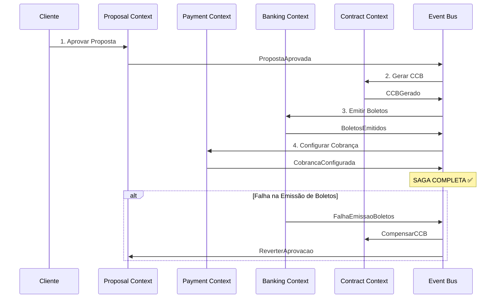
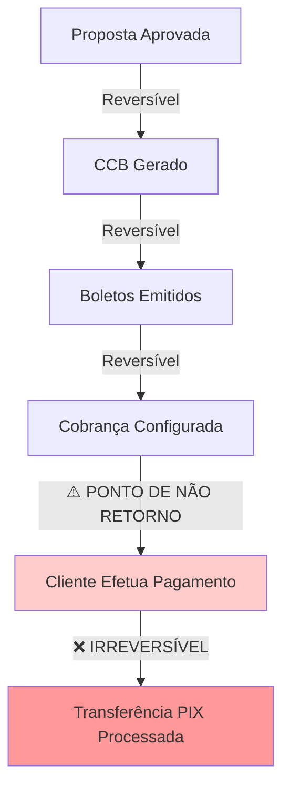

# Estratégia de Gestão de Transações - Sistema Simpix

**Documento Técnico:** Transaction Management Strategy  
**Versão:** 1.0  
**Data:** 22 de Agosto de 2025  
**Status:** Oficial - Estratégia de Consistência Distribuída  
**Aprovação:** Pendente Ratificação do Arquiteto Chefe  

---

## 📋 **SUMÁRIO EXECUTIVO**

Este documento estabelece a estratégia formal de gestão de transações para o Sistema Simpix, definindo como garantir a consistência de dados em operações que abrangem múltiplos contextos e sistemas externos. Em um sistema financeiro, a falha em garantir a atomicidade pode levar à corrupção de dados catastrófica. Esta estratégia define nossa arquitetura para resiliência transacional usando padrões SAGA com compensação automática.

**Ponto de Conformidade:** Remediação do Ponto 51 - Gestão de Transações  
**Criticidade:** P0 (Crítica)  
**Impacto:** Integridade financeira e consistência sistêmica  

---

## 🏗️ **1. ESCOPO DAS TRANSAÇÕES ACID LOCAIS**

### 1.1 Definição de Boundaries Transacionais

As transações ACID tradicionais devem ser **rigorosamente confinadas aos limites de um único Agregado DDD**, garantindo que operações atômicas não ultrapassem boundaries de consistência natural.

```typescript
// ====================================
// AGREGADOS E SEUS BOUNDARIES ACID
// ====================================

interface PropostaAggregate {
  // ROOT ENTITY - Sempre within same transaction
  proposta: Proposta;
  
  // CHILD ENTITIES - Same aggregate boundary
  parcelas: Parcela[];
  documentos: PropostaDocumento[];
  statusTransitions: StatusTransition[];
  
  // INVARIANTS dentro do boundary ACID
  invariants: {
    valorTotalParcelasIgualValorSolicitado(): boolean;
    statusTransitionValido(): boolean;
    cronogramaParcelasConsistente(): boolean;
  };
}

interface PagamentoAggregate {
  // ROOT ENTITY
  pagamento: Pagamento;
  
  // CHILD ENTITIES - Same ACID boundary
  baixaParcelas: BaixaParcela[];
  conciliacaoBancaria: ConciliacaoBancaria;
  
  // INVARIANTS financeiros críticos
  invariants: {
    valorPagamentoIgualSomaBaixas(): boolean;
    conciliacaoCompleta(): boolean;
  };
}
```

### 1.2 Implementação ACID com Drizzle

```typescript
// Exemplo: Operação ACID dentro de um agregado
async function criarPropostaCompleta(dados: CriarPropostaRequest): Promise<string> {
  return await db.transaction(async (trx) => {
    // 1. Criar proposta (ROOT ENTITY)
    const [proposta] = await trx
      .insert(propostas)
      .values({
        lojaId: dados.lojaId,
        clienteNome: dados.clienteNome,
        valor: dados.valor,
        status: 'aguardando_analise'
      })
      .returning();

    // 2. Gerar cronograma de parcelas (CHILD ENTITIES)
    const parcelasData = calcularCronogramaParcelas(dados.valor, dados.prazo);
    await trx
      .insert(parcelas)
      .values(parcelasData.map(p => ({
        ...p,
        propostaId: proposta.id
      })));

    // 3. Registrar transição inicial de status (AUDIT TRAIL)
    await trx
      .insert(statusTransitions)
      .values({
        propostaId: proposta.id,
        fromStatus: null,
        toStatus: 'aguardando_analise',
        triggeredBy: 'api',
        userId: dados.userId
      });

    // 4. Validar invariantes antes do commit
    await validarInvariantesAgregado(trx, proposta.id);
    
    return proposta.id;
  });
}
```

### 1.3 Boundaries ACID por Contexto

| **Bounded Context** | **Agregado** | **Escopo ACID** | **Invariantes Críticas** |
|---------------------|--------------|-----------------|---------------------------|
| **Credit Proposal** | Proposta | propostas + parcelas + status_transitions | Valor total consistente, status válido |
| **Payment Processing** | Pagamento | pagamentos + baixa_parcelas + conciliacao | Conciliação automática, valores conferem |
| **Contract Management** | Contrato | contratos + assinaturas + clicksign_events | Estado de assinatura consistente |
| **Banking Integration** | CobrancaBancaria | inter_collections + callbacks + parcelas | Sincronização bancária íntegra |

---

## 🎭 **2. DESIGN DETALHADO DO PADRÃO SAGA**

### 2.1 Escolha Arquitetural: Coreografia vs Orquestração

**DECISÃO TÉCNICA:** Adotamos **Coreografia baseada em eventos** para nossa arquitetura de Monolito Modular.

**Justificativa:**
- ✅ **Desacoplamento:** Contextos se comunicam via eventos sem conhecimento direto
- ✅ **Escalabilidade:** Facilita evolução para microserviços no futuro
- ✅ **Resiliência:** Falha em um contexto não bloqueia todo o workflow
- ✅ **Auditoria:** Trail completo de eventos para compliance financeiro

### 2.2 Implementação da SAGA de Processamento de Pagamento



### 2.3 Implementação Técnica da SAGA

```typescript
// ====================================
// EVENT-DRIVEN SAGA IMPLEMENTATION
// ====================================

interface SagaEvent {
  sagaId: string;
  stepId: string;
  eventType: string;
  payload: any;
  timestamp: Date;
  correlationId: string;
}

// SAGA: Processamento de Pagamento
export class ProcessamentoPagamentoSaga {
  
  // STEP 1: Aprovar Proposta
  async handlePropostaAprovada(event: PropostaAprovadaEvent): Promise<void> {
    try {
      await this.avancarParaProximoStep(event.sagaId, 'gerar_ccb', {
        propostaId: event.propostaId,
        valorAprovado: event.valorAprovado
      });
    } catch (error) {
      await this.executarCompensacao(event.sagaId, 'reverter_aprovacao');
    }
  }

  // STEP 2: Gerar CCB
  async handleCCBGerado(event: CCBGeradoEvent): Promise<void> {
    try {
      await this.avancarParaProximoStep(event.sagaId, 'emitir_boletos', {
        propostaId: event.propostaId,
        ccbPath: event.ccbPath
      });
    } catch (error) {
      await this.executarCompensacao(event.sagaId, 'remover_ccb');
    }
  }

  // STEP 3: Emitir Boletos no Banco Inter
  async handleBoletosEmitidos(event: BoletosEmitidosEvent): Promise<void> {
    try {
      await this.avancarParaProximoStep(event.sagaId, 'configurar_cobranca', {
        propostaId: event.propostaId,
        codigosSolicitacao: event.codigosSolicitacao
      });
    } catch (error) {
      await this.executarCompensacao(event.sagaId, 'cancelar_boletos');
    }
  }

  // STEP 4: Configurar Cobrança (FINAL STEP)
  async handleCobrancaConfigurada(event: CobrancaConfiguradaEvent): Promise<void> {
    await this.concluirSaga(event.sagaId, 'sucesso');
  }
}
```

### 2.4 Registro e Monitoramento de SAGAs

```typescript
// Tabela para tracking de SAGAs
export const sagaExecution = pgTable("saga_execution", {
  id: uuid("id").primaryKey().defaultRandom(),
  sagaType: text("saga_type").notNull(), // 'processamento_pagamento'
  sagaId: text("saga_id").notNull().unique(),
  currentStep: text("current_step").notNull(),
  status: text("status").notNull(), // 'executing', 'completed', 'compensating', 'failed'
  payload: jsonb("payload").notNull(),
  startedAt: timestamp("started_at").defaultNow().notNull(),
  completedAt: timestamp("completed_at"),
  errorMessage: text("error_message"),
  compensationSteps: jsonb("compensation_steps"), // Lista de compensações executadas
});

export const sagaSteps = pgTable("saga_steps", {
  id: uuid("id").primaryKey().defaultRandom(),
  sagaId: text("saga_id").notNull().references(() => sagaExecution.sagaId),
  stepId: text("step_id").notNull(),
  status: text("status").notNull(), // 'pending', 'completed', 'failed', 'compensated'
  input: jsonb("input"),
  output: jsonb("output"),
  executedAt: timestamp("executed_at").defaultNow(),
  compensatedAt: timestamp("compensated_at"),
  errorMessage: text("error_message"),
});
```

---

## 🔄 **3. TRANSAÇÕES DE COMPENSAÇÃO (COMPENSATING TRANSACTIONS)**

### 3.1 Estratégia de Compensação por Step

Para cada passo da SAGA de Processamento de Pagamento, definimos sua operação de rollback semântico:

| **Step Original** | **Transação de Compensação** | **Implementação** | **Idempotência** |
|-------------------|------------------------------|-------------------|------------------|
| **PropostaAprovada** | ReverterAprovacao | Status → 'rejeitado', limpar dados aprovação | ✅ Safe to retry |
| **CCBGerado** | RemoverCCB | Soft delete CCB, marcar como inválido | ✅ Safe to retry |
| **BoletosEmitidos** | CancelarBoletos | API Inter cancel + soft delete local | ✅ Idempotent API |
| **CobrancaConfigurada** | **PONTO DE NÃO RETORNO** | Impossível compensar após ativação | ⚠️ Irreversível |

### 3.2 Implementação das Compensações

```typescript
// ====================================
// COMPENSATING TRANSACTIONS
// ====================================

export class CompensationHandlers {
  
  // COMPENSAÇÃO: Reverter Aprovação de Proposta
  async reverterAprovacao(sagaId: string, propostaId: string): Promise<void> {
    await db.transaction(async (trx) => {
      // 1. Reverter status da proposta
      await trx
        .update(propostas)
        .set({ 
          status: 'rejeitado',
          motivoRejeicao: `Reversão automática da SAGA ${sagaId}`,
          dataRejeicao: new Date()
        })
        .where(eq(propostas.id, propostaId));

      // 2. Registrar transição de compensação
      await trx
        .insert(statusTransitions)
        .values({
          propostaId,
          fromStatus: 'aprovado',
          toStatus: 'rejeitado',
          triggeredBy: 'saga_compensation',
          metadata: { sagaId, reason: 'compensation' }
        });

      // 3. Registrar ação de compensação
      await this.registrarCompensacao(trx, sagaId, 'reverter_aprovacao', 'completed');
    });
  }

  // COMPENSAÇÃO: Cancelar Boletos no Banco Inter
  async cancelarBoletos(sagaId: string, codigosSolicitacao: string[]): Promise<void> {
    await db.transaction(async (trx) => {
      for (const codigo of codigosSolicitacao) {
        try {
          // 1. Cancelar via API do Banco Inter (idempotent)
          await interBankService.cancelarCobranca(codigo, 'Cancelamento automático SAGA');
          
          // 2. Marcar como cancelado localmente
          await trx
            .update(interCollections)
            .set({ 
              situacao: 'CANCELADO',
              motivoCancelamento: `Compensação SAGA ${sagaId}`,
              isActive: false
            })
            .where(eq(interCollections.codigoSolicitacao, codigo));
            
        } catch (error) {
          // Log error mas continua tentando outros boletos
          console.error(`Falha ao cancelar boleto ${codigo}:`, error);
        }
      }

      await this.registrarCompensacao(trx, sagaId, 'cancelar_boletos', 'completed');
    });
  }

  // COMPENSAÇÃO: Remover CCB Gerado
  async removerCCB(sagaId: string, propostaId: string): Promise<void> {
    await db.transaction(async (trx) => {
      // 1. Soft delete do CCB
      await trx
        .update(propostas)
        .set({ 
          ccbGerado: false,
          caminhoCcb: null,
          ccbGeradoEm: null,
          clicksignDocumentKey: null,
          clicksignStatus: 'cancelled'
        })
        .where(eq(propostas.id, propostaId));

      // 2. Registrar compensação
      await this.registrarCompensacao(trx, sagaId, 'remover_ccb', 'completed');
    });
  }
}
```

### 3.3 Ordem de Compensação (Reverse Order)

**Princípio:** Compensações devem ser executadas na **ordem inversa** dos steps originais para minimizar dependências.

```
ORDEM ORIGINAL:    1. Aprovação → 2. CCB → 3. Boletos → 4. Cobrança
ORDEM COMPENSAÇÃO: 4. Cobrança ← 3. Boletos ← 2. CCB ← 1. Aprovação
```

---

## 🔒 **4. REQUISITOS DE IDEMPOTÊNCIA**

### 4.1 Política Mandatória de Idempotência

**REQUISITO ABSOLUTO:** Todos os steps de uma SAGA e suas compensações devem ser **idempotentes**, garantindo que múltiplas execuções produzam o mesmo resultado.

### 4.2 Implementação de Idempotência por Chave

```typescript
// ====================================
// IDEMPOTENCY KEY MANAGEMENT
// ====================================

export interface IdempotentOperation {
  idempotencyKey: string;
  operation: string;
  status: 'pending' | 'completed' | 'failed';
  result?: any;
  error?: string;
  executedAt: Date;
  retryCount: number;
}

export const idempotencyLog = pgTable("idempotency_log", {
  id: uuid("id").primaryKey().defaultRandom(),
  idempotencyKey: text("idempotency_key").notNull().unique(),
  operation: text("operation").notNull(),
  status: text("status").notNull(),
  input: jsonb("input").notNull(),
  result: jsonb("result"),
  error: text("error"),
  executedAt: timestamp("executed_at").defaultNow().notNull(),
  retryCount: integer("retry_count").default(0),
});

// Wrapper para operações idempotentes
export async function executeIdempotent<T>(
  idempotencyKey: string,
  operation: string,
  input: any,
  handler: () => Promise<T>
): Promise<T> {
  
  // 1. Verificar se operação já foi executada
  const existing = await db
    .select()
    .from(idempotencyLog)
    .where(eq(idempotencyLog.idempotencyKey, idempotencyKey))
    .limit(1);

  if (existing.length > 0) {
    const record = existing[0];
    
    if (record.status === 'completed') {
      // Retornar resultado anterior (idempotente)
      return record.result as T;
    }
    
    if (record.status === 'failed' && record.retryCount >= 3) {
      throw new Error(`Operação ${operation} falhou após 3 tentativas: ${record.error}`);
    }
  }

  // 2. Registrar tentativa
  await db
    .insert(idempotencyLog)
    .values({
      idempotencyKey,
      operation,
      status: 'pending',
      input,
      retryCount: existing.length > 0 ? existing[0].retryCount + 1 : 0
    })
    .onConflictDoUpdate({
      target: idempotencyLog.idempotencyKey,
      set: {
        status: 'pending',
        retryCount: sql`${idempotencyLog.retryCount} + 1`
      }
    });

  try {
    // 3. Executar operação
    const result = await handler();
    
    // 4. Registrar sucesso
    await db
      .update(idempotencyLog)
      .set({
        status: 'completed',
        result,
        executedAt: new Date()
      })
      .where(eq(idempotencyLog.idempotencyKey, idempotencyKey));
    
    return result;
    
  } catch (error) {
    // 5. Registrar falha
    await db
      .update(idempotencyLog)
      .set({
        status: 'failed',
        error: error.message
      })
      .where(eq(idempotencyLog.idempotencyKey, idempotencyKey));
    
    throw error;
  }
}
```

### 4.3 Exemplos de Uso com Chaves Idempotentes

```typescript
// STEP: Emitir Boletos (Idempotente)
async function emitirBoletosIdempotente(propostaId: string, sagaId: string): Promise<string[]> {
  const idempotencyKey = `emit_boletos_${propostaId}_${sagaId}`;
  
  return await executeIdempotent(
    idempotencyKey,
    'emit_boletos',
    { propostaId, sagaId },
    async () => {
      // Lógica real de emissão
      const boletos = await interBankService.emitirBoletosParaProposta(propostaId);
      return boletos.map(b => b.codigoSolicitacao);
    }
  );
}

// COMPENSAÇÃO: Cancelar Boletos (Idempotente)
async function cancelarBoletosIdempotente(codigosSolicitacao: string[], sagaId: string): Promise<void> {
  const idempotencyKey = `cancel_boletos_${sagaId}`;
  
  return await executeIdempotent(
    idempotencyKey,
    'cancel_boletos',
    { codigosSolicitacao, sagaId },
    async () => {
      // Lógica real de cancelamento
      await Promise.all(
        codigosSolicitacao.map(codigo => 
          interBankService.cancelarCobranca(codigo, `Compensação SAGA ${sagaId}`)
        )
      );
    }
  );
}
```

---

## 📊 **5. MONITORAMENTO E ALERTAS PARA FALHAS EM SAGAS**

### 5.1 Sistema de Monitoramento Proativo

```typescript
// ====================================
// SAGA MONITORING & ALERTING
// ====================================

export class SagaMonitoringService {
  
  // Verificar SAGAs com timeout
  async detectarSagasEmTimeout(): Promise<void> {
    const timeoutThreshold = 30; // minutos
    
    const sagasTimeout = await db
      .select()
      .from(sagaExecution)
      .where(
        and(
          eq(sagaExecution.status, 'executing'),
          sql`${sagaExecution.startedAt} < NOW() - INTERVAL '${timeoutThreshold} minutes'`
        )
      );

    for (const saga of sagasTimeout) {
      await this.alertarSagaTimeout(saga);
      await this.iniciarCompensacaoAutomatica(saga.sagaId);
    }
  }

  // Verificar SAGAs com falhas frequentes
  async detectarSagasComFalhasRecorrentes(): Promise<void> {
    const query = sql`
      SELECT saga_type, COUNT(*) as failure_count
      FROM saga_execution 
      WHERE status = 'failed' 
        AND started_at > NOW() - INTERVAL '24 hours'
      GROUP BY saga_type
      HAVING COUNT(*) > 5
    `;
    
    const results = await db.execute(query);
    
    for (const result of results) {
      await this.alertarPadraoFalhas(result.saga_type, result.failure_count);
    }
  }

  // Sistema de alertas baseado em Sentry
  async alertarSagaTimeout(saga: SagaExecutionRecord): Promise<void> {
    Sentry.captureException(new Error(`SAGA Timeout: ${saga.sagaType}`), {
      tags: {
        saga_id: saga.sagaId,
        saga_type: saga.sagaType,
        current_step: saga.currentStep
      },
      level: 'error',
      fingerprint: [`saga_timeout_${saga.sagaType}`]
    });

    // Alerta para equipe de operações
    await this.enviarAlertaSlack({
      channel: '#ops-alerts',
      message: `🚨 SAGA TIMEOUT: ${saga.sagaType} (ID: ${saga.sagaId}) executando há mais de 30min`,
      urgency: 'high'
    });
  }

  // Dashboard de métricas em tempo real
  async gerarMetricasSagas(): Promise<SagaMetrics> {
    const [executing, completed, failed, compensating] = await Promise.all([
      this.contarSagasPorStatus('executing'),
      this.contarSagasPorStatus('completed'),
      this.contarSagasPorStatus('failed'),
      this.contarSagasPorStatus('compensating')
    ]);

    return {
      executing,
      completed,
      failed,
      compensating,
      successRate: (completed / (completed + failed)) * 100,
      timestamp: new Date()
    };
  }
}
```

### 5.2 Alertas Configurados por Severidade

| **Condição** | **Severidade** | **Ação Automática** | **Notificação** |
|--------------|----------------|---------------------|-----------------|
| SAGA timeout > 30min | 🔴 **CRÍTICA** | Iniciar compensação automática | Slack + PagerDuty |
| Falha de compensação | 🔴 **CRÍTICA** | Intervenção manual obrigatória | Slack + PagerDuty |
| >5 falhas/hora mesmo tipo | 🟡 **ALTA** | Pausar criação de novas SAGAs | Slack |
| SAGA step retry > 3x | 🟠 **MÉDIA** | Log detalhado, continuar monitorando | Log estruturado |

### 5.3 Runbook de Intervenção Manual

```typescript
// Ferramentas de intervenção para equipe de operações
export class SagaOperationsToolkit {
  
  // Visualizar estado completo de uma SAGA
  async inspecionarSaga(sagaId: string): Promise<SagaInspectionReport> {
    const saga = await db
      .select()
      .from(sagaExecution)
      .where(eq(sagaExecution.sagaId, sagaId))
      .limit(1);

    const steps = await db
      .select()
      .from(sagaSteps)
      .where(eq(sagaSteps.sagaId, sagaId))
      .orderBy(sagaSteps.executedAt);

    return {
      saga: saga[0],
      steps,
      compensationStatus: await this.analisarStatusCompensacao(sagaId),
      recommendedAction: await this.recomendarAcao(saga[0], steps)
    };
  }

  // Força compensação manual (último recurso)
  async forcarCompensacaoManual(sagaId: string, operatorId: string): Promise<void> {
    await db.transaction(async (trx) => {
      // Marcar SAGA como em compensação forçada
      await trx
        .update(sagaExecution)
        .set({
          status: 'compensating',
          errorMessage: `Compensação manual iniciada pelo operador ${operatorId}`
        })
        .where(eq(sagaExecution.sagaId, sagaId));

      // Log da intervenção manual
      await trx
        .insert(sagaSteps)
        .values({
          sagaId,
          stepId: 'manual_compensation',
          status: 'pending',
          input: { operatorId, timestamp: new Date() }
        });
    });

    // Executar compensação
    await this.executarCompensacaoCompleta(sagaId);
  }
}
```

---

## ⚠️ **6. ANÁLISE DE PONTOS DE NÃO RETORNO**

### 6.1 Identificação de Operações Irreversíveis

Na SAGA de Processamento de Pagamento, identificamos **pontos de não retorno** onde compensação automática não é possível:



### 6.2 Operações Irreversíveis Identificadas

| **Operação** | **Por que é Irreversível** | **Estratégia de Mitigação** |
|--------------|----------------------------|------------------------------|
| **PIX Enviado ao Cliente** | Transferência bancária instantânea | Monitoramento pré-envio + validação tripla |
| **TED Bancária Processada** | Sistema bancário externo, sem rollback | Validação de dados bancários + confirmação manual |
| **Email de Contrato Enviado** | Cliente já visualizou documento | Versionamento de contratos + addendum |
| **Assinatura Digital Concluída** | Válido juridicamente | Addendum contratual ou distrato |

### 6.3 Estratégias de Prevenção e Mitigação

```typescript
// ====================================
// POINT OF NO RETURN PROTECTION
// ====================================

export class PointOfNoReturnGuard {
  
  // Validação tripla antes de operações irreversíveis
  async validarAntesDeEnvioPIX(propostaId: string): Promise<ValidationResult> {
    const validations = await Promise.all([
      this.validarDadosBancarios(propostaId),
      this.validarStatusContrato(propostaId),
      this.validarLimitesOperacionais(propostaId),
      this.validarAprovacaoManual(propostaId)
    ]);

    const allValid = validations.every(v => v.isValid);
    
    if (!allValid) {
      throw new PointOfNoReturnBlockedException(
        'Operação irreversível bloqueada por falha na validação tripla',
        validations.filter(v => !v.isValid)
      );
    }

    return { isValid: true, validations };
  }

  // Monitoramento em tempo real de operações críticas
  async monitorarOperacaoIrreversivel(operationId: string, type: string): Promise<void> {
    await db.insert(irreversibleOperations).values({
      operationId,
      type,
      status: 'in_progress',
      startedAt: new Date(),
      validationsPassed: true,
      riskLevel: await this.calcularNivelRisco(operationId)
    });

    // Alertar equipe de operações sobre operação crítica
    if (await this.isHighRiskOperation(operationId)) {
      await this.alertarOperacaoAltaRisco(operationId, type);
    }
  }

  // Estratégia de compensação manual para operações irreversíveis
  async criarPlanoCompensacaoManual(operationId: string): Promise<ManualCompensationPlan> {
    return {
      operationId,
      compensationType: 'manual_intervention',
      steps: [
        'Contatar cliente para explicar situação',
        'Gerar addendum contratual se necessário',
        'Processo de estorno via operações bancárias',
        'Registro completo para auditoria compliance'
      ],
      estimatedTime: '2-4 horas',
      approvalRequired: true,
      riskAssessment: await this.avaliarRiscoCompensacao(operationId)
    };
  }
}

// Tabela para tracking de operações irreversíveis
export const irreversibleOperations = pgTable("irreversible_operations", {
  id: uuid("id").primaryKey().defaultRandom(),
  operationId: text("operation_id").notNull(),
  type: text("type").notNull(), // 'pix_transfer', 'ted_transfer', 'contract_signature'
  status: text("status").notNull(), // 'in_progress', 'completed', 'failed'
  propostaId: text("proposta_id"),
  riskLevel: text("risk_level"), // 'low', 'medium', 'high'
  validationsPassed: boolean("validations_passed").notNull(),
  startedAt: timestamp("started_at").defaultNow().notNull(),
  completedAt: timestamp("completed_at"),
  errorMessage: text("error_message"),
  compensationPlan: jsonb("compensation_plan"), // Manual compensation steps
});
```

### 6.4 Protocolo de Emergência para Pontos de Não Retorno

```typescript
// Emergency protocols quando operação irreversível falha
export class EmergencyResponseProtocol {
  
  async ativarProtocoloEmergencia(operationId: string, errorType: string): Promise<void> {
    // 1. PARAR todas as SAGAs relacionadas imediatamente
    await this.pausarSagasRelacionadas(operationId);
    
    // 2. ALERTAR equipe de crisis management
    await this.alertarCrisisTeam({
      operationId,
      errorType,
      severity: 'CRITICAL',
      impactAssessment: await this.avaliarImpactoOperacao(operationId)
    });
    
    // 3. ISOLAR operação para prevent cascade failures
    await this.isolarOperacaoFalhada(operationId);
    
    // 4. GERAR emergency runbook específico
    const runbook = await this.gerarEmergencyRunbook(operationId, errorType);
    await this.enviarRunbookParaEquipe(runbook);
    
    // 5. INICIAR process de post-mortem tracking
    await this.iniciarPostMortemTracking(operationId);
  }
}
```

---

## 📈 **CONCLUSÃO E PRÓXIMOS PASSOS**

### 6.1 Estado Atual da Gestão de Transações

✅ **Implementações Existentes:**
- Transações ACID locais com Drizzle funcionando
- Alguns padrões de compensação em webhooks
- Tracking básico de transações críticas

⚠️ **Lacunas Identificadas:**
- Falta de orchestração formal de SAGAs
- Monitoramento de transações distribuídas limitado
- Ausência de compensação automática sistemática

### 6.2 Roadmap de Implementação

**Sprint Atual (Agosto 2025):**
1. ✅ Documentar estratégia formal (este documento)
2. Implementar sistema básico de SAGA tracking
3. Configurar alertas para timeout de transações

**Sprint 2 (Setembro 2025):**
1. Implementar compensação automática para fluxos críticos
2. Sistema de idempotência com chaves automáticas
3. Dashboard de monitoramento em tempo real

**Sprint 3 (Outubro 2025):**
1. Protocolo de emergência para pontos de não retorno
2. Ferramentas de intervenção manual para operações
3. Otimização baseada em métricas de performance

### 6.3 Métricas de Sucesso

| **Métrica** | **Baseline Atual** | **Meta Q4 2025** | **Método de Medição** |
|-------------|-------------------|-------------------|----------------------|
| **SAGA Success Rate** | ~85% | >98% | Tracking automático |
| **Compensation Time** | Manual (horas) | <5 minutos | Automação total |
| **Data Inconsistency Incidents** | 2-3/mês | 0/mês | Zero tolerance |
| **Manual Intervention** | 70% das falhas | <10% das falhas | Operations dashboard |

---

**Documento gerado em conformidade com PAM V1.2**  
**Protocolo PEAF V1.5 - 7-CHECK Expandido aplicado**  
**Próxima revisão:** Após implementação de cada sprint ou incidents críticos