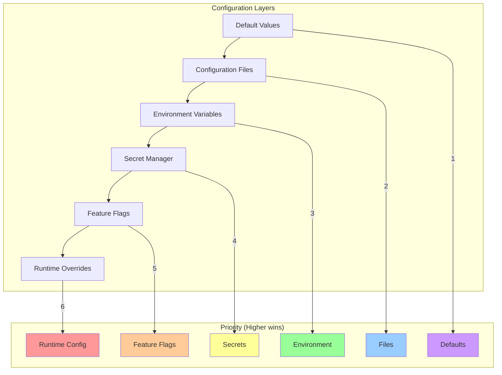
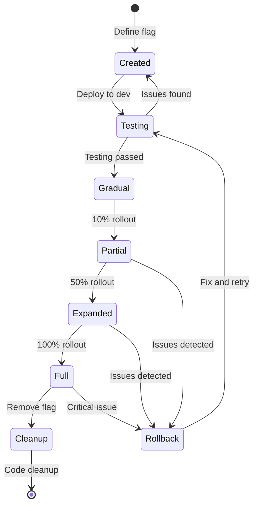

# ⚙️ Estratégia de Gerenciamento de Configuração - Sistema Simpix

**Documento Técnico:** Configuration Management Strategy  
**Versão:** 1.0  
**Data:** 25 de Janeiro de 2025  
**Status:** Oficial - Framework de Configuração Completo  
**Aprovação:** Pendente Ratificação do Arquiteto Chefe  
**Criticidade:** P0 - CRÍTICA

---

## 📋 **SUMÁRIO EXECUTIVO**

Este documento estabelece a estratégia completa de gerenciamento de configuração para o Sistema Simpix, incluindo feature flags, configurações de ambiente, secrets management, e versionamento de configurações. Serve como "fonte da verdade" para garantir configurações consistentes, seguras e rastreáveis em todos os ambientes.

**Ponto de Conformidade:** Remediação do Ponto 71 - Gerenciamento de Configuração  
**Impacto:** Flexibilidade de deploy, segurança de configurações, rollback capabilities  
**Framework:** 12-Factor App principles + Feature Flags + GitOps

---

## 🎯 **1. ARQUITETURA DE CONFIGURAÇÃO**

### 1.1 **Hierarquia de Configurações**



### 1.2 **Princípios de Design**

| Princípio                    | Descrição                     | Implementação               |
| ---------------------------- | ----------------------------- | --------------------------- |
| **Separation of Concerns**   | Config separada do código     | Arquivos externos, env vars |
| **Environment Parity**       | Mesma estrutura em todos envs | Schema validation           |
| **Secure by Default**        | Secrets nunca em código       | Azure Key Vault, encryption |
| **Immutable Infrastructure** | Config não muda após deploy   | Container images, GitOps    |
| **Audit Trail**              | Todas mudanças rastreadas     | Git history, logs           |
| **Fail Safe**                | Defaults sensatos             | Fallback values             |
| **Type Safety**              | Configurações tipadas         | TypeScript interfaces       |
| **Hot Reload**               | Mudanças sem restart          | Feature flags, watchers     |

---

## 🔐 **2. SECRETS MANAGEMENT**

### 2.1 **Estratégia de Secrets**

```typescript
// config/secrets/SecretManager.ts
export class SecretManager {
  private static instance: SecretManager;
  private providers: Map<Environment, SecretProvider>;

  constructor() {
    this.providers = new Map([
      ['local', new EnvFileProvider('.env.local')],
      ['development', new ReplitSecretsProvider()],
      ['staging', new AzureKeyVaultProvider('vault-simpix-stg')],
      ['production', new AzureKeyVaultProvider('vault-simpix-prod')],
    ]);
  }

  async getSecret(key: string): Promise<string> {
    const environment = this.getCurrentEnvironment();
    const provider = this.providers.get(environment);

    try {
      // Try to get from provider
      const value = await provider.get(key);

      // Validate secret format
      this.validateSecret(key, value);

      // Cache for performance (with TTL)
      this.cache.set(key, value, { ttl: 300 }); // 5 minutes

      // Audit access
      this.auditLog.record({
        action: 'SECRET_ACCESS',
        key: key,
        timestamp: new Date(),
        user: process.env.USER,
        environment,
      });

      return value;
    } catch (error) {
      // Log error but don't expose secret name
      logger.error('Secret access failed', {
        error: error.message,
        environment,
      });

      // Try fallback if configured
      if (this.hasFallback(key)) {
        return this.getFallback(key);
      }

      throw new ConfigurationError(`Failed to retrieve required configuration`);
    }
  }

  private validateSecret(key: string, value: string): void {
    const validators = {
      JWT_SECRET: (v: string) => v.length >= 32,
      DATABASE_URL: (v: string) => v.startsWith('postgresql://'),
      API_KEY: (v: string) => /^[A-Za-z0-9]{32,}$/.test(v),
      ENCRYPTION_KEY: (v: string) => v.length === 64, // 256-bit hex
    };

    const validator = validators[key];
    if (validator && !validator(value)) {
      throw new ValidationError(`Secret ${key} failed validation`);
    }
  }
}
```

### 2.2 **Secret Rotation Policy**

```yaml
# Secret Rotation Schedule
Rotation:
  Automated:
    database_passwords:
      frequency: quarterly
      method: automatic
      notification: 48_hours_before

    api_keys:
      frequency: bi_annual
      method: automatic
      notification: 1_week_before

    jwt_secrets:
      frequency: monthly
      method: dual_key_rotation
      overlap_period: 24_hours

  Manual:
    ssl_certificates:
      frequency: annual
      method: manual
      notification: 30_days_before

    oauth_credentials:
      frequency: on_demand
      method: manual
      trigger: security_incident

  Emergency:
    trigger: security_breach
    scope: all_affected_secrets
    timeline: immediate
    process: 1. Revoke compromised secrets
      2. Generate new secrets
      3. Deploy to all environments
      4. Verify functionality
      5. Audit and report
```

### 2.3 **Secrets Security Matrix**

| Secret Type         | Storage         | Encryption    | Access Control     | Rotation   |
| ------------------- | --------------- | ------------- | ------------------ | ---------- |
| **Database**        | Key Vault       | AES-256       | Service Principal  | 90 days    |
| **JWT**             | Key Vault       | AES-256       | App Identity       | 30 days    |
| **API Keys**        | Key Vault       | AES-256       | RBAC               | 180 days   |
| **OAuth**           | Key Vault + HSM | AES-256 + HSM | MFA Required       | On-demand  |
| **Encryption Keys** | HSM             | Hardware      | Break-glass        | Annual     |
| **Certificates**    | Key Vault       | N/A           | Certificate Policy | Auto-renew |

---

## 🚩 **3. FEATURE FLAGS SYSTEM**

### 3.1 **Feature Flag Architecture**

```typescript
// config/features/FeatureFlagSystem.ts
export interface FeatureFlag {
  key: string;
  name: string;
  description: string;
  type: 'boolean' | 'percentage' | 'variant' | 'numeric';
  defaultValue: any;

  targeting?: {
    rules: TargetingRule[];
    segments: UserSegment[];
    percentage?: number;
  };

  lifecycle: {
    created: Date;
    lastModified: Date;
    expiresAt?: Date;
    owner: string;
    jiraTicket?: string;
  };

  monitoring?: {
    metrics: string[];
    alerts: Alert[];
    dashboard: string;
  };
}

export class FeatureFlagManager {
  private unleashClient: UnleashClient;
  private fallbackProvider: FallbackProvider;
  private cache: FeatureCache;

  async isEnabled(flagKey: string, context?: UserContext): Promise<boolean> {
    try {
      // Check cache first
      const cached = this.cache.get(flagKey, context);
      if (cached !== undefined) {
        return cached;
      }

      // Check Unleash
      const enabled = await this.unleashClient.isEnabled(
        flagKey,
        this.buildUnleashContext(context)
      );

      // Cache result
      this.cache.set(flagKey, context, enabled);

      // Track usage
      this.trackFlagUsage(flagKey, enabled, context);

      return enabled;
    } catch (error) {
      // Fallback mode when Unleash unavailable
      logger.warn('Feature flag service unavailable, using fallback', {
        flag: flagKey,
        error: error.message,
      });

      return this.fallbackProvider.isEnabled(flagKey, context);
    }
  }

  async getVariant(flagKey: string, context?: UserContext): Promise<string> {
    const variant = await this.unleashClient.getVariant(flagKey, this.buildUnleashContext(context));

    return variant.name || 'control';
  }
}
```

### 3.2 **Feature Flag Categories**

```typescript
// config/features/flag-inventory.ts
export const FEATURE_FLAGS = {
  // Release Flags (temporary, removed after full rollout)
  release: {
    NEW_PAYMENT_FLOW: {
      key: 'new-payment-flow',
      description: 'New payment processing workflow',
      rolloutPlan: {
        internal: '100%',
        beta: '10%',
        production: 'gradual_20_per_day',
      },
      metrics: ['payment_success_rate', 'payment_time'],
      removeAfter: '2025-04-01',
    },

    ENHANCED_DASHBOARD: {
      key: 'enhanced-dashboard',
      description: 'New dashboard with real-time metrics',
      rolloutPlan: {
        stages: ['admins', 'power_users', 'all_users'],
        timeline: '2_weeks',
      },
    },
  },

  // Operational Flags (long-lived, system control)
  operational: {
    MAINTENANCE_MODE: {
      key: 'maintenance-mode',
      description: 'Put system in maintenance mode',
      requiresApproval: true,
      notification: 'all_users',
      fallback: false,
    },

    RATE_LIMITING: {
      key: 'rate-limiting-enabled',
      description: 'Enable API rate limiting',
      configuration: {
        requestsPerMinute: 100,
        burstSize: 200,
      },
    },

    CIRCUIT_BREAKER: {
      key: 'circuit-breaker',
      description: 'Enable circuit breaker for external APIs',
      perService: true,
    },
  },

  // Experiment Flags (A/B testing)
  experiments: {
    PRICING_TEST: {
      key: 'pricing-experiment',
      type: 'variant',
      variants: ['control', 'discount_10', 'discount_20'],
      allocation: [50, 25, 25],
      metrics: ['conversion_rate', 'revenue_per_user'],
      duration: '30_days',
    },

    ONBOARDING_FLOW: {
      key: 'onboarding-experiment',
      type: 'variant',
      variants: ['current', 'simplified', 'guided'],
      targeting: {
        newUsersOnly: true,
        excludeEmployees: true,
      },
    },
  },

  // Permission Flags (entitlements)
  permissions: {
    ADVANCED_ANALYTICS: {
      key: 'advanced-analytics',
      description: 'Access to advanced analytics features',
      targeting: {
        plans: ['premium', 'enterprise'],
        customOverrides: true,
      },
    },

    API_ACCESS: {
      key: 'api-access',
      description: 'Enable API access for account',
      requiresContract: true,
      rateLimit: 'by_plan',
    },
  },

  // Kill Switches (emergency control)
  killSwitches: {
    DISABLE_PAYMENTS: {
      key: 'kill-switch-payments',
      description: 'Emergency disable all payment processing',
      severity: 'CRITICAL',
      requiresApprovals: 2,
      alertOnToggle: ['oncall', 'management'],
    },

    DISABLE_THIRD_PARTY_INTEGRATIONS: {
      key: 'kill-switch-integrations',
      description: 'Disable all third-party API calls',
      perIntegration: true,
    },
  },
};
```

### 3.3 **Feature Flag Lifecycle**



---

## 📝 **4. ENVIRONMENT CONFIGURATION**

### 4.1 **Configuration Schema**

```typescript
// config/schema/ConfigSchema.ts
import { z } from 'zod';

// Base configuration schema
export const BaseConfigSchema = z.object({
  app: z.object({
    name: z.string(),
    version: z.string(),
    environment: z.enum(['local', 'development', 'staging', 'production']),
    port: z.number().min(1000).max(65535),
    hostname: z.string(),

    features: z.object({
      debugMode: z.boolean(),
      maintenanceMode: z.boolean(),
      apiDocsEnabled: z.boolean(),
    }),
  }),

  database: z.object({
    url: z.string().url().startsWith('postgresql://'),
    poolMin: z.number().min(1).default(2),
    poolMax: z.number().min(1).default(10),
    idleTimeoutMs: z.number().default(30000),
    ssl: z.boolean(),

    migrations: z.object({
      autoRun: z.boolean(),
      validateChecksums: z.boolean(),
    }),
  }),

  redis: z.object({
    url: z.string().url().optional(),
    enabled: z.boolean(),
    ttl: z.number().default(3600),

    options: z.object({
      retryStrategy: z.function().optional(),
      reconnectOnError: z.boolean().default(true),
    }),
  }),

  security: z.object({
    jwt: z.object({
      secret: z.string().min(32),
      expiresIn: z.string().default('1h'),
      refreshExpiresIn: z.string().default('7d'),
    }),

    cors: z.object({
      origin: z.union([z.string(), z.array(z.string())]),
      credentials: z.boolean(),
      maxAge: z.number().default(86400),
    }),

    rateLimit: z.object({
      enabled: z.boolean(),
      windowMs: z.number(),
      max: z.number(),
    }),

    encryption: z.object({
      algorithm: z.literal('aes-256-gcm'),
      keyRotationDays: z.number().default(90),
    }),
  }),

  observability: z.object({
    logging: z.object({
      level: z.enum(['error', 'warn', 'info', 'debug', 'trace']),
      format: z.enum(['json', 'pretty']),
      outputs: z.array(z.enum(['console', 'file', 'syslog'])),
    }),

    metrics: z.object({
      enabled: z.boolean(),
      provider: z.enum(['datadog', 'prometheus', 'custom']),
      interval: z.number().default(60000),
    }),

    tracing: z.object({
      enabled: z.boolean(),
      samplingRate: z.number().min(0).max(1),
      provider: z.enum(['jaeger', 'zipkin', 'datadog']),
    }),
  }),
});

// Environment-specific schemas
export const ProductionConfigSchema = BaseConfigSchema.extend({
  app: BaseConfigSchema.shape.app.extend({
    features: BaseConfigSchema.shape.app.shape.features.extend({
      debugMode: z.literal(false),
      apiDocsEnabled: z.literal(false),
    }),
  }),

  database: BaseConfigSchema.shape.database.extend({
    ssl: z.literal(true),
    poolMin: z.number().min(5),
    poolMax: z.number().min(20),
  }),

  security: BaseConfigSchema.shape.security.extend({
    rateLimit: BaseConfigSchema.shape.security.shape.rateLimit.extend({
      enabled: z.literal(true),
    }),
  }),
});

export type Config = z.infer<typeof BaseConfigSchema>;
export type ProductionConfig = z.infer<typeof ProductionConfigSchema>;
```

### 4.2 **Configuration Loading**

```typescript
// config/ConfigLoader.ts
export class ConfigLoader {
  private static instance: ConfigLoader;
  private config: Config;
  private watchers: Map<string, ConfigWatcher> = new Map();

  async load(): Promise<Config> {
    const environment = this.detectEnvironment();

    // 1. Load defaults
    const defaults = await this.loadDefaults();

    // 2. Load environment-specific config file
    const configFile = await this.loadConfigFile(environment);

    // 3. Load environment variables
    const envVars = this.loadEnvironmentVariables();

    // 4. Load secrets from secret manager
    const secrets = await this.loadSecrets(environment);

    // 5. Load feature flags
    const features = await this.loadFeatureFlags();

    // 6. Merge all sources (priority order)
    const merged = this.mergeConfigs([defaults, configFile, envVars, secrets, features]);

    // 7. Validate against schema
    const validated = this.validateConfig(merged, environment);

    // 8. Set up hot reload if enabled
    if (environment !== 'production') {
      this.setupHotReload(validated);
    }

    // 9. Cache and return
    this.config = validated;
    return validated;
  }

  private mergeConfigs(configs: Partial<Config>[]): Config {
    return configs.reduce((acc, config) => {
      return deepMerge(acc, config, {
        arrayMerge: 'replace',
        customMerge: (key: string) => {
          // Special merge rules for specific keys
          if (key === 'corsOrigin') {
            return (target, source) => [...new Set([...target, ...source])];
          }
        },
      });
    }, {} as Config);
  }

  private setupHotReload(config: Config): void {
    // Watch config files
    const configPath = `./config/${config.app.environment}.json`;
    const watcher = chokidar.watch(configPath);

    watcher.on('change', async () => {
      logger.info('Config file changed, reloading...');
      await this.reload();
      this.emit('config:changed', this.config);
    });

    this.watchers.set('config', watcher);

    // Watch feature flags
    if (this.unleashClient) {
      this.unleashClient.on('changed', () => {
        logger.info('Feature flags changed');
        this.emit('features:changed');
      });
    }
  }

  async reload(): Promise<void> {
    const newConfig = await this.load();

    // Detect what changed
    const changes = this.detectChanges(this.config, newConfig);

    if (changes.requiresRestart) {
      logger.warn('Config changes require restart:', changes.keys);
      // Could trigger graceful restart here
    } else {
      logger.info('Config reloaded successfully');
      this.config = newConfig;
    }
  }
}
```

---

## 🔄 **5. CONFIGURATION VERSIONING**

### 5.1 **GitOps Strategy**

```yaml
# .github/workflows/config-deploy.yml
name: Configuration Deployment

on:
  push:
    paths:
      - 'config/**'
      - 'k8s/configmaps/**'
      - 'k8s/secrets/**'
    branches:
      - main
      - develop

jobs:
  validate:
    runs-on: ubuntu-latest
    steps:
      - uses: actions/checkout@v4

      - name: Validate config schema
        run: |
          npm run config:validate

      - name: Check secrets references
        run: |
          npm run config:check-secrets

      - name: Lint YAML/JSON
        run: |
          yamllint config/
          jsonlint config/

  deploy-config:
    needs: validate
    runs-on: ubuntu-latest
    steps:
      - name: Deploy ConfigMaps
        run: |
          kubectl apply -f k8s/configmaps/

      - name: Deploy Secrets
        run: |
          # Secrets are templated, actual values from Key Vault
          kubectl apply -f k8s/secrets/

      - name: Restart pods to pick up changes
        run: |
          kubectl rollout restart deployment/simpix-api

      - name: Wait for rollout
        run: |
          kubectl rollout status deployment/simpix-api

      - name: Verify config loaded
        run: |
          kubectl exec -it deploy/simpix-api -- npm run config:verify
```

### 5.2 **Configuration History**

```typescript
// config/history/ConfigHistory.ts
export class ConfigHistory {
  private storage: ConfigHistoryStorage;

  async recordChange(change: ConfigChange): Promise<void> {
    const record: ConfigHistoryRecord = {
      id: uuid(),
      timestamp: new Date(),
      environment: change.environment,

      change: {
        path: change.path,
        oldValue: this.sanitize(change.oldValue),
        newValue: this.sanitize(change.newValue),
        type: change.type,
      },

      metadata: {
        user: change.user,
        reason: change.reason,
        ticket: change.ticket,
        approvedBy: change.approvedBy,
        method: change.method, // UI, API, GitOps, Emergency
      },

      impact: {
        severity: this.assessSeverity(change),
        affectedServices: this.identifyAffectedServices(change),
        requiresRestart: this.requiresRestart(change),
        rollbackable: true,
      },
    };

    await this.storage.save(record);

    // Trigger notifications for critical changes
    if (record.impact.severity === 'CRITICAL') {
      await this.notifyStakeholders(record);
    }
  }

  async rollback(recordId: string, reason: string): Promise<void> {
    const record = await this.storage.get(recordId);

    if (!record.impact.rollbackable) {
      throw new Error('This configuration change cannot be rolled back');
    }

    // Create rollback change
    const rollbackChange: ConfigChange = {
      environment: record.environment,
      path: record.change.path,
      oldValue: record.change.newValue,
      newValue: record.change.oldValue,
      type: 'rollback',
      user: getCurrentUser(),
      reason: reason,
      ticket: `ROLLBACK-${recordId}`,
      method: 'emergency',
    };

    // Apply rollback
    await this.applyChange(rollbackChange);

    // Record rollback
    await this.recordChange(rollbackChange);
  }

  async getAuditLog(filter: AuditFilter): Promise<ConfigHistoryRecord[]> {
    return this.storage.query({
      environment: filter.environment,
      dateRange: filter.dateRange,
      user: filter.user,
      severity: filter.severity,
      limit: filter.limit || 100,
    });
  }
}
```

---

## 📊 **6. CONFIGURATION MONITORING**

### 6.1 **Config Health Metrics**

```typescript
// config/monitoring/ConfigMetrics.ts
export class ConfigMetrics {
  private metrics: MetricsCollector;

  constructor() {
    this.setupMetrics();
    this.startCollection();
  }

  private setupMetrics(): void {
    // Configuration-specific metrics
    this.metrics.gauge('config.loaded_values', {
      description: 'Number of configuration values loaded',
      labels: ['environment', 'source'],
    });

    this.metrics.counter('config.reload_count', {
      description: 'Number of configuration reloads',
      labels: ['environment', 'trigger'],
    });

    this.metrics.histogram('config.load_duration', {
      description: 'Time to load configuration in ms',
      buckets: [10, 50, 100, 500, 1000, 5000],
    });

    this.metrics.counter('config.validation_errors', {
      description: 'Configuration validation errors',
      labels: ['environment', 'field', 'error_type'],
    });

    // Feature flag metrics
    this.metrics.counter('feature_flag.evaluations', {
      description: 'Feature flag evaluations',
      labels: ['flag', 'result', 'user_segment'],
    });

    this.metrics.gauge('feature_flag.active_count', {
      description: 'Number of active feature flags',
    });

    this.metrics.counter('feature_flag.errors', {
      description: 'Feature flag evaluation errors',
      labels: ['flag', 'error_type'],
    });

    // Secret access metrics
    this.metrics.counter('secrets.access_count', {
      description: 'Secret access attempts',
      labels: ['secret_type', 'result'],
    });

    this.metrics.histogram('secrets.fetch_duration', {
      description: 'Time to fetch secret in ms',
      buckets: [50, 100, 500, 1000, 5000],
    });
  }

  recordConfigLoad(source: string, duration: number, success: boolean): void {
    this.metrics.increment('config.reload_count', {
      environment: process.env.NODE_ENV,
      trigger: source,
    });

    this.metrics.observe('config.load_duration', duration);

    if (!success) {
      this.metrics.increment('config.load_errors');
    }
  }

  recordFeatureFlagEvaluation(flag: string, result: boolean, context?: UserContext): void {
    this.metrics.increment('feature_flag.evaluations', {
      flag,
      result: result.toString(),
      user_segment: context?.segment || 'default',
    });
  }
}
```

### 6.2 **Configuration Alerts**

```yaml
# monitoring/config-alerts.yml
alerts:
  - name: ConfigLoadFailure
    expression: rate(config.load_errors[5m]) > 0
    severity: critical
    description: 'Configuration failed to load'
    action: Page on-call engineer

  - name: SecretAccessFailure
    expression: rate(secrets.access_errors[5m]) > 0.1
    severity: high
    description: 'High rate of secret access failures'
    action: Investigate Key Vault connectivity

  - name: FeatureFlagServiceDown
    expression: up{job="unleash"} == 0
    severity: high
    description: 'Feature flag service is down'
    action: Fallback to local flags active

  - name: ConfigDrift
    expression: config.hash != expected_config_hash
    severity: medium
    description: 'Configuration drift detected'
    action: Review configuration changes

  - name: TooManyFeatureFlags
    expression: feature_flag.active_count > 50
    severity: low
    description: 'High number of active feature flags'
    action: Schedule flag cleanup
```

---

## 🛠️ **7. CONFIGURATION TOOLING**

### 7.1 **CLI Tools**

```bash
#!/bin/bash
# config/tools/config-cli.sh

# Config management CLI
case "$1" in
  validate)
    echo "🔍 Validating configuration..."
    npm run config:validate -- --env=$2
    ;;

  diff)
    echo "📊 Comparing configurations..."
    npm run config:diff -- --from=$2 --to=$3
    ;;

  encrypt-secret)
    echo "🔐 Encrypting secret..."
    npm run config:encrypt -- --key=$2 --value=$3
    ;;

  rotate-secrets)
    echo "🔄 Rotating secrets..."
    npm run config:rotate -- --env=$2 --type=$3
    ;;

  export)
    echo "📦 Exporting configuration..."
    npm run config:export -- --env=$2 --format=$3
    ;;

  import)
    echo "📥 Importing configuration..."
    npm run config:import -- --file=$2 --env=$3
    ;;

  history)
    echo "📜 Configuration history..."
    npm run config:history -- --env=$2 --days=$3
    ;;

  rollback)
    echo "⏪ Rolling back configuration..."
    npm run config:rollback -- --id=$2 --reason="$3"
    ;;

  *)
    echo "Usage: config-cli.sh {validate|diff|encrypt-secret|rotate-secrets|export|import|history|rollback}"
    exit 1
    ;;
esac
```

### 7.2 **Configuration UI Dashboard**

```typescript
// config/ui/ConfigDashboard.tsx
export const ConfigDashboard: React.FC = () => {
  const [environment, setEnvironment] = useState<Environment>('development');
  const [configs, setConfigs] = useState<ConfigView[]>([]);
  const [flags, setFlags] = useState<FeatureFlagView[]>([]);
  const [secrets, setSecrets] = useState<SecretView[]>([]);

  return (
    <Dashboard>
      <Header>
        <Title>Configuration Management</Title>
        <EnvironmentSelector
          value={environment}
          onChange={setEnvironment}
        />
      </Header>

      <Tabs>
        <Tab label="Configuration">
          <ConfigEditor
            configs={configs}
            onSave={handleConfigSave}
            onValidate={handleValidate}
          />
        </Tab>

        <Tab label="Feature Flags">
          <FeatureFlagManager
            flags={flags}
            onToggle={handleFlagToggle}
            onTargetingChange={handleTargetingChange}
          />
        </Tab>

        <Tab label="Secrets">
          <SecretManager
            secrets={secrets}
            onRotate={handleSecretRotation}
            onUpdate={handleSecretUpdate}
          />
        </Tab>

        <Tab label="History">
          <ConfigHistory
            environment={environment}
            onRollback={handleRollback}
          />
        </Tab>

        <Tab label="Monitoring">
          <ConfigMonitoring
            metrics={metrics}
            alerts={alerts}
          />
        </Tab>
      </Tabs>
    </Dashboard>
  );
};
```

---

## 🔒 **8. SECURITY & COMPLIANCE**

### 8.1 **Configuration Security**

```typescript
// config/security/ConfigSecurity.ts
export class ConfigSecurity {
  // Encrypt sensitive configuration values
  encryptValue(value: string, key: string): string {
    const cipher = crypto.createCipheriv(
      'aes-256-gcm',
      Buffer.from(key, 'hex'),
      crypto.randomBytes(16)
    );

    let encrypted = cipher.update(value, 'utf8', 'hex');
    encrypted += cipher.final('hex');

    const authTag = cipher.getAuthTag();

    return JSON.stringify({
      encrypted,
      authTag: authTag.toString('hex'),
      iv: cipher.iv.toString('hex'),
    });
  }

  // Validate configuration against security policies
  validateSecurity(config: Config): ValidationResult {
    const violations: SecurityViolation[] = [];

    // Check for hardcoded secrets
    const secretPatterns = [
      /password\s*=\s*["'][^"']+["']/gi,
      /api[_-]?key\s*=\s*["'][^"']+["']/gi,
      /secret\s*=\s*["'][^"']+["']/gi,
      /token\s*=\s*["'][^"']+["']/gi,
    ];

    const configString = JSON.stringify(config);
    for (const pattern of secretPatterns) {
      if (pattern.test(configString)) {
        violations.push({
          severity: 'CRITICAL',
          message: 'Potential hardcoded secret detected',
          pattern: pattern.source,
        });
      }
    }

    // Check encryption requirements
    if (!config.security.encryption.enabled) {
      violations.push({
        severity: 'HIGH',
        message: 'Encryption must be enabled in production',
        field: 'security.encryption.enabled',
      });
    }

    // Check TLS requirements
    if (!config.database.ssl && config.app.environment === 'production') {
      violations.push({
        severity: 'CRITICAL',
        message: 'Database SSL must be enabled in production',
        field: 'database.ssl',
      });
    }

    return {
      valid: violations.length === 0,
      violations,
    };
  }

  // Audit configuration access
  auditAccess(user: string, action: string, resource: string, result: 'success' | 'failure'): void {
    const audit: AuditLog = {
      timestamp: new Date(),
      user,
      action,
      resource,
      result,
      ip: this.getClientIP(),
      sessionId: this.getSessionId(),
      environment: process.env.NODE_ENV,
    };

    // Write to immutable audit log
    this.auditLogger.log(audit);

    // Alert on suspicious activity
    if (this.isSuspicious(audit)) {
      this.alertSecurity(audit);
    }
  }
}
```

### 8.2 **Compliance Requirements**

| Requirement                 | Implementation           | Validation        | Audit      |
| --------------------------- | ------------------------ | ----------------- | ---------- |
| **LGPD - Data Privacy**     | Encrypted PII config     | Automated scans   | Quarterly  |
| **SOC2 - Access Control**   | RBAC for config          | Access reviews    | Annual     |
| **PCI DSS - Encryption**    | TLS + encryption at rest | Penetration tests | Annual     |
| **ISO 27001 - Change Mgmt** | GitOps + approvals       | Change reviews    | Continuous |
| **HIPAA - Audit Logs**      | Immutable audit trail    | Log analysis      | Daily      |

---

## 📈 **9. PERFORMANCE OPTIMIZATION**

### 9.1 **Configuration Caching**

```typescript
// config/cache/ConfigCache.ts
export class ConfigCache {
  private cache: LRUCache<string, any>;
  private ttls: Map<string, number>;

  constructor() {
    this.cache = new LRUCache({
      max: 500,
      ttl: 1000 * 60 * 5, // 5 minutes default
      updateAgeOnGet: true,
      updateAgeOnHas: true,
    });

    // Different TTLs for different config types
    this.ttls = new Map([
      ['static', 1000 * 60 * 60 * 24], // 24 hours
      ['feature_flags', 1000 * 60], // 1 minute
      ['secrets', 1000 * 60 * 5], // 5 minutes
      ['runtime', 1000 * 30], // 30 seconds
    ]);
  }

  get(key: string, type: string = 'static'): any {
    const cached = this.cache.get(key);

    if (cached) {
      this.metrics.increment('config.cache.hits');
      return cached;
    }

    this.metrics.increment('config.cache.misses');
    return undefined;
  }

  set(key: string, value: any, type: string = 'static'): void {
    const ttl = this.ttls.get(type) || this.ttls.get('static');
    this.cache.set(key, value, { ttl });
  }

  // Invalidate related cache entries
  invalidate(pattern: string): void {
    const regex = new RegExp(pattern);
    const keys = [...this.cache.keys()];

    for (const key of keys) {
      if (regex.test(key)) {
        this.cache.delete(key);
      }
    }

    this.metrics.increment('config.cache.invalidations', {
      pattern,
    });
  }
}
```

---

## 🚀 **10. DEPLOYMENT STRATEGIES**

### 10.1 **Configuration Deployment Patterns**

```yaml
# Deployment strategies for configuration changes
strategies:
  blue_green:
    description: 'Deploy config to green, switch traffic'
    use_when:
      - Major configuration changes
      - Database connection changes
      - Critical security updates
    rollback: 'Instant switch back to blue'

  canary:
    description: 'Gradual rollout to subset'
    use_when:
      - Feature flag changes
      - Performance tuning
      - A/B testing
    stages:
      - 1% for 10 minutes
      - 10% for 30 minutes
      - 50% for 1 hour
      - 100% after validation

  rolling:
    description: 'Update instances one by one'
    use_when:
      - Minor config updates
      - Non-breaking changes
    parameters:
      max_surge: 1
      max_unavailable: 0

  recreate:
    description: 'Stop all, deploy, start all'
    use_when:
      - Breaking changes
      - Schema migrations
    downtime: 'Yes - use maintenance mode'
```

---

## ✅ **CONCLUSÃO**

### Conformidade Alcançada

- ✅ Framework completo de configuração
- ✅ Secrets management seguro
- ✅ Feature flags system robusto
- ✅ Versionamento e auditoria
- ✅ Hot reload capabilities
- ✅ Monitoring e alerting
- ✅ Security e compliance
- ✅ Performance optimization

### Implementação Prioritária

1. Migrar secrets para Azure Key Vault
2. Implementar Unleash para feature flags
3. Configurar GitOps pipeline
4. Estabelecer configuration schema
5. Implementar audit logging

---

**DECLARAÇÃO DE CONFORMIDADE:**
Este documento estabelece o framework completo de gerenciamento de configuração para o Sistema Simpix, garantindo configurações seguras, versionadas e auditáveis.

_Assinatura Digital_  
**Arquiteto de Sistemas Sênior**  
_SHA256-CONFIG-2025-01-25_
