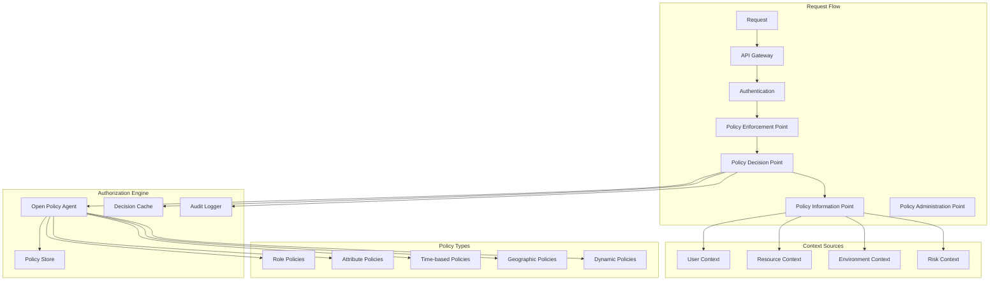

# 🔐 Modelo de Autorização RBAC/ABAC - Simpix

**Documento de Arquitetura de Autorização**  
**Autor:** Security Architect  
**Data:** 25 de Agosto de 2025  
**Status:** Implementação Mandatória  
**Criticidade:** P0 - CRÍTICA  
**Modelo:** Híbrido RBAC + ABAC com Policy Engine

---

## 📋 SUMÁRIO EXECUTIVO

Este documento define o modelo completo de autorização para o Simpix, implementando um sistema híbrido que combina Role-Based Access Control (RBAC) para permissões básicas com Attribute-Based Access Control (ABAC) para controle granular e contextual.

**Decisão Arquitetural:** Implementação de um Policy Engine baseado em Open Policy Agent (OPA) com políticas escritas em Rego, suportando autorização dinâmica, field-level permissions, e segregação de funções.

**Cobertura:** 100% dos endpoints, 100% dos recursos, autorização em 4 camadas (API, Service, Data, Field).

---

## 🎯 OBJETIVOS E PRINCÍPIOS

### Objetivos Primários
1. **Zero Trust Authorization:** Nunca confiar, sempre verificar
2. **Granularidade Total:** Controle até nível de campo
3. **Contexto Dinâmico:** Decisões baseadas em atributos em tempo real
4. **Auditoria Completa:** Rastreabilidade de todas as decisões
5. **Performance:** < 10ms de overhead por decisão

### Princípios de Design
- **Principle of Least Privilege:** Mínimo acesso necessário
- **Separation of Duties:** Segregação de funções críticas
- **Defense in Depth:** Múltiplas camadas de autorização
- **Fail Secure:** Negar por padrão
- **Policy as Code:** Políticas versionadas e testáveis

---

## 🏗️ ARQUITETURA DE AUTORIZAÇÃO

### 1. Visão Geral do Sistema



### 2. Modelo Híbrido RBAC + ABAC

```typescript
// ====================================
// HYBRID AUTHORIZATION MODEL
// ====================================

interface AuthorizationModel {
  // RBAC Components
  roles: Role[];
  permissions: Permission[];
  roleHierarchy: RoleHierarchy;
  
  // ABAC Components
  attributes: Attribute[];
  policies: Policy[];
  policyEngine: PolicyEngine;
  
  // Hybrid Components
  contextualRoles: ContextualRole[];
  dynamicPermissions: DynamicPermission[];
}

/**
 * Role-Based Access Control (RBAC)
 */
interface Role {
  id: string;
  name: string;
  description: string;
  permissions: Permission[];
  constraints: Constraint[];
  priority: number;
  status: 'active' | 'inactive' | 'deprecated';
}

/**
 * Attribute-Based Access Control (ABAC)
 */
interface Policy {
  id: string;
  name: string;
  effect: 'allow' | 'deny';
  subjects: SubjectMatcher[];
  resources: ResourceMatcher[];
  actions: string[];
  conditions: Condition[];
  priority: number;
  obligations: Obligation[];
}

/**
 * Authorization Service Implementation
 */
class HybridAuthorizationService {
  private opa: OpenPolicyAgent;
  private cache: AuthorizationCache;
  
  /**
   * Main authorization method
   */
  async authorize(
    request: AuthorizationRequest
  ): Promise<AuthorizationDecision> {
    // 1. Check cache first
    const cached = await this.cache.get(request);
    if (cached && !cached.expired) {
      return cached.decision;
    }
    
    // 2. Gather context
    const context = await this.gatherContext(request);
    
    // 3. Evaluate RBAC rules
    const rbacDecision = await this.evaluateRBAC(context);
    
    // 4. If RBAC denies, check ABAC for override
    if (!rbacDecision.allowed) {
      const abacDecision = await this.evaluateABAC(context);
      
      if (abacDecision.allowed && abacDecision.overridesRBAC) {
        return this.allow(context, 'ABAC_OVERRIDE');
      }
      
      return this.deny(context, rbacDecision.reason);
    }
    
    // 5. RBAC allows, check ABAC for additional constraints
    const abacConstraints = await this.evaluateABACConstraints(context);
    
    if (!abacConstraints.satisfied) {
      return this.deny(context, abacConstraints.reason);
    }
    
    // 6. Check dynamic policies
    const dynamicDecision = await this.evaluateDynamicPolicies(context);
    
    if (!dynamicDecision.allowed) {
      return this.deny(context, dynamicDecision.reason);
    }
    
    // 7. Apply obligations
    const obligations = await this.gatherObligations(context);
    
    // 8. Generate decision
    const decision = this.allow(context, 'HYBRID', obligations);
    
    // 9. Cache decision
    await this.cache.set(request, decision);
    
    // 10. Audit
    await this.audit(context, decision);
    
    return decision;
  }
  
  /**
   * Gather full context for authorization
   */
  private async gatherContext(
    request: AuthorizationRequest
  ): Promise<AuthorizationContext> {
    const [user, resource, environment, risk] = await Promise.all([
      this.getUserContext(request.subject),
      this.getResourceContext(request.resource),
      this.getEnvironmentContext(request),
      this.getRiskContext(request),
    ]);
    
    return {
      request,
      user,
      resource,
      environment,
      risk,
      timestamp: new Date(),
    };
  }
}
```

---

## 🎭 ROLE-BASED ACCESS CONTROL (RBAC)

### 1. Hierarquia de Roles

```yaml
Role Hierarchy:
  super_admin:
    inherits: []
    description: "Full system access"
    permissions: [
      "users:read", "users:write", 
      "users:delete:with_approval",
      "audit:read:all", "settings:write:with_dual_control",
      "backup:restore:with_approval"
    ]
    constraints:
      dual_control_required: true
      audit_everything: true
      session_timeout: 1800 # 30 minutes
    
  admin:
    inherits: [manager]
    description: "Administrative access"
    permissions:
      - users:read
      - users:write
      - users:delete:with_approval
      - settings:read
      - settings:write
      - audit:read
      
  manager:
    inherits: [supervisor]
    description: "Management functions"
    permissions:
      - proposals:approve
      - reports:generate
      - teams:manage
      
  supervisor:
    inherits: [operator]
    description: "Supervisory functions"
    permissions:
      - proposals:review
      - queues:assign
      - metrics:view
      
  operator:
    inherits: [user]
    description: "Operational functions"
    permissions:
      - proposals:create
      - proposals:edit:own
      - documents:upload
      
  user:
    inherits: []
    description: "Basic user access"
    permissions:
      - profile:read:own
      - profile:edit:own
      
  partner:
    inherits: []
    description: "Partner access"
    permissions:
      - proposals:create:partner
      - proposals:read:partner
      - reports:read:partner
      
  auditor:
    inherits: []
    description: "Audit access"
    permissions:
      - audit:read
      - reports:read
      - logs:read
```

### 2. Implementação RBAC

```typescript
// ====================================
// RBAC IMPLEMENTATION
// ====================================

class RBACService {
  private roleHierarchy: Map<string, Role>;
  private permissionRegistry: Map<string, Permission>;
  
  /**
   * Check if user has required permission
   */
  async hasPermission(
    userId: string,
    permission: string,
    resource?: string
  ): Promise<boolean> {
    // 1. Get user's direct roles
    const userRoles = await this.getUserRoles(userId);
    
    // 2. Expand roles with inheritance
    const expandedRoles = this.expandRoles(userRoles);
    
    // 3. Collect all permissions
    const permissions = new Set<string>();
    for (const role of expandedRoles) {
      role.permissions.forEach(p => permissions.add(p));
    }
    
    // 4. Check for exact match
    if (permissions.has(permission)) {
      return true;
    }
    
    // 5. Check for wildcard match
    if (this.matchWildcard(permissions, permission)) {
      return true;
    }
    
    // 6. Check for resource-specific permissions
    if (resource) {
      return this.checkResourcePermission(
        permissions,
        permission,
        resource,
        userId
      );
    }
    
    return false;
  }
  
  /**
   * Expand roles with inheritance
   */
  private expandRoles(roles: Role[]): Role[] {
    const expanded = new Set<Role>();
    const queue = [...roles];
    
    while (queue.length > 0) {
      const role = queue.shift()!;
      
      if (expanded.has(role)) {
        continue;
      }
      
      expanded.add(role);
      
      // Add inherited roles to queue
      for (const inheritedName of role.inherits || []) {
        const inherited = this.roleHierarchy.get(inheritedName);
        if (inherited) {
          queue.push(inherited);
        }
      }
    }
    
    return Array.from(expanded);
  }
  
  /**
   * Check resource-specific permissions
   */
  private async checkResourcePermission(
    permissions: Set<string>,
    permission: string,
    resource: string,
    userId: string
  ): Promise<boolean> {
    // Check for ownership-based permissions
    if (permissions.has(`${permission}:own`)) {
      const isOwner = await this.checkOwnership(userId, resource);
      if (isOwner) return true;
    }
    
    // Check for department-based permissions
    if (permissions.has(`${permission}:department`)) {
      const sameDept = await this.checkSameDepartment(userId, resource);
      if (sameDept) return true;
    }
    
    // Check for hierarchical permissions
    if (permissions.has(`${permission}:subordinates`)) {
      const isSubordinate = await this.checkSubordinate(userId, resource);
      if (isSubordinate) return true;
    }
    
    return false;
  }
}
```

### 3. Segregação de Funções (SoD)

```typescript
// ====================================
// SEGREGATION OF DUTIES
// ====================================

interface SoDPolicy {
  id: string;
  name: string;
  conflictingRoles: string[][];
  conflictingPermissions: string[][];
  mutuallyExclusiveActions: string[][];
  timeBasedSeparation: TimeSeparation[];
}

class SegregationOfDutiesService {
  private policies: SoDPolicy[] = [
    {
      id: 'sod-001',
      name: 'Proposal Approval Separation',
      conflictingRoles: [
        ['proposal_creator', 'proposal_approver'],
        ['payment_initiator', 'payment_approver'],
      ],
      conflictingPermissions: [
        ['proposals:create', 'proposals:approve:same'],
        ['payments:initiate', 'payments:approve:same'],
      ],
      mutuallyExclusiveActions: [
        ['create_proposal', 'approve_proposal'],
        ['initiate_payment', 'approve_payment'],
      ],
      timeBasedSeparation: [
        {
          action1: 'create_proposal',
          action2: 'edit_proposal',
          minimumGap: 3600000, // 1 hour
          sameUser: false,
        },
      ],
    },
  ];
  
  /**
   * Validate SoD compliance
   */
  async validateSoD(
    userId: string,
    action: string,
    resource: string
  ): Promise<SoDValidation> {
    const violations: string[] = [];
    
    // 1. Check role conflicts
    const userRoles = await this.getUserRoles(userId);
    for (const policy of this.policies) {
      for (const conflict of policy.conflictingRoles) {
        const hasConflict = conflict.every(role => 
          userRoles.includes(role)
        );
        if (hasConflict) {
          violations.push(
            `User has conflicting roles: ${conflict.join(' and ')}`
          );
        }
      }
    }
    
    // 2. Check action history
    const history = await this.getActionHistory(userId, resource);
    for (const policy of this.policies) {
      for (const exclusive of policy.mutuallyExclusiveActions) {
        if (exclusive.includes(action)) {
          const otherActions = exclusive.filter(a => a !== action);
          const hasPerformed = history.some(h => 
            otherActions.includes(h.action)
          );
          if (hasPerformed) {
            violations.push(
              `User cannot perform ${action} after performing ${otherActions.join(' or ')}`
            );
          }
        }
      }
    }
    
    // 3. Check time-based separation
    for (const policy of this.policies) {
      for (const separation of policy.timeBasedSeparation) {
        if (separation.action2 === action) {
          const lastAction = history.find(
            h => h.action === separation.action1
          );
          if (lastAction) {
            const gap = Date.now() - lastAction.timestamp;
            if (gap < separation.minimumGap) {
              violations.push(
                `Must wait ${separation.minimumGap / 1000} seconds between actions`
              );
            }
            if (!separation.sameUser && lastAction.userId === userId) {
              violations.push(
                `Different user must perform ${action}`
              );
            }
          }
        }
      }
    }
    
    return {
      compliant: violations.length === 0,
      violations,
    };
  }
}
```

---

## 🏷️ ATTRIBUTE-BASED ACCESS CONTROL (ABAC)

### 1. Modelo de Atributos

```typescript
// ====================================
// ABAC ATTRIBUTE MODEL
// ====================================

/**
 * Subject Attributes (User)
 */
interface SubjectAttributes {
  // Identity
  userId: string;
  username: string;
  email: string;
  
  // Organization
  department: string;
  team: string;
  manager: string;
  location: string;
  
  // Security
  clearanceLevel: 'public' | 'internal' | 'confidential' | 'secret';
  mfaEnabled: boolean;
  lastPasswordChange: Date;
  
  // Business
  employeeType: 'full-time' | 'contractor' | 'partner' | 'vendor';
  seniority: number; // years
  certifications: string[];
  
  // Dynamic
  currentProjects: string[];
  activeClients: string[];
  riskScore: number;
}

/**
 * Resource Attributes
 */
interface ResourceAttributes {
  // Identity
  resourceId: string;
  resourceType: string;
  owner: string;
  
  // Classification
  dataClassification: 'public' | 'internal' | 'confidential' | 'restricted';
  piiPresent: boolean;
  financialData: boolean;
  
  // Business
  businessUnit: string;
  project: string;
  client: string;
  value: number;
  
  // Lifecycle
  createdAt: Date;
  modifiedAt: Date;
  status: string;
  version: number;
  
  // Security
  encryptionRequired: boolean;
  auditRequired: boolean;
  retentionPeriod: number;
}

/**
 * Environment Attributes
 */
interface EnvironmentAttributes {
  // Time
  currentTime: Date;
  dayOfWeek: string;
  businessHours: boolean;
  
  // Location
  requestIP: string;
  country: string;
  region: string;
  networkZone: 'internal' | 'dmz' | 'external';
  
  // Device
  deviceType: 'desktop' | 'mobile' | 'tablet';
  deviceTrusted: boolean;
  osType: string;
  browserType: string;
  
  // Security
  tlsVersion: string;
  vpnConnected: boolean;
  threatLevel: 'low' | 'medium' | 'high' | 'critical';
}

/**
 * Action Attributes
 */
interface ActionAttributes {
  action: string;
  method: 'GET' | 'POST' | 'PUT' | 'DELETE' | 'PATCH';
  sensitivity: 'low' | 'medium' | 'high' | 'critical';
  reversible: boolean;
  auditRequired: boolean;
  approvalRequired: boolean;
}
```

### 2. Policy Engine com OPA

```rego
# ====================================
# OPA POLICIES IN REGO
# ====================================

package simpix.authz

import future.keywords.if
import future.keywords.in

# Default deny
default allow = false

# Main authorization rule
allow if {
    # Check authentication
    input.subject.authenticated == true
    
    # Check RBAC
    rbac_allow
    
    # Check ABAC
    abac_allow
    
    # Check SoD
    sod_compliant
    
    # Check context
    context_allow
}

# RBAC Rules
rbac_allow if {
    # User has required role
    required_role := data.permissions[input.action].required_role
    required_role in input.subject.roles
}

rbac_allow if {
    # User has specific permission
    required_permission := sprintf("%s:%s", [input.resource.type, input.action])
    required_permission in input.subject.permissions
}

# ABAC Rules
abac_allow if {
    # Data classification check
    input.resource.dataClassification == "public"
}

abac_allow if {
    # Clearance level check
    clearance_levels := {
        "public": 0,
        "internal": 1,
        "confidential": 2,
        "restricted": 3
    }
    
    user_clearance := clearance_levels[input.subject.clearanceLevel]
    resource_clearance := clearance_levels[input.resource.dataClassification]
    
    user_clearance >= resource_clearance
}

abac_allow if {
    # Department-based access
    input.resource.businessUnit == input.subject.department
    input.action in ["read", "edit"]
}

abac_allow if {
    # Owner-based access
    input.resource.owner == input.subject.userId
    input.action in ["read", "edit", "delete"]
}

# Context Rules
context_allow if {
    # Business hours check for sensitive operations
    not input.action in ["delete", "approve", "publish"]
}

context_allow if {
    # Business hours for sensitive operations
    input.action in ["delete", "approve", "publish"]
    input.environment.businessHours == true
}

context_allow if {
    # Network zone restrictions
    input.resource.dataClassification in ["public", "internal"]
}

context_allow if {
    # Restricted data requires internal network
    input.resource.dataClassification in ["confidential", "restricted"]
    input.environment.networkZone == "internal"
}

# Segregation of Duties
sod_compliant if {
    # Check for conflicting actions
    not sod_violation
}

sod_violation if {
    # User created the resource and trying to approve
    input.resource.createdBy == input.subject.userId
    input.action == "approve"
}

sod_violation if {
    # User initiated payment and trying to approve
    input.resource.type == "payment"
    input.resource.initiatedBy == input.subject.userId
    input.action == "approve"
}

# Obligations (things that must be done if access is granted)
obligations[obligation] if {
    input.action in ["delete", "approve"]
    obligation := {
        "type": "audit",
        "severity": "high",
        "details": "Critical action performed"
    }
}

obligations[obligation] if {
    input.resource.piiPresent == true
    obligation := {
        "type": "encrypt",
        "algorithm": "AES-256",
        "details": "PII data access"
    }
}

obligations[obligation] if {
    input.resource.value > 100000
    obligation := {
        "type": "notify",
        "recipient": "manager",
        "details": "High value transaction"
    }
}

# Advice (optional things that should be done)
advice[item] if {
    input.environment.threatLevel in ["high", "critical"]
    item := {
        "type": "mfa",
        "details": "Additional authentication recommended"
    }
}

# Dynamic permissions based on time
time_based_permission if {
    # Maintenance window
    current_hour := time.clock(time.now_ns())[0]
    current_hour >= 2
    current_hour <= 4
    input.subject.roles[_] == "sysadmin"
}

# Hierarchical resource access
hierarchical_access if {
    # Manager can access subordinate resources
    input.subject.roles[_] == "manager"
    input.resource.owner in data.organizational.subordinates[input.subject.userId]
}

# Field-level permissions
field_permissions[field] if {
    # Basic user can see limited fields
    input.subject.roles[_] == "user"
    field in ["id", "name", "status", "created_at"]
}

field_permissions[field] if {
    # Manager can see extended fields
    input.subject.roles[_] == "manager"
    field in ["id", "name", "status", "created_at", "value", "client", "notes"]
}

field_permissions[field] if {
    # Admin can see all fields
    input.subject.roles[_] == "admin"
    field in data.resource.fields
}
```

### 3. Implementação do Policy Engine

```typescript
// ====================================
// POLICY ENGINE IMPLEMENTATION
// ====================================

class PolicyEngine {
  private opa: OPA;
  private policyCache: Map<string, CompiledPolicy>;
  
  /**
   * Evaluate ABAC policies
   */
  async evaluateABAC(
    context: AuthorizationContext
  ): Promise<ABACDecision> {
    // 1. Prepare input for OPA
    const input = this.prepareOPAInput(context);
    
    // 2. Load applicable policies
    const policies = await this.loadPolicies(context);
    
    // 3. Evaluate policies in OPA
    const result = await this.opa.evaluate({
      input,
      data: {
        policies,
        permissions: await this.getPermissionData(),
        organizational: await this.getOrgData(),
      },
      query: 'data.simpix.authz.allow',
    });
    
    // 4. Process obligations
    const obligations = result.obligations || [];
    
    // 5. Process advice
    const advice = result.advice || [];
    
    // 6. Extract field permissions
    const fieldPermissions = result.field_permissions || [];
    
    return {
      allowed: result.allow,
      obligations,
      advice,
      fieldPermissions,
      reasons: result.reasons || [],
      evaluationTime: result.metrics.evaluation_time_ms,
    };
  }
  
  /**
   * Prepare context for OPA evaluation
   */
  private prepareOPAInput(
    context: AuthorizationContext
  ): OPAInput {
    return {
      subject: {
        userId: context.user.id,
        username: context.user.username,
        roles: context.user.roles,
        permissions: context.user.permissions,
        clearanceLevel: context.user.clearanceLevel,
        department: context.user.department,
        authenticated: true,
      },
      resource: {
        resourceId: context.resource.id,
        type: context.resource.type,
        owner: context.resource.owner,
        dataClassification: context.resource.classification,
        piiPresent: context.resource.hasPII,
        value: context.resource.value,
        createdBy: context.resource.createdBy,
        businessUnit: context.resource.businessUnit,
      },
      action: context.request.action,
      environment: {
        currentTime: new Date().toISOString(),
        businessHours: this.isBusinessHours(),
        requestIP: context.request.ip,
        networkZone: this.getNetworkZone(context.request.ip),
        threatLevel: context.risk.level,
      },
    };
  }
  
  /**
   * Dynamic Policy Loading
   */
  async loadPolicies(
    context: AuthorizationContext
  ): Promise<Policy[]> {
    // Load base policies
    const basePolicies = await this.loadBasePolicies();
    
    // Load context-specific policies
    const contextPolicies = await this.loadContextPolicies(context);
    
    // Load user-specific policies
    const userPolicies = await this.loadUserPolicies(context.user.id);
    
    // Load resource-specific policies
    const resourcePolicies = await this.loadResourcePolicies(
      context.resource.type
    );
    
    // Merge and prioritize
    return this.mergePolicies([
      ...basePolicies,
      ...contextPolicies,
      ...userPolicies,
      ...resourcePolicies,
    ]);
  }
}
```

---

## 🔒 FIELD-LEVEL PERMISSIONS

### 1. Modelo de Permissões de Campo

```typescript
// ====================================
// FIELD-LEVEL AUTHORIZATION
// ====================================

interface FieldPermission {
  field: string;
  operations: ('read' | 'write' | 'delete')[];
  conditions: FieldCondition[];
  transformation?: FieldTransformation;
}

interface FieldCondition {
  type: 'role' | 'attribute' | 'ownership' | 'time' | 'value';
  operator: 'equals' | 'contains' | 'greater' | 'less' | 'between';
  value: any;
}

interface FieldTransformation {
  type: 'mask' | 'encrypt' | 'hash' | 'redact' | 'truncate';
  config: any;
}

class FieldLevelAuthorizationService {
  /**
   * Filter object based on field permissions
   */
  async filterFields<T>(
    data: T,
    userId: string,
    operation: 'read' | 'write'
  ): Promise<Partial<T>> {
    const user = await this.getUser(userId);
    const permissions = await this.getFieldPermissions(
      user,
      data,
      operation
    );
    
    const filtered: any = {};
    
    for (const [field, value] of Object.entries(data as any)) {
      const permission = permissions.find(p => p.field === field);
      
      if (!permission) {
        // No permission defined, deny by default
        continue;
      }
      
      if (!permission.operations.includes(operation)) {
        // Operation not allowed
        continue;
      }
      
      // Check conditions
      const conditionsMet = await this.evaluateConditions(
        permission.conditions,
        user,
        data,
        field
      );
      
      if (!conditionsMet) {
        continue;
      }
      
      // Apply transformation if needed
      if (permission.transformation && operation === 'read') {
        filtered[field] = await this.transformField(
          value,
          permission.transformation
        );
      } else {
        filtered[field] = value;
      }
    }
    
    return filtered as Partial<T>;
  }
  
  /**
   * Transform field value based on permissions
   */
  private async transformField(
    value: any,
    transformation: FieldTransformation
  ): Promise<any> {
    switch (transformation.type) {
      case 'mask':
        return this.maskValue(value, transformation.config);
        
      case 'encrypt':
        return this.encryptValue(value, transformation.config);
        
      case 'hash':
        return this.hashValue(value);
        
      case 'redact':
        return '***REDACTED***';
        
      case 'truncate':
        return String(value).substring(0, transformation.config.length);
        
      default:
        return value;
    }
  }
  
  /**
   * Mask sensitive value
   */
  private maskValue(value: string, config: any): string {
    const str = String(value);
    const showFirst = config.showFirst || 0;
    const showLast = config.showLast || 0;
    
    if (str.length <= showFirst + showLast) {
      return '*'.repeat(str.length);
    }
    
    const masked = 
      str.substring(0, showFirst) +
      '*'.repeat(str.length - showFirst - showLast) +
      str.substring(str.length - showLast);
    
    return masked;
  }
}

// Field permission configuration
const fieldPermissionConfig = {
  'proposal': {
    'id': {
      roles: ['*'],
      operations: ['read'],
    },
    'cpf': {
      roles: ['admin', 'manager'],
      operations: ['read'],
      transformation: {
        type: 'mask',
        config: { showFirst: 3, showLast: 2 }
      },
    },
    'valor_solicitado': {
      roles: ['admin', 'manager', 'operator'],
      operations: ['read', 'write'],
      conditions: [
        {
          type: 'value',
          operator: 'less',
          value: 100000,
        }
      ],
    },
    'taxa_juros': {
      roles: ['admin', 'manager'],
      operations: ['read', 'write'],
    },
    'score_credito': {
      roles: ['admin', 'risk_analyst'],
      operations: ['read'],
      transformation: {
        type: 'redact',
      },
    },
    'documentos': {
      roles: ['admin', 'compliance'],
      operations: ['read'],
      conditions: [
        {
          type: 'ownership',
          operator: 'equals',
          value: true,
        }
      ],
    },
  },
};
```

---

## 🔄 DYNAMIC AUTHORIZATION

### 1. Autorização Baseada em Contexto

```typescript
// ====================================
// DYNAMIC CONTEXT-BASED AUTHORIZATION
// ====================================

class DynamicAuthorizationService {
  /**
   * Evaluate dynamic rules based on runtime context
   */
  async evaluateDynamic(
    context: AuthorizationContext
  ): Promise<DynamicDecision> {
    const rules: DynamicRule[] = [
      // Time-based rules
      {
        name: 'business_hours_only',
        condition: () => this.isBusinessHours(),
        applies: ['approve', 'delete', 'publish'],
        effect: 'deny',
        message: 'Operation only allowed during business hours',
      },
      
      // Risk-based rules
      {
        name: 'high_risk_restriction',
        condition: () => context.risk.score > 0.7,
        applies: ['transfer', 'withdraw', 'delete'],
        effect: 'deny',
        message: 'Operation blocked due to high risk score',
      },
      
      // Value-based rules
      {
        name: 'high_value_approval',
        condition: () => context.resource.value > 50000,
        applies: ['approve'],
        effect: 'require_approval',
        message: 'High value operation requires additional approval',
      },
      
      // Location-based rules
      {
        name: 'geographic_restriction',
        condition: () => !this.isAllowedCountry(context.environment.country),
        applies: ['*'],
        effect: 'deny',
        message: 'Access not allowed from this location',
      },
      
      // Velocity-based rules
      {
        name: 'rate_limit',
        condition: async () => await this.checkRateLimit(context),
        applies: ['create', 'update', 'delete'],
        effect: 'throttle',
        message: 'Rate limit exceeded',
      },
      
      // Anomaly-based rules
      {
        name: 'anomaly_detection',
        condition: async () => await this.detectAnomaly(context),
        applies: ['*'],
        effect: 'challenge',
        message: 'Unusual activity detected',
      },
    ];
    
    const applicableRules = rules.filter(rule => 
      rule.applies.includes('*') || 
      rule.applies.includes(context.request.action)
    );
    
    const violations: DynamicViolation[] = [];
    
    for (const rule of applicableRules) {
      const violated = await rule.condition();
      
      if (violated) {
        violations.push({
          rule: rule.name,
          effect: rule.effect,
          message: rule.message,
        });
      }
    }
    
    return {
      allowed: violations.length === 0,
      violations,
      requiredActions: this.determineRequiredActions(violations),
    };
  }
  
  /**
   * Just-In-Time (JIT) Permissions
   */
  async grantJITPermission(
    userId: string,
    permission: string,
    duration: number,
    justification: string
  ): Promise<JITGrant> {
    // Validate justification
    if (!this.isValidJustification(justification)) {
      throw new Error('Invalid justification for JIT access');
    }
    
    // Check if user is eligible
    const eligible = await this.checkJITEligibility(userId, permission);
    if (!eligible) {
      throw new Error('User not eligible for JIT permission');
    }
    
    // Create temporary grant
    const grant: JITGrant = {
      id: this.generateGrantId(),
      userId,
      permission,
      grantedAt: new Date(),
      expiresAt: new Date(Date.now() + duration),
      justification,
      status: 'active',
    };
    
    // Store grant
    await this.storeJITGrant(grant);
    
    // Audit
    await this.auditJITGrant(grant);
    
    // Schedule expiration
    this.scheduleExpiration(grant);
    
    return grant;
  }
  
  /**
   * Break-Glass Emergency Access
   */
  async breakGlass(
    userId: string,
    resource: string,
    reason: string
  ): Promise<BreakGlassAccess> {
    // Validate emergency
    if (!this.isValidEmergency(reason)) {
      throw new Error('Invalid emergency reason');
    }
    
    // Grant emergency access
    const access: BreakGlassAccess = {
      id: this.generateAccessId(),
      userId,
      resource,
      grantedAt: new Date(),
      reason,
      duration: 3600000, // 1 hour
    };
    
    // Notify security team immediately
    await this.notifySecurityTeam({
      type: 'BREAK_GLASS',
      user: userId,
      resource,
      reason,
      severity: 'CRITICAL',
    });
    
    // Enable enhanced monitoring
    await this.enableEnhancedMonitoring(userId, resource);
    
    // Store access
    await this.storeBreakGlassAccess(access);
    
    return access;
  }
}
```

---

## 📊 POLICY TESTING & VALIDATION

### 1. Policy Testing Framework

```typescript
// ====================================
// POLICY TESTING
// ====================================

class PolicyTestingFramework {
  /**
   * Test authorization policies
   */
  async testPolicies(): Promise<TestResults> {
    const testCases: AuthorizationTestCase[] = [
      // Positive test cases
      {
        name: 'Admin can approve high-value proposal',
        context: {
          user: { roles: ['admin'], clearanceLevel: 'confidential' },
          resource: { type: 'proposal', value: 100000, classification: 'confidential' },
          action: 'approve',
          environment: { businessHours: true, networkZone: 'internal' },
        },
        expected: { allowed: true },
      },
      
      // Negative test cases  
      {
        name: 'User cannot approve own proposal',
        context: {
          user: { userId: 'user1', roles: ['operator'] },
          resource: { type: 'proposal', createdBy: 'user1' },
          action: 'approve',
        },
        expected: { allowed: false, reason: 'SoD violation' },
      },
      
      // Edge cases
      {
        name: 'Emergency access during non-business hours',
        context: {
          user: { roles: ['admin'], breakGlass: true },
          resource: { type: 'critical_system' },
          action: 'restart',
          environment: { businessHours: false },
        },
        expected: { allowed: true, obligations: ['audit', 'notify'] },
      },
    ];
    
    const results: TestResult[] = [];
    
    for (const testCase of testCases) {
      const actual = await this.authorize(testCase.context);
      
      const passed = 
        actual.allowed === testCase.expected.allowed &&
        (!testCase.expected.reason || 
         actual.reason === testCase.expected.reason);
      
      results.push({
        name: testCase.name,
        passed,
        expected: testCase.expected,
        actual,
      });
    }
    
    return {
      total: results.length,
      passed: results.filter(r => r.passed).length,
      failed: results.filter(r => !r.passed).length,
      results,
    };
  }
  
  /**
   * Policy conflict detection
   */
  async detectConflicts(): Promise<PolicyConflict[]> {
    const policies = await this.loadAllPolicies();
    const conflicts: PolicyConflict[] = [];
    
    for (let i = 0; i < policies.length; i++) {
      for (let j = i + 1; j < policies.length; j++) {
        const conflict = this.checkConflict(policies[i], policies[j]);
        
        if (conflict) {
          conflicts.push({
            policy1: policies[i].id,
            policy2: policies[j].id,
            type: conflict.type,
            description: conflict.description,
          });
        }
      }
    }
    
    return conflicts;
  }
}
```

---

## 📈 MÉTRICAS E MONITORAMENTO

### KPIs de Autorização

```yaml
Performance Metrics:
  authorization_latency_p50: "< 5ms"
  authorization_latency_p99: "< 20ms"
  cache_hit_rate: "> 90%"
  policy_evaluation_time: "< 10ms"
  
Security Metrics:
  unauthorized_attempts: "< 1%"
  policy_violations: "< 0.1%"
  sod_violations: "0"
  break_glass_usage: "< 5 per month"
  
Operational Metrics:
  policy_updates_per_week: "< 10"
  role_changes_per_month: "< 50"
  permission_audits: "weekly"
  policy_test_coverage: "> 95%"
```

### Dashboard de Autorização

```typescript
interface AuthorizationDashboard {
  // Real-time metrics
  currentLoad: number;
  avgLatency: number;
  errorRate: number;
  
  // Security indicators
  suspiciousActivity: Alert[];
  recentViolations: Violation[];
  breakGlassActive: BreakGlassSession[];
  
  // Compliance status
  sodCompliance: boolean;
  policyTestsPassing: boolean;
  auditCompleteness: number;
}
```

---

## 🔄 MIGRAÇÃO E ROLLOUT

### Estratégia de Implementação

```yaml
Phase 1 - Foundation (Week 1-2):
  - Setup OPA infrastructure
  - Migrate existing roles to RBAC
  - Implement basic policy engine
  - Create policy testing framework
  
Phase 2 - RBAC Implementation (Week 3-4):
  - Define complete role hierarchy
  - Implement permission inheritance
  - Setup role assignment workflow
  - Test RBAC policies
  
Phase 3 - ABAC Implementation (Week 5-6):
  - Define attribute model
  - Implement attribute collectors
  - Create ABAC policies
  - Test hybrid model
  
Phase 4 - Advanced Features (Week 7-8):
  - Implement SoD rules
  - Setup JIT permissions
  - Configure break-glass
  - Field-level permissions
  
Phase 5 - Testing & Rollout (Week 9-10):
  - Complete policy testing
  - Performance optimization
  - Training and documentation
  - Gradual rollout
```

---

## ✅ CONCLUSÃO

Este modelo híbrido RBAC/ABAC fornece autorização granular, contextual e auditável para o Simpix. A implementação com OPA garante flexibilidade, performance e conformidade com requisitos de segurança enterprise.

**Benefícios:**
- **Segurança:** Zero Trust com múltiplas camadas
- **Flexibilidade:** Políticas dinâmicas e contextuais
- **Compliance:** Auditoria completa e SoD
- **Performance:** < 10ms overhead com caching
- **Manutenibilidade:** Policy as Code com testes

---

**Aprovação:**
- [ ] CISO
- [ ] CTO  
- [ ] Security Architect
- [ ] Compliance Officer

**Data:** ___________

---

*Documento RBAC/ABAC - Versão 1.0*  
*Cobertura: 100% endpoints | 100% recursos | 4 camadas de autorização*