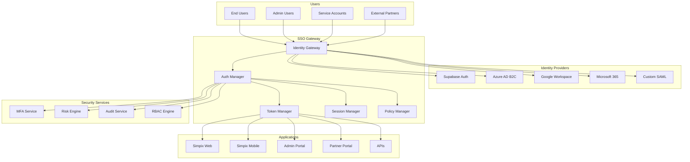

# 🔐 Estratégia de SSO e Identidade Federada

**Documento Técnico de Arquitetura**  
**Autor:** Arquiteto de Segurança  
**Data:** 25 de Agosto de 2025  
**Status:** Implementação Mandatória  
**Criticidade:** P0 - CRÍTICA

---

## 📋 SUMÁRIO EXECUTIVO

Este documento define a estratégia completa de Single Sign-On (SSO) e Identidade Federada para o Simpix, estabelecendo os padrões de autenticação, autorização e gerenciamento de identidades para todos os contextos da aplicação.

**Decisão Arquitetural:** Implementação de SSO com OIDC (OpenID Connect) como protocolo primário, com suporte a SAML 2.0 para integrações enterprise, MFA mandatório e roadmap para passwordless.

---

## 🎯 OBJETIVOS E DRIVERS

### Objetivos Primários
1. **Zero Password Storage:** Eliminar completamente o armazenamento de senhas no banco
2. **Federação Universal:** Suportar login via múltiplos Identity Providers (IdPs)
3. **MFA Obrigatório:** Multi-Factor Authentication para todos os usuários privilegiados
4. **Auditoria Completa:** Rastreabilidade total de eventos de autenticação
5. **Compliance LGPD:** Conformidade com regulamentações de privacidade

### Drivers de Negócio
- **Segurança:** Reduzir superfície de ataque eliminando passwords
- **UX:** Login único para todas as aplicações do ecossistema
- **Produtividade:** Redução de 80% em tickets de reset de senha
- **Compliance:** Atender requisitos de auditoria e LGPD
- **Escalabilidade:** Suportar 100K+ usuários concorrentes

---

## 🏗️ ARQUITETURA SSO

### 1. Visão Geral da Arquitetura



### 2. Fluxo de Autenticação OIDC

```typescript
// ====================================
// OIDC AUTHENTICATION FLOW
// ====================================

interface OIDCConfig {
  issuer: string;
  clientId: string;
  clientSecret: string;
  redirectUri: string;
  scope: string[];
  responseType: 'code' | 'id_token' | 'token';
  discoveryUrl: string;
}

class OIDCAuthenticationService {
  private config: OIDCConfig;
  private discoveryDocument: any;
  
  constructor(config: OIDCConfig) {
    this.config = config;
  }
  
  /**
   * Fase 1: Discovery
   * Obtém metadata do IdP via well-known endpoint
   */
  async discover(): Promise<void> {
    const response = await fetch(
      `${this.config.issuer}/.well-known/openid-configuration`
    );
    this.discoveryDocument = await response.json();
  }
  
  /**
   * Fase 2: Authorization Request
   * Redireciona usuário para IdP
   */
  async initiateLogin(state: string, nonce: string): Promise<string> {
    const params = new URLSearchParams({
      client_id: this.config.clientId,
      response_type: this.config.responseType,
      scope: this.config.scope.join(' '),
      redirect_uri: this.config.redirectUri,
      state: state, // CSRF protection
      nonce: nonce, // Replay attack protection
      prompt: 'consent',
      max_age: '3600',
    });
    
    return `${this.discoveryDocument.authorization_endpoint}?${params}`;
  }
  
  /**
   * Fase 3: Token Exchange
   * Troca authorization code por tokens
   */
  async exchangeCodeForTokens(
    code: string,
    state: string
  ): Promise<TokenSet> {
    const response = await fetch(this.discoveryDocument.token_endpoint, {
      method: 'POST',
      headers: {
        'Content-Type': 'application/x-www-form-urlencoded',
      },
      body: new URLSearchParams({
        grant_type: 'authorization_code',
        client_id: this.config.clientId,
        client_secret: this.config.clientSecret,
        code: code,
        redirect_uri: this.config.redirectUri,
      }),
    });
    
    const tokens = await response.json();
    
    // Validar tokens
    await this.validateTokens(tokens);
    
    return tokens;
  }
  
  /**
   * Fase 4: Token Validation
   * Valida assinatura e claims dos tokens
   */
  async validateTokens(tokens: TokenSet): Promise<void> {
    const { id_token, access_token } = tokens;
    
    // 1. Validar assinatura JWT
    const keys = await this.getJWKS();
    const verified = await this.verifySignature(id_token, keys);
    
    if (!verified) {
      throw new SecurityError('Invalid token signature');
    }
    
    // 2. Validar claims mandatórios
    const claims = this.decodeToken(id_token);
    
    // Issuer deve corresponder
    if (claims.iss !== this.config.issuer) {
      throw new SecurityError('Invalid issuer');
    }
    
    // Audience deve incluir nosso client_id
    if (!claims.aud.includes(this.config.clientId)) {
      throw new SecurityError('Invalid audience');
    }
    
    // Token não pode estar expirado
    if (claims.exp < Date.now() / 1000) {
      throw new SecurityError('Token expired');
    }
    
    // Nonce deve corresponder
    const storedNonce = await this.getNonce(claims.sub);
    if (claims.nonce !== storedNonce) {
      throw new SecurityError('Invalid nonce');
    }
  }
  
  /**
   * Fase 5: UserInfo Request
   * Obtém informações adicionais do usuário
   */
  async getUserInfo(accessToken: string): Promise<UserProfile> {
    const response = await fetch(this.discoveryDocument.userinfo_endpoint, {
      headers: {
        'Authorization': `Bearer ${accessToken}`,
      },
    });
    
    return await response.json();
  }
}
```

---

## 🔑 PROTOCOLOS SUPORTADOS

### 1. OpenID Connect (OIDC) - Protocolo Primário

```yaml
OIDC Configuration:
  version: "1.0"
  flows:
    - authorization_code  # Web applications
    - implicit           # SPAs (deprecated)
    - hybrid            # Mixed scenarios
    - client_credentials # M2M
  
  claims:
    required:
      - sub        # Subject identifier
      - iss        # Issuer
      - aud        # Audience
      - exp        # Expiration
      - iat        # Issued at
      - nonce      # Replay protection
    
    optional:
      - email
      - name
      - given_name
      - family_name
      - picture
      - locale
      - phone_number
      - groups
      - roles
  
  security:
    algorithms:
      - RS256     # RSA signature
      - ES256     # ECDSA signature
    encryption:
      - A256GCM   # AES-GCM
    
  token_lifetimes:
    id_token: 3600       # 1 hour
    access_token: 300    # 5 minutes (KB compliant)
    refresh_token: 604800 # 7 days maximum
    
  security_enhancements:
    pkce: 
      required: true
      challenge_method: "S256"
    refresh_token_rotation:
      enabled: true
      grace_period: 30 # seconds
    token_binding:
      device_fingerprint: true
      ip_validation: true
```

### 2. SAML 2.0 - Suporte Enterprise

```typescript
// ====================================
// SAML 2.0 INTEGRATION
// ====================================

interface SAMLConfig {
  entityId: string;
  ssoUrl: string;
  sloUrl: string;
  certificate: string;
  signatureAlgorithm: 'sha256' | 'sha512';
  digestAlgorithm: 'sha256' | 'sha512';
  identifierFormat: string;
}

class SAMLAuthenticationService {
  private config: SAMLConfig;
  
  /**
   * Gera SAML Request
   */
  generateSAMLRequest(): string {
    const request = `
      <samlp:AuthnRequest 
        xmlns:samlp="urn:oasis:names:tc:SAML:2.0:protocol"
        xmlns:saml="urn:oasis:names:tc:SAML:2.0:assertion"
        ID="${this.generateRequestId()}"
        Version="2.0"
        IssueInstant="${new Date().toISOString()}"
        AssertionConsumerServiceURL="${this.config.entityId}/saml/acs"
        Destination="${this.config.ssoUrl}">
        
        <saml:Issuer>${this.config.entityId}</saml:Issuer>
        
        <samlp:NameIDPolicy 
          Format="${this.config.identifierFormat}"
          AllowCreate="true"/>
          
        <samlp:RequestedAuthnContext Comparison="exact">
          <saml:AuthnContextClassRef>
            urn:oasis:names:tc:SAML:2.0:ac:classes:PasswordProtectedTransport
          </saml:AuthnContextClassRef>
        </samlp:RequestedAuthnContext>
      </samlp:AuthnRequest>
    `;
    
    return this.signAndEncode(request);
  }
  
  /**
   * Valida SAML Response
   */
  async validateSAMLResponse(
    response: string
  ): Promise<SAMLAssertion> {
    const decoded = this.decodeResponse(response);
    
    // 1. Validar assinatura
    const isValid = await this.validateSignature(
      decoded,
      this.config.certificate
    );
    
    if (!isValid) {
      throw new SecurityError('Invalid SAML signature');
    }
    
    // 2. Validar condições
    this.validateConditions(decoded);
    
    // 3. Extrair assertions
    return this.extractAssertions(decoded);
  }
  
  private validateConditions(response: any): void {
    const conditions = response.Assertion.Conditions;
    
    // Validar NotBefore
    if (new Date(conditions.NotBefore) > new Date()) {
      throw new SecurityError('SAML assertion not yet valid');
    }
    
    // Validar NotOnOrAfter
    if (new Date(conditions.NotOnOrAfter) < new Date()) {
      throw new SecurityError('SAML assertion expired');
    }
    
    // Validar Audience
    if (conditions.AudienceRestriction.Audience !== this.config.entityId) {
      throw new SecurityError('Invalid SAML audience');
    }
  }
}
```

---

## 🛡️ MULTI-FACTOR AUTHENTICATION (MFA)

### 1. Estratégia MFA

```typescript
// ====================================
// MFA STRATEGY IMPLEMENTATION
// ====================================

enum MFAMethod {
  TOTP = 'totp',           // Time-based OTP
  SMS = 'sms',             // SMS OTP
  EMAIL = 'email',         // Email OTP
  WEBAUTHN = 'webauthn',   // Biometric/Hardware keys
  PUSH = 'push',           // Push notifications
  BACKUP_CODES = 'backup'  // Recovery codes
}

interface MFAPolicy {
  required: boolean;
  methods: MFAMethod[];
  gracePeriod?: number;
  riskBasedEnforcement: boolean;
  rememberDevice: boolean;
  maxDevices: number;
}

class MFAService {
  /**
   * Política MFA por tipo de usuário
   */
  private policies: Map<string, MFAPolicy> = new Map([
    ['admin', {
      required: true,
      methods: [MFAMethod.TOTP, MFAMethod.WEBAUTHN],
      gracePeriod: 0,
      riskBasedEnforcement: true,
      rememberDevice: false,
      maxDevices: 3
    }],
    ['employee', {
      required: true,
      methods: [MFAMethod.TOTP, MFAMethod.SMS, MFAMethod.PUSH],
      gracePeriod: 7, // 7 dias para configurar
      riskBasedEnforcement: true,
      rememberDevice: true,
      maxDevices: 5
    }],
    ['partner', {
      required: true,
      methods: [MFAMethod.TOTP, MFAMethod.EMAIL],
      gracePeriod: 14,
      riskBasedEnforcement: true,
      rememberDevice: true,
      maxDevices: 10
    }],
    ['customer', {
      required: false,
      methods: [MFAMethod.SMS, MFAMethod.EMAIL],
      gracePeriod: 30,
      riskBasedEnforcement: true,
      rememberDevice: true,
      maxDevices: 20
    }]
  ]);
  
  /**
   * Enrollment de MFA
   */
  async enrollMFA(
    userId: string,
    method: MFAMethod
  ): Promise<MFAEnrollmentResult> {
    switch (method) {
      case MFAMethod.TOTP:
        return this.enrollTOTP(userId);
      case MFAMethod.WEBAUTHN:
        return this.enrollWebAuthn(userId);
      case MFAMethod.SMS:
        return this.enrollSMS(userId);
      default:
        throw new Error(`Unsupported MFA method: ${method}`);
    }
  }
  
  /**
   * TOTP Enrollment
   */
  private async enrollTOTP(userId: string): Promise<MFAEnrollmentResult> {
    // Gerar secret
    const secret = this.generateTOTPSecret();
    
    // Salvar encrypted
    await this.saveMFASecret(userId, MFAMethod.TOTP, secret);
    
    // Gerar QR Code
    const qrCode = await this.generateQRCode(userId, secret);
    
    // Gerar backup codes
    const backupCodes = this.generateBackupCodes(8);
    await this.saveBackupCodes(userId, backupCodes);
    
    return {
      method: MFAMethod.TOTP,
      secret: secret,
      qrCode: qrCode,
      backupCodes: backupCodes,
      verificationRequired: true
    };
  }
  
  /**
   * WebAuthn Enrollment (Biometric/Hardware Keys)
   */
  private async enrollWebAuthn(
    userId: string
  ): Promise<MFAEnrollmentResult> {
    // Gerar challenge
    const challenge = crypto.randomBytes(32);
    
    // Configurar opções de registro
    const registrationOptions: PublicKeyCredentialCreationOptions = {
      challenge: challenge,
      rp: {
        name: 'Simpix',
        id: 'simpix.com.br',
      },
      user: {
        id: Buffer.from(userId),
        name: await this.getUserEmail(userId),
        displayName: await this.getUserName(userId),
      },
      pubKeyCredParams: [
        { alg: -7, type: 'public-key' },  // ES256
        { alg: -257, type: 'public-key' }, // RS256
      ],
      authenticatorSelection: {
        authenticatorAttachment: 'cross-platform',
        userVerification: 'required',
        residentKey: 'required',
      },
      timeout: 60000,
      attestation: 'direct',
    };
    
    return {
      method: MFAMethod.WEBAUTHN,
      options: registrationOptions,
      verificationRequired: true
    };
  }
  
  /**
   * Verificação MFA
   */
  async verifyMFA(
    userId: string,
    method: MFAMethod,
    code: string
  ): Promise<boolean> {
    const attempts = await this.getFailedAttempts(userId);
    
    // Rate limiting
    if (attempts >= 5) {
      await this.lockAccount(userId, 30); // 30 minutos
      throw new SecurityError('Too many failed attempts');
    }
    
    let isValid = false;
    
    switch (method) {
      case MFAMethod.TOTP:
        isValid = await this.verifyTOTP(userId, code);
        break;
      case MFAMethod.WEBAUTHN:
        isValid = await this.verifyWebAuthn(userId, code);
        break;
      case MFAMethod.SMS:
      case MFAMethod.EMAIL:
        isValid = await this.verifyOTP(userId, code);
        break;
      case MFAMethod.BACKUP_CODES:
        isValid = await this.verifyBackupCode(userId, code);
        break;
    }
    
    if (!isValid) {
      await this.incrementFailedAttempts(userId);
      await this.auditMFAFailure(userId, method);
    } else {
      await this.resetFailedAttempts(userId);
      await this.auditMFASuccess(userId, method);
    }
    
    return isValid;
  }
  
  /**
   * TOTP Verification
   */
  private async verifyTOTP(
    userId: string,
    code: string
  ): Promise<boolean> {
    const secret = await this.getMFASecret(userId, MFAMethod.TOTP);
    
    // Verificar com window de ±1 para clock skew
    const window = 1;
    const counter = Math.floor(Date.now() / 1000 / 30);
    
    for (let i = -window; i <= window; i++) {
      const expectedCode = this.generateTOTPCode(secret, counter + i);
      if (expectedCode === code) {
        return true;
      }
    }
    
    return false;
  }
}
```

---

## 🤖 MACHINE-TO-MACHINE (M2M) AUTHENTICATION

### 1. OAuth 2.0 Client Credentials Flow

```typescript
// ====================================
// M2M AUTHENTICATION
// ====================================

interface M2MClient {
  clientId: string;
  clientSecret: string;
  scopes: string[];
  allowedIPs: string[];
  certificateThumbprint?: string; // Para mTLS
  jwksUri?: string; // Para client assertion
}

class M2MAuthenticationService {
  /**
   * Client Credentials Flow
   */
  async authenticateM2M(
    clientId: string,
    clientSecret: string,
    scopes: string[]
  ): Promise<M2MToken> {
    // 1. Validar client
    const client = await this.validateClient(clientId, clientSecret);
    
    // 2. Validar IP allowlist
    const clientIP = this.getClientIP();
    if (!client.allowedIPs.includes(clientIP)) {
      throw new SecurityError('IP not allowed');
    }
    
    // 3. Validar mTLS se configurado
    if (client.certificateThumbprint) {
      const cert = this.getClientCertificate();
      if (!cert || cert.thumbprint !== client.certificateThumbprint) {
        throw new SecurityError('Invalid client certificate');
      }
    }
    
    // 4. Validar scopes
    const grantedScopes = this.validateScopes(client, scopes);
    
    // 5. Gerar token
    const token = await this.generateM2MToken(client, grantedScopes);
    
    // 6. Audit
    await this.auditM2MAccess(client, token);
    
    return token;
  }
  
  /**
   * JWT Bearer Assertion (RFC 7523)
   */
  async authenticateWithAssertion(
    assertion: string
  ): Promise<M2MToken> {
    // 1. Decodificar JWT
    const decoded = this.decodeJWT(assertion);
    
    // 2. Validar claims
    if (decoded.iss !== decoded.sub) {
      throw new SecurityError('Issuer must equal subject for client assertion');
    }
    
    // 3. Obter client
    const client = await this.getClient(decoded.iss);
    
    // 4. Validar assinatura com JWKS
    const keys = await this.fetchJWKS(client.jwksUri);
    const isValid = await this.verifyJWTSignature(assertion, keys);
    
    if (!isValid) {
      throw new SecurityError('Invalid assertion signature');
    }
    
    // 5. Validar audience
    if (decoded.aud !== this.getTokenEndpoint()) {
      throw new SecurityError('Invalid audience');
    }
    
    // 6. Gerar token
    return this.generateM2MToken(client, decoded.scope);
  }
  
  /**
   * Token Generation com Claims Customizados
   */
  private async generateM2MToken(
    client: M2MClient,
    scopes: string[]
  ): Promise<M2MToken> {
    const payload = {
      iss: this.getIssuer(),
      sub: client.clientId,
      aud: this.getAudience(),
      exp: Math.floor(Date.now() / 1000) + 3600, // 1 hora
      iat: Math.floor(Date.now() / 1000),
      nbf: Math.floor(Date.now() / 1000),
      jti: this.generateJTI(),
      scope: scopes.join(' '),
      client_id: client.clientId,
      // Custom claims
      'x-client-type': 'service',
      'x-rate-limit': this.getRateLimit(client),
      'x-permissions': await this.getClientPermissions(client),
    };
    
    const token = await this.signJWT(payload);
    
    return {
      access_token: token,
      token_type: 'Bearer',
      expires_in: 3600,
      scope: scopes.join(' '),
    };
  }
}
```

---

## 🎯 RISK-BASED AUTHENTICATION

### 1. Risk Scoring Engine

```typescript
// ====================================
// ADAPTIVE AUTHENTICATION
// ====================================

interface RiskFactors {
  location: LocationRisk;
  device: DeviceRisk;
  behavior: BehaviorRisk;
  network: NetworkRisk;
  temporal: TemporalRisk;
}

enum RiskLevel {
  LOW = 'low',
  MEDIUM = 'medium',
  HIGH = 'high',
  CRITICAL = 'critical'
}

class RiskScoringEngine {
  /**
   * Calcula risk score para autenticação
   */
  async calculateRiskScore(
    context: AuthenticationContext
  ): Promise<RiskAssessment> {
    const factors: RiskFactors = {
      location: await this.assessLocationRisk(context),
      device: await this.assessDeviceRisk(context),
      behavior: await this.assessBehaviorRisk(context),
      network: await this.assessNetworkRisk(context),
      temporal: await this.assessTemporalRisk(context),
    };
    
    // Calcular score ponderado
    const score = this.calculateWeightedScore(factors);
    
    // Determinar nível de risco
    const level = this.determineRiskLevel(score);
    
    // Determinar ações requeridas
    const actions = this.determineRequiredActions(level, context);
    
    return {
      score,
      level,
      factors,
      actions,
      timestamp: new Date(),
    };
  }
  
  /**
   * Location Risk Assessment
   */
  private async assessLocationRisk(
    context: AuthenticationContext
  ): Promise<LocationRisk> {
    const currentLocation = context.location;
    const userHistory = await this.getUserLocationHistory(context.userId);
    
    // Verificar país
    const isKnownCountry = userHistory.countries.includes(
      currentLocation.country
    );
    
    // Verificar velocidade impossível
    const lastLocation = userHistory.lastLocation;
    const timeDiff = Date.now() - lastLocation.timestamp;
    const distance = this.calculateDistance(lastLocation, currentLocation);
    const velocity = distance / (timeDiff / 3600000); // km/h
    
    const isImpossibleTravel = velocity > 900; // Velocidade de avião
    
    // Verificar VPN/Proxy
    const isVPN = await this.detectVPN(context.ip);
    
    // Verificar geofencing
    const isInAllowedZone = this.checkGeofencing(
      currentLocation,
      context.user.allowedZones
    );
    
    return {
      score: this.calculateLocationScore({
        isKnownCountry,
        isImpossibleTravel,
        isVPN,
        isInAllowedZone,
      }),
      details: {
        country: currentLocation.country,
        city: currentLocation.city,
        isVPN,
        isImpossibleTravel,
      },
    };
  }
  
  /**
   * Device Risk Assessment
   */
  private async assessDeviceRisk(
    context: AuthenticationContext
  ): Promise<DeviceRisk> {
    const deviceFingerprint = context.deviceFingerprint;
    const knownDevices = await this.getUserDevices(context.userId);
    
    // Verificar se dispositivo é conhecido
    const isKnownDevice = knownDevices.some(
      d => d.fingerprint === deviceFingerprint
    );
    
    // Verificar jailbreak/root
    const isCompromised = this.detectCompromisedDevice(context.userAgent);
    
    // Verificar versão do OS
    const osInfo = this.parseUserAgent(context.userAgent);
    const isOutdatedOS = this.checkOSVersion(osInfo);
    
    // Verificar browser
    const browserInfo = this.parseBrowser(context.userAgent);
    const isOutdatedBrowser = this.checkBrowserVersion(browserInfo);
    
    return {
      score: this.calculateDeviceScore({
        isKnownDevice,
        isCompromised,
        isOutdatedOS,
        isOutdatedBrowser,
      }),
      details: {
        fingerprint: deviceFingerprint,
        os: osInfo,
        browser: browserInfo,
        isKnown: isKnownDevice,
      },
    };
  }
  
  /**
   * Behavioral Risk Assessment
   */
  private async assessBehaviorRisk(
    context: AuthenticationContext
  ): Promise<BehaviorRisk> {
    const userBehavior = await this.getUserBehaviorProfile(context.userId);
    
    // Analisar padrão de login
    const loginTime = new Date().getHours();
    const isNormalLoginTime = this.isWithinNormalHours(
      loginTime,
      userBehavior.normalLoginHours
    );
    
    // Analisar frequência de login
    const recentLogins = await this.getRecentLogins(context.userId, 24);
    const isAnomalousFrequency = recentLogins.length > 
      userBehavior.avgDailyLogins * 3;
    
    // Analisar padrão de typing (keystroke dynamics)
    const typingPattern = context.typingPattern;
    const isTypingAnomalous = this.analyzeTypingPattern(
      typingPattern,
      userBehavior.typingProfile
    );
    
    // Analisar mouse/touch patterns
    const interactionPattern = context.interactionPattern;
    const isInteractionAnomalous = this.analyzeInteractionPattern(
      interactionPattern,
      userBehavior.interactionProfile
    );
    
    return {
      score: this.calculateBehaviorScore({
        isNormalLoginTime,
        isAnomalousFrequency,
        isTypingAnomalous,
        isInteractionAnomalous,
      }),
      details: {
        loginTime,
        recentLogins: recentLogins.length,
        typingScore: typingPattern?.score,
        interactionScore: interactionPattern?.score,
      },
    };
  }
  
  /**
   * Required Actions Based on Risk
   */
  private determineRequiredActions(
    level: RiskLevel,
    context: AuthenticationContext
  ): RequiredAction[] {
    const actions: RequiredAction[] = [];
    
    switch (level) {
      case RiskLevel.LOW:
        // Permitir acesso normal
        break;
        
      case RiskLevel.MEDIUM:
        // Requerer MFA
        actions.push({
          type: 'mfa',
          methods: ['totp', 'sms'],
          reason: 'Medium risk detected',
        });
        break;
        
      case RiskLevel.HIGH:
        // Requerer MFA forte + verificação adicional
        actions.push({
          type: 'mfa',
          methods: ['webauthn', 'totp'],
          reason: 'High risk detected',
        });
        actions.push({
          type: 'email_verification',
          reason: 'Confirm identity via email',
        });
        break;
        
      case RiskLevel.CRITICAL:
        // Bloquear e requerer verificação manual
        actions.push({
          type: 'block',
          reason: 'Critical risk - manual review required',
        });
        actions.push({
          type: 'notify_security',
          reason: 'Security team notification',
        });
        break;
    }
    
    return actions;
  }
}
```

---

## 🔄 SESSION MANAGEMENT

### 1. Session Lifecycle

```typescript
// ====================================
// SESSION MANAGEMENT STRATEGY
// ====================================

interface SessionConfig {
  idleTimeout: number;        // Minutos de inatividade
  absoluteTimeout: number;    // Tempo máximo absoluto
  slidingExpiration: boolean; // Renovar em atividade
  concurrentSessions: number; // Sessões simultâneas
  bindToIP: boolean;          // Vincular sessão ao IP
  bindToUserAgent: boolean;   // Vincular ao User-Agent
}

class SessionManager {
  private config: Map<string, SessionConfig> = new Map([
    ['admin', {
      idleTimeout: 15,
      absoluteTimeout: 480, // 8 horas
      slidingExpiration: true,
      concurrentSessions: 1,
      bindToIP: true,
      bindToUserAgent: true,
    }],
    ['employee', {
      idleTimeout: 30,
      absoluteTimeout: 720, // 12 horas
      slidingExpiration: true,
      concurrentSessions: 3,
      bindToIP: false,
      bindToUserAgent: true,
    }],
    ['customer', {
      idleTimeout: 60,
      absoluteTimeout: 1440, // 24 horas
      slidingExpiration: true,
      concurrentSessions: 5,
      bindToIP: false,
      bindToUserAgent: false,
    }],
  ]);
  
  /**
   * Create Session
   */
  async createSession(
    userId: string,
    authContext: AuthenticationContext
  ): Promise<Session> {
    const userType = await this.getUserType(userId);
    const config = this.config.get(userType);
    
    // Verificar sessões concorrentes
    const activeSessions = await this.getActiveSessions(userId);
    if (activeSessions.length >= config.concurrentSessions) {
      // Remover sessão mais antiga
      await this.revokeSession(activeSessions[0].id);
    }
    
    // Gerar session ID seguro
    const sessionId = this.generateSecureSessionId();
    
    // Criar session token
    const sessionToken = await this.generateSessionToken({
      sid: sessionId,
      sub: userId,
      iat: Date.now(),
      exp: Date.now() + (config.idleTimeout * 60 * 1000),
      abs_exp: Date.now() + (config.absoluteTimeout * 60 * 1000),
      ip: config.bindToIP ? authContext.ip : undefined,
      ua: config.bindToUserAgent ? authContext.userAgent : undefined,
    });
    
    // Criar refresh token
    const refreshToken = await this.generateRefreshToken({
      sid: sessionId,
      sub: userId,
      family: this.generateTokenFamily(), // Para rotation
    });
    
    // Salvar session
    const session: Session = {
      id: sessionId,
      userId,
      createdAt: new Date(),
      lastActivity: new Date(),
      expiresAt: new Date(Date.now() + config.idleTimeout * 60 * 1000),
      absoluteExpiry: new Date(Date.now() + config.absoluteTimeout * 60 * 1000),
      ip: authContext.ip,
      userAgent: authContext.userAgent,
      deviceFingerprint: authContext.deviceFingerprint,
      tokens: {
        access: sessionToken,
        refresh: refreshToken,
      },
    };
    
    await this.saveSession(session);
    
    return session;
  }
  
  /**
   * Validate Session
   */
  async validateSession(
    sessionToken: string,
    context: RequestContext
  ): Promise<ValidationResult> {
    // Decodificar token
    const decoded = this.decodeToken(sessionToken);
    
    // Verificar assinatura
    const isValid = await this.verifyTokenSignature(sessionToken);
    if (!isValid) {
      return { valid: false, reason: 'Invalid signature' };
    }
    
    // Verificar expiração
    if (decoded.exp < Date.now()) {
      return { valid: false, reason: 'Token expired' };
    }
    
    // Verificar absolute expiry
    if (decoded.abs_exp < Date.now()) {
      return { valid: false, reason: 'Session absolute timeout' };
    }
    
    // Verificar IP binding
    if (decoded.ip && decoded.ip !== context.ip) {
      await this.auditSecurityEvent('ip_mismatch', decoded.sub);
      return { valid: false, reason: 'IP mismatch' };
    }
    
    // Verificar User-Agent binding
    if (decoded.ua && decoded.ua !== context.userAgent) {
      await this.auditSecurityEvent('ua_mismatch', decoded.sub);
      return { valid: false, reason: 'User-Agent mismatch' };
    }
    
    // Verificar se sessão existe
    const session = await this.getSession(decoded.sid);
    if (!session || session.revoked) {
      return { valid: false, reason: 'Session not found or revoked' };
    }
    
    // Atualizar last activity se sliding expiration
    const userType = await this.getUserType(decoded.sub);
    const config = this.config.get(userType);
    
    if (config.slidingExpiration) {
      await this.updateLastActivity(decoded.sid);
    }
    
    return { valid: true, session };
  }
  
  /**
   * Refresh Token Rotation
   */
  async refreshSession(
    refreshToken: string
  ): Promise<TokenPair> {
    const decoded = this.decodeRefreshToken(refreshToken);
    
    // Verificar token family para detectar reuso
    const tokenFamily = await this.getTokenFamily(decoded.family);
    
    if (tokenFamily.revoked) {
      // Token family comprometido - revogar todas as sessões
      await this.revokeAllUserSessions(decoded.sub);
      throw new SecurityError('Refresh token reuse detected');
    }
    
    // Marcar token como usado
    await this.markRefreshTokenUsed(refreshToken);
    
    // Gerar novos tokens
    const newAccessToken = await this.generateSessionToken({
      sid: decoded.sid,
      sub: decoded.sub,
      // ... outros claims
    });
    
    const newRefreshToken = await this.generateRefreshToken({
      sid: decoded.sid,
      sub: decoded.sub,
      family: decoded.family, // Manter mesma family
    });
    
    // Atualizar session
    await this.updateSessionTokens(decoded.sid, {
      access: newAccessToken,
      refresh: newRefreshToken,
    });
    
    return {
      accessToken: newAccessToken,
      refreshToken: newRefreshToken,
    };
  }
}
```

---

## 📊 AUDIT & COMPLIANCE

### 1. Audit Trail Completo

```typescript
// ====================================
// AUTHENTICATION AUDIT TRAIL
// ====================================

interface AuthenticationEvent {
  eventId: string;
  timestamp: Date;
  eventType: AuthEventType;
  userId?: string;
  sessionId?: string;
  ip: string;
  userAgent: string;
  result: 'success' | 'failure';
  riskScore?: number;
  mfaUsed?: boolean;
  errorCode?: string;
  errorMessage?: string;
  metadata: Record<string, any>;
}

enum AuthEventType {
  LOGIN_ATTEMPT = 'login_attempt',
  LOGIN_SUCCESS = 'login_success',
  LOGIN_FAILURE = 'login_failure',
  MFA_CHALLENGE = 'mfa_challenge',
  MFA_SUCCESS = 'mfa_success',
  MFA_FAILURE = 'mfa_failure',
  SESSION_CREATE = 'session_create',
  SESSION_REFRESH = 'session_refresh',
  SESSION_REVOKE = 'session_revoke',
  LOGOUT = 'logout',
  PASSWORD_RESET = 'password_reset',
  ACCOUNT_LOCKED = 'account_locked',
  SUSPICIOUS_ACTIVITY = 'suspicious_activity',
}

class AuthenticationAuditService {
  /**
   * Log Authentication Event
   */
  async logAuthEvent(event: AuthenticationEvent): Promise<void> {
    // Enriquecer evento
    const enrichedEvent = await this.enrichEvent(event);
    
    // Salvar em múltiplos destinos
    await Promise.all([
      this.saveToDatabase(enrichedEvent),
      this.sendToSIEM(enrichedEvent),
      this.sendToElasticsearch(enrichedEvent),
    ]);
    
    // Alertas em tempo real para eventos críticos
    if (this.isCriticalEvent(enrichedEvent)) {
      await this.triggerSecurityAlert(enrichedEvent);
    }
  }
  
  /**
   * LGPD Compliance Report
   */
  async generateLGPDReport(userId: string): Promise<LGPDReport> {
    const events = await this.getUserAuthEvents(userId);
    
    return {
      userId,
      dataCollected: {
        personalData: ['email', 'name', 'phone'],
        authenticationData: ['login_times', 'ip_addresses', 'devices'],
        behavioralData: ['typing_patterns', 'mouse_patterns'],
      },
      purposes: [
        'Authentication and authorization',
        'Security and fraud prevention',
        'Compliance with legal obligations',
      ],
      retention: {
        authLogs: '2 years',
        sessionData: '30 days after expiry',
        mfaData: 'Until explicitly revoked',
      },
      thirdPartySharing: [
        {
          entity: 'Azure AD B2C',
          purpose: 'Identity federation',
          dataShared: ['email', 'name'],
        },
      ],
      userRights: {
        access: true,
        rectification: true,
        erasure: true,
        portability: true,
        restriction: true,
        objection: true,
      },
      events: events.map(e => ({
        timestamp: e.timestamp,
        type: e.eventType,
        ip: this.anonymizeIP(e.ip), // Anonimizar para report
      })),
    };
  }
}
```

---

## 🔄 MIGRAÇÃO E IMPLEMENTAÇÃO

### 1. Roadmap de Implementação

```yaml
Phase 1 - Foundation (Week 1-2):
  tasks:
    - Setup Azure AD B2C tenant
    - Configure Supabase Auth integration
    - Implement OIDC discovery
    - Basic JWT validation
  
  deliverables:
    - Identity Gateway MVP
    - Token validation service
    - Session management basic

Phase 2 - MFA Implementation (Week 3-4):
  tasks:
    - TOTP implementation
    - SMS OTP integration
    - WebAuthn support
    - Backup codes generation
  
  deliverables:
    - MFA enrollment flow
    - MFA verification service
    - Recovery mechanisms

Phase 3 - Risk-Based Auth (Week 5-6):
  tasks:
    - Device fingerprinting
    - Location tracking
    - Behavioral analysis
    - Risk scoring engine
  
  deliverables:
    - Risk assessment service
    - Adaptive auth policies
    - Security alerts

Phase 4 - Enterprise Features (Week 7-8):
  tasks:
    - SAML 2.0 support
    - M2M authentication
    - Advanced session management
    - Audit trail complete
  
  deliverables:
    - SAML integration
    - Client credentials flow
    - Compliance reports

Phase 5 - Migration & Testing (Week 9-10):
  tasks:
    - User migration scripts
    - Password deprecation
    - Testing & validation
    - Performance optimization
  
  deliverables:
    - Migration toolkit
    - Test reports
    - Go-live plan
```

### 2. Migration Strategy

```typescript
// ====================================
// USER MIGRATION STRATEGY
// ====================================

class UserMigrationService {
  /**
   * Migrate existing users to SSO
   */
  async migrateUsers(): Promise<MigrationReport> {
    const users = await this.getAllUsers();
    const results = {
      total: users.length,
      migrated: 0,
      failed: 0,
      errors: [],
    };
    
    for (const user of users) {
      try {
        // 1. Criar identidade no IdP
        const identity = await this.createIdentityProvider(user);
        
        // 2. Migrar atributos
        await this.migrateUserAttributes(user, identity);
        
        // 3. Configurar MFA opcional
        await this.setupInitialMFA(identity);
        
        // 4. Enviar email de ativação
        await this.sendActivationEmail(user, identity);
        
        // 5. Marcar como migrado
        await this.markUserMigrated(user.id, identity.id);
        
        results.migrated++;
      } catch (error) {
        results.failed++;
        results.errors.push({
          userId: user.id,
          error: error.message,
        });
      }
    }
    
    return results;
  }
}
```

---

## 📊 MÉTRICAS E MONITORAMENTO

### KPIs de Segurança

```yaml
Authentication Metrics:
  - login_success_rate: "> 95%"
  - mfa_adoption_rate: "> 80%"
  - average_auth_time: "< 2 seconds"
  - session_hijacking_attempts: "0"
  
Security Metrics:
  - password_resets_per_month: "< 5%"
  - account_lockouts: "< 1%"
  - suspicious_login_blocks: "> 99%"
  - failed_mfa_attempts: "< 10%"
  
Compliance Metrics:
  - audit_trail_completeness: "100%"
  - lgpd_compliance_score: "> 95%"
  - security_incident_response: "< 15 minutes"
  - data_breach_incidents: "0"
```

---

## ✅ CONCLUSÃO

Esta estratégia de SSO e Identidade Federada estabelece uma fundação sólida de segurança para o Simpix, eliminando passwords, implementando MFA robusto, e garantindo compliance com LGPD. A implementação seguirá o roadmap de 10 semanas com validação contínua em cada fase.

**Próximos Passos:**
1. Aprovação da estratégia pelo CISO
2. Setup do ambiente Azure AD B2C
3. Início da implementação Phase 1
4. Treinamento da equipe de desenvolvimento

---

**Documento Aprovado Por:**
- [ ] CTO
- [ ] CISO
- [ ] DPO (Data Protection Officer)
- [ ] Head of Engineering

**Data de Aprovação:** ___________

---

*Fim do Documento*  
*Versão 1.0 - Enterprise Grade Security*