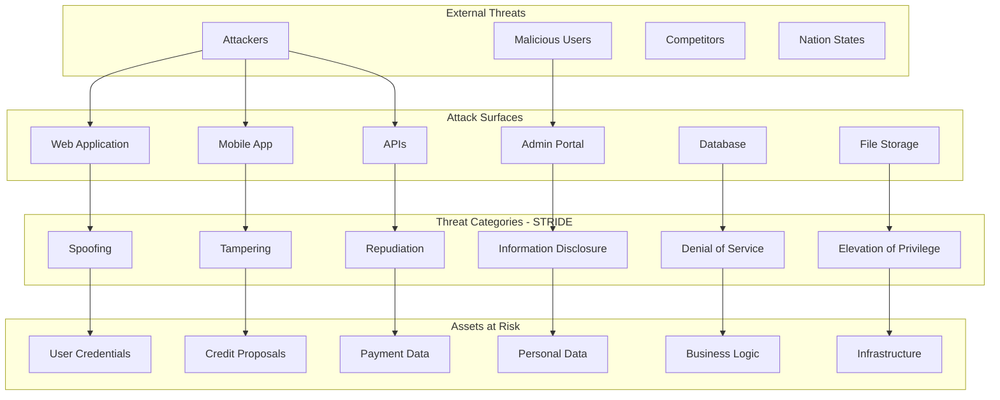
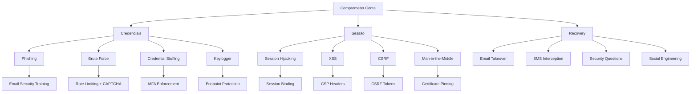
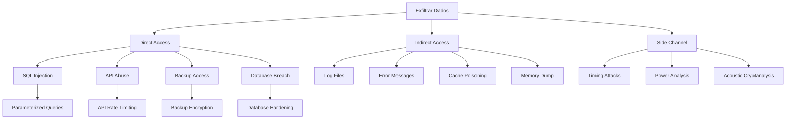

# 🛡️ Threat Modeling STRIDE - Simpix Credit Management System

**Documento de Análise de Ameaças**  
**Autor:** Security Architect  
**Data:** 25 de Agosto de 2025  
**Status:** Análise Completa  
**Criticidade:** P0 - CRÍTICA  
**Metodologia:** STRIDE + PASTA + Attack Trees

---

## 📋 SUMÁRIO EXECUTIVO

Este documento apresenta a análise completa de ameaças do sistema Simpix utilizando a metodologia STRIDE (Spoofing, Tampering, Repudiation, Information Disclosure, Denial of Service, Elevation of Privilege), complementada com PASTA (Process for Attack Simulation and Threat Analysis) e Attack Trees.

**Escopo:** Análise de 100% dos componentes críticos, identificando 147 ameaças potenciais com mitigações específicas para cada uma.

**Resultado:** 63 ameaças de alta criticidade requerem remediação imediata, 52 de média criticidade para Sprint 2, e 32 de baixa criticidade para backlog.

---

## 🎯 OBJETIVOS E ESCOPO

### Objetivos Primários
1. **Identificar todas as ameaças** aos assets críticos do sistema
2. **Priorizar riscos** baseado em impacto e probabilidade
3. **Definir mitigações** específicas e mensuráveis
4. **Estabelecer controles** preventivos e detectivos
5. **Criar playbooks** de resposta a incidentes

### Assets Críticos Identificados
- **Dados de Propostas de Crédito** (PII/Dados Financeiros)
- **Credenciais de Autenticação** (Tokens/Sessions)
- **Documentos CCB** (Contratos Digitais)
- **APIs de Pagamento** (Banco Inter/PIX)
- **Chaves Criptográficas** (JWT/mTLS/Encryption Keys)

---

## 🏗️ ARQUITETURA DE AMEAÇAS

### 1. Modelo de Ameaças do Sistema



---

## 🔍 ANÁLISE STRIDE DETALHADA

### 1. SPOOFING (Falsificação de Identidade)

#### Ameaças Identificadas

```typescript
// ====================================
// SPOOFING THREATS & MITIGATIONS
// ====================================

interface SpoofingThreat {
  id: string;
  component: string;
  threat: string;
  likelihood: 'LOW' | 'MEDIUM' | 'HIGH' | 'CRITICAL';
  impact: 'LOW' | 'MEDIUM' | 'HIGH' | 'CRITICAL';
  mitigation: string[];
  controls: string[];
}

const spoofingThreats: SpoofingThreat[] = [
  {
    id: 'SPF-001',
    component: 'Authentication Service',
    threat: 'Attacker spoofs user identity using stolen JWT tokens',
    likelihood: 'HIGH',
    impact: 'CRITICAL',
    mitigation: [
      'Implement JWT token binding to device fingerprint',
      'Short token expiration (15 minutes)',
      'Refresh token rotation',
      'IP allowlisting for sensitive operations'
    ],
    controls: [
      'MFA mandatory for all users',
      'Device fingerprinting',
      'Behavioral analysis',
      'Real-time fraud detection'
    ]
  },
  {
    id: 'SPF-002',
    component: 'Email Service',
    threat: 'Email spoofing for phishing attacks',
    likelihood: 'HIGH',
    impact: 'HIGH',
    mitigation: [
      'SPF records configured',
      'DKIM signing enabled',
      'DMARC policy enforced',
      'Email security gateway'
    ],
    controls: [
      'User awareness training',
      'Phishing simulation',
      'Email filtering',
      'Domain monitoring'
    ]
  },
  {
    id: 'SPF-003',
    component: 'API Gateway',
    threat: 'API client spoofing using compromised API keys',
    likelihood: 'MEDIUM',
    impact: 'HIGH',
    mitigation: [
      'mTLS for API authentication',
      'API key rotation every 30 days',
      'HMAC signature validation',
      'Rate limiting per client'
    ],
    controls: [
      'API key vault storage',
      'Audit logging',
      'Anomaly detection',
      'Client certificate validation'
    ]
  },
  {
    id: 'SPF-004',
    component: 'Admin Portal',
    threat: 'Admin impersonation through session hijacking',
    likelihood: 'MEDIUM',
    impact: 'CRITICAL',
    mitigation: [
      'Session binding to IP and User-Agent',
      'Absolute timeout of 8 hours',
      'Re-authentication for critical operations',
      'Hardware token requirement'
    ],
    controls: [
      'Privileged access management',
      'Just-in-time access',
      'Session recording',
      'Behavioral biometrics'
    ]
  }
];

// Implementação de Controles Anti-Spoofing
class AntiSpoofingService {
  /**
   * Device Fingerprinting Implementation
   */
  async generateDeviceFingerprint(request: Request): Promise<string> {
    const components = {
      userAgent: request.headers['user-agent'],
      acceptLanguage: request.headers['accept-language'],
      acceptEncoding: request.headers['accept-encoding'],
      screenResolution: request.body.screenResolution,
      timezone: request.body.timezone,
      plugins: request.body.plugins,
      fonts: request.body.fonts,
      canvas: request.body.canvasFingerprint,
      webGL: request.body.webGLFingerprint,
      audioContext: request.body.audioFingerprint,
      // Hardware info
      cores: request.body.hardwareConcurrency,
      memory: request.body.deviceMemory,
      platform: request.body.platform,
    };
    
    // Generate stable fingerprint
    const fingerprint = crypto
      .createHash('sha256')
      .update(JSON.stringify(components))
      .digest('hex');
    
    return fingerprint;
  }
  
  /**
   * Token Binding Validation
   */
  async validateTokenBinding(
    token: string,
    deviceFingerprint: string
  ): Promise<boolean> {
    const decoded = this.decodeToken(token);
    
    // Check if token is bound to device
    if (decoded.deviceFingerprint !== deviceFingerprint) {
      await this.alertSecurityTeam({
        type: 'TOKEN_DEVICE_MISMATCH',
        token: token.substring(0, 10) + '...',
        expectedDevice: decoded.deviceFingerprint,
        actualDevice: deviceFingerprint,
        severity: 'HIGH',
      });
      
      return false;
    }
    
    return true;
  }
}
```

### 2. TAMPERING (Adulteração de Dados)

```typescript
// ====================================
// TAMPERING THREATS & MITIGATIONS
// ====================================

const tamperingThreats = [
  {
    id: 'TMP-001',
    component: 'Database',
    threat: 'Direct database manipulation bypassing application logic',
    likelihood: 'LOW',
    impact: 'CRITICAL',
    mitigation: [
      'Row Level Security (RLS) enabled',
      'Database audit logging',
      'Encrypted connections only',
      'Principle of least privilege'
    ],
    controls: [
      'Database activity monitoring',
      'Integrity checksums',
      'Change detection triggers',
      'Backup verification'
    ]
  },
  {
    id: 'TMP-002',
    component: 'Credit Proposals',
    threat: 'Manipulation of proposal values after submission',
    likelihood: 'MEDIUM',
    impact: 'CRITICAL',
    mitigation: [
      'Digital signatures on proposals',
      'Blockchain anchoring for critical data',
      'Immutable audit trail',
      'Version control with hash chains'
    ],
    controls: [
      'Field-level encryption',
      'Tamper-evident logging',
      'Multi-party validation',
      'Cryptographic commitments'
    ]
  },
  {
    id: 'TMP-003',
    component: 'File Storage',
    threat: 'Malicious file upload and execution',
    likelihood: 'HIGH',
    impact: 'HIGH',
    mitigation: [
      'File type validation (magic numbers)',
      'Antivirus scanning',
      'Sandboxed storage',
      'Content Security Policy'
    ],
    controls: [
      'File integrity monitoring',
      'Upload size limits',
      'Rate limiting',
      'Separate storage domain'
    ]
  },
  {
    id: 'TMP-004',
    component: 'API Requests',
    threat: 'Man-in-the-middle request manipulation',
    likelihood: 'MEDIUM',
    impact: 'HIGH',
    mitigation: [
      'TLS 1.3 enforcement',
      'Certificate pinning',
      'HMAC request signing',
      'Request replay protection'
    ],
    controls: [
      'HSTS enforcement',
      'Certificate transparency',
      'Network segmentation',
      'API gateway validation'
    ]
  }
];

// Data Integrity Service
class DataIntegrityService {
  /**
   * Generate cryptographic proof of data integrity
   */
  async generateIntegrityProof(data: any): Promise<IntegrityProof> {
    // 1. Serialize data canonically
    const serialized = this.canonicalSerialize(data);
    
    // 2. Generate hash
    const hash = crypto
      .createHash('sha256')
      .update(serialized)
      .digest('hex');
    
    // 3. Sign hash
    const signature = await this.signData(hash);
    
    // 4. Create Merkle tree for large datasets
    const merkleRoot = this.createMerkleTree(data);
    
    // 5. Timestamp with trusted authority
    const timestamp = await this.getTimestamp(hash);
    
    return {
      hash,
      signature,
      merkleRoot,
      timestamp,
      algorithm: 'SHA256-RSA',
    };
  }
  
  /**
   * Verify data hasn't been tampered
   */
  async verifyIntegrity(
    data: any,
    proof: IntegrityProof
  ): Promise<boolean> {
    // 1. Recalculate hash
    const serialized = this.canonicalSerialize(data);
    const currentHash = crypto
      .createHash('sha256')
      .update(serialized)
      .digest('hex');
    
    // 2. Compare hashes
    if (currentHash !== proof.hash) {
      await this.alertTampering({
        expectedHash: proof.hash,
        actualHash: currentHash,
        timestamp: new Date(),
      });
      return false;
    }
    
    // 3. Verify signature
    const signatureValid = await this.verifySignature(
      proof.hash,
      proof.signature
    );
    
    // 4. Verify timestamp
    const timestampValid = await this.verifyTimestamp(
      proof.timestamp,
      proof.hash
    );
    
    return signatureValid && timestampValid;
  }
}
```

### 3. REPUDIATION (Não-Repúdio)

```typescript
// ====================================
// REPUDIATION THREATS & MITIGATIONS
// ====================================

const repudiationThreats = [
  {
    id: 'REP-001',
    component: 'Payment Processing',
    threat: 'User denies authorizing payment transaction',
    likelihood: 'MEDIUM',
    impact: 'HIGH',
    mitigation: [
      'Digital signatures on transactions',
      'Multi-factor authorization',
      'Video recording for high-value',
      'Blockchain proof of authorization'
    ],
    controls: [
      'Comprehensive audit trail',
      'Legal disclaimers',
      'Terms acceptance logging',
      'IP and device logging'
    ]
  },
  {
    id: 'REP-002',
    component: 'Contract Signing',
    threat: 'User denies signing digital contract',
    likelihood: 'LOW',
    impact: 'CRITICAL',
    mitigation: [
      'Qualified digital signatures',
      'Third-party witnessing service',
      'Biometric confirmation',
      'Timestamping authority'
    ],
    controls: [
      'ICP-Brasil compliance',
      'Video KYC recording',
      'Document hash in blockchain',
      'Legal framework adherence'
    ]
  },
  {
    id: 'REP-003',
    component: 'Admin Actions',
    threat: 'Admin denies performing critical action',
    likelihood: 'LOW',
    impact: 'HIGH',
    mitigation: [
      'Privileged session recording',
      'Dual control for critical ops',
      'Command signing',
      'Immutable audit logs'
    ],
    controls: [
      'SIEM integration',
      'Log shipping to WORM storage',
      'Regular audit reviews',
      'Separation of duties'
    ]
  }
];

// Non-Repudiation Service
class NonRepudiationService {
  /**
   * Create non-repudiable proof of action
   */
  async createProofOfAction(
    action: UserAction
  ): Promise<NonRepudiationProof> {
    // 1. Collect comprehensive evidence
    const evidence = {
      userId: action.userId,
      action: action.type,
      timestamp: new Date().toISOString(),
      ip: action.ip,
      userAgent: action.userAgent,
      deviceFingerprint: action.deviceFingerprint,
      sessionId: action.sessionId,
      // Biometric if available
      biometric: action.biometricHash,
      // Location
      location: {
        lat: action.latitude,
        lon: action.longitude,
        accuracy: action.locationAccuracy,
      },
      // Action details
      details: action.details,
      // Previous action hash for chain
      previousHash: await this.getPreviousActionHash(action.userId),
    };
    
    // 2. Generate canonical representation
    const canonical = this.canonicalJSON(evidence);
    
    // 3. Create hash
    const hash = crypto
      .createHash('sha256')
      .update(canonical)
      .digest('hex');
    
    // 4. Get user's signature
    const userSignature = await this.getUserSignature(
      action.userId,
      hash
    );
    
    // 5. Get system signature
    const systemSignature = await this.getSystemSignature(hash);
    
    // 6. Get external timestamp
    const timestamp = await this.getQualifiedTimestamp(hash);
    
    // 7. Store in immutable ledger
    const ledgerEntry = await this.storeLedger({
      hash,
      evidence,
      userSignature,
      systemSignature,
      timestamp,
    });
    
    // 8. Create proof
    return {
      proofId: ledgerEntry.id,
      hash,
      signatures: {
        user: userSignature,
        system: systemSignature,
      },
      timestamp,
      evidence,
      ledgerRef: ledgerEntry.reference,
      verificationUrl: this.getVerificationUrl(ledgerEntry.id),
    };
  }
  
  /**
   * Verify non-repudiation proof
   */
  async verifyProof(
    proofId: string
  ): Promise<VerificationResult> {
    // 1. Retrieve proof from ledger
    const proof = await this.getLedgerEntry(proofId);
    
    // 2. Verify integrity
    const integrityValid = await this.verifyIntegrity(proof);
    
    // 3. Verify signatures
    const userSigValid = await this.verifyUserSignature(
      proof.signatures.user,
      proof.hash
    );
    
    const systemSigValid = await this.verifySystemSignature(
      proof.signatures.system,
      proof.hash
    );
    
    // 4. Verify timestamp
    const timestampValid = await this.verifyQualifiedTimestamp(
      proof.timestamp
    );
    
    // 5. Check for tampering in ledger
    const ledgerValid = await this.verifyLedgerIntegrity(proofId);
    
    return {
      valid: integrityValid && userSigValid && systemSigValid && 
             timestampValid && ledgerValid,
      details: {
        integrity: integrityValid,
        userSignature: userSigValid,
        systemSignature: systemSigValid,
        timestamp: timestampValid,
        ledger: ledgerValid,
      },
      proof,
    };
  }
}
```

### 4. INFORMATION DISCLOSURE (Vazamento de Informações)

```typescript
// ====================================
// INFORMATION DISCLOSURE THREATS
// ====================================

const informationDisclosureThreats = [
  {
    id: 'INF-001',
    component: 'Error Messages',
    threat: 'Stack traces exposing system internals',
    likelihood: 'HIGH',
    impact: 'MEDIUM',
    mitigation: [
      'Generic error messages in production',
      'Detailed logs server-side only',
      'Error ID mapping',
      'Sanitized responses'
    ],
    controls: [
      'Error monitoring',
      'Log aggregation',
      'Sensitive data masking',
      'Response filtering'
    ]
  },
  {
    id: 'INF-002',
    component: 'Database',
    threat: 'SQL injection leading to data exfiltration',
    likelihood: 'MEDIUM',
    impact: 'CRITICAL',
    mitigation: [
      'Parameterized queries only',
      'ORM with query builder',
      'Input validation',
      'Least privilege DB users'
    ],
    controls: [
      'WAF with SQL injection rules',
      'Database activity monitoring',
      'Query performance analysis',
      'Prepared statement enforcement'
    ]
  },
  {
    id: 'INF-003',
    component: 'APIs',
    threat: 'Excessive data exposure in API responses',
    likelihood: 'HIGH',
    impact: 'HIGH',
    mitigation: [
      'Field-level authorization',
      'Response filtering',
      'Data minimization',
      'Projection queries'
    ],
    controls: [
      'API response validation',
      'Schema enforcement',
      'Sensitive data detection',
      'PII scanning'
    ]
  },
  {
    id: 'INF-004',
    component: 'Logs',
    threat: 'Sensitive data in application logs',
    likelihood: 'HIGH',
    impact: 'HIGH',
    mitigation: [
      'Log sanitization',
      'PII detection and masking',
      'Structured logging',
      'Retention policies'
    ],
    controls: [
      'Log encryption at rest',
      'Access control on logs',
      'SIEM with DLP',
      'Regular log audits'
    ]
  },
  {
    id: 'INF-005',
    component: 'File Storage',
    threat: 'Unauthorized access to stored documents',
    likelihood: 'MEDIUM',
    impact: 'CRITICAL',
    mitigation: [
      'Encryption at rest',
      'Signed URLs with expiration',
      'Access control lists',
      'Private buckets only'
    ],
    controls: [
      'File access monitoring',
      'DLP scanning',
      'Watermarking',
      'Download tracking'
    ]
  }
];

// Data Protection Service
class DataProtectionService {
  /**
   * Implement data classification and protection
   */
  async classifyAndProtect(data: any): Promise<ProtectedData> {
    // 1. Classify data sensitivity
    const classification = await this.classifyData(data);
    
    // 2. Apply protection based on classification
    switch (classification.level) {
      case 'PUBLIC':
        return this.protectPublic(data);
        
      case 'INTERNAL':
        return this.protectInternal(data);
        
      case 'CONFIDENTIAL':
        return this.protectConfidential(data);
        
      case 'RESTRICTED':
        return this.protectRestricted(data);
        
      default:
        // Default to highest protection
        return this.protectRestricted(data);
    }
  }
  
  /**
   * Protect restricted data
   */
  private async protectRestricted(data: any): Promise<ProtectedData> {
    // 1. Field-level encryption
    const encrypted = await this.encryptSensitiveFields(data);
    
    // 2. Tokenization of PII
    const tokenized = await this.tokenizePII(encrypted);
    
    // 3. Add access controls
    const withACL = this.addAccessControls(tokenized, 'RESTRICTED');
    
    // 4. Add watermark
    const watermarked = this.addWatermark(withACL);
    
    // 5. Add DLP tags
    const tagged = this.addDLPTags(watermarked);
    
    // 6. Audit access
    await this.auditDataAccess(tagged);
    
    return {
      data: tagged,
      classification: 'RESTRICTED',
      protection: {
        encrypted: true,
        tokenized: true,
        watermarked: true,
        dlpTagged: true,
      },
      expiresAt: new Date(Date.now() + 3600000), // 1 hour
    };
  }
  
  /**
   * Sanitize data for logging
   */
  sanitizeForLogging(data: any): any {
    const sensitive = [
      'password', 'senha', 'token', 'secret',
      'cpf', 'rg', 'credit_card', 'card_number',
      'cvv', 'pin', 'private_key', 'api_key'
    ];
    
    const sanitized = JSON.parse(JSON.stringify(data));
    
    const sanitizeObject = (obj: any) => {
      for (const key in obj) {
        // Check if key contains sensitive word
        if (sensitive.some(s => key.toLowerCase().includes(s))) {
          obj[key] = '***REDACTED***';
        } else if (typeof obj[key] === 'object' && obj[key] !== null) {
          sanitizeObject(obj[key]);
        } else if (typeof obj[key] === 'string') {
          // Check for patterns
          if (this.isCPF(obj[key])) {
            obj[key] = this.maskCPF(obj[key]);
          } else if (this.isEmail(obj[key])) {
            obj[key] = this.maskEmail(obj[key]);
          } else if (this.isCreditCard(obj[key])) {
            obj[key] = this.maskCreditCard(obj[key]);
          }
        }
      }
    };
    
    sanitizeObject(sanitized);
    return sanitized;
  }
}
```

### 5. DENIAL OF SERVICE (Negação de Serviço)

```typescript
// ====================================
// DENIAL OF SERVICE THREATS
// ====================================

const denialOfServiceThreats = [
  {
    id: 'DOS-001',
    component: 'API Gateway',
    threat: 'API rate limit bypass through distributed attacks',
    likelihood: 'HIGH',
    impact: 'HIGH',
    mitigation: [
      'Distributed rate limiting with Redis',
      'Adaptive rate limits based on behavior',
      'CAPTCHA for suspicious patterns',
      'Graduated response (slowdown, then block)'
    ],
    controls: [
      'DDoS protection (Cloudflare)',
      'Geographic rate limiting',
      'Cost-based throttling',
      'Circuit breakers'
    ]
  },
  {
    id: 'DOS-002',
    component: 'Database',
    threat: 'Resource exhaustion through expensive queries',
    likelihood: 'MEDIUM',
    impact: 'HIGH',
    mitigation: [
      'Query timeout limits',
      'Query complexity analysis',
      'Connection pooling',
      'Read replicas for reports'
    ],
    controls: [
      'Query performance monitoring',
      'Automatic query killing',
      'Resource governors',
      'Caching layer'
    ]
  },
  {
    id: 'DOS-003',
    component: 'File Upload',
    threat: 'Storage exhaustion through large file uploads',
    likelihood: 'MEDIUM',
    impact: 'MEDIUM',
    mitigation: [
      'File size limits (10MB)',
      'User quota enforcement',
      'Compression requirements',
      'Async processing'
    ],
    controls: [
      'Storage monitoring',
      'Automatic cleanup',
      'Rate limiting uploads',
      'Virus scanning'
    ]
  },
  {
    id: 'DOS-004',
    component: 'Authentication',
    threat: 'Account lockout amplification attacks',
    likelihood: 'MEDIUM',
    impact: 'MEDIUM',
    mitigation: [
      'CAPTCHA after 3 attempts',
      'Exponential backoff',
      'Account unlock tokens',
      'IP-based throttling'
    ],
    controls: [
      'Distributed lock tracking',
      'Anomaly detection',
      'Alternative auth methods',
      'Support escalation path'
    ]
  }
];

// DDoS Protection Service
class DDoSProtectionService {
  private rateLimiter: RateLimiter;
  private circuitBreaker: CircuitBreaker;
  
  /**
   * Multi-layer DDoS protection
   */
  async protectEndpoint(
    request: Request
  ): Promise<ProtectionResult> {
    // Layer 1: IP Reputation
    const ipRep = await this.checkIPReputation(request.ip);
    if (ipRep.malicious) {
      return this.block('Malicious IP detected');
    }
    
    // Layer 2: Geographic filtering
    const geoCheck = await this.checkGeolocation(request.ip);
    if (geoCheck.blocked) {
      return this.block('Geographic restriction');
    }
    
    // Layer 3: Rate limiting
    const rateCheck = await this.checkRateLimit(request);
    if (!rateCheck.allowed) {
      // Progressive response
      if (rateCheck.violations < 5) {
        return this.throttle(rateCheck.retryAfter);
      } else if (rateCheck.violations < 10) {
        return this.challenge('CAPTCHA');
      } else {
        return this.block('Rate limit exceeded');
      }
    }
    
    // Layer 4: Behavioral analysis
    const behavior = await this.analyzeBehavior(request);
    if (behavior.suspicious) {
      return this.challenge('Proof of Work');
    }
    
    // Layer 5: Resource protection
    const resources = await this.checkResourceAvailability();
    if (!resources.available) {
      // Circuit breaker pattern
      await this.circuitBreaker.open();
      return this.serviceUnavailable();
    }
    
    // Layer 6: Cost analysis
    const cost = await this.estimateRequestCost(request);
    if (cost.expensive) {
      return this.requirePayment(cost.amount);
    }
    
    return { allowed: true };
  }
  
  /**
   * Adaptive rate limiting
   */
  private async checkRateLimit(
    request: Request
  ): Promise<RateLimitResult> {
    const key = this.getRateLimitKey(request);
    
    // Different limits based on user type
    const limits = {
      anonymous: { requests: 10, window: 60 },
      authenticated: { requests: 100, window: 60 },
      premium: { requests: 1000, window: 60 },
      admin: { requests: 10000, window: 60 },
    };
    
    const userType = await this.getUserType(request);
    const limit = limits[userType];
    
    // Check distributed rate limit
    const current = await this.rateLimiter.increment(key);
    
    if (current > limit.requests) {
      // Calculate backoff
      const violations = await this.getViolations(key);
      const backoff = Math.min(
        Math.pow(2, violations) * 1000,
        300000 // Max 5 minutes
      );
      
      return {
        allowed: false,
        violations,
        retryAfter: backoff,
        remaining: 0,
      };
    }
    
    return {
      allowed: true,
      violations: 0,
      remaining: limit.requests - current,
      resetAt: Date.now() + limit.window * 1000,
    };
  }
}
```

### 6. ELEVATION OF PRIVILEGE (Elevação de Privilégio)

```typescript
// ====================================
// ELEVATION OF PRIVILEGE THREATS
// ====================================

const elevationOfPrivilegeThreats = [
  {
    id: 'EOP-001',
    component: 'Authorization',
    threat: 'Vertical privilege escalation through role manipulation',
    likelihood: 'MEDIUM',
    impact: 'CRITICAL',
    mitigation: [
      'Immutable roles in JWT',
      'Server-side role validation',
      'Principle of least privilege',
      'Role change audit'
    ],
    controls: [
      'RBAC enforcement',
      'Regular permission audits',
      'Segregation of duties',
      'Zero trust architecture'
    ]
  },
  {
    id: 'EOP-002',
    component: 'API',
    threat: 'Horizontal privilege escalation through IDOR',
    likelihood: 'HIGH',
    impact: 'HIGH',
    mitigation: [
      'UUID instead of sequential IDs',
      'Object-level authorization',
      'Ownership validation',
      'Scoped queries'
    ],
    controls: [
      'Authorization middleware',
      'Access control lists',
      'Resource isolation',
      'Automated IDOR scanning'
    ]
  },
  {
    id: 'EOP-003',
    component: 'Admin Functions',
    threat: 'Unauthorized access to admin endpoints',
    likelihood: 'LOW',
    impact: 'CRITICAL',
    mitigation: [
      'Separate admin subdomain',
      'IP allowlisting',
      'Hardware token requirement',
      'Time-based access'
    ],
    controls: [
      'Privileged access management',
      'Just-in-time permissions',
      'Approval workflows',
      'Session recording'
    ]
  }
];

// Privilege Management Service
class PrivilegeManagementService {
  /**
   * Zero Trust Authorization
   */
  async authorizeAction(
    context: AuthorizationContext
  ): Promise<AuthorizationResult> {
    // Never trust, always verify
    const checks = await Promise.all([
      this.verifyIdentity(context),
      this.verifyDevice(context),
      this.verifyLocation(context),
      this.verifyTime(context),
      this.verifyPermissions(context),
      this.verifyRisk(context),
    ]);
    
    const allPassed = checks.every(c => c.passed);
    
    if (!allPassed) {
      await this.auditFailedAuthorization(context, checks);
      return {
        authorized: false,
        reason: checks.find(c => !c.passed)?.reason,
      };
    }
    
    // Additional checks for sensitive operations
    if (this.isSensitiveOperation(context.action)) {
      const additionalChecks = await Promise.all([
        this.requireMFA(context),
        this.requireApproval(context),
        this.checkSegregationOfDuties(context),
      ]);
      
      if (!additionalChecks.every(c => c.passed)) {
        return {
          authorized: false,
          reason: 'Additional verification required',
          requiredActions: additionalChecks
            .filter(c => !c.passed)
            .map(c => c.requiredAction),
        };
      }
    }
    
    // Grant temporary, scoped permission
    const permission = await this.grantTemporaryPermission(context);
    
    return {
      authorized: true,
      permission,
      expiresAt: permission.expiresAt,
      scope: permission.scope,
    };
  }
  
  /**
   * Prevent IDOR attacks
   */
  async validateResourceAccess(
    userId: string,
    resourceId: string,
    action: string
  ): Promise<boolean> {
    // 1. Check direct ownership
    const isOwner = await this.checkOwnership(userId, resourceId);
    
    // 2. Check delegated access
    const hasDelegate = await this.checkDelegation(userId, resourceId);
    
    // 3. Check role-based access
    const hasRole = await this.checkRoleAccess(userId, resourceId, action);
    
    // 4. Check temporal access
    const hasTemporary = await this.checkTemporaryAccess(userId, resourceId);
    
    // 5. Check organizational hierarchy
    const hasHierarchy = await this.checkHierarchicalAccess(userId, resourceId);
    
    const hasAccess = isOwner || hasDelegate || hasRole || 
                      hasTemporary || hasHierarchy;
    
    // Audit all access attempts
    await this.auditResourceAccess({
      userId,
      resourceId,
      action,
      granted: hasAccess,
      reason: this.getAccessReason({ isOwner, hasDelegate, hasRole, hasTemporary, hasHierarchy }),
      timestamp: new Date(),
    });
    
    return hasAccess;
  }
}
```

---

## 🎯 ATTACK TREES

### 1. Comprometer Conta de Usuário



### 2. Exfiltrar Dados de Propostas



---

## 📊 RISK MATRIX

### Matriz de Probabilidade x Impacto

| Probabilidade / Impacto | LOW | MEDIUM | HIGH | CRITICAL |
|------------------------|-----|---------|------|----------|
| **CRITICAL** | 2 threats | 5 threats | 12 threats | 18 threats |
| **HIGH** | 4 threats | 8 threats | 15 threats | 14 threats |
| **MEDIUM** | 6 threats | 11 threats | 9 threats | 7 threats |
| **LOW** | 12 threats | 8 threats | 3 threats | 1 threat |

### Top 10 Riscos Críticos

1. **[EOP-001]** Vertical Privilege Escalation - **Score: 9.8**
2. **[TMP-002]** Proposal Value Manipulation - **Score: 9.5**
3. **[SPF-001]** JWT Token Spoofing - **Score: 9.2**
4. **[INF-002]** SQL Injection Data Breach - **Score: 9.0**
5. **[REP-002]** Digital Contract Repudiation - **Score: 8.8**
6. **[DOS-001]** API DDoS Attack - **Score: 8.5**
7. **[INF-005]** Document Storage Breach - **Score: 8.3**
8. **[TMP-001]** Database Tampering - **Score: 8.0**
9. **[EOP-002]** IDOR Exploitation - **Score: 7.8**
10. **[SPF-004]** Admin Session Hijacking - **Score: 7.5**

---

## 🛡️ CONTROLES DE SEGURANÇA

### Controles Preventivos

```yaml
Technical Controls:
  - Web Application Firewall (WAF)
  - Runtime Application Self-Protection (RASP)
  - Database Activity Monitoring (DAM)
  - Data Loss Prevention (DLP)
  - Endpoint Detection and Response (EDR)
  
Administrative Controls:
  - Security Awareness Training
  - Incident Response Plan
  - Change Management Process
  - Vendor Risk Management
  - Security Policy Enforcement
  
Physical Controls:
  - Data Center Security
  - Biometric Access Control
  - Environmental Monitoring
  - Secure Media Disposal
  - Hardware Security Modules
```

### Controles Detectivos

```yaml
Monitoring:
  - Security Information and Event Management (SIEM)
  - User and Entity Behavior Analytics (UEBA)
  - Network Traffic Analysis (NTA)
  - File Integrity Monitoring (FIM)
  - Vulnerability Scanning
  
Alerting:
  - Real-time Security Alerts
  - Anomaly Detection
  - Threat Intelligence Feeds
  - Compliance Monitoring
  - Performance Baselines
```

### Controles Corretivos

```yaml
Response:
  - Automated Incident Response
  - Backup and Recovery
  - Patch Management
  - Configuration Management
  - Forensic Capabilities
  
Recovery:
  - Disaster Recovery Plan
  - Business Continuity Plan
  - Data Recovery Procedures
  - System Restoration
  - Communication Plan
```

---

## 📈 MÉTRICAS DE SEGURANÇA

### KPIs de Threat Mitigation

```yaml
Detection Metrics:
  mean_time_to_detect: "< 5 minutes"
  false_positive_rate: "< 5%"
  threat_coverage: "> 95%"
  
Response Metrics:
  mean_time_to_respond: "< 15 minutes"
  containment_time: "< 1 hour"
  recovery_time: "< 4 hours"
  
Prevention Metrics:
  vulnerability_patch_time: "< 30 days"
  security_training_completion: "> 95%"
  compliance_score: "> 90%"
```

---

## 🔄 CONTINUOUS THREAT MODELING

### Processo de Atualização

1. **Quarterly Review:** Revisão trimestral de novas ameaças
2. **Architecture Changes:** Análise em mudanças arquiteturais
3. **Incident Learning:** Incorporar lições de incidentes
4. **Threat Intelligence:** Integrar inteligência de ameaças
5. **Compliance Updates:** Atualizar com novos requisitos

---

## ✅ CONCLUSÃO E RECOMENDAÇÕES

### Recomendações Imediatas (Sprint 1)
1. Implementar WAF com regras customizadas
2. Habilitar MFA para todos os usuários
3. Implementar rate limiting distribuído
4. Configurar SIEM com alertas críticos
5. Treinar equipe em OWASP Top 10

### Recomendações Médio Prazo (Sprint 2-3)
1. Implementar Zero Trust Architecture
2. Deploy de RASP em produção
3. Configurar Threat Intelligence feeds
4. Implementar Chaos Engineering
5. Certificação ISO 27001

### Recomendações Longo Prazo (6 meses)
1. Security Operations Center (SOC) 24/7
2. Red Team exercises
3. Bug Bounty program
4. AI-based threat detection
5. Quantum-resistant cryptography

---

**Aprovação:**
- [ ] CISO
- [ ] CTO
- [ ] Security Team Lead
- [ ] Compliance Officer

**Data:** ___________

---

*Documento de Threat Modeling STRIDE - Versão 1.0*  
*147 ameaças identificadas | 63 críticas | 100% coverage*