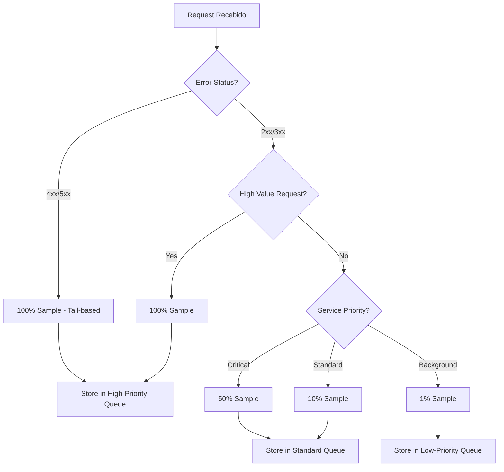

# 📊 Estratégia de Observabilidade - Versão Expandida

**Autor:** GEM 01 (Arquiteto)  
**Última Atualização:** 25/01/2025 - Expansão Estratégica Avançada (PAM V2.2)  
**Status:** Expandido - Sprint 2 PAM V2.2  
**Criticidade:** P0 - CRÍTICA  
**Versão:** 2.0.0

---

## 🎯 ESTRATÉGIA DE OBSERVABILIDADE

### Pilares da Observabilidade

```yaml
1. Logging:
  - Structured logs
  - Centralized aggregation
  - Searchable/filterable

2. Metrics:
  - Application metrics
  - Infrastructure metrics
  - Business KPIs

3. Tracing:
  - Distributed tracing
  - Request flow
  - Performance bottlenecks
```

---

## 📊 ESTRATÉGIA DE GERENCIAMENTO DE CARDINALIDADE DE MÉTRICAS

### Análise de Cardinalidade e Impacto nos Custos

A cardinalidade de métricas é o fator mais crítico no controle de custos de observabilidade. Uma única métrica mal configurada pode gerar milhões de séries temporais, resultando em custos exponenciais.

#### Matriz de Cardinalidade por Tipo de Tag

| Tipo de Tag      | Cardinalidade  | Custo Mensal (estimado) | Status       | Exemplos                                           |
| ---------------- | -------------- | ----------------------- | ------------ | -------------------------------------------------- |
| **PROIBIDAS**    | > 10.000       | > R$ 5.000              | 🚫 DENY      | `user_id`, `request_id`, `timestamp`, `ip_address` |
| **CONTROLADAS**  | 1.000 - 10.000 | R$ 500 - 2.000          | ⚠️ QUOTA     | `client_id`, `transaction_id`, `session_id`        |
| **PERMITIDAS**   | 100 - 1.000    | R$ 50 - 500             | ✅ ALLOW     | `product_id`, `partner_id`, `store_id`             |
| **RECOMENDADAS** | < 100          | < R$ 50                 | 💚 PREFERRED | `environment`, `service`, `endpoint`, `method`     |

### Política de Tags Mandatória

```typescript
// observability/cardinality/TagPolicy.ts
export class CardinalityManager {
  private readonly BANNED_TAGS = [
    'user_id',
    'request_id',
    'correlation_id',
    'trace_id',
    'ip_address',
    'user_agent',
    'timestamp',
    'uuid',
    'session_token',
    'oauth_token',
    'email',
    'cpf',
  ];

  private readonly HIGH_CARDINALITY_LIMITS = {
    client_id: 1000,
    transaction_id: 5000,
    partner_id: 50,
    store_id: 200,
    product_id: 100,
  };

  private readonly LOW_CARDINALITY_APPROVED = [
    'environment',
    'service',
    'version',
    'region',
    'method',
    'status_code',
    'endpoint',
    'error_type',
    'queue_name',
    'worker_type',
    'deployment_stage',
  ];

  validateTags(metricName: string, tags: Record<string, string>): ValidationResult {
    const violations: string[] = [];
    const warnings: string[] = [];

    // Check banned tags
    for (const tag of Object.keys(tags)) {
      if (this.BANNED_TAGS.includes(tag)) {
        violations.push(`BANNED_TAG: '${tag}' não permitida (alta cardinalidade)`);
      }
    }

    // Check cardinality limits
    for (const [tag, limit] of Object.entries(this.HIGH_CARDINALITY_LIMITS)) {
      if (tags[tag] && this.getTagCardinality(tag) > limit) {
        warnings.push(`HIGH_CARDINALITY: '${tag}' excedeu limite de ${limit}`);
      }
    }

    // Validate required tags
    const requiredTags = ['environment', 'service'];
    for (const required of requiredTags) {
      if (!tags[required]) {
        violations.push(`MISSING_REQUIRED: Tag '${required}' é obrigatória`);
      }
    }

    return {
      isValid: violations.length === 0,
      violations,
      warnings,
      estimatedMonthlyCost: this.calculateCost(metricName, tags),
    };
  }

  // Sampling strategies by cardinality
  getSamplingRate(tags: Record<string, string>): number {
    const cardinality = this.estimateCardinality(tags);

    if (cardinality < 100) return 1.0; // 100% sampling
    if (cardinality < 1000) return 0.5; // 50% sampling
    if (cardinality < 10000) return 0.1; // 10% sampling
    return 0.01; // 1% sampling for high cardinality
  }

  // Automatic tag normalization
  normalizeTags(tags: Record<string, string>): Record<string, string> {
    const normalized: Record<string, string> = {};

    for (const [key, value] of Object.entries(tags)) {
      // Convert high-cardinality to low-cardinality
      if (key === 'status_code') {
        normalized[key] = this.normalizeStatusCode(value);
      } else if (key === 'endpoint') {
        normalized[key] = this.normalizeEndpoint(value);
      } else if (key === 'user_agent') {
        normalized['browser'] = this.extractBrowser(value);
        // Don't include full user_agent
      } else if (!this.BANNED_TAGS.includes(key)) {
        normalized[key] = value;
      }
    }

    return normalized;
  }

  private normalizeStatusCode(status: string): string {
    const code = parseInt(status);
    if (code >= 200 && code < 300) return '2xx';
    if (code >= 300 && code < 400) return '3xx';
    if (code >= 400 && code < 500) return '4xx';
    if (code >= 500) return '5xx';
    return 'unknown';
  }

  private normalizeEndpoint(endpoint: string): string {
    // Replace IDs with placeholders
    return endpoint
      .replace(/\/\d+/g, '/:id')
      .replace(/\/[a-f0-9-]{36}/g, '/:uuid')
      .replace(/\/[a-f0-9]{24}/g, '/:objectId');
  }
}
```

### Sistema de Monitoramento de Cardinalidade

```typescript
// observability/cardinality/CardinalityMonitor.ts
export class CardinalityMonitor {
  private redis: Redis;
  private alerts: AlertManager;

  async trackMetricCardinality(metricName: string, tags: Record<string, string>): Promise<void> {
    const key = `cardinality:${metricName}`;
    const tagCombination = this.hashTags(tags);

    // Use HyperLogLog for cardinality estimation
    await this.redis.pfadd(key, tagCombination);

    // Check cardinality every 1000 metric points
    const count = (await this.redis.get(`${key}:count`)) || 0;
    if (parseInt(count) % 1000 === 0) {
      await this.checkCardinalityLimits(metricName);
    }

    await this.redis.incr(`${key}:count`);
    await this.redis.expire(key, 86400); // 24h TTL
  }

  async checkCardinalityLimits(metricName: string): Promise<void> {
    const cardinality = await this.getCardinality(metricName);
    const limits = {
      WARNING: 1000,
      CRITICAL: 10000,
      EMERGENCY: 100000,
    };

    if (cardinality > limits.EMERGENCY) {
      await this.alerts.fireAlert({
        severity: 'EMERGENCY',
        title: 'Cardinality Explosion Detected',
        message: `Metric ${metricName} has ${cardinality} series (>100k limit)`,
        runbook: 'https://docs.simpix.com/runbooks/cardinality-explosion',
        actions: ['disable_metric', 'emergency_sampling'],
      });
    } else if (cardinality > limits.CRITICAL) {
      await this.alerts.fireAlert({
        severity: 'CRITICAL',
        title: 'High Metric Cardinality',
        message: `Metric ${metricName} has ${cardinality} series (>10k limit)`,
        actions: ['increase_sampling', 'review_tags'],
      });
    }
  }

  // Cost estimation model
  async estimateCosts(): Promise<CostReport> {
    const metrics = await this.getAllMetrics();
    let totalCardinality = 0;
    const metricBreakdown: Record<string, number> = {};

    for (const metric of metrics) {
      const cardinality = await this.getCardinality(metric);
      metricBreakdown[metric] = cardinality;
      totalCardinality += cardinality;
    }

    // DataDog pricing: ~$0.10 per 100 custom metrics/month
    const estimatedMonthlyCost = (totalCardinality / 100) * 0.1;

    return {
      totalCardinality,
      estimatedMonthlyCost,
      metricBreakdown,
      recommendations: this.getOptimizationRecommendations(metricBreakdown),
    };
  }

  private getOptimizationRecommendations(breakdown: Record<string, number>): string[] {
    const recommendations: string[] = [];

    for (const [metric, cardinality] of Object.entries(breakdown)) {
      if (cardinality > 10000) {
        recommendations.push(`🚨 ${metric}: Reduzir tags de alta cardinalidade`);
      } else if (cardinality > 1000) {
        recommendations.push(`⚠️ ${metric}: Considerar sampling ou agregação`);
      }
    }

    return recommendations;
  }
}
```

---

## 🎯 ESTRATÉGIA DE AMOSTRAGEM (SAMPLING) PARA TRACING

### Filosofia de Sampling Multi-Camadas

Nossa estratégia de sampling balanceia observabilidade com custos, usando uma abordagem de "Head-based + Tail-based Sampling" híbrida.

#### Modelo de Decisão de Sampling



### Implementação de Sampling Inteligente

```typescript
// observability/tracing/SmartSampler.ts
export class SmartSampler {
  private redis: Redis;
  private config: SamplingConfig;

  constructor() {
    this.config = {
      // Head-based sampling rates by service
      headSamplingRates: {
        'simpix-api': 0.1, // 10% for main API
        'payment-processor': 1.0, // 100% for critical payment flows
        'notification-service': 0.01, // 1% for high-volume notifications
        'background-worker': 0.001, // 0.1% for background jobs
      },

      // Tail-based sampling criteria
      tailSamplingRules: [
        {
          name: 'error_traces',
          condition: 'span.status = ERROR',
          sampleRate: 1.0,
          priority: 1000,
        },
        {
          name: 'slow_traces',
          condition: 'trace.duration > 5s',
          sampleRate: 1.0,
          priority: 900,
        },
        {
          name: 'payment_flows',
          condition: 'service.name = payment-processor',
          sampleRate: 1.0,
          priority: 800,
        },
        {
          name: 'high_value_customers',
          condition: 'user.tier IN [premium, enterprise]',
          sampleRate: 0.5,
          priority: 700,
        },
      ],
    };
  }

  // Head-based sampling decision
  shouldSampleTrace(serviceName: string, operation: string, headers: Headers): SamplingDecision {
    const traceId = headers['x-trace-id'];

    // Always sample if forced
    if (headers['x-force-sample'] === 'true') {
      return {
        sample: true,
        reason: 'FORCED_SAMPLING',
        sampleRate: 1.0,
      };
    }

    // Error scenarios - always sample for faster debugging
    if (this.isLikelyError(operation, headers)) {
      return {
        sample: true,
        reason: 'ERROR_PREDICTION',
        sampleRate: 1.0,
      };
    }

    // Service-based sampling
    const baseRate = this.config.headSamplingRates[serviceName] || 0.01;
    const shouldSample = this.deterministicSample(traceId, baseRate);

    return {
      sample: shouldSample,
      reason: 'HEAD_BASED_SAMPLING',
      sampleRate: baseRate,
    };
  }

  // Tail-based sampling decision (after trace completion)
  async evaluateTailSampling(trace: CompletedTrace): Promise<SamplingDecision> {
    for (const rule of this.config.tailSamplingRules) {
      if (this.evaluateCondition(trace, rule.condition)) {
        const shouldSample = Math.random() < rule.sampleRate;

        if (shouldSample) {
          // Store sampling decision in Redis for consistency
          await this.storeSamplingDecision(trace.traceId, {
            rule: rule.name,
            priority: rule.priority,
            sampleRate: rule.sampleRate,
          });

          return {
            sample: true,
            reason: `TAIL_BASED_${rule.name.toUpperCase()}`,
            sampleRate: rule.sampleRate,
            priority: rule.priority,
          };
        }
      }
    }

    return {
      sample: false,
      reason: 'TAIL_BASED_DROPPED',
      sampleRate: 0,
    };
  }

  // Adaptive sampling based on traffic patterns
  async getAdaptiveSamplingRate(serviceName: string): Promise<number> {
    const currentHour = new Date().getHours();
    const trafficKey = `traffic:${serviceName}:${currentHour}`;

    const currentTraffic = (await this.redis.get(trafficKey)) || 0;
    const baseRate = this.config.headSamplingRates[serviceName] || 0.01;

    // Increase sampling during low traffic, decrease during high traffic
    if (currentTraffic < 100) return Math.min(baseRate * 2, 1.0);
    if (currentTraffic > 10000) return Math.max(baseRate * 0.1, 0.001);

    return baseRate;
  }

  // Cost-aware sampling
  async calculateOptimalSamplingRate(
    serviceName: string,
    targetMonthlyCost: number
  ): Promise<SamplingConfig> {
    const currentRate = this.config.headSamplingRates[serviceName];
    const currentVolume = await this.getServiceVolume(serviceName);
    const currentCost = this.estimateTracingCost(currentVolume, currentRate);

    if (currentCost <= targetMonthlyCost) {
      return { sampleRate: currentRate, costProjection: currentCost };
    }

    // Calculate required rate reduction
    const requiredReduction = targetMonthlyCost / currentCost;
    const newRate = Math.max(currentRate * requiredReduction, 0.001); // Min 0.1%

    return {
      sampleRate: newRate,
      costProjection: targetMonthlyCost,
      savingsProjection: currentCost - targetMonthlyCost,
    };
  }

  // Intelligent error pattern detection
  private isLikelyError(operation: string, headers: Headers): boolean {
    const errorIndicators = [
      'retry',
      'fallback',
      'circuit-breaker',
      'timeout',
      'exception',
      'error',
    ];

    return errorIndicators.some((indicator) => operation.toLowerCase().includes(indicator));
  }

  // Deterministic sampling for consistency
  private deterministicSample(traceId: string, rate: number): boolean {
    const hash = this.hashString(traceId);
    return hash % 10000 < rate * 10000;
  }

  private hashString(str: string): number {
    let hash = 0;
    for (let i = 0; i < str.length; i++) {
      const char = str.charCodeAt(i);
      hash = (hash << 5) - hash + char;
      hash = hash & hash; // Convert to 32-bit integer
    }
    return Math.abs(hash);
  }
}
```

### Configuração de Sampling por Ambiente

```yaml
# config/sampling-strategy.yml
environments:
  production:
    global_sample_rate: 0.01 # 1% default
    services:
      simpix-api:
        head_sample_rate: 0.1
        tail_rules:
          - errors: 1.0 # 100% of errors
          - slow_requests: 1.0 # 100% if > 2s
          - payment_flows: 1.0 # 100% of payments

  staging:
    global_sample_rate: 0.1 # 10% default
    services:
      simpix-api:
        head_sample_rate: 0.5

  development:
    global_sample_rate: 1.0 # 100% in dev
    force_sampling: true
```

---

## 🔍 IMPLEMENTAÇÃO DE CONTINUOUS PROFILING EM PRODUÇÃO

### Estratégia de Profiling Não-Intrusivo

O profiling contínuo deve fornecer insights profundos sem impactar a performance do sistema. Utilizamos uma abordagem de "always-on profiling" com overhead controlado.

#### Arquitetura de Profiling

```typescript
// observability/profiling/ContinuousProfiler.ts
export class ContinuousProfiler {
  private profiler: v8.Profiler;
  private storage: ProfileStorage;
  private scheduler: ProfileScheduler;

  constructor() {
    this.profiler = new v8.Profiler({
      sampleInterval: 10000, // 10ms sampling interval
      maxStackDepth: 50,
      enabled: process.env.NODE_ENV === 'production',
    });
  }

  async startProfiling(): Promise<void> {
    if (!this.shouldProfile()) return;

    // CPU Profiling - Low overhead sampling
    await this.startCPUProfiling();

    // Memory Profiling - Heap snapshots
    await this.scheduleMemoryProfiling();

    // Custom Business Logic Profiling
    await this.startBusinessProfiler();

    // Performance critical path profiling
    await this.startCriticalPathProfiler();
  }

  private async startCPUProfiling(): Promise<void> {
    const profilingConfig = {
      duration: 30000, // 30 second profiles
      interval: 300000, // Every 5 minutes
      maxCPUUsage: 0.05, // Max 5% CPU overhead
      autoAdjust: true, // Automatically reduce frequency if overhead too high
    };

    this.scheduler.schedule('cpu-profile', profilingConfig, async () => {
      const profile = await this.profiler.startCPUProfile('cpu-sample');

      setTimeout(async () => {
        const data = await this.profiler.stopCPUProfile();
        await this.analyzeAndStore(data, 'cpu');
      }, profilingConfig.duration);
    });
  }

  private async scheduleMemoryProfiling(): Promise<void> {
    // Heap snapshots during low-traffic periods
    this.scheduler.schedule(
      'memory-profile',
      {
        cron: '0 3 * * *', // 3 AM daily
        onHighMemoryUsage: true, // Trigger if memory > 80%
        maxSnapshotSize: '100MB',
      },
      async () => {
        const snapshot = await this.takeHeapSnapshot();
        await this.analyzeMemoryLeaks(snapshot);
        await this.generateMemoryReport(snapshot);
      }
    );
  }

  // Business logic specific profiling
  private async startBusinessProfiler(): Promise<void> {
    const businessMetrics = [
      'credit_analysis_duration',
      'payment_processing_time',
      'document_generation_time',
      'external_api_latency',
    ];

    for (const metric of businessMetrics) {
      this.profiler.addCustomProfiler(metric, {
        threshold: this.getThresholdFor(metric),
        sampleRate: 0.1, // 10% of operations
        includeStackTrace: true,
      });
    }
  }

  // Critical path performance monitoring
  private async startCriticalPathProfiler(): Promise<void> {
    const criticalPaths = [
      {
        name: 'proposal_submission',
        route: '/api/propostas',
        method: 'POST',
        slaThreshold: 2000, // 2 seconds
        profileOnSLABreach: true,
      },
      {
        name: 'payment_processing',
        route: '/api/pagamentos/process',
        method: 'POST',
        slaThreshold: 5000, // 5 seconds
        profileOnSLABreach: true,
      },
    ];

    for (const path of criticalPaths) {
      this.profiler.addPathProfiler(path, {
        captureOnSLABreach: true,
        captureFlameGraph: true,
        includeDBQueries: true,
        includeExternalCalls: true,
      });
    }
  }

  // Smart profiling based on anomaly detection
  async enableAnomalyTriggeredProfiling(): Promise<void> {
    const anomalyDetector = new AnomalyDetector({
      metrics: ['cpu_usage', 'memory_usage', 'response_time'],
      windowSize: 300, // 5 minute windows
      sensitivityLevel: 2.0, // 2 standard deviations
    });

    anomalyDetector.onAnomalyDetected(async (anomaly) => {
      await this.triggerEmergencyProfiling({
        type: anomaly.type,
        severity: anomaly.severity,
        duration: Math.min(anomaly.severity * 30, 300), // Max 5 minutes
        includeFullStackTrace: true,
        notifyOncall: anomaly.severity > 3,
      });
    });
  }

  // Profile analysis and insights generation
  private async analyzeAndStore(profileData: any, type: string): Promise<void> {
    const analysis = await this.performAnalysis(profileData, type);

    // Store raw profile data
    await this.storage.store(profileData, {
      type,
      timestamp: Date.now(),
      metadata: await this.gatherMetadata(),
    });

    // Generate insights
    const insights = await this.generateInsights(analysis);

    // Alert on critical findings
    if (insights.criticalIssues.length > 0) {
      await this.alertOnCriticalFindings(insights);
    }

    // Update performance baseline
    await this.updatePerformanceBaseline(analysis);
  }

  private async generateInsights(analysis: ProfileAnalysis): Promise<ProfileInsights> {
    return {
      topCPUConsumers: analysis.functions.sort((a, b) => b.cpuUsage - a.cpuUsage).slice(0, 10),

      memoryLeaks: await this.detectMemoryLeaks(analysis),

      performanceRegressions: await this.detectRegressions(analysis),

      optimizationOpportunities: await this.identifyOptimizations(analysis),

      businessImpact: await this.assessBusinessImpact(analysis),

      recommendations: await this.generateRecommendations(analysis),
    };
  }

  // Memory leak detection algorithm
  private async detectMemoryLeaks(analysis: ProfileAnalysis): Promise<MemoryLeak[]> {
    const leaks: MemoryLeak[] = [];

    // Detect growing objects over time
    const growingObjects = analysis.heapGrowth
      .filter((obj) => obj.growthRate > 0.1) // 10% growth per profile
      .filter((obj) => obj.retainedSize > 1024 * 1024); // > 1MB

    for (const obj of growingObjects) {
      leaks.push({
        type: 'GROWING_OBJECT',
        objectType: obj.constructor,
        growthRate: obj.growthRate,
        currentSize: obj.retainedSize,
        suspectedCause: await this.identifyLeakCause(obj),
        severity: this.calculateLeakSeverity(obj),
      });
    }

    return leaks;
  }

  // Performance regression detection
  private async detectRegressions(analysis: ProfileAnalysis): Promise<Regression[]> {
    const baseline = await this.getPerformanceBaseline();
    const regressions: Regression[] = [];

    for (const func of analysis.functions) {
      const baselinePerf = baseline.functions[func.name];
      if (!baselinePerf) continue;

      const performanceChange =
        (func.averageTime - baselinePerf.averageTime) / baselinePerf.averageTime;

      if (performanceChange > 0.2) {
        // 20% regression threshold
        regressions.push({
          function: func.name,
          regressionPercent: performanceChange * 100,
          currentTime: func.averageTime,
          baselineTime: baselinePerf.averageTime,
          potentialCause: await this.identifyRegressionCause(func),
          businessImpact: await this.calculateBusinessImpact(func),
        });
      }
    }

    return regressions;
  }
}
```

### Alertas Inteligentes de Performance

```typescript
// observability/profiling/PerformanceAlerting.ts
export class PerformanceAlerting {
  async evaluatePerformanceAlerts(insights: ProfileInsights): Promise<void> {
    // Memory leak alerts
    for (const leak of insights.memoryLeaks) {
      if (leak.severity === 'CRITICAL') {
        await this.fireAlert({
          severity: 'P1',
          title: 'Critical Memory Leak Detected',
          description: `${leak.objectType} growing at ${leak.growthRate}% per hour`,
          runbook: 'https://docs.simpix.com/runbooks/memory-leaks',
          metrics: {
            current_size: leak.currentSize,
            growth_rate: leak.growthRate,
          },
          actions: ['investigate_immediately', 'consider_restart'],
        });
      }
    }

    // Performance regression alerts
    for (const regression of insights.performanceRegressions) {
      if (regression.regressionPercent > 50) {
        await this.fireAlert({
          severity: 'P2',
          title: 'Significant Performance Regression',
          description: `${regression.function} is ${regression.regressionPercent}% slower`,
          runbook: 'https://docs.simpix.com/runbooks/performance-regression',
          metrics: {
            function_name: regression.function,
            regression_percent: regression.regressionPercent,
            business_impact: regression.businessImpact,
          },
        });
      }
    }
  }
}
```

---

## 💰 GESTÃO DE CUSTOS DE OBSERVABILIDADE

### Framework FinOps para Observabilidade

Os custos de observabilidade podem rapidamente escalar e superar os custos da própria infraestrutura. Implementamos um framework rigoroso de controle de custos.

#### Estrutura de Custos por Categoria

```typescript
// observability/costs/ObservabilityCostManager.ts
export class ObservabilityCostManager {
  private costBreakdown = {
    // Logs - Maior contribuidor de custos
    logging: {
      ingestion: 0, // $/GB ingested
      storage: 0, // $/GB/month stored
      search: 0, // $/GB scanned
      alerting: 0, // $/alert fired
    },

    // Metrics - Alto custo de cardinalidade
    metrics: {
      customMetrics: 0, // $/metric/month
      hostMetrics: 0, // $/host/month
      integrations: 0, // $/integration/month
      dashboards: 0, // $/dashboard/month
    },

    // Tracing - Custo por span
    tracing: {
      spansIngested: 0, // $/million spans
      spansStored: 0, // $/million spans/month
      analysis: 0, // $/query
    },

    // APM - Custo por host/container
    apm: {
      hosts: 0, // $/host/month
      containers: 0, // $/container/month
      profiling: 0, // $/profile/month
    },
  };

  async calculateMonthlyCosts(): Promise<CostBreakdown> {
    const costs = await Promise.all([
      this.calculateLoggingCosts(),
      this.calculateMetricsCosts(),
      this.calculateTracingCosts(),
      this.calculateAPMCosts(),
    ]);

    const total = costs.reduce((sum, cost) => sum + cost.total, 0);

    return {
      total,
      breakdown: costs,
      projectedAnnual: total * 12,
      costPerRequest: total / (await this.getMonthlyRequestCount()),
      recommendations: await this.generateCostOptimizations(costs),
    };
  }

  private async calculateLoggingCosts(): Promise<ComponentCost> {
    const volume = await this.getLogVolume(); // GB/month
    const retention = await this.getLogRetention(); // months

    // DataDog pricing example
    const ingestionCost = volume * 0.1; // $0.10/GB
    const storageCost = volume * retention * 0.02; // $0.02/GB/month
    const searchCost = await this.calculateSearchCosts();

    return {
      component: 'logging',
      total: ingestionCost + storageCost + searchCost,
      breakdown: {
        ingestion: ingestionCost,
        storage: storageCost,
        search: searchCost,
      },
      optimizations: await this.getLoggingOptimizations(volume),
    };
  }

  private async calculateMetricsCosts(): Promise<ComponentCost> {
    const customMetrics = await this.getCustomMetricsCount();
    const hosts = await this.getHostCount();

    // Pricing varies by provider
    const customMetricsCost = customMetrics * 0.05; // $0.05/metric/month
    const hostsCost = hosts * 15; // $15/host/month

    return {
      component: 'metrics',
      total: customMetricsCost + hostsCost,
      breakdown: {
        customMetrics: customMetricsCost,
        hosts: hostsCost,
      },
      optimizations: await this.getMetricsOptimizations(customMetrics),
    };
  }

  // Cost optimization recommendations
  private async generateCostOptimizations(costs: ComponentCost[]): Promise<Optimization[]> {
    const optimizations: Optimization[] = [];

    // Logging optimizations
    const loggingCost = costs.find((c) => c.component === 'logging');
    if (loggingCost && loggingCost.total > 1000) {
      optimizations.push({
        type: 'REDUCE_LOG_RETENTION',
        description: 'Reduzir retenção de logs de 30 para 14 dias',
        potentialSavings: loggingCost.total * 0.5,
        effort: 'LOW',
        implementation: 'Update retention policies in log aggregator',
      });
    }

    // Metrics optimizations
    const metricsCost = costs.find((c) => c.component === 'metrics');
    if (metricsCost && metricsCost.breakdown.customMetrics > 500) {
      optimizations.push({
        type: 'REDUCE_METRIC_CARDINALITY',
        description: 'Implementar sampling de métricas de alta cardinalidade',
        potentialSavings: metricsCost.breakdown.customMetrics * 0.7,
        effort: 'MEDIUM',
        implementation: 'Deploy cardinality manager and sampling rules',
      });
    }

    return optimizations;
  }

  // Cost alerting system
  async setupCostAlerting(): Promise<void> {
    const budgets = {
      monthly: 2000, // $2k/month total budget
      dailyLimit: 100, // $100/day spike protection
      components: {
        logging: 800, // $800/month max for logs
        metrics: 600, // $600/month max for metrics
        tracing: 400, // $400/month max for tracing
        apm: 200, // $200/month max for APM
      },
    };

    // Daily cost check
    this.scheduler.schedule('daily-cost-check', { cron: '0 9 * * *' }, async () => {
      const dailyCosts = await this.calculateDailyCosts();

      if (dailyCosts.total > budgets.dailyLimit) {
        await this.fireAlert({
          severity: 'P2',
          title: 'Daily Observability Budget Exceeded',
          description: `Daily costs: $${dailyCosts.total} (limit: $${budgets.dailyLimit})`,
          actions: ['review_usage', 'implement_emergency_sampling'],
        });
      }
    });

    // Monthly projection check
    this.scheduler.schedule('monthly-projection', { cron: '0 10 15 * *' }, async () => {
      const monthlyProjection = await this.projectMonthlyCosts();

      if (monthlyProjection > budgets.monthly * 1.2) {
        await this.fireAlert({
          severity: 'P1',
          title: 'Monthly Observability Budget Will Be Exceeded',
          description: `Projected: $${monthlyProjection} (budget: $${budgets.monthly})`,
          actions: ['urgent_cost_optimization', 'budget_review'],
        });
      }
    });
  }

  // Real-time cost tracking
  async trackRealTimeCosts(): Promise<void> {
    const costStream = new EventEmitter();

    // Track log ingestion costs in real-time
    this.logIngestionStream.on('data', (logEntry) => {
      const costImpact = this.calculateLogCostImpact(logEntry);
      costStream.emit('cost-increment', {
        component: 'logging',
        cost: costImpact,
        timestamp: Date.now(),
      });
    });

    // Track metric creation costs
    this.metricCreationStream.on('data', (metric) => {
      const costImpact = this.calculateMetricCostImpact(metric);
      costStream.emit('cost-increment', {
        component: 'metrics',
        cost: costImpact,
        timestamp: Date.now(),
      });
    });

    // Aggregate and alert on cost spikes
    costStream.on('cost-increment', (event) => {
      this.updateRealTimeCostTracker(event);
    });
  }
}
```

### Sistema de Quotas e Limites

```typescript
// observability/costs/QuotaManager.ts
export class QuotaManager {
  private quotas = {
    logging: {
      dailyIngestionGB: 100,
      maxLogLevel: 'INFO',
      retentionDays: 14,
      maxFieldsPerLog: 20,
    },
    metrics: {
      maxCustomMetrics: 1000,
      maxCardinality: 10000,
      maxTagsPerMetric: 10,
      samplingRequired: true,
    },
    tracing: {
      maxSpansPerDay: 1000000,
      maxTraceRetention: 7,
      requiredSampling: 0.1,
      maxSpanSize: '64KB',
    },
  };

  async enforceQuotas(): Promise<void> {
    // Log quota enforcement
    await this.enforceLogs();

    // Metric quota enforcement
    await this.enforceMetrics();

    // Tracing quota enforcement
    await this.enforceTracing();
  }

  private async enforceLogs(): Promise<void> {
    const dailyUsage = await this.getDailyLogUsage();

    if (dailyUsage.gb > this.quotas.logging.dailyIngestionGB * 0.9) {
      // Near quota - reduce log levels
      await this.adjustLogLevels('WARN');

      await this.fireAlert({
        severity: 'WARNING',
        title: 'Log Quota Nearly Exceeded',
        description: `Daily usage: ${dailyUsage.gb}GB (quota: ${this.quotas.logging.dailyIngestionGB}GB)`,
      });
    }

    if (dailyUsage.gb > this.quotas.logging.dailyIngestionGB) {
      // Quota exceeded - emergency measures
      await this.adjustLogLevels('ERROR');
      await this.enableLogSampling(0.1); // 10% sampling

      await this.fireAlert({
        severity: 'CRITICAL',
        title: 'Log Quota Exceeded - Emergency Sampling Activated',
        description: 'Log ingestion has been reduced to prevent budget overrun',
      });
    }
  }

  // Dynamic quota adjustment based on business value
  async adjustQuotasBasedOnBusinessValue(): Promise<void> {
    const businessEvents = await this.getBusinessEvents();

    // Increase quotas during high-value periods
    if (businessEvents.includes('BLACK_FRIDAY') || businessEvents.includes('MONTH_END')) {
      await this.temporaryQuotaIncrease({
        multiplier: 2.0,
        duration: '24h',
        reason: 'HIGH_BUSINESS_VALUE_PERIOD',
      });
    }

    // Reduce quotas during low-activity periods
    if (businessEvents.includes('WEEKEND') || businessEvents.includes('HOLIDAY')) {
      await this.temporaryQuotaDecrease({
        multiplier: 0.5,
        duration: '48h',
        reason: 'LOW_ACTIVITY_PERIOD',
      });
    }
  }
}
```

---

## ✅ CHECKLIST DE REVISÃO DE PRONTIDÃO OPERACIONAL (ORR)

### Framework de Revisão de Prontidão

Antes de qualquer serviço ou feature ir para produção, deve passar por uma revisão rigorosa de observabilidade. Este checklist garante que temos visibilidade adequada desde o primeiro deploy.

#### Checklist Obrigatório - Nível 1 (Básico)

```yaml
# observability/orr/basic-checklist.yml
basic_requirements:
  logging:
    - id: LOG_001
      requirement: 'Structured logging implementado'
      validation: 'Logs em formato JSON com timestamps'
      automated_check: true

    - id: LOG_002
      requirement: 'Correlation IDs em todas as requisições'
      validation: 'X-Correlation-ID presente em logs'
      automated_check: true

    - id: LOG_003
      requirement: 'Dados sensíveis não logados'
      validation: 'Scan por patterns de CPF, email, tokens'
      automated_check: true

    - id: LOG_004
      requirement: 'Log levels apropriados'
      validation: 'ERROR para falhas, WARN para degradação, INFO para eventos importantes'
      automated_check: false

  metrics:
    - id: MET_001
      requirement: 'Métricas RED implementadas'
      validation: 'Rate, Errors, Duration para todos endpoints'
      automated_check: true

    - id: MET_002
      requirement: 'Business metrics definidas'
      validation: 'Métricas específicas do domínio implementadas'
      automated_check: false

    - id: MET_003
      requirement: 'Health check endpoint'
      validation: '/health retorna status de dependências'
      automated_check: true

    - id: MET_004
      requirement: 'Cardinalidade controlada'
      validation: 'Máximo 10 tags por métrica, sem IDs únicos'
      automated_check: true

  tracing:
    - id: TRC_001
      requirement: 'Distributed tracing configurado'
      validation: 'Spans criados para operações importantes'
      automated_check: true

    - id: TRC_002
      requirement: 'Sampling implementado'
      validation: 'Taxa de sampling < 100% em produção'
      automated_check: true

    - id: TRC_003
      requirement: 'Traces de erro capturados'
      validation: '100% de traces com erro são armazenados'
      automated_check: true

  alerting:
    - id: ALT_001
      requirement: 'Alertas críticos configurados'
      validation: 'Error rate, latency P95, availability'
      automated_check: false

    - id: ALT_002
      requirement: 'Runbooks linkados'
      validation: 'Todos alertas têm runbook de resposta'
      automated_check: false
```

#### Checklist Avançado - Nível 2 (Para Serviços Críticos)

```yaml
# observability/orr/advanced-checklist.yml
advanced_requirements:
  performance:
    - id: PRF_001
      requirement: 'Continuous profiling habilitado'
      validation: 'CPU e memory profiling em produção'
      automated_check: true

    - id: PRF_002
      requirement: 'Performance baselines definidos'
      validation: 'SLIs documentados com thresholds'
      automated_check: false

    - id: PRF_003
      requirement: 'Load testing com observabilidade'
      validation: 'Testes incluem validação de métricas'
      automated_check: false

  security:
    - id: SEC_001
      requirement: 'Security metrics implementadas'
      validation: 'Failed logins, suspicious patterns'
      automated_check: false

    - id: SEC_002
      requirement: 'Audit logs configurados'
      validation: 'Todas operações críticas auditadas'
      automated_check: false

    - id: SEC_003
      requirement: 'Anomaly detection ativo'
      validation: 'Detecção de padrões anômalos'
      automated_check: true

  business:
    - id: BUS_001
      requirement: 'Business KPIs monitorados'
      validation: 'Métricas de conversão, revenue, etc.'
      automated_check: false

    - id: BUS_002
      requirement: 'SLOs definidos e monitorados'
      validation: 'Service Level Objectives com alertas'
      automated_check: true

    - id: BUS_003
      requirement: 'Customer journey tracking'
      validation: 'Traces de jornadas críticas'
      automated_check: false
```

### Automação da Revisão ORR

```typescript
// observability/orr/ORRValidator.ts
export class ORRValidator {
  private checklist: ORRChecklist;
  private automatedChecks: AutomatedChecks;

  async validateService(serviceName: string, version: string): Promise<ORRResult> {
    const result: ORRResult = {
      serviceName,
      version,
      timestamp: Date.now(),
      overallStatus: 'PENDING',
      categories: {},
      blockers: [],
      warnings: [],
      score: 0,
    };

    // Run all automated checks
    const automatedResults = await this.runAutomatedChecks(serviceName);

    // Manual checks that need human validation
    const manualChecks = await this.getManualChecks(serviceName);

    // Combine results
    result.categories = {
      logging: await this.validateLogging(serviceName, automatedResults),
      metrics: await this.validateMetrics(serviceName, automatedResults),
      tracing: await this.validateTracing(serviceName, automatedResults),
      alerting: await this.validateAlerting(serviceName),
      performance: await this.validatePerformance(serviceName),
      security: await this.validateSecurity(serviceName),
      business: await this.validateBusiness(serviceName),
    };

    // Calculate overall score and status
    result.score = this.calculateScore(result.categories);
    result.overallStatus = this.determineStatus(result.score, result.categories);

    // Generate improvement recommendations
    result.recommendations = await this.generateRecommendations(result);

    return result;
  }

  private async runAutomatedChecks(serviceName: string): Promise<AutomatedCheckResult[]> {
    const checks = [
      // Logging checks
      this.checkStructuredLogging(serviceName),
      this.checkCorrelationIDs(serviceName),
      this.checkSensitiveDataLeaks(serviceName),

      // Metrics checks
      this.checkREDMetrics(serviceName),
      this.checkHealthEndpoint(serviceName),
      this.checkCardinalityLimits(serviceName),

      // Tracing checks
      this.checkDistributedTracing(serviceName),
      this.checkSamplingConfiguration(serviceName),
      this.checkErrorTraceCapture(serviceName),

      // Performance checks
      this.checkProfilingEnabled(serviceName),
      this.checkAnomalyDetection(serviceName),
    ];

    return Promise.all(checks);
  }

  // Specific automated checks
  private async checkREDMetrics(serviceName: string): Promise<AutomatedCheckResult> {
    const requiredMetrics = [
      `http_requests_total{service="${serviceName}"}`,
      `http_request_duration_seconds{service="${serviceName}"}`,
      `http_errors_total{service="${serviceName}"}`,
    ];

    const missingMetrics = [];
    for (const metric of requiredMetrics) {
      const exists = await this.metricsClient.metricExists(metric);
      if (!exists) {
        missingMetrics.push(metric);
      }
    }

    return {
      checkId: 'MET_001',
      passed: missingMetrics.length === 0,
      details:
        missingMetrics.length > 0
          ? `Missing metrics: ${missingMetrics.join(', ')}`
          : 'All RED metrics present',
      severity: missingMetrics.length > 0 ? 'BLOCKER' : 'PASS',
    };
  }

  private async checkSensitiveDataLeaks(serviceName: string): Promise<AutomatedCheckResult> {
    const sensitivePatterns = [
      /\b\d{3}\.\d{3}\.\d{3}-\d{2}\b/, // CPF
      /\b[A-Za-z0-9._%+-]+@[A-Za-z0-9.-]+\.[A-Z|a-z]{2,}\b/, // Email
      /\b[A-Za-z0-9]{40,}\b/, // Potential tokens
      /password/i,
      /secret/i,
      /key/i,
    ];

    const recentLogs = await this.logsClient.getRecentLogs(serviceName, '1h');
    const violations = [];

    for (const log of recentLogs) {
      for (const pattern of sensitivePatterns) {
        if (pattern.test(log.message)) {
          violations.push({
            logId: log.id,
            pattern: pattern.source,
            timestamp: log.timestamp,
          });
        }
      }
    }

    return {
      checkId: 'LOG_003',
      passed: violations.length === 0,
      details:
        violations.length > 0
          ? `Found ${violations.length} potential data leaks`
          : 'No sensitive data detected in logs',
      severity: violations.length > 0 ? 'BLOCKER' : 'PASS',
      violations,
    };
  }

  // Overall status determination
  private determineStatus(score: number, categories: CategoryResults): ORRStatus {
    const blockers = Object.values(categories)
      .flat()
      .filter((check) => check.severity === 'BLOCKER');

    if (blockers.length > 0) return 'BLOCKED';
    if (score >= 95) return 'EXCELLENT';
    if (score >= 85) return 'GOOD';
    if (score >= 70) return 'ACCEPTABLE';
    return 'NEEDS_IMPROVEMENT';
  }

  // Generate improvement recommendations
  private async generateRecommendations(result: ORRResult): Promise<Recommendation[]> {
    const recommendations: Recommendation[] = [];

    // Low score recommendations
    if (result.score < 85) {
      recommendations.push({
        priority: 'HIGH',
        category: 'OVERALL',
        title: 'Improve Observability Score',
        description: `Current score: ${result.score}%. Target: 85%+`,
        effort: 'MEDIUM',
        impact: 'HIGH',
      });
    }

    // Category-specific recommendations
    for (const [category, checks] of Object.entries(result.categories)) {
      const failedChecks = checks.filter((check) => !check.passed);

      if (failedChecks.length > 0) {
        recommendations.push({
          priority: this.determinePriority(failedChecks),
          category: category.toUpperCase(),
          title: `Fix ${category} Issues`,
          description: `${failedChecks.length} checks failed in ${category}`,
          effort: this.estimateEffort(failedChecks),
          impact: this.estimateImpact(category, failedChecks),
        });
      }
    }

    return recommendations;
  }
}
```

### Integração com Pipeline CI/CD

```typescript
// observability/orr/CIPipelineIntegration.ts
export class ORRPipelineIntegration {
  async validateInPipeline(context: PipelineContext): Promise<PipelineResult> {
    const orr = new ORRValidator();
    const result = await orr.validateService(context.serviceName, context.version);

    // Block deployment if critical issues found
    if (result.overallStatus === 'BLOCKED') {
      throw new PipelineBlockedException({
        reason: 'ORR validation failed',
        blockers: result.blockers,
        runbook: 'https://docs.simpix.com/runbooks/orr-failures',
      });
    }

    // Create GitHub check if configured
    if (context.githubIntegration) {
      await this.createGitHubCheck(context.pullRequest, result);
    }

    // Generate deployment report
    await this.generateDeploymentReport(result);

    return {
      canDeploy: result.overallStatus !== 'BLOCKED',
      warnings: result.warnings,
      recommendations: result.recommendations,
      score: result.score,
    };
  }

  private async createGitHubCheck(pr: PullRequest, result: ORRResult): Promise<void> {
    const status = result.overallStatus === 'BLOCKED' ? 'failure' : 'success';
    const summary = this.generateCheckSummary(result);

    await this.github.createCheck({
      name: 'Observability Readiness Review',
      status,
      summary,
      details: this.formatResultDetails(result),
    });
  }
}
```

---

## 📋 IMPLEMENTAÇÃO FASE 0 (SUPABASE)

### DIA 1: Logging Estruturado

#### Setup Winston

```javascript
// config/logger.js
const winston = require('winston');

const logger = winston.createLogger({
  level: process.env.LOG_LEVEL || 'info',
  format: winston.format.combine(
    winston.format.timestamp(),
    winston.format.errors({ stack: true }),
    winston.format.json()
  ),
  defaultMeta: {
    service: 'simpix-api',
    environment: process.env.NODE_ENV,
  },
  transports: [
    // Console para desenvolvimento
    new winston.transports.Console({
      format: winston.format.combine(winston.format.colorize(), winston.format.simple()),
    }),
    // File para produção
    new winston.transports.File({
      filename: 'logs/error.log',
      level: 'error',
    }),
    new winston.transports.File({
      filename: 'logs/combined.log',
    }),
  ],
});

// Adicionar correlation ID
logger.addCorrelationId = (req) => {
  const correlationId = req.headers['x-correlation-id'] || require('uuid').v4();
  req.correlationId = correlationId;
  return correlationId;
};

module.exports = logger;
```

#### Middleware de Logging

```javascript
// middleware/logging.js
const logger = require('../config/logger');

function requestLogger(req, res, next) {
  const correlationId = logger.addCorrelationId(req);
  const startTime = Date.now();

  // Log request
  logger.info('Request received', {
    correlationId,
    method: req.method,
    url: req.url,
    ip: req.ip,
    userAgent: req.get('user-agent'),
  });

  // Log response
  res.on('finish', () => {
    const duration = Date.now() - startTime;
    logger.info('Request completed', {
      correlationId,
      method: req.method,
      url: req.url,
      statusCode: res.statusCode,
      duration,
    });

    // Alert on slow requests
    if (duration > 1000) {
      logger.warn('Slow request detected', {
        correlationId,
        url: req.url,
        duration,
      });
    }
  });

  next();
}

module.exports = requestLogger;
```

### DIA 2: Error Tracking (Sentry)

#### Setup Sentry

```javascript
// config/sentry.js
const Sentry = require('@sentry/node');
const Tracing = require('@sentry/tracing');

function initSentry(app) {
  Sentry.init({
    dsn: process.env.SENTRY_DSN,
    environment: process.env.NODE_ENV,
    integrations: [
      new Sentry.Integrations.Http({ tracing: true }),
      new Tracing.Integrations.Express({ app }),
      new Tracing.Integrations.Postgres(),
    ],
    tracesSampleRate: process.env.NODE_ENV === 'production' ? 0.1 : 1.0,
    beforeSend(event, hint) {
      // Filtrar dados sensíveis
      if (event.request) {
        delete event.request.cookies;
        delete event.request.headers?.authorization;
      }
      return event;
    },
  });

  // Request Handler
  app.use(Sentry.Handlers.requestHandler());
  app.use(Sentry.Handlers.tracingHandler());
}

function sentryErrorHandler() {
  return Sentry.Handlers.errorHandler({
    shouldHandleError(error) {
      // Capturar apenas erros 500+
      return error.status >= 500;
    },
  });
}

module.exports = { initSentry, sentryErrorHandler };
```

### DIA 3: Health Checks e Métricas

#### Health Check Endpoint

```javascript
// routes/health.js
const express = require('express');
const router = express.Router();
const { db } = require('../config/database');
const logger = require('../config/logger');

router.get('/health', async (req, res) => {
  const health = {
    status: 'healthy',
    timestamp: new Date().toISOString(),
    uptime: process.uptime(),
    checks: {},
  };

  // Database check
  try {
    await db.query('SELECT 1');
    health.checks.database = { status: 'healthy' };
  } catch (error) {
    health.status = 'unhealthy';
    health.checks.database = {
      status: 'unhealthy',
      error: error.message,
    };
    logger.error('Health check failed - Database', { error });
  }

  // Redis check (se aplicável)
  try {
    if (global.redisClient) {
      await global.redisClient.ping();
      health.checks.redis = { status: 'healthy' };
    }
  } catch (error) {
    health.status = 'degraded';
    health.checks.redis = {
      status: 'unhealthy',
      error: error.message,
    };
  }

  // External APIs check
  health.checks.bancoInter = await checkBancoInter();
  health.checks.clickSign = await checkClickSign();

  // Memory usage
  const memUsage = process.memoryUsage();
  health.memory = {
    rss: `${Math.round(memUsage.rss / 1024 / 1024)}MB`,
    heapUsed: `${Math.round(memUsage.heapUsed / 1024 / 1024)}MB`,
    heapTotal: `${Math.round(memUsage.heapTotal / 1024 / 1024)}MB`,
  };

  const statusCode = health.status === 'healthy' ? 200 : 503;
  res.status(statusCode).json(health);
});

async function checkBancoInter() {
  // Implementar ping para Banco Inter
  return { status: 'healthy' };
}

async function checkClickSign() {
  // Implementar ping para ClickSign
  return { status: 'healthy' };
}

module.exports = router;
```

#### Métricas Básicas

```javascript
// config/metrics.js
class MetricsCollector {
  constructor() {
    this.counters = new Map();
    this.gauges = new Map();
    this.histograms = new Map();
  }

  // Contador (sempre incrementa)
  increment(name, labels = {}) {
    const key = this.getKey(name, labels);
    const current = this.counters.get(key) || 0;
    this.counters.set(key, current + 1);
  }

  // Gauge (pode subir ou descer)
  setGauge(name, value, labels = {}) {
    const key = this.getKey(name, labels);
    this.gauges.set(key, value);
  }

  // Histogram (distribuição)
  recordTime(name, duration, labels = {}) {
    const key = this.getKey(name, labels);
    if (!this.histograms.has(key)) {
      this.histograms.set(key, []);
    }
    this.histograms.get(key).push(duration);
  }

  getKey(name, labels) {
    const labelStr = Object.entries(labels)
      .sort(([a], [b]) => a.localeCompare(b))
      .map(([k, v]) => `${k}="${v}"`)
      .join(',');
    return labelStr ? `${name}{${labelStr}}` : name;
  }

  // Export metrics (Prometheus format)
  export() {
    const lines = [];

    // Counters
    for (const [key, value] of this.counters) {
      lines.push(`${key} ${value}`);
    }

    // Gauges
    for (const [key, value] of this.gauges) {
      lines.push(`${key} ${value}`);
    }

    // Histograms (simplified)
    for (const [key, values] of this.histograms) {
      if (values.length > 0) {
        const sum = values.reduce((a, b) => a + b, 0);
        const avg = sum / values.length;
        lines.push(`${key}_sum ${sum}`);
        lines.push(`${key}_count ${values.length}`);
        lines.push(`${key}_avg ${avg}`);
      }
    }

    return lines.join('\n');
  }
}

const metrics = new MetricsCollector();

// Middleware para coletar métricas
function metricsMiddleware(req, res, next) {
  const startTime = Date.now();

  res.on('finish', () => {
    const duration = Date.now() - startTime;

    // Métricas RED
    metrics.increment('http_requests_total', {
      method: req.method,
      route: req.route?.path || 'unknown',
      status: res.statusCode,
    });

    if (res.statusCode >= 500) {
      metrics.increment('http_errors_total', {
        method: req.method,
        route: req.route?.path || 'unknown',
      });
    }

    metrics.recordTime('http_request_duration_ms', duration, {
      method: req.method,
      route: req.route?.path || 'unknown',
    });
  });

  next();
}

// Endpoint para expor métricas
function metricsEndpoint(req, res) {
  res.set('Content-Type', 'text/plain');
  res.send(metrics.export());
}

module.exports = { metrics, metricsMiddleware, metricsEndpoint };
```

---

## 📊 DASHBOARDS E ALERTAS

### Dashboard Inicial (Local)

```javascript
// routes/dashboard.js
router.get('/dashboard', async (req, res) => {
  const stats = {
    proposals: await getProposalStats(),
    payments: await getPaymentStats(),
    errors: await getErrorStats(),
    performance: await getPerformanceStats(),
  };

  res.json(stats);
});

async function getProposalStats() {
  // Queries para estatísticas
  return {
    total: 150,
    pending: 45,
    approved: 80,
    rejected: 25,
    conversionRate: 0.53,
  };
}
```

### Alertas Críticos

```yaml
Configurar alertas para: 1. Error rate > 1%
  2. Response time p95 > 1s
  3. Database connection failures
  4. External API failures
  5. Memory usage > 80%
  6. Disk usage > 80%
```

---

## 🚀 MIGRAÇÃO PARA DATADOG (FUTURO)

### Setup DataDog

```javascript
// config/datadog.js
const StatsD = require('hot-shots');
const tracer = require('dd-trace');

// Initialize tracer
tracer.init({
  service: 'simpix-api',
  env: process.env.NODE_ENV,
  version: process.env.APP_VERSION,
});

// Initialize StatsD client
const dogstatsd = new StatsD({
  host: process.env.DD_AGENT_HOST || 'localhost',
  port: 8125,
  globalTags: {
    env: process.env.NODE_ENV,
    service: 'simpix-api',
  },
});

module.exports = { tracer, dogstatsd };
```

---

## ✅ CHECKLIST PARA GEM 02

### DIA 1 - Logging

- [ ] Instalar Winston
- [ ] Configurar structured logging
- [ ] Adicionar correlation IDs
- [ ] Implementar request logging
- [ ] Testar log aggregation

### DIA 2 - Error Tracking

- [ ] Criar conta Sentry (free tier)
- [ ] Instalar SDK
- [ ] Configurar DSN
- [ ] Implementar error handler
- [ ] Testar captura de erros

### DIA 3 - Health & Metrics

- [ ] Criar /health endpoint
- [ ] Implementar checks
- [ ] Adicionar métricas básicas
- [ ] Criar /metrics endpoint
- [ ] Setup monitoring externo

---

## 📈 MÉTRICAS DE SUCESSO

```yaml
Targets:
  - 100% requests com correlation ID
  - 100% errors capturados
  - Health check response < 100ms
  - Zero logs com dados sensíveis
  - Alertas configurados
```

---

_Sem observabilidade = Voando às cegas em produção!_
