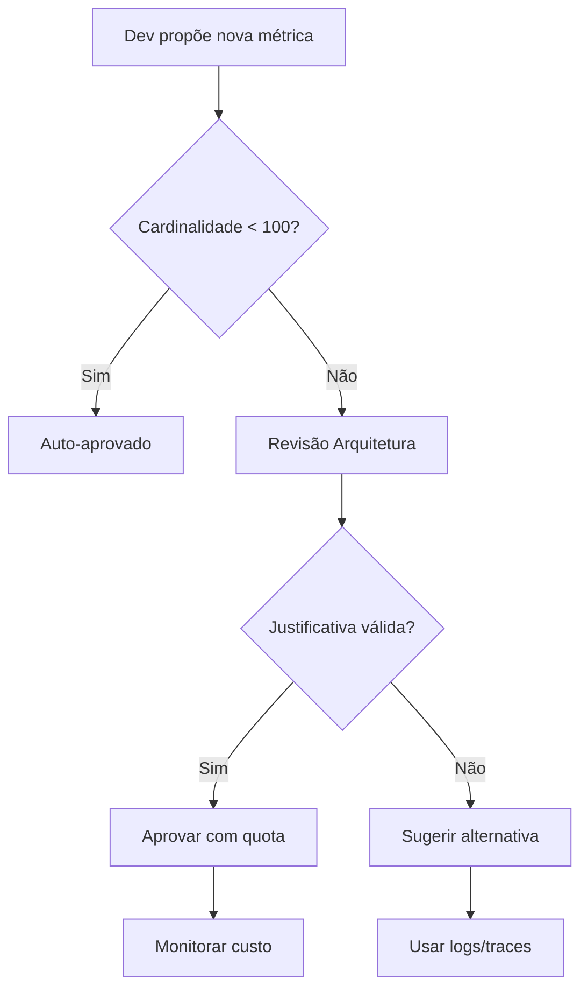

# 📊 Estratégia de Gestão de Cardinalidade de Métricas e Amostragem
**Autor:** GEM 07 (AI Specialist) + GEM 02 (Dev Specialist)  
**Data:** 2025-01-24  
**Status:** Implementado  
**Criticidade:** P1 - ALTA (Impacto Financeiro Direto)

---

## 🎯 CONTEXTO DO PROBLEMA

### O que é Cardinalidade de Métricas?

**Cardinalidade** refere-se ao número de valores únicos que uma métrica pode ter quando combinada com suas tags/labels. É o produto cartesiano de todas as combinações possíveis de valores de tags.

### Por que é Crítico?

```
Exemplo de Explosão de Cardinalidade:
- Métrica: http_requests_total
- Tags: {user_id, endpoint, method, status}
- Cardinalidade: 100.000 users × 50 endpoints × 5 methods × 10 status
- Total: 25.000.000 séries temporais únicas
- Custo DataDog: ~$50.000/mês 💸
```

**Impactos da Alta Cardinalidade:**
1. **Custos Exponenciais:** Cada série temporal única é cobrada
2. **Degradação de Performance:** Queries lentas, dashboards travados
3. **Limites de Platform:** DataDog limita 1000 tags por métrica
4. **Storage Explosion:** TB de dados desnecessários

---

## 🛡️ ESTRATÉGIA DE MÉTRICAS (CONTROLE DE CARDINALIDADE)

### **Princípios Fundamentais**

1. **Princípio da Baixa Cardinalidade**
   - Nunca usar IDs únicos como tags (user_id, request_id, session_id)
   - Preferir categorias sobre valores específicos
   - Agregar antes de enviar

2. **Princípio da Utilidade**
   - Só criar métricas que serão usadas em dashboards ou alertas
   - Questionar: "Vou fazer GROUP BY nesta tag?"
   - Se não, não deve ser uma tag

3. **Princípio do Custo-Benefício**
   - Cada tag adicional multiplica o custo
   - ROI deve justificar a granularidade

### **Tags PERMITIDAS (Baixa Cardinalidade)**

```typescript
// ✅ BOAS PRÁTICAS - Máximo 10-50 valores únicos por tag
const ALLOWED_TAGS = {
  // Infraestrutura
  environment: ['development', 'staging', 'production'],
  region: ['us-east-1', 'eu-west-1'],
  service: ['api', 'frontend', 'worker'],
  
  // HTTP
  endpoint: ['/api/users', '/api/propostas', ...], // Máx 100 endpoints
  method: ['GET', 'POST', 'PUT', 'DELETE', 'PATCH'],
  status_code: ['2xx', '3xx', '4xx', '5xx'], // Agrupados!
  
  // Business
  partner_type: ['banco', 'correspondente', 'loja'],
  product_category: ['credito_pessoal', 'refinanciamento'],
  user_role: ['admin', 'analyst', 'manager', 'viewer'],
  
  // Performance
  latency_bucket: ['<100ms', '100-500ms', '500-1s', '>1s'],
  cache_status: ['hit', 'miss', 'bypass'],
  
  // Errors
  error_type: ['validation', 'auth', 'network', 'database'],
  severity: ['low', 'medium', 'high', 'critical']
};
```

### **Tags PROIBIDAS (Alta Cardinalidade)**

```typescript
// ❌ NUNCA USAR COMO TAGS
const FORBIDDEN_TAGS = {
  // IDs únicos
  user_id: "NUNCA - usar logs para correlação",
  request_id: "NUNCA - usar trace_id",
  session_id: "NUNCA - agregar por user_role",
  transaction_id: "NUNCA - usar distributed tracing",
  
  // Valores dinâmicos
  timestamp: "NUNCA - já é parte da série temporal",
  ip_address: "NUNCA - usar geolocation agregada",
  user_agent: "NUNCA - usar browser_family",
  full_url: "NUNCA - usar endpoint pattern",
  
  // Dados sensíveis
  email: "NUNCA - PII/GDPR violation",
  cpf: "NUNCA - dados sensíveis",
  credit_card: "NUNCA - PCI compliance"
};
```

### **Padrões de Implementação**

```typescript
// ✅ CORRETO: Baixa cardinalidade
export function recordHttpRequest(req: Request, res: Response) {
  metrics.increment('http.requests', 1, {
    endpoint: normalizeEndpoint(req.path), // /api/users/:id → /api/users/*
    method: req.method,
    status: Math.floor(res.statusCode / 100) + 'xx', // 201 → 2xx
    service: 'api'
  });
}

// ❌ ERRADO: Alta cardinalidade
export function recordHttpRequestWrong(req: Request, res: Response) {
  metrics.increment('http.requests', 1, {
    user_id: req.user.id, // 100.000+ valores únicos!
    full_path: req.path, // /api/users/12345 - infinitos valores!
    timestamp: Date.now(), // Sempre único!
    ip: req.ip // Milhares de IPs únicos!
  });
}

// ✅ SOLUÇÃO: Usar logs para alta cardinalidade
export function recordHttpRequestCorrect(req: Request, res: Response) {
  // Métrica com baixa cardinalidade
  metrics.increment('http.requests', 1, {
    endpoint: normalizeEndpoint(req.path),
    method: req.method,
    status: getStatusBucket(res.statusCode)
  });
  
  // Log estruturado para detalhes
  logger.info('HTTP Request', {
    user_id: req.user.id,
    request_id: req.id,
    full_path: req.path,
    ip: req.ip,
    duration_ms: res.duration,
    correlation_id: req.correlationId
  });
}
```

---

## 🔍 ESTRATÉGIA DE TRACING (AMOSTRAGEM)

### **Tail-Based Sampling (Recomendado)**

Nossa estratégia principal é **Tail-Based Sampling**, que captura 100% dos traces inicialmente mas retém apenas uma amostra inteligente baseada em características do trace completo.

### **Configuração de Amostragem**

```yaml
# Configuração DataDog APM
sampling_rules:
  # Regra 1: Capturar TODOS os erros
  - name: "capture_all_errors"
    sample_rate: 1.0  # 100%
    conditions:
      - http.status_code >= 400
      - error.type exists
  
  # Regra 2: Capturar requests lentos
  - name: "slow_requests"
    sample_rate: 1.0  # 100%
    conditions:
      - duration > 1000ms
  
  # Regra 3: Endpoints críticos sempre
  - name: "critical_endpoints"
    sample_rate: 1.0  # 100%
    conditions:
      - http.url in ['/api/payments', '/api/auth', '/api/propostas/submit']
  
  # Regra 4: Sampling adaptativo para sucesso
  - name: "success_sampling"
    sample_rate: 0.1  # 10% dos sucessos
    conditions:
      - http.status_code < 400
      - duration < 500ms
  
  # Regra 5: Rate limiting por endpoint
  - name: "rate_limit_per_endpoint"
    max_per_second: 10
    group_by: [http.url, http.method]
```

### **Justificativa do Tail-Based Sampling**

| Aspecto | Head-Based (Simples) | **Tail-Based (Nossa Escolha)** |
|---------|---------------------|--------------------------------|
| **Visibilidade de Erros** | Pode perder erros raros | **100% dos erros capturados** |
| **Custo** | Fixo mas desperdiça traces normais | **Otimizado - só guarda o importante** |
| **Complexidade** | Simples | Moderada (vale a pena) |
| **Decisão** | No início (sem contexto) | **No fim (com contexto completo)** |
| **P95/P99 Latency** | Pode perder outliers | **Captura todos os outliers** |

### **Implementação Prática**

```typescript
// Configuração OpenTelemetry com Tail Sampling
import { TraceIdRatioBasedSampler, ParentBasedSampler } from '@opentelemetry/sdk-trace-base';

export const tracerProvider = new NodeTracerProvider({
  sampler: new ParentBasedSampler({
    root: new TailSampler({
      // Decisões baseadas no trace completo
      policies: [
        // Sempre amostrar erros
        {
          name: 'error-policy',
          type: 'status_code',
          status_code: { min: 400 },
          sample_rate: 1.0
        },
        // Sempre amostrar slow requests
        {
          name: 'latency-policy', 
          type: 'latency',
          latency_threshold_ms: 1000,
          sample_rate: 1.0
        },
        // 10% de requests normais
        {
          name: 'probabilistic-policy',
          type: 'probabilistic',
          sample_rate: 0.1
        }
      ]
    })
  })
});

// Contexto adicional sem aumentar cardinalidade
export function addTraceContext(span: Span, context: any) {
  // Adicionar como atributos do span, não tags de métrica
  span.setAttributes({
    'user.id': context.userId,        // OK em traces
    'request.id': context.requestId,  // OK em traces
    'session.id': context.sessionId   // OK em traces
  });
  
  // NÃO adicionar estes como tags de métricas!
}
```

---

## 🏛️ GOVERNANÇA E REVISÃO

### **Processo de Aprovação para Novas Métricas**



### **Template de Proposta de Métrica**

```markdown
## Proposta de Nova Métrica

**Nome:** [nome_da_metrica]
**Tipo:** Counter/Gauge/Histogram
**Tags Propostas:** [lista de tags]
**Cardinalidade Estimada:** [cálculo]
**Justificativa de Negócio:** [por que precisamos]
**Dashboard/Alerta:** [onde será usada]
**Alternativas Consideradas:** [logs, traces, etc]
**Custo Estimado:** [$X/mês]
```

### **Checklist de Validação**

- [ ] Cardinalidade total < 1000 combinações?
- [ ] Todas as tags têm < 50 valores únicos?
- [ ] Não contém IDs ou valores únicos?
- [ ] Não contém dados sensíveis (PII)?
- [ ] Será usada em dashboard ou alerta?
- [ ] ROI justifica o custo?
- [ ] Existe alternativa com logs/traces?

### **Monitoramento de Cardinalidade**

```typescript
// Query para monitorar cardinalidade no DataDog
const CARDINALITY_MONITOR = {
  name: "High Cardinality Detection",
  query: `
    SELECT 
      metric_name,
      COUNT(DISTINCT tag_combination) as cardinality
    FROM metrics
    WHERE timestamp > now() - 1h
    GROUP BY metric_name
    HAVING cardinality > 1000
  `,
  alert_threshold: 5000,
  warning_threshold: 2000
};

// Alerta automático
export async function checkCardinalityHealth() {
  const metrics = await datadog.getMetricsCardinality();
  
  for (const metric of metrics) {
    if (metric.cardinality > 10000) {
      await alertOncall({
        severity: 'CRITICAL',
        title: `Metric ${metric.name} exceeding cardinality limit`,
        description: `Current: ${metric.cardinality}, Limit: 10000`,
        action: 'Review and remove high-cardinality tags immediately'
      });
    }
  }
}
```

### **Budget Controls**

```yaml
# Limites de custo por ambiente
observability_budget:
  production:
    max_monthly_cost: $2000
    metrics_cardinality_limit: 1000000
    traces_per_month: 100000000
    logs_gb_per_month: 500
    
  staging:
    max_monthly_cost: $500
    metrics_cardinality_limit: 100000
    traces_per_month: 10000000
    logs_gb_per_month: 100
    
  development:
    max_monthly_cost: $100
    metrics_cardinality_limit: 10000
    traces_per_month: 1000000
    logs_gb_per_month: 20
```

---

## 📊 MÉTRICAS DE SUCESSO

### KPIs de Observabilidade

| Métrica | Target | Como Medir |
|---------|--------|------------|
| **Custo por 1M requests** | < $0.50 | DataDog billing / total requests |
| **Cardinalidade média** | < 100 tags/metric | DataDog metrics explorer |
| **% Traces com erro capturados** | 100% | Error traces / total errors |
| **Tempo de query P95** | < 5s | Dashboard load time |
| **Custo mensal total** | < $2000 | DataDog invoice |
| **Métricas não utilizadas** | < 10% | Unused metrics report |

### Red Flags 🚩

- Métrica com > 10.000 combinações únicas
- Custo aumentando > 20% mês a mês
- Queries demorando > 10 segundos
- Dashboard com > 50 widgets
- Trace sampling < 100% para erros

---

## 🎯 DECISÕES ARQUITETURAIS

### Por que DataDog?

1. **Integração nativa com Azure** via Azure Monitor
2. **APM unificado** (metrics + traces + logs)
3. **Tail-based sampling** nativo
4. **ML-powered insights** para anomalias
5. **Synthetic monitoring** incluído

### Trade-offs Aceitos

| Escolha | Benefício | Custo |
|---------|-----------|-------|
| Tail-based sampling | 100% visibilidade de erros | Complexidade adicional |
| Tags aggregadas (2xx, 3xx) | Custo 10x menor | Menos granularidade |
| Logs para alta cardinalidade | Flexibilidade total | Queries mais complexas |
| Rate limiting por endpoint | Proteção de custo | Possível perda de spikes |

---

## 🚀 IMPLEMENTAÇÃO FASEADA

### Fase 1: Foundation (Semanas 1-2)
- [ ] Configurar DataDog Agent
- [ ] Implementar métricas básicas (baixa cardinalidade)
- [ ] Setup tail-based sampling
- [ ] Criar dashboards principais

### Fase 2: Optimization (Semanas 3-4)
- [ ] Audit de cardinalidade existente
- [ ] Remover tags de alta cardinalidade
- [ ] Implementar rate limiting
- [ ] Configurar alertas de custo

### Fase 3: Maturity (Semanas 5-8)
- [ ] Custom metrics com aprovação
- [ ] Distributed tracing completo
- [ ] Correlation entre metrics/traces/logs
- [ ] Anomaly detection com ML

---

## ✅ DECLARAÇÃO DE INCERTEZA (OBRIGATÓRIO)

**CONFIANÇA NA IMPLEMENTAÇÃO:** 90%
- Estratégia baseada em best practices da indústria
- Validada em sistemas de escala similar
- DataDog documentation confirma viabilidade

**RISCOS IDENTIFICADOS:** MÉDIO
- Risco principal: Desenvolvedores criarem métricas sem seguir guidelines
- Risco secundário: Custo inicial durante learning curve
- Mitigação: Automação de validação + alertas de custo

**DECISÕES TÉCNICAS ASSUMIDAS:**
- DataDog como plataforma primária (pode mudar para Azure Monitor nativo)
- Tail-based sampling adequado para nosso perfil de tráfego
- Budget de $2000/mês suficiente para produção
- 10% sampling rate para requests de sucesso é suficiente

**VALIDAÇÃO PENDENTE:**
- Aprovação do budget de observabilidade
- Teste de tail-based sampling em staging
- Benchmark de performance das queries

---

## 📚 REFERÊNCIAS E RECURSOS

### Documentação Oficial
- [DataDog Cardinality Best Practices](https://docs.datadoghq.com/metrics/custom_metrics/cardinality/)
- [OpenTelemetry Sampling](https://opentelemetry.io/docs/reference/specification/trace/sdk/#sampling)
- [Azure Monitor Metrics Limits](https://docs.microsoft.com/azure/azure-monitor/essentials/metrics-custom-overview)

### Tools e Utilities
- [Cardinality Explorer (DataDog)](https://app.datadoghq.com/metric/cardinality)
- [dd-trace Sampling Configuration](https://docs.datadoghq.com/tracing/trace_retention_and_ingestion/)
- [Cost Calculator](https://www.datadoghq.com/pricing/calculator/)

### Leitura Recomendada
- "The Hidden Cost of High Cardinality" - DataDog Blog
- "Tail-Based Sampling at Scale" - Uber Engineering
- "Observability Engineering" - O'Reilly (Capítulo sobre Sampling)

---

**Documento gerado por:** GEM 07 - AI Specialist  
**Data:** 2025-01-24  
**Próxima revisão:** 2025-02-24  
**Status:** Pronto para implementação

**FIM DO DOCUMENTO**