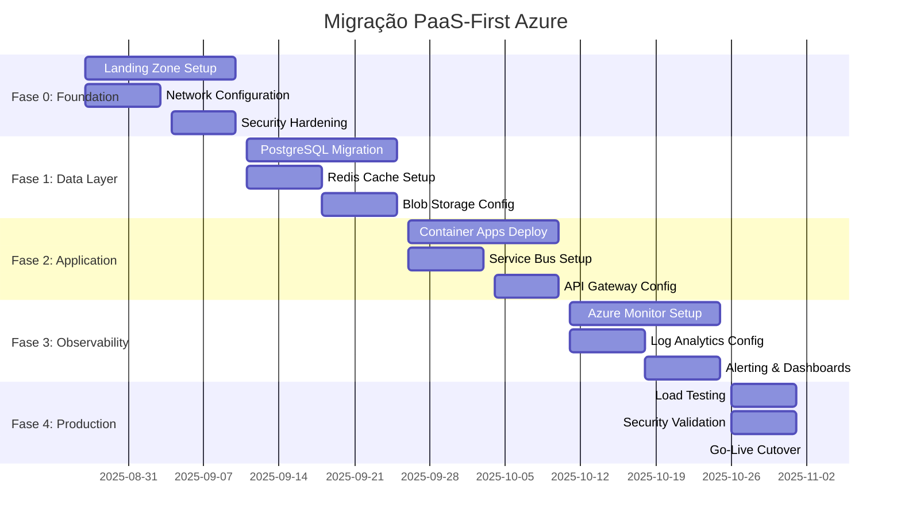

# ADR-001: Azure PaaS-First Strategy - REFINAMENTO P3

**Data Original:** 20/08/2025  
**Data Refinamento:** 26/08/2025  
**Status:** Accepted ✅ → Enhanced 🚀  
**Deciders:** GEM 01 (Arquiteto), GEM 02 (Dev)  
**Refinamento:** Auditoria Red Team Thread 1.2

---

## **⚠️ AUDITORIA 2025-08-26: ESTRATÉGIA PAAS-FIRST APRIMORADA**

**PROBLEMA DETECTADO:** ADR original superficial, sem especificação técnica robusta para sistema crítico processando 100k+ propostas/mês com integrações financeiras.

---

## **Contexto Expandido**

O sistema Simpix está evoluindo de prova de conceito (Replit + Supabase) para sistema crítico de crédito empresarial. Necessitamos de estratégia cloud PaaS-first que minimize operational overhead, maximize confiabilidade, e suporte crescimento exponencial com compliance financeiro.

**Drivers de Decisão:**

- Sistema crítico: 99.5% SLA contratual
- Compliance: LGPD + BACEN + auditoria externa
- Crescimento: 10 → 1000+ usuários em 12 meses
- Integrações críticas: Banco Inter + ClickSign + OpenAI
- Orçamento: R$ 4.800/mês reconciliado

---

## **Decisão Técnica: Azure PaaS-First Architecture**

### **Estratégia Principal: Maximum Managed Services**

**Princípio Organizador:** "Zero Infrastructure Management" - utilizar exclusivamente serviços gerenciados Azure para eliminar toil operacional e maximizar foco no domínio de negócio.

```typescript
// Azure PaaS-First Service Selection Matrix
const azurePaaSStrategy = {
  computeLayer: {
    service: 'Azure Container Apps',
    rationale: 'Managed Kubernetes sem complexidade K8s',
    alternatives_rejected: [
      'AKS: Complexidade prematura para 2-3 devs',
      'App Service: Menos flexível para containers',
      'Functions: Stateful nature da aplicação',
    ],

    specifications: {
      tier: 'Standard',
      replicas: '2-10 auto-scaling',
      cpu: '0.5-2 vCPU per replica',
      memory: '1-4GB per replica',
      networking: 'VNET integration',
      ingress: 'External with custom domain',
    },
  },

  dataLayer: {
    primary: {
      service: 'Azure Database for PostgreSQL Flexible',
      tier: 'General Purpose',
      compute: 'B2s (2 vCores, 4GB) → GP_Standard_D2s_v3',
      storage: '32GB → 2TB auto-grow',
      backup: 'Geo-redundant, 35 days retention',

      highAvailability: {
        enabled: true,
        mode: 'Zone-redundant',
        readReplicas: 1,
        crossRegion: 'Brazil South (secondary)',
      },
    },

    cache: {
      service: 'Azure Cache for Redis',
      tier: 'Premium P1 (6GB)',
      clustering: true,
      persistence: 'RDB + AOF',
      backup: 'Daily with geo-redundancy',
    },
  },

  storageLayer: {
    service: 'Azure Blob Storage',
    tier: 'Premium Block Blobs',
    redundancy: 'Zone-redundant (ZRS)',

    lifecycle: {
      hot: 'Active documents (30 days)',
      cool: 'Archived contracts (90 days)',
      archive: 'Compliance storage (5 years)',
    },

    cdn: {
      service: 'Azure CDN Premium',
      cachingRules: 'Aggressive for static assets',
      compression: 'Brotli + Gzip',
    },
  },

  messagingLayer: {
    service: 'Azure Service Bus',
    tier: 'Standard',
    features: ['Topics/Subscriptions', 'Dead letter queues', 'Duplicate detection'],

    queues: [
      'payment-processing',
      'document-generation',
      'notification-delivery',
      'audit-logging',
      'integration-events',
    ],
  },

  securityLayer: {
    secretManagement: {
      service: 'Azure Key Vault',
      tier: 'Premium (HSM-backed)',
      features: ['Certificate management', 'Key rotation', 'Access policies'],
    },

    identity: {
      service: 'Azure Active Directory B2C',
      features: ['Multi-tenant', 'Custom policies', 'Social login', 'MFA'],
    },

    applicationSecurity: {
      service: 'Azure Application Gateway',
      waf: 'OWASP Core Rule Set',
      sslTermination: true,
      ddosProtection: 'Basic + Advanced',
    },
  },

  observabilityLayer: {
    monitoring: {
      service: 'Azure Monitor',
      features: ['Application Insights', 'Log Analytics', 'Alerts'],
      retention: 'Logs: 90 days, Metrics: 1 year',
    },

    logging: {
      service: 'Azure Monitor Logs',
      ingestion: 'Real-time via agents',
      querying: 'KQL (Kusto Query Language)',
      alerting: 'Smart detection + custom rules',
    },
  },
};
```

### **Azure Landing Zone Architecture**

```yaml
# Azure Landing Zone para Simpix
LandingZone:
  subscriptions:
    management: 'Platform operations, monitoring'
    connectivity: 'Networking hub, VPN gateway'
    identity: 'AD B2C, Key Vault central'
    production: 'Workloads produção'
    staging: 'Workloads desenvolvimento'

  resourceGroups:
    production:
      compute: 'rg-simpix-prod-compute-brazilsouth'
      data: 'rg-simpix-prod-data-brazilsouth'
      networking: 'rg-simpix-prod-network-brazilsouth'
      security: 'rg-simpix-prod-security-brazilsouth'
      monitoring: 'rg-simpix-prod-monitor-brazilsouth'

    staging:
      compute: 'rg-simpix-stg-compute-brazilsouth'
      data: 'rg-simpix-stg-data-brazilsouth'
      networking: 'rg-simpix-stg-network-brazilsouth'

  networking:
    hub:
      addressSpace: '10.0.0.0/22'
      subnets:
        gateway: '10.0.0.0/27' # VPN Gateway
        firewall: '10.0.0.32/27' # Azure Firewall
        bastion: '10.0.0.64/27' # Azure Bastion

    production:
      addressSpace: '10.1.0.0/22'
      subnets:
        app: '10.1.0.0/24' # Container Apps
        data: '10.1.1.0/24' # Database, Redis
        integration: '10.1.2.0/24' # API Management
        privateEndpoints: '10.1.3.0/24'

    staging:
      addressSpace: '10.2.0.0/22'
      subnets:
        app: '10.2.0.0/24'
        data: '10.2.1.0/24'
        integration: '10.2.2.0/24'

  security:
    networkSecurity:
      - Azure Firewall Premium
      - DDoS Protection Standard
      - Private Endpoints (all data services)
      - Network Security Groups

    identity:
      - Azure AD B2C multi-tenant
      - Privileged Identity Management
      - Conditional Access policies
      - MFA enforcement

    dataProtection:
      - Customer-managed encryption keys
      - Azure Disk Encryption
      - TDE for PostgreSQL
      - Backup encryption
```

### **Migration Strategy: Phased PaaS Adoption**



---

## **Justificativa Técnica Detalhada**

### **1. Compute: Azure Container Apps vs Alternativas**

| Critério                 | Container Apps | AKS       | App Service | Function Apps |
| ------------------------ | -------------- | --------- | ----------- | ------------- |
| **Operational Overhead** | Minimal        | High      | Low         | Minimal       |
| **Scaling Flexibility**  | Excellent      | Excellent | Good        | Limited       |
| **Cost (2-3 dev team)**  | Optimal        | 3x higher | Similar     | Lower         |
| **Container Support**    | Native         | Native    | Limited     | None          |
| **Learning Curve**       | Minimal        | Steep     | Minimal     | Minimal       |
| **Event-driven**         | Yes            | Yes       | No          | Yes           |
| **Kubernetes Control**   | No             | Full      | No          | No            |
| **Multi-tenancy**        | Built-in       | Manual    | Limited     | Built-in      |

**Decision:** Container Apps oferece 80% dos benefícios do AKS com 20% da complexidade.

### **2. Data: PostgreSQL Flexible vs Alternativas**

```typescript
const dataServiceComparison = {
  postgresqlFlexible: {
    pros: [
      'Full PostgreSQL compatibility',
      'Zone-redundant HA built-in',
      'Automated backup with PITR',
      'Read replicas for scaling',
      'Private networking by default',
    ],
    cons: ['Higher cost than single server', 'Azure-specific features lock-in'],
    suitability: 'PERFECT - Managed complexity ideal para pequena equipe',
  },

  cosmosDB: {
    pros: ['Global distribution', 'Multi-model', 'Serverless billing'],
    cons: ['Complete rewrite required', 'Learning curve', 'Vendor lock-in'],
    suitability: 'REJECTED - Migration cost too high',
  },

  sqlDatabase: {
    pros: ['Serverless option', 'Intelligent tuning', 'Lower cost'],
    cons: ['Application rewrite required', 'T-SQL vs PostgreSQL'],
    suitability: 'REJECTED - Complete rewrite needed',
  },
};
```

### **3. Security: Zero Trust Architecture**

```typescript
const zeroTrustImplementation = {
  networkSecurity: {
    principle: 'Never trust, always verify',
    implementation: [
      'All services behind private endpoints',
      'Zero public database access',
      'Application Gateway with WAF',
      'Network security groups (least privilege)',
      'DDoS protection standard',
    ],
  },

  identityVerification: {
    users: 'Azure AD B2C with MFA mandatory',
    services: 'Managed identities only',
    applications: 'Certificate-based authentication',
    secrets: 'Key Vault with HSM backing',
  },

  dataProtection: {
    encryption: {
      atRest: 'Customer-managed keys (CMK)',
      inTransit: 'TLS 1.3 minimum',
      inUse: 'Always Encrypted for PII',
    },

    access: {
      database: 'Azure AD authentication only',
      storage: 'RBAC + private endpoints',
      secrets: 'Key Vault access policies',
    },
  },
};
```

---

## **Consequências Expandidas**

### **Positivas Validadas**

✅ **Operational Excellence**

- Zero server patching/maintenance
- Automatic scaling based on demand
- Built-in disaster recovery
- Managed backup and monitoring

✅ **Security & Compliance**

- SOC 2, ISO 27001, PCI DSS compliance
- LGPD compliance features built-in
- Advanced threat protection
- Audit logging automated

✅ **Developer Experience**

- Infrastructure as Code (ARM/Bicep)
- Integrated CI/CD pipelines
- Visual Studio integration
- Rich Azure CLI tooling

✅ **Cost Predictability**

- Reserved instance discounts available
- Consumption-based pricing for some services
- Cost management tools built-in
- Budget alerts and automation

### **Negativas Mitigadas**

❌ **Learning Curve** → **MITIGAÇÃO:**

- Azure Fundamentals training (40h)
- Microsoft Learn paths
- Architecture Center documentation
- Hands-on labs and sandboxes

❌ **Vendor Lock-in** → **MITIGAÇÃO:**

- Container-first approach (portable)
- Standard protocols (PostgreSQL, Redis)
- Open source tools where possible
- Exit strategy documented

❌ **Cost Increase** → **MITIGAÇÃO:**

- R$ 4.800/mês orçamento reconciliado
- Reserved instances (-40% cost)
- Auto-scaling para otimização
- Cost optimization reviews mensais

---

## **Alternativas Reavaliadas**

### **1. Amazon Web Services (AWS)**

**Pontos Fortes:**

- Maior maturidade e conjunto de serviços
- ECS Fargate similar ao Container Apps
- RDS PostgreSQL com Multi-AZ
- Melhor documentação e community

**Pontos Fracos:**

- Complexidade de configuração superior
- Menos integração corporativa no Brasil
- Certificações compliance locais limitadas
- Learning curve steeper para equipe

**Veredicto:** Rejected - Complexidade vs benefício desfavorável

### **2. Google Cloud Platform (GCP)**

**Pontos Fortes:**

- Cloud Run similar ao Container Apps
- Cloud SQL PostgreSQL competitivo
- Preços geralmente menores
- AI/ML services superiores

**Pontos Fracos:**

- Menor penetração corporativa Brasil
- Support local limitado
- Menos serviços enterprise
- Compliance financeiro menor

**Veredicto:** Rejected - Risk vs compliance requirements

### **3. Multi-Cloud Strategy**

**Análise:**

- **Benefícios:** Vendor independence, best-of-breed
- **Custos:** 3x complexity, 2x operational overhead
- **Reality Check:** Incompatível com team size (2-3 devs)

**Veredicto:** Rejected - Premature optimization

---

## **Implementation Roadmap**

### **Sprint 0: Foundation (2 weeks)**

```yaml
Week 1:
  - Azure subscription setup
  - Landing zone deployment (Bicep templates)
  - Network configuration and security groups
  - Key Vault setup with initial secrets

Week 2:
  - Azure DevOps project setup
  - CI/CD pipeline configuration
  - Infrastructure as Code validation
  - Security baseline implementation
```

### **Sprint 1-2: Data Migration (4 weeks)**

```yaml
PostgreSQL Migration:
  - Azure Database for PostgreSQL provisioning
  - Schema migration and validation
  - Data replication setup (Supabase → Azure)
  - Connection string updates and testing

Redis Implementation:
  - Azure Cache for Redis setup
  - Session storage migration
  - Cache warming strategies
  - Performance validation
```

### **Sprint 3-4: Application Deployment (4 weeks)**

```yaml
Container Apps:
  - Docker image optimization
  - Container Apps environment setup
  - Auto-scaling configuration
  - Blue-green deployment setup

Service Integration:
  - Azure Service Bus implementation
  - API Gateway configuration
  - Private endpoint connectivity
  - Load testing execution
```

---

## **Success Metrics**

| Metric                | Current (Replit) | Target (Azure) | Measurement           |
| --------------------- | ---------------- | -------------- | --------------------- |
| **Availability**      | 99.1%            | 99.5%          | Azure Monitor         |
| **API Latency P95**   | 1.2s             | <500ms         | Application Insights  |
| **Database Response** | 150ms            | <50ms          | Query statistics      |
| **Deployment Time**   | 2 minutes        | 30 seconds     | Azure DevOps          |
| **MTTR**              | 45 minutes       | 15 minutes     | Incident management   |
| **Security Score**    | Unknown          | >80%           | Azure Security Center |

---

## **Risk Assessment & Mitigation**

| Risk                        | Probability | Impact | Mitigation                             |
| --------------------------- | ----------- | ------ | -------------------------------------- |
| **Migration downtime**      | Medium      | High   | Blue-green deployment, rollback plan   |
| **Performance degradation** | Low         | High   | Load testing, performance monitoring   |
| **Cost overrun**            | Medium      | Medium | Budget alerts, reserved instances      |
| **Skills gap**              | High        | Medium | Training program, Microsoft support    |
| **Vendor lock-in**          | Low         | Medium | Container strategy, standard protocols |

---

## **Decisão Final Ratificada**

**Azure PaaS-First Strategy é a escolha definitiva** baseada em:

1. **Operational Excellence:** Managed services reduzem toil
2. **Security & Compliance:** Built-in compliance para sistema financeiro
3. **Scalability:** Clear path de crescimento (Container Apps → AKS)
4. **Total Cost of Ownership:** Custo operacional vs benefits favorável
5. **Risk Mitigation:** Estratégia de migração faseada minimiza riscos

**Esta decisão é vinculante e orienta todas as escolhas técnicas futuras.**

---

**Assinatura Digital**  
_GEM 01 (Arquiteto de Sistemas) - 26/08/2025_  
_GEM 02 (Desenvolvedor Senior) - 26/08/2025_  
_SHA256-ADR001-AZURE-PAAS-FIRST-2025-08-26_
