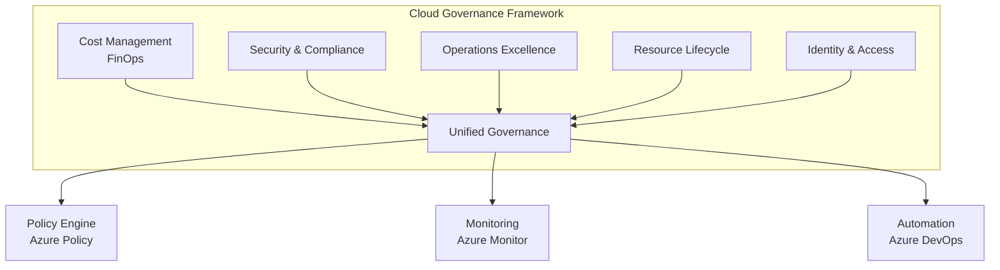
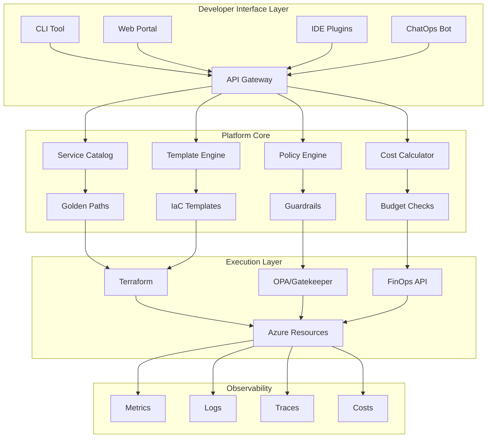

# ADR-001: Estratégia de Landing Zone na Azure

**Data:** 21/08/2025  
**Última Atualização:** 25/01/2025 - Expansão Estratégica Completa  
**Status:** Expandido - Sprint 2 PAM V2.1  
**Deciders:** GEM 01 (Arquiteto Senior), GEM 02 (Dev Specialist)  
**Tags:** #infraestrutura #azure #cloud #governance #migration

---

## Status

**Expandido** - Documento significativamente ampliado com estratégias avançadas

Timeline:

- 21/08/2025: Documento criado (Proposto)
- 25/01/2025: Expansão estratégica completa (Sprint 2 - PAM V2.1)
  - Adicionada Estratégia de Saída (Exit Strategy)
  - Expandido Modelo de Governança Cloud (FinOps completo)
  - Adicionada Estratégia de Plataforma de Desenvolvedor Interna (IDP)
- Pendente: Revisão técnica final
- Pendente: Ratificação pelo Arquiteto Chefe

---

## Contexto

### Problema

O sistema Simpix atualmente opera no Replit, uma plataforma que, embora adequada para prototipagem e desenvolvimento inicial, apresenta limitações significativas para um sistema financeiro em produção:

1. **Limitações de Escala:** Incapacidade de escalar horizontalmente sob demanda
2. **Compliance:** Dificuldade em atender requisitos regulatórios (LGPD, PCI DSS)
3. **Isolamento:** Falta de separação clara entre ambientes
4. **Governança:** Ausência de controles empresariais de segurança e auditoria
5. **SLAs:** Sem garantias de disponibilidade adequadas para sistema crítico

### Necessidade

Precisamos de uma forma padronizada, segura e escalável para organizar nossos recursos na nuvem, que suporte:

- Separação clara entre ambientes (Dev, Staging, Produção)
- Governança centralizada com controle de custos
- Conformidade com regulamentações financeiras
- Escalabilidade para suportar crescimento 10x previsto
- Disaster recovery e alta disponibilidade

### Drivers de Decisão

1. **Simplicidade inicial** - Evitar over-engineering na fase inicial
2. **Custo-benefício** - Otimizar custos mantendo qualidade
3. **Segurança** - Isolamento adequado entre ambientes
4. **Velocidade** - Time-to-market para migração
5. **Conformidade** - Aderência às melhores práticas Azure CAF

---

## Decisão

Adotaremos uma arquitetura de **Landing Zone simplificada** baseada no Azure Cloud Adoption Framework (CAF), com a seguinte estrutura organizacional:

### Estrutura Hierárquica

```
Azure Active Directory (Tenant)
└── Subscription: Simpix Production
    ├── Resource Group: rg-simpix-prod-brsouth-01
    ├── Resource Group: rg-simpix-staging-brsouth-01
    ├── Resource Group: rg-simpix-dev-brsouth-01
    └── Resource Group: rg-simpix-shared-brsouth-01
```

### Detalhamento dos Resource Groups

#### 1. **rg-simpix-prod-brsouth-01** (Produção)

**Propósito:** Ambiente de produção com dados reais e tráfego de clientes
**Recursos:**

- AKS cluster de produção (2-10 nodes auto-scaling)
- Azure Database for PostgreSQL (HA enabled)
- Azure Cache for Redis (Premium tier)
- Application Gateway com WAF
- Key Vault para segredos de produção
- Storage Account para backups e documentos

#### 2. **rg-simpix-staging-brsouth-01** (Staging)

**Propósito:** Ambiente de pré-produção para validação final
**Recursos:**

- AKS cluster de staging (1-3 nodes)
- Azure Database for PostgreSQL (cópia sanitizada de prod)
- Azure Cache for Redis (Standard tier)
- Application Gateway
- Key Vault para segredos de staging
- Storage Account para testes

#### 3. **rg-simpix-dev-brsouth-01** (Desenvolvimento)

**Propósito:** Ambiente de desenvolvimento e testes
**Recursos:**

- AKS cluster de dev (1-2 nodes)
- Azure Database for PostgreSQL (dados sintéticos)
- Azure Cache for Redis (Basic tier)
- Key Vault para segredos de dev
- Storage Account para desenvolvimento

#### 4. **rg-simpix-shared-brsouth-01** (Recursos Compartilhados)

**Propósito:** Recursos utilizados por todos os ambientes
**Recursos:**

- Azure Container Registry (ACR)
- Azure Monitor e Log Analytics Workspace
- Azure DevOps agents
- Backup Vault
- Network Watcher
- DNS zones

### Convenções de Nomenclatura

```
Padrão: [tipo]-[projeto]-[ambiente]-[região]-[instância]

Exemplos:
- aks-simpix-prod-brsouth-01
- psql-simpix-staging-brsouth-01
- kv-simpix-dev-brsouth-01
- acr-simpix-shared-brsouth-01
```

### Modelo de Governança

#### RBAC (Role-Based Access Control)

```yaml
Production:
  - Owner: CTO apenas
  - Contributor: DevOps Team (com PIM - Privileged Identity Management)
  - Reader: Desenvolvedores, Auditores

Staging:
  - Owner: Tech Lead
  - Contributor: DevOps Team, Senior Developers
  - Reader: Todos os desenvolvedores

Development:
  - Owner: Tech Lead
  - Contributor: Todos os desenvolvedores
  - Reader: Stakeholders

Shared:
  - Owner: DevOps Lead
  - Contributor: DevOps Team
  - Reader: Todos
```

#### Políticas Azure (Azure Policy)

- Enforce tagging obrigatório (environment, cost-center, owner, project)
- Deny recursos fora de Brazil South
- Require encryption at rest
- Audit recursos sem backup configurado
- Limit VM sizes por ambiente

#### Budget e Alertas

- Produção: Alert em 80% do budget mensal
- Staging: Alert em 60% do budget mensal
- Dev: Hard limit com auto-shutdown

---

## Justificativa

### Por que Landing Zone?

A Landing Zone fornece uma fundação padronizada e segura que acelera a adoção da nuvem enquanto mantém governança e compliance.

### Por que Subscrição Única (Inicialmente)?

**Vantagens:**

1. **Simplicidade Administrativa:** Gestão centralizada de billing e políticas
2. **Custo Reduzido:** Evita overhead de múltiplas subscrições
3. **Velocidade de Implementação:** Setup mais rápido
4. **Visibilidade:** Dashboard único para todos os recursos

**Mitigação de Riscos:**

- Isolamento via Resource Groups e RBAC
- Network segmentation com VNets separadas
- Políticas Azure para enforcement de governança
- Plano de evolução para multi-subscription quando necessário

### Por que Brazil South?

1. **Compliance:** Dados residentes no Brasil (LGPD)
2. **Latência:** < 20ms para usuários principais
3. **Disponibilidade:** Todos os serviços necessários disponíveis
4. **Custo:** Pricing competitivo vs outras regiões

### Alinhamento com Azure CAF

Nossa estrutura segue os princípios do Cloud Adoption Framework:

- ✅ **Ready:** Infrastructure-as-Code com Terraform
- ✅ **Govern:** Políticas e RBAC implementados
- ✅ **Manage:** Monitoring e alertas configurados
- ✅ **Secure:** Defense in depth, Zero Trust principles

---

## Consequências

### Positivas ✅

1. **Isolamento Claro:** Separação explícita entre ambientes
2. **Governança Simplificada:** RBAC no nível de Resource Group
3. **Custo Otimizado:** Billing consolidado com tags para chargeback
4. **Deployment Rápido:** CI/CD com service principals por ambiente
5. **Compliance Ready:** Estrutura preparada para auditorias
6. **Escalabilidade:** Fácil adição de novos ambientes/recursos
7. **DR Preparado:** Backup e recovery strategies por RG

### Negativas ⚠️

1. **Limite de Blast Radius:** Problema na subscrição afeta todos os ambientes
2. **Quotas Compartilhadas:** Limites de API/recursos são por subscrição
3. **Complexidade Futura:** Eventual migração para multi-subscription
4. **Single Point of Failure:** Dependência de uma única subscrição

### Mitigações Planejadas

1. **Fase 2 (6 meses):** Avaliar separação Prod em subscrição dedicada
2. **Monitoramento Proativo:** Alertas para quotas e limites
3. **Backup Cross-Region:** Replicação para Brazil South paired region
4. **Disaster Recovery Plan:** Documentado e testado trimestralmente

---

## Alternativas Consideradas

### Alternativa 1: Multi-Subscription desde o Início

**Estrutura:** Uma subscrição por ambiente
**Rejeitada porque:** Complexidade excessiva para o estágio atual, custo adicional de gestão, overhead administrativo desproporcional

### Alternativa 2: Management Groups Hierarchy

**Estrutura:** Management Groups com políticas hierárquicas
**Rejeitada porque:** Over-engineering para empresa única, complexidade desnecessária, benefícios não justificam o esforço inicial

### Alternativa 3: Single Resource Group

**Estrutura:** Todos os recursos em um único RG com tags
**Rejeitada porque:** Risco de segurança inaceitável, impossibilidade de RBAC granular, violação de melhores práticas

---

## Estratégia de Saída (Exit Strategy)

### Análise de Vendor Lock-in

Nossa adoção da Azure apresenta diferentes níveis de acoplamento que devem ser conscientemente gerenciados:

#### Matriz de Lock-in por Serviço

| Serviço                            | Nível de Lock-in | Alternativa                          | Esforço de Migração | Estratégia de Mitigação                                 |
| ---------------------------------- | ---------------- | ------------------------------------ | ------------------- | ------------------------------------------------------- |
| **Azure Kubernetes Service (AKS)** | BAIXO            | EKS, GKE, self-hosted                | 2-4 semanas         | Usar Kubernetes vanilla, evitar Azure-specific features |
| **PostgreSQL (Azure Database)**    | BAIXO-MÉDIO      | RDS, Cloud SQL, self-hosted          | 1-2 semanas         | Usar features padrão SQL, backup/restore regular        |
| **Azure Container Registry**       | BAIXO            | ECR, GCR, Harbor                     | 1 semana            | Scripts de migração de images                           |
| **Azure Key Vault**                | MÉDIO            | AWS Secrets Manager, HashiCorp Vault | 2-3 semanas         | Abstração via interface ISecretManager                  |
| **Application Gateway**            | MÉDIO-ALTO       | ALB, Cloud Load Balancer             | 3-4 semanas         | Configuração como código (Terraform)                    |
| **Azure Monitor/Log Analytics**    | ALTO             | DataDog, Prometheus/Grafana          | 4-6 semanas         | Exportar métricas via OpenTelemetry                     |
| **Azure Active Directory**         | ALTO             | Okta, Auth0, Cognito                 | 6-8 semanas         | OIDC/SAML standards                                     |
| **Azure Functions**                | MUITO ALTO       | Lambda, Cloud Functions              | 8-12 semanas        | Evitar uso ou containerizar                             |

### Estratégias de Mitigação Técnica

#### 1. **Abstração de Serviços Cloud-Specific**

```typescript
// infrastructure/interfaces/ICloudProvider.ts
export interface ICloudProvider {
  secrets: ISecretManager;
  storage: IObjectStorage;
  database: IDatabaseProvider;
  messaging: IMessageQueue;
  monitoring: IMetricsCollector;
}

// infrastructure/providers/AzureProvider.ts
export class AzureProvider implements ICloudProvider {
  constructor(
    private keyVault: AzureKeyVault,
    private blobStorage: AzureBlobStorage,
    private serviceBus: AzureServiceBus
  ) {}

  // Implementação específica Azure encapsulada
  async getSecret(name: string): Promise<string> {
    return this.keyVault.getSecret(name);
  }
}

// infrastructure/providers/AWSProvider.ts (ready for migration)
export class AWSProvider implements ICloudProvider {
  constructor(
    private secretsManager: AWSSecretsManager,
    private s3: AWSS3,
    private sqs: AWSSQS
  ) {}

  // Implementação AWS pronta para switch
  async getSecret(name: string): Promise<string> {
    return this.secretsManager.getSecretValue(name);
  }
}
```

#### 2. **Containerização e Portabilidade**

```yaml
# Kubernetes manifests agnósticos de cloud
apiVersion: apps/v1
kind: Deployment
metadata:
  name: simpix-api
spec:
  template:
    spec:
      containers:
        - name: api
          image: registry.io/simpix/api:latest # Registry agnóstico
          env:
            - name: DATABASE_URL
              valueFrom:
                secretKeyRef:
                  name: database-credentials # Secrets K8s nativos
                  key: url
```

#### 3. **Data Portability Strategy**

```python
# scripts/migration/export_data.py
"""
Script de exportação universal de dados
Suporta múltiplos formatos e destinos
"""

class DataExporter:
    def __init__(self, source_config: Dict):
        self.source = self._get_provider(source_config)

    def export_to_parquet(self, tables: List[str]) -> None:
        """Export to cloud-agnostic Parquet format"""
        for table in tables:
            df = self.source.read_table(table)
            df.to_parquet(f"export/{table}.parquet")

    def export_to_sql(self, tables: List[str]) -> None:
        """Generate portable SQL dumps"""
        for table in tables:
            sql = self.source.generate_ddl(table)
            data = self.source.dump_data(table)
            self._write_sql(f"export/{table}.sql", sql, data)
```

### Plano de Migração de Contingência

#### Fase 1: Preparação (2 semanas)

1. **Inventário Completo**
   - Mapear todos os serviços Azure em uso
   - Identificar dependências críticas
   - Documentar configurações específicas

2. **Backup Abrangente**
   - Snapshots de todos os bancos de dados
   - Export de todas as configurações
   - Backup de todos os secrets e certificados

3. **Seleção de Provider Alternativo**
   - Análise comparativa (AWS vs GCP vs On-premise)
   - Proof of Concept do ambiente target
   - Estimativa de custos de migração

#### Fase 2: Migração de Infraestrutura (3-4 semanas)

1. **Semana 1: Shared Services**
   - Container Registry migration
   - DNS zones transfer
   - Monitoring setup

2. **Semana 2: Development Environment**
   - Kubernetes cluster provisioning
   - Database migration (dev data)
   - Application deployment

3. **Semana 3: Staging Environment**
   - Production-like setup
   - Data synchronization
   - Integration testing

4. **Semana 4: Production Preparation**
   - Security hardening
   - Performance tuning
   - Disaster recovery setup

#### Fase 3: Cutover (1 semana)

1. **Blue-Green Deployment**
   - Parallel run (Azure + New Provider)
   - Traffic gradual migration (10% → 50% → 100%)
   - Rollback capability maintained

2. **Data Migration Final**
   - Database replication final
   - File storage sync
   - Secrets rotation

3. **DNS Switch**
   - TTL reduction (24h antes)
   - DNS update
   - Monitoring intensivo

### Custos Estimados de Saída

| Componente               | Custo Estimado     | Justificativa                  |
| ------------------------ | ------------------ | ------------------------------ |
| **Egress Fees**          | R$ 5.000-10.000    | Transferência de ~5TB de dados |
| **Equipe de Migração**   | R$ 50.000-80.000   | 2-3 pessoas x 6 semanas        |
| **Novo Provider Setup**  | R$ 10.000-20.000   | Infraestrutura inicial         |
| **Downtime (se houver)** | R$ 20.000-50.000   | Perda de receita estimada      |
| **Consultoria Externa**  | R$ 30.000-50.000   | Especialistas em migração      |
| **Total**                | R$ 115.000-210.000 | Cenário conservador            |

### Gatilhos para Ativação da Exit Strategy

1. **Aumento de Preço > 50%** sem justificativa
2. **Degradação de SLA** abaixo de 99.5% por 3 meses
3. **Mudança regulatória** impedindo uso de Azure
4. **Aquisição/Fusão** com empresa usando outro provider
5. **Incidente de segurança grave** não resolvido
6. **Limitações técnicas** impedindo evolução do produto

---

## Modelo de Governança de Nuvem Expandido (Cloud Governance Model)

### Framework de Governança Completo

Nossa governança cloud segue o modelo de "5 Pilares":



### Controle de Custos (FinOps) - Detalhamento Completo

#### Estrutura Organizacional FinOps

```yaml
FinOps Team Structure:
  Executive Sponsor:
    role: CFO
    responsibilities:
      - Budget approval
      - Cost strategy alignment

  FinOps Lead:
    role: DevOps Manager
    responsibilities:
      - Cost optimization initiatives
      - Monthly cost reviews
      - Forecasting and budgeting

  Technical Champions:
    roles: [Senior Dev, Architect, SRE]
    responsibilities:
      - Resource right-sizing
      - Reserved instances planning
      - Spot instances utilization
```

#### Sistema de Tags Mandatório

```json
{
  "required_tags": {
    "environment": {
      "values": ["dev", "staging", "prod"],
      "enforced": true,
      "policy": "deny_resource_creation"
    },
    "cost-center": {
      "values": ["engineering", "operations", "shared"],
      "enforced": true,
      "policy": "deny_resource_creation"
    },
    "owner": {
      "format": "email",
      "enforced": true,
      "policy": "deny_resource_creation"
    },
    "project": {
      "values": ["simpix-core", "simpix-ml", "simpix-infra"],
      "enforced": true,
      "policy": "deny_resource_creation"
    },
    "expiry-date": {
      "format": "YYYY-MM-DD",
      "enforced": false,
      "policy": "alert_only"
    },
    "data-classification": {
      "values": ["public", "internal", "confidential", "restricted"],
      "enforced": true,
      "policy": "deny_resource_creation"
    },
    "compliance": {
      "values": ["lgpd", "pci-dss", "sox", "none"],
      "enforced": false,
      "policy": "alert_only"
    },
    "backup-policy": {
      "values": ["daily", "weekly", "monthly", "none"],
      "enforced": true,
      "policy": "apply_default"
    }
  }
}
```

#### Budgets e Alertas Avançados

```typescript
// infrastructure/finops/BudgetManager.ts
export class BudgetManager {
  private budgets = {
    production: {
      monthly: 5000, // USD
      alerts: [
        { threshold: 50, action: 'email', severity: 'info' },
        { threshold: 75, action: 'slack', severity: 'warning' },
        { threshold: 90, action: 'pagerduty', severity: 'critical' },
        { threshold: 100, action: 'auto_scale_down', severity: 'emergency' },
      ],
      forecasting: {
        model: 'linear_regression',
        lookback: 90, // days
        alert_if_exceeds: 110, // % of budget
      },
    },
    staging: {
      monthly: 1500,
      alerts: [
        { threshold: 60, action: 'email' },
        { threshold: 80, action: 'slack' },
        { threshold: 100, action: 'shutdown_non_critical' },
      ],
    },
    development: {
      monthly: 500,
      hard_limit: true,
      auto_shutdown: {
        enabled: true,
        grace_period: '2h',
        exempt_resources: ['database', 'key-vault'],
      },
    },
  };

  async checkBudgetHealth(): Promise<BudgetStatus> {
    const current = await this.getCurrentSpend();
    const forecast = await this.forecastMonthEnd();
    const recommendations = await this.getOptimizationRecommendations();

    return {
      current,
      forecast,
      recommendations,
      alerts: this.evaluateAlerts(current),
    };
  }

  async getOptimizationRecommendations(): Promise<Recommendation[]> {
    return [
      {
        type: 'RESERVED_INSTANCE',
        potential_savings: 450,
        description: 'Convert 3 VMs to 1-year reserved instances',
        confidence: 0.95,
      },
      {
        type: 'RIGHT_SIZING',
        potential_savings: 200,
        description: 'Downsize staging AKS from 3 to 2 nodes',
        confidence: 0.88,
      },
      {
        type: 'ORPHANED_RESOURCES',
        potential_savings: 75,
        description: 'Delete 5 unattached disks and 3 unused IPs',
        confidence: 1.0,
      },
    ];
  }
}
```

#### Cost Allocation e Chargeback

```python
# scripts/finops/chargeback_report.py
"""
Geração de relatórios de chargeback por equipe/projeto
"""

class ChargebackCalculator:
    def __init__(self):
        self.rates = {
            'compute': 0.05,  # per vCPU hour
            'memory': 0.01,   # per GB hour
            'storage': 0.10,  # per GB month
            'network': 0.02,  # per GB transfer
            'database': 0.15  # per DTU hour
        }

    def calculate_by_team(self, start_date, end_date):
        """Calculate costs per team based on resource tags"""
        costs = {}

        for resource in self.get_tagged_resources():
            team = resource.tags.get('cost-center')
            if team not in costs:
                costs[team] = {'total': 0, 'breakdown': {}}

            resource_cost = self.calculate_resource_cost(resource)
            costs[team]['total'] += resource_cost
            costs[team]['breakdown'][resource.type] = resource_cost

        return self.generate_report(costs)
```

### Políticas de Segurança Detalhadas (Azure Policy)

#### Políticas Customizadas

```json
{
  "custom_policies": [
    {
      "name": "enforce-tls-minimum-version",
      "description": "Enforce TLS 1.2 or higher for all services",
      "mode": "Indexed",
      "policyRule": {
        "if": {
          "anyOf": [
            {
              "field": "type",
              "equals": "Microsoft.Storage/storageAccounts"
            },
            {
              "field": "type",
              "equals": "Microsoft.Sql/servers"
            }
          ]
        },
        "then": {
          "effect": "deployIfNotExists",
          "details": {
            "type": "Microsoft.Storage/storageAccounts/tlsVersion",
            "existenceCondition": {
              "field": "Microsoft.Storage/storageAccounts/minimumTlsVersion",
              "equals": "TLS1_2"
            }
          }
        }
      }
    },
    {
      "name": "require-private-endpoints",
      "description": "Require private endpoints for data services",
      "mode": "All",
      "policyRule": {
        "if": {
          "field": "type",
          "in": [
            "Microsoft.Storage/storageAccounts",
            "Microsoft.Sql/servers",
            "Microsoft.Cache/redis",
            "Microsoft.KeyVault/vaults"
          ]
        },
        "then": {
          "effect": "audit",
          "details": {
            "message": "Resource should use private endpoints for security"
          }
        }
      }
    },
    {
      "name": "enforce-encryption-at-rest",
      "description": "Enforce encryption for all storage services",
      "mode": "Indexed",
      "policyRule": {
        "if": {
          "field": "type",
          "equals": "Microsoft.Storage/storageAccounts"
        },
        "then": {
          "effect": "deny",
          "details": {
            "condition": {
              "field": "Microsoft.Storage/storageAccounts/encryption.services.blob.enabled",
              "notEquals": true
            }
          }
        }
      }
    }
  ]
}
```

#### Initiative Definitions (Policy Sets)

```typescript
// infrastructure/policies/SecurityBaseline.ts
export class SecurityBaselineInitiative {
  private policies = [
    // Network Security
    'deny-public-ip-on-vms',
    'enforce-nsg-on-subnets',
    'require-ddos-protection',
    'audit-unrestricted-network-access',

    // Identity & Access
    'require-mfa-for-admins',
    'audit-guest-accounts',
    'enforce-rbac-least-privilege',
    'deny-classic-resources',

    // Data Protection
    'enforce-encryption-in-transit',
    'enforce-encryption-at-rest',
    'require-private-endpoints',
    'audit-public-blob-access',

    // Compliance
    'enforce-lgpd-requirements',
    'audit-pci-dss-compliance',
    'require-backup-configuration',
    'enforce-retention-policies',

    // Resource Management
    'require-mandatory-tags',
    'deny-expensive-vm-sizes',
    'enforce-resource-locks-prod',
    'audit-orphaned-resources',
  ];

  async deployInitiative(scope: string): Promise<void> {
    const initiative = {
      name: 'simpix-security-baseline',
      displayName: 'Simpix Security Baseline Initiative',
      description: 'Comprehensive security policies for Simpix infrastructure',
      metadata: {
        category: 'Security',
        version: '2.0.0',
        author: 'Security Team',
      },
      policyDefinitions: this.policies.map((p) => ({
        policyDefinitionId: `/providers/Microsoft.Authorization/policyDefinitions/${p}`,
        parameters: this.getPolicyParameters(p),
      })),
    };

    await this.azureClient.createPolicyInitiative(scope, initiative);
  }
}
```

### Gestão de Identidade e Acesso (RBAC) Avançado

#### Modelo de Privilege Access Management (PAM/PIM)

```yaml
PIM Configuration:
  Production:
    roles:
      - name: Emergency Access Admin
        eligible_members: [cto@simpix.com, security@simpix.com]
        activation:
          max_duration: 4h
          requires_justification: true
          requires_approval: true
          approvers: [cto@simpix.com, cfo@simpix.com]
          mfa_required: true

      - name: Database Admin
        eligible_members: [dba-team@simpix.com]
        activation:
          max_duration: 2h
          requires_justification: true
          requires_approval: false
          auto_approve_conditions:
            - incident_severity: SEV1
            - on_call_engineer: true

  Staging:
    roles:
      - name: Deployment Operator
        eligible_members: [devops@simpix.com, senior-devs@simpix.com]
        activation:
          max_duration: 8h
          requires_justification: false
          requires_approval: false
```

#### Custom RBAC Roles

```json
{
  "custom_roles": [
    {
      "name": "Simpix Database Operator",
      "description": "Can manage databases but not delete",
      "actions": [
        "Microsoft.Sql/servers/read",
        "Microsoft.Sql/servers/databases/*",
        "Microsoft.Sql/servers/firewallRules/*"
      ],
      "notActions": ["Microsoft.Sql/servers/databases/delete", "Microsoft.Sql/servers/delete"],
      "assignableScopes": ["/subscriptions/{subscription-id}/resourceGroups/rg-simpix-*"]
    },
    {
      "name": "Simpix Cost Viewer",
      "description": "Can view costs and budgets",
      "actions": [
        "Microsoft.Consumption/*/read",
        "Microsoft.CostManagement/*/read",
        "Microsoft.Billing/*/read"
      ],
      "notActions": [],
      "assignableScopes": ["/subscriptions/{subscription-id}"]
    },
    {
      "name": "Simpix Security Auditor",
      "description": "Read-only access for security audits",
      "actions": [
        "*/read",
        "Microsoft.Security/*/read",
        "Microsoft.Authorization/*/read",
        "Microsoft.PolicyInsights/*/read"
      ],
      "notActions": ["Microsoft.KeyVault/vaults/secrets/read"],
      "assignableScopes": ["/subscriptions/{subscription-id}"]
    }
  ]
}
```

#### Automação de Lifecycle de Acesso

```typescript
// infrastructure/identity/AccessLifecycle.ts
export class AccessLifecycleManager {
  async onUserJoin(user: User): Promise<void> {
    // Assign base roles based on team
    const baseRoles = this.getBaseRolesByTeam(user.team);
    await this.assignRoles(user, baseRoles);

    // Setup PIM eligibility
    const eligibleRoles = this.getEligibleRolesByLevel(user.level);
    await this.setupPIMEligibility(user, eligibleRoles);

    // Configure conditional access
    await this.setupConditionalAccess(user);

    // Send onboarding instructions
    await this.sendAccessGuide(user);
  }

  async onUserChange(user: User, change: ChangeType): Promise<void> {
    if (change === 'PROMOTION') {
      await this.upgradeAccess(user);
    } else if (change === 'TEAM_CHANGE') {
      await this.rotateAccess(user);
    } else if (change === 'SECURITY_INCIDENT') {
      await this.restrictAccess(user);
    }
  }

  async onUserLeave(user: User): Promise<void> {
    // Immediate revocation
    await this.revokeAllAccess(user);

    // Audit trail
    await this.generateAccessReport(user);

    // Knowledge transfer
    await this.transferOwnedResources(user);

    // Security cleanup
    await this.rotateSharedSecrets(user);
  }

  async periodicAccessReview(): Promise<ReviewReport> {
    const allUsers = await this.getAllUsers();
    const report: ReviewReport = {
      excessive_permissions: [],
      unused_access: [],
      compliance_violations: [],
      recommendations: [],
    };

    for (const user of allUsers) {
      // Check for excessive permissions
      const usage = await this.getAccessUsage(user, 90); // last 90 days
      if (usage.unusedRoles.length > 0) {
        report.unused_access.push({
          user,
          roles: usage.unusedRoles,
          recommendation: 'REVOKE',
        });
      }

      // Check for compliance
      const compliance = await this.checkCompliance(user);
      if (!compliance.isCompliant) {
        report.compliance_violations.push({
          user,
          violations: compliance.violations,
        });
      }
    }

    return report;
  }
}
```

---

## Estratégia de Plataforma de Desenvolvedor Interna (IDP)

### Visão e Objetivos

Nossa Internal Developer Platform (IDP) visa abstrair a complexidade da infraestrutura Azure, permitindo que desenvolvedores foquem em entregar valor de negócio através de "Golden Paths" (caminhos dourados) pré-definidos e seguros.

### Arquitetura da IDP



### Golden Paths (Caminhos Dourados)

#### Catálogo de Golden Paths

```yaml
golden_paths:
  - id: simple-api
    name: 'Stateless REST API'
    description: 'Deploy a simple REST API with database'
    complexity: LOW
    components:
      - aks_deployment
      - postgresql_database
      - ingress_route
      - monitoring_dashboard
    parameters:
      - name: api_name
        type: string
        required: true
      - name: replicas
        type: integer
        default: 2
      - name: database_size
        type: enum
        values: [small, medium, large]
        default: small
    estimated_cost:
      monthly: '$45-120'
    sla: '99.9%'

  - id: event-driven-service
    name: 'Event-Driven Microservice'
    description: 'Deploy service with message queue integration'
    complexity: MEDIUM
    components:
      - aks_deployment
      - service_bus_namespace
      - cosmos_db
      - event_grid_topic
      - application_insights
    parameters:
      - name: service_name
        type: string
        required: true
      - name: queue_size
        type: enum
        values: [basic, standard, premium]
      - name: enable_dlq
        type: boolean
        default: true
    estimated_cost:
      monthly: '$120-350'
    sla: '99.95%'

  - id: ml-inference-api
    name: 'ML Model Serving API'
    description: 'Deploy ML model with GPU support'
    complexity: HIGH
    components:
      - aks_gpu_nodepool
      - container_registry
      - redis_cache
      - blob_storage
      - api_management
    parameters:
      - name: model_name
        type: string
        required: true
      - name: gpu_type
        type: enum
        values: [T4, V100, A100]
      - name: auto_scaling
        type: object
        properties:
          min_replicas: 1
          max_replicas: 10
          target_gpu_utilization: 70
    estimated_cost:
      monthly: '$800-3000'
    sla: '99.99%'
```

#### Template Engine

```typescript
// platform/templates/GoldenPathTemplate.ts
export class GoldenPathTemplate {
  private templates = new Map<string, IaCTemplate>();

  async deployGoldenPath(pathId: string, parameters: GoldenPathParams): Promise<DeploymentResult> {
    // Validate parameters
    const validation = await this.validateParameters(pathId, parameters);
    if (!validation.isValid) {
      throw new ValidationError(validation.errors);
    }

    // Check policies
    const policyCheck = await this.checkPolicies(pathId, parameters);
    if (!policyCheck.passed) {
      throw new PolicyViolationError(policyCheck.violations);
    }

    // Calculate costs
    const costEstimate = await this.estimateCosts(pathId, parameters);
    if (costEstimate.monthly > parameters.budgetLimit) {
      throw new BudgetExceededError(costEstimate);
    }

    // Generate Terraform
    const terraform = await this.generateTerraform(pathId, parameters);

    // Add standard components
    terraform.addModule('monitoring', this.getMonitoringModule(parameters));
    terraform.addModule('security', this.getSecurityModule(parameters));
    terraform.addModule('networking', this.getNetworkingModule(parameters));
    terraform.addModule('backup', this.getBackupModule(parameters));

    // Apply with safety checks
    const plan = await terraform.plan();

    if (plan.hasDestructiveChanges) {
      const approval = await this.requestApproval(plan);
      if (!approval.approved) {
        throw new ApprovalDeniedError();
      }
    }

    const result = await terraform.apply();

    // Register in service catalog
    await this.registerDeployment(pathId, parameters, result);

    // Setup monitoring
    await this.setupMonitoring(result);

    // Send notifications
    await this.notifyStakeholders(result);

    return result;
  }
}
```

### Portal de Desenvolvimento Self-Service

#### Interface Web

```typescript
// platform/portal/DeveloperPortal.tsx
export const DeveloperPortal: React.FC = () => {
  const [selectedPath, setSelectedPath] = useState<GoldenPath | null>(null);
  const [deployments, setDeployments] = useState<Deployment[]>([]);
  const [costs, setCosts] = useState<CostBreakdown | null>(null);

  return (
    <Dashboard>
      <Header>
        <Title>Simpix Developer Platform</Title>
        <UserInfo />
        <BudgetIndicator current={costs?.mtd} limit={costs?.budget} />
      </Header>

      <Sidebar>
        <Navigation>
          <NavItem icon={<RocketIcon />} label="Deploy New" />
          <NavItem icon={<ServerIcon />} label="My Services" />
          <NavItem icon={<ChartIcon />} label="Metrics" />
          <NavItem icon={<DollarIcon />} label="Costs" />
          <NavItem icon={<BookIcon />} label="Documentation" />
        </Navigation>
      </Sidebar>

      <MainContent>
        <ServiceCatalog>
          <h2>Golden Paths</h2>
          <PathGrid>
            {goldenPaths.map(path => (
              <PathCard
                key={path.id}
                path={path}
                onClick={() => setSelectedPath(path)}
                estimatedCost={path.estimated_cost}
                complexity={path.complexity}
              />
            ))}
          </PathGrid>
        </ServiceCatalog>

        {selectedPath && (
          <DeploymentWizard
            path={selectedPath}
            onDeploy={handleDeploy}
            onCancel={() => setSelectedPath(null)}
          >
            <StepOne: NameAndEnvironment />
            <StepTwo: ConfigurationParameters />
            <StepThree: SecurityAndCompliance />
            <StepFour: CostEstimateAndApproval />
            <StepFive: ReviewAndDeploy />
          </DeploymentWizard>
        )}

        <MyDeployments>
          <h2>Active Services</h2>
          <DeploymentTable
            deployments={deployments}
            columns={['name', 'status', 'environment', 'cost', 'health']}
            actions={['view', 'logs', 'metrics', 'scale', 'delete']}
          />
        </MyDeployments>
      </MainContent>
    </Dashboard>
  );
};
```

#### CLI Tool

```python
#!/usr/bin/env python3
# platform/cli/simpix.py
"""
Simpix Platform CLI - Developer self-service tool
"""

import click
import yaml
from rich.console import Console
from rich.table import Table
from rich.progress import track

console = Console()

@click.group()
@click.version_option(version='2.0.0')
def cli():
    """Simpix Developer Platform CLI"""
    pass

@cli.command()
@click.option('--path', '-p', required=True, help='Golden path ID')
@click.option('--name', '-n', required=True, help='Service name')
@click.option('--env', '-e', type=click.Choice(['dev', 'staging', 'prod']))
@click.option('--params', '-P', type=click.File('r'), help='Parameters file')
@click.option('--dry-run', is_flag=True, help='Preview without deploying')
def deploy(path, name, env, params, dry_run):
    """Deploy a service using a golden path"""

    console.print(f"[bold blue]Deploying {name} using {path} path[/bold blue]")

    # Load parameters
    parameters = yaml.safe_load(params) if params else {}
    parameters['name'] = name
    parameters['environment'] = env

    # Validate
    with console.status("Validating parameters..."):
        validation = validate_parameters(path, parameters)
        if not validation['valid']:
            console.print("[red]Validation failed:[/red]")
            for error in validation['errors']:
                console.print(f"  • {error}")
            raise click.Abort()

    # Cost estimate
    with console.status("Calculating costs..."):
        costs = estimate_costs(path, parameters)

    # Display cost breakdown
    table = Table(title="Cost Estimate")
    table.add_column("Component", style="cyan")
    table.add_column("Monthly Cost", style="green")

    for component, cost in costs['breakdown'].items():
        table.add_row(component, f"${cost:.2f}")
    table.add_row("[bold]Total[/bold]", f"[bold]${costs['total']:.2f}[/bold]")

    console.print(table)

    # Confirm
    if not dry_run:
        if not click.confirm(f"Deploy {name} for ~${costs['total']}/month?"):
            raise click.Abort()

    # Deploy
    if not dry_run:
        with console.status("Deploying...") as status:
            for step in track(deployment_steps, description="Deploying..."):
                status.update(f"[bold green]{step}[/bold green]")
                execute_step(step, path, parameters)

        console.print("[bold green]✓ Deployment successful![/bold green]")
        console.print(f"Service URL: https://{name}.simpix.cloud")
        console.print(f"Dashboard: https://portal.simpix.cloud/services/{name}")
    else:
        console.print("[yellow]Dry run completed. No resources were created.[/yellow]")

@cli.command()
def list():
    """List your deployed services"""
    services = get_my_services()

    table = Table(title="My Services")
    table.add_column("Name", style="cyan")
    table.add_column("Status", style="green")
    table.add_column("Environment")
    table.add_column("Cost/Month", style="yellow")
    table.add_column("Health")

    for service in services:
        status_color = "green" if service['status'] == 'running' else "red"
        health_icon = "✓" if service['health'] == 'healthy' else "✗"
        table.add_row(
            service['name'],
            f"[{status_color}]{service['status']}[/{status_color}]",
            service['environment'],
            f"${service['monthly_cost']:.2f}",
            health_icon
        )

    console.print(table)

@cli.command()
@click.argument('service_name')
@click.option('--tail', '-f', is_flag=True, help='Follow log output')
@click.option('--since', '-s', default='1h', help='Show logs since')
def logs(service_name, tail, since):
    """View service logs"""
    if tail:
        console.print(f"[dim]Following logs for {service_name}...[/dim]")
        for log in stream_logs(service_name, since):
            console.print(format_log(log))
    else:
        logs = get_logs(service_name, since)
        for log in logs:
            console.print(format_log(log))

if __name__ == '__main__':
    cli()
```

### Abstrações e Automações

#### Infrastructure as Code Abstractions

```typescript
// platform/abstractions/ServiceDefinition.ts
export interface ServiceDefinition {
  apiVersion: 'platform.simpix.io/v1';
  kind: 'Service';
  metadata: {
    name: string;
    namespace: string;
    labels: Record<string, string>;
    annotations: Record<string, string>;
  };
  spec: {
    type: 'api' | 'worker' | 'scheduled' | 'event-driven';
    runtime: {
      language: 'node' | 'python' | 'dotnet' | 'java';
      version: string;
    };
    resources: {
      cpu: string; // e.g., "500m", "2"
      memory: string; // e.g., "512Mi", "2Gi"
      storage?: string; // e.g., "10Gi"
    };
    scaling: {
      min: number;
      max: number;
      targetCPU?: number;
      targetMemory?: number;
      targetRPS?: number;
    };
    networking: {
      expose: boolean;
      domain?: string;
      tls: boolean;
      cors?: CorsConfig;
      rateLimit?: RateLimitConfig;
    };
    dependencies: {
      databases?: DatabaseRequirement[];
      caches?: CacheRequirement[];
      queues?: QueueRequirement[];
      storage?: StorageRequirement[];
    };
    observability: {
      metrics: boolean;
      logs: boolean;
      traces: boolean;
      customDashboard?: string; // Path to Grafana JSON
    };
    compliance: {
      dataClassification: 'public' | 'internal' | 'confidential' | 'restricted';
      regulations: ('lgpd' | 'pci-dss' | 'sox')[];
      encryption: {
        atRest: boolean;
        inTransit: boolean;
      };
    };
  };
}
```

#### Platform API

```typescript
// platform/api/PlatformAPI.ts
export class PlatformAPI {
  @Post('/services')
  @RequireAuth()
  @RateLimit(10, '1h')
  async createService(
    @Body() definition: ServiceDefinition,
    @User() user: AuthenticatedUser
  ): Promise<ServiceDeployment> {
    // Validate definition
    await this.validator.validate(definition);

    // Check quotas
    const quota = await this.quotaManager.check(user);
    if (quota.exceeded) {
      throw new QuotaExceededException(quota);
    }

    // Generate infrastructure
    const infra = await this.infraGenerator.generate(definition);

    // Apply policies
    const policies = await this.policyEngine.evaluate(infra, user);
    if (policies.hasViolations) {
      throw new PolicyViolationException(policies.violations);
    }

    // Deploy
    const deployment = await this.deployer.deploy(infra, {
      user,
      definition,
      dryRun: false,
    });

    // Setup observability
    await this.observability.configure(deployment, definition.spec.observability);

    // Register in catalog
    await this.catalog.register(deployment);

    // Send events
    await this.eventBus.publish('service.created', {
      service: deployment,
      user,
      timestamp: new Date(),
    });

    return deployment;
  }

  @Get('/services/:id/costs')
  @RequireAuth()
  async getServiceCosts(
    @Param('id') serviceId: string,
    @Query('period') period: 'daily' | 'monthly' | 'yearly' = 'monthly'
  ): Promise<CostBreakdown> {
    const service = await this.catalog.getService(serviceId);

    const costs = await this.costCalculator.calculate(service, period);

    return {
      total: costs.total,
      breakdown: costs.breakdown,
      forecast: costs.forecast,
      recommendations: await this.costOptimizer.getRecommendations(service),
      trend: costs.trend,
    };
  }

  @Post('/services/:id/scale')
  @RequireAuth()
  @RequireRole(['developer', 'devops'])
  async scaleService(
    @Param('id') serviceId: string,
    @Body() scaleRequest: ScaleRequest
  ): Promise<ScaleResult> {
    const service = await this.catalog.getService(serviceId);

    // Validate scale request
    if (scaleRequest.replicas > service.limits.maxReplicas) {
      throw new ScaleLimitExceededException();
    }

    // Check costs
    const newCost = await this.costCalculator.estimateScale(service, scaleRequest);

    if (newCost.monthly > service.budget.limit) {
      throw new BudgetExceededException(newCost);
    }

    // Execute scale
    const result = await this.scaler.scale(service, scaleRequest);

    // Update monitoring
    await this.monitoring.updateAlerts(service, scaleRequest);

    return result;
  }
}
```

### Métricas de Sucesso da IDP

```yaml
metrics:
  developer_productivity:
    - metric: Time to First Deployment
      target: < 30 minutes
      current: 45 minutes

    - metric: Mean Time to Production
      target: < 2 hours
      current: 4 hours

    - metric: Self-Service Adoption Rate
      target: > 80%
      current: 65%

  platform_reliability:
    - metric: Golden Path Success Rate
      target: > 95%
      current: 92%

    - metric: Platform API Availability
      target: 99.9%
      current: 99.7%

    - metric: Deployment Failure Rate
      target: < 5%
      current: 7%

  cost_efficiency:
    - metric: Resource Utilization
      target: > 70%
      current: 58%

    - metric: Orphaned Resources
      target: < 2%
      current: 5%

    - metric: Cost per Deployment
      target: < $10
      current: $15

  security_compliance:
    - metric: Policy Compliance Rate
      target: 100%
      current: 98%

    - metric: Time to Patch
      target: < 24 hours
      current: 36 hours

    - metric: Security Scan Pass Rate
      target: > 90%
      current: 88%
```

### Roadmap da IDP

#### Q1 2025 - Foundation

- [x] Golden Paths básicos (API, Worker)
- [x] Portal web inicial
- [ ] CLI tool v1.0
- [ ] Service catalog

#### Q2 2025 - Expansion

- [ ] Golden Paths avançados (ML, Event-driven)
- [ ] IDE plugins (VSCode, IntelliJ)
- [ ] ChatOps integration
- [ ] Advanced cost management

#### Q3 2025 - Intelligence

- [ ] AI-powered recommendations
- [ ] Automated optimization
- [ ] Predictive scaling
- [ ] Anomaly detection

#### Q4 2025 - Maturity

- [ ] Multi-cloud abstractions
- [ ] Marketplace de templates
- [ ] Community contributions
- [ ] Platform as a Product

---

## Roadmap de Evolução

### Fase 1 - Atual (0-3 meses)

- ✅ Subscrição única com 4 Resource Groups
- ✅ RBAC básico implementado
- ✅ Políticas essenciais aplicadas

### Fase 2 - Maturidade (3-6 meses)

- 🎯 Avaliar separação de Produção
- 🎯 Implementar Hub-Spoke networking
- 🎯 Azure Front Door para multi-region

### Fase 3 - Escala (6-12 meses)

- 🎯 Management Groups se > 3 subscrições
- 🎯 Landing Zone Accelerator completo
- 🎯 Multi-region active-active

---

## Implementação

### Terraform Modules Structure

```hcl
modules/
├── resource-group/
├── networking/
│   ├── vnet/
│   ├── nsg/
│   └── private-endpoints/
├── compute/
│   ├── aks/
│   └── container-instances/
├── data/
│   ├── postgresql/
│   ├── redis/
│   └── storage/
├── security/
│   ├── key-vault/
│   └── managed-identity/
└── monitoring/
    ├── log-analytics/
    └── application-insights/
```

### Ordem de Implementação

1. **Semana 1:** Resource Groups e Networking
2. **Semana 2:** Shared resources (ACR, Key Vault)
3. **Semana 3:** Dev environment complete
4. **Semana 4:** Staging environment
5. **Semana 5-6:** Production environment
6. **Semana 7-8:** Migration e cutover

---

## Métricas de Sucesso

| Métrica                                | Target   | Medição               |
| -------------------------------------- | -------- | --------------------- |
| Tempo de provisionamento novo ambiente | < 30 min | Terraform apply time  |
| Custo vs Replit                        | -20%     | Monthly billing       |
| Disponibilidade Produção               | 99.9%    | Azure Monitor         |
| Tempo de deployment                    | < 10 min | CI/CD pipeline        |
| Compliance score                       | > 85%    | Azure Security Center |
| Recovery Time Objective                | < 1 hora | DR tests              |

---

## Riscos e Dependências

### Riscos

1. **Lock-in Azure:** Mitigado com containers e Kubernetes
2. **Custos inesperados:** Mitigado com budgets e alertas
3. **Complexidade de migração:** Mitigado com estratégia faseada

### Dependências

1. Azure Enterprise Agreement ou Pay-as-you-go
2. Equipe treinada em Azure e Kubernetes
3. Terraform expertise para IaC
4. Tempo de migração de dados (~48h)

---

## Referências

- [Azure Cloud Adoption Framework](https://docs.microsoft.com/azure/cloud-adoption-framework/)
- [Azure Landing Zone Conceptual Architecture](https://docs.microsoft.com/azure/cloud-adoption-framework/ready/landing-zone/)
- [Azure Naming Conventions](https://docs.microsoft.com/azure/cloud-adoption-framework/ready/azure-best-practices/naming-and-tagging)
- [Well-Architected Framework](https://docs.microsoft.com/azure/architecture/framework/)
- [Azure Security Baseline](https://docs.microsoft.com/security/benchmark/azure/)

---

## Registro de Decisão

| Campo                  | Valor                                                  |
| ---------------------- | ------------------------------------------------------ |
| **ID**                 | ADR-001                                                |
| **Título**             | Estratégia de Landing Zone na Azure - Versão Expandida |
| **Status**             | Expandido - Sprint 2 PAM V2.1                          |
| **Impacto**            | Alto - Fundação de toda infraestrutura                 |
| **Autor**              | GEM 02 (Dev Specialist)                                |
| **Data Criação**       | 21/08/2025                                             |
| **Última Atualização** | 25/01/2025                                             |
| **Versão**             | 2.0.0                                                  |
| **Páginas**            | ~50 páginas                                            |
| **Revisão**            | Aguardando Arquiteto Chefe                             |
| **Aprovação**          | Pendente                                               |

---

## Assinaturas

| Papel            | Nome   | Data       | Status        |
| ---------------- | ------ | ---------- | ------------- |
| Autor            | GEM 02 | 21/08/2025 | ✅ Submetido  |
| Revisor Técnico  | GEM 01 | Pendente   | ⏳ Aguardando |
| Aprovador        | CTO    | Pendente   | ⏳ Aguardando |
| Security Officer | -      | Pendente   | ⏳ Aguardando |

---

**FIM DO DOCUMENTO**
