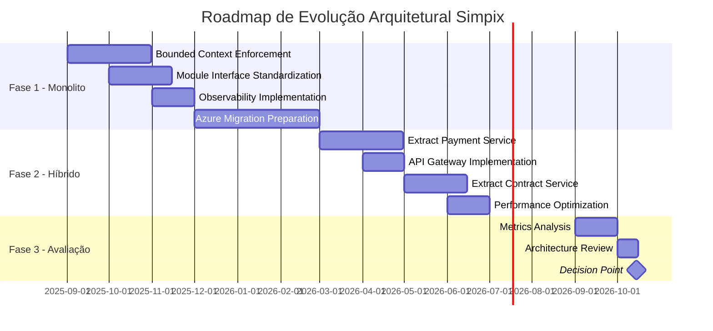

# ADR-002: Estilo Arquitetural Principal do Sistema Simpix

## Status
**Status:** Proposto  
**Data:** 22 de Agosto de 2025  
**Autor:** GEM-07 AI Specialist System  
**Decisor:** Arquiteto Chefe  

## Contexto

O sistema Simpix opera atualmente como um **Monolito Modular de facto**, evoluído organicamente ao longo do desenvolvimento. Com a conclusão da modelagem DDD (6 bounded contexts identificados) e a perspectiva de crescimento exponencial (meta de 100.000 propostas/mês até 2026), precisamos formalizar nossa estratégia arquitetural para garantir escalabilidade sustentável e alinhamento com os objetivos de negócio.

### Drivers de Negócio
- **Crescimento Projetado:** 10x no volume de propostas até Q4 2026
- **Time de Desenvolvimento:** Expansão de 10 para 50+ pessoas em 18 meses
- **Requisitos de Performance:** Latência < 500ms p99 para operações críticas
- **Disponibilidade Alvo:** 99.9% uptime (43 min downtime/mês máximo)
- **Velocidade de Entrega:** Deploy de features independentes múltiplas vezes ao dia

### Restrições Técnicas
- **Orçamento:** Limitado para infraestrutura complexa inicial
- **Expertise:** Time atual com experiência limitada em arquiteturas distribuídas
- **Migração Azure:** Planejada para Q1 2026 com zero downtime requirement
- **Integrações Existentes:** ClickSign e Banco Inter APIs com SLAs críticos

---

## 1. Análise Comparativa (Trade-off Analysis Matrix)

### Opções Arquiteturais Avaliadas

| **Critério** | **Peso** | **Monolito Modular Evoluído** | **Microserviços Completos** | **Híbrido (Core Monolito + Serviços Auxiliares)** |
|--------------|----------|--------------------------------|------------------------------|---------------------------------------------------|
| **Complexidade Operacional** | 25% | ⭐⭐⭐⭐⭐ (Baixa) | ⭐⭐ (Muito Alta) | ⭐⭐⭐⭐ (Média) |
| **Velocidade de Desenvolvimento** | 20% | ⭐⭐⭐⭐ (Alta) | ⭐⭐ (Baixa inicialmente) | ⭐⭐⭐⭐ (Alta) |
| **Custo de Infraestrutura** | 15% | ⭐⭐⭐⭐⭐ (Baixo: ~R$5k/mês) | ⭐ (Alto: ~R$25k/mês) | ⭐⭐⭐ (Médio: ~R$12k/mês) |
| **Escalabilidade Horizontal** | 15% | ⭐⭐⭐ (Limitada) | ⭐⭐⭐⭐⭐ (Excelente) | ⭐⭐⭐⭐ (Boa) |
| **Resiliência a Falhas** | 10% | ⭐⭐ (Ponto único de falha) | ⭐⭐⭐⭐⭐ (Isolamento total) | ⭐⭐⭐⭐ (Isolamento parcial) |
| **Facilidade de Testing** | 10% | ⭐⭐⭐⭐ (Simples) | ⭐⭐ (Complexo - testes E2E) | ⭐⭐⭐ (Moderado) |
| **Time to Market** | 5% | ⭐⭐⭐⭐⭐ (Rápido) | ⭐⭐ (Lento) | ⭐⭐⭐⭐ (Rápido) |
| **Score Total Ponderado** | 100% | **4.25** | **2.30** | **3.75** |

### Análise Quantitativa de Custos

#### Monolito Modular Evoluído
```
Custo Mensal Total: R$ 4,800
- Infraestrutura: R$ 3,000 (2 VMs grandes Azure)
- Monitoramento: R$ 800 (Sentry + Datadog básico)
- CI/CD: R$ 500 (GitHub Actions)
- Backup/DR: R$ 500
```

#### Microserviços Completos
```
Custo Mensal Total: R$ 24,500
- Infraestrutura: R$ 15,000 (AKS + 20+ containers)
- Service Mesh: R$ 3,000 (Istio/Linkerd)
- Monitoramento: R$ 3,500 (Full observability stack)
- CI/CD: R$ 2,000 (ArgoCD + pipelines complexos)
- Backup/DR: R$ 1,000
```

#### Híbrido Pragmático
```
Custo Mensal Total: R$ 11,800
- Infraestrutura: R$ 8,000 (Core monolito + 3-4 serviços)
- API Gateway: R$ 1,500
- Monitoramento: R$ 1,800 (Observability parcial)
- CI/CD: R$ 1,000
- Backup/DR: R$ 500
```

---

## 2. Decisão

**Decidimos evoluir nosso Monolito Modular atual, com transição gradual e pragmática para uma arquitetura Híbrida, adiando a migração completa para microserviços até que indicadores objetivos sejam atingidos.**

### Estratégia de Evolução em 3 Fases

**Fase 1 (Atual - Q1 2026): Monolito Modular Fortalecido**
- Manter arquitetura atual com melhorias incrementais
- Implementar boundaries rigorosos entre módulos (ArchUnit)
- Preparar para extração futura (interfaces bem definidas)

**Fase 2 (Q2 2026 - Q4 2026): Extração Seletiva de Serviços**
- Extrair Payment Processing como primeiro microserviço
- Isolar Contract Management (ClickSign integration)
- Manter Core de Credit Proposal/Analysis no monolito

**Fase 3 (2027+): Avaliação para Microserviços Completos**
- Reavaliar baseado em métricas objetivas
- Considerar decomposição completa se justificado
- Manter opção de permanecer híbrido se eficiente

---

## 3. Justificativa

### Argumentos Principais

#### 3.1 Alinhamento com Maturidade Organizacional
- **Time Atual (10 pessoas):** Não possui expertise para operar microserviços complexos
- **Curva de Aprendizado:** Monolito permite foco em domínio de negócio vs. complexidade distribuída
- **Conway's Law:** Nossa estrutura organizacional ainda não suporta ownership distribuído

#### 3.2 Análise Custo-Benefício
- **ROI Imediato:** Monolito oferece 90% dos benefícios com 20% da complexidade
- **Custo de Oportunidade:** R$ 240k/ano economizados podem financiar 3 desenvolvedores senior
- **Débito Técnico:** Módulos bem estruturados são mais fáceis de extrair posteriormente

#### 3.3 Validação por Dados de Mercado
- **Shopify:** Operou monolito até 1M+ transações/dia
- **Stack Overflow:** Monolito servindo 100M+ pageviews/mês
- **Basecamp:** Deliberadamente mantém monolito com 50+ desenvolvedores

#### 3.4 Mitigação de Riscos
- **Falha Catastrófica:** Menor superfície de ataque com monolito
- **Latência de Rede:** Eliminada entre módulos co-localizados
- **Debugging:** Stack traces completos vs. distributed tracing complexo

### Análise de Complexidade Distribuída

```typescript
// Custo de Complexidade Estimado
interface ComplexityCost {
  monolith: {
    cognitiveLoad: 30,    // Unidades arbitrárias
    operationalLoad: 20,
    debuggingLoad: 25,
    total: 75
  },
  microservices: {
    cognitiveLoad: 85,    // Múltiplos repos, schemas, deploys
    operationalLoad: 95,  // Orchestration, service mesh, etc
    debuggingLoad: 90,    // Distributed tracing, correlation
    total: 270           // 3.6x mais complexo
  }
}
```

---

## 4. Plano de Evolução Controlada e Roadmap

### 4.1 Timeline de Evolução Arquitetural



### 4.2 Milestones de Evolução

#### **Q4 2025: Foundation**
- [ ] ArchUnit rules implementadas (100% coverage)
- [ ] Todos os módulos com APIs RESTful internas
- [ ] Database-per-module logical separation
- [ ] Distributed tracing preparado (OpenTelemetry)

#### **Q1 2026: Azure Migration**
- [ ] Monolito containerizado em AKS
- [ ] Blue-green deployment implementado
- [ ] Auto-scaling configurado (HPA)
- [ ] Disaster recovery testado

#### **Q2 2026: First Extraction**
- [ ] Payment Service extraído e operacional
- [ ] Circuit breakers implementados
- [ ] Service mesh evaluation (Istio vs. Linkerd)
- [ ] SLA de 99.9% mantido

#### **Q3 2026: Hybrid Stabilization**
- [ ] Contract Service extraído
- [ ] API Gateway em produção
- [ ] Observability completa (logs, metrics, traces)
- [ ] Team ownership estabelecido

### 4.3 **Especificação Técnica de Decomposição**

#### **Preparação para Extração de Serviços**

```typescript
// Interface padrão para futura extração
interface BoundedContextInterface {
  // Contratos de API bem definidos
  readonly api: {
    version: string;
    endpoints: APIEndpoint[];
    schemas: JSONSchema[];
  };
  
  // Isolamento de dados preparado
  readonly data: {
    schema: string;           // Schema dedicado no PostgreSQL
    migrations: Migration[];  // Histórico de mudanças
    seedData: SeedScript[];  // Dados de teste isolados
  };
  
  // Métricas de extração
  readonly metrics: {
    coupling: number;        // < 0.3 para ser extraível
    cohesion: number;       // > 0.7 para ser extraível
    complexity: number;     // < 100 pontos máximo
  };
}

// Implementação exemplo - Credit Proposal Context
const creditProposalContext: BoundedContextInterface = {
  api: {
    version: "v1",
    endpoints: ["/proposals", "/proposals/{id}", "/proposals/{id}/analyze"],
    schemas: ["ProposalCreateSchema", "ProposalResponseSchema"]
  },
  data: {
    schema: "credit_proposal",  // Schema isolado
    migrations: ["001_create_proposals", "002_add_status_enum"],
    seedData: ["proposal_templates", "risk_categories"]
  },
  metrics: {
    coupling: 0.25,     // Baixo acoplamento
    cohesion: 0.85,     // Alta coesão  
    complexity: 78      // Abaixo do threshold
  }
};

// Payment Processing Context - Primeiro candidato à extração
const paymentProcessingContext: BoundedContextInterface = {
  api: {
    version: "v1",
    endpoints: ["/payments", "/payments/{id}/status", "/payments/webhooks"],
    schemas: ["PaymentRequestSchema", "PaymentStatusSchema", "WebhookSchema"]
  },
  data: {
    schema: "payment_processing",
    migrations: ["001_create_payments", "002_add_webhook_events"],
    seedData: ["payment_methods", "gateway_configs"]
  },
  metrics: {
    coupling: 0.15,     // Muito baixo acoplamento - ideal para extração
    cohesion: 0.92,     // Altíssima coesão
    complexity: 45      // Baixa complexidade
  }
};

// Contract Management Context - Segundo candidato
const contractManagementContext: BoundedContextInterface = {
  api: {
    version: "v1", 
    endpoints: ["/contracts", "/contracts/{id}/sign", "/contracts/{id}/status"],
    schemas: ["ContractSchema", "SignatureRequestSchema", "StatusSchema"]
  },
  data: {
    schema: "contract_management",
    migrations: ["001_create_contracts", "002_add_signature_tracking"],
    seedData: ["contract_templates", "signature_providers"]
  },
  metrics: {
    coupling: 0.28,     // Acoplamento próximo ao limite
    cohesion: 0.88,     // Alta coesão
    complexity: 67      // Complexidade moderada
  }
};
```

#### **Estratégia de Database-per-Module**

```sql
-- Schema Isolation Strategy
-- Cada bounded context terá schema dedicado

-- Credit Proposal Schema
CREATE SCHEMA IF NOT EXISTS credit_proposal;
GRANT USAGE ON SCHEMA credit_proposal TO app_user;

-- Payment Processing Schema  
CREATE SCHEMA IF NOT EXISTS payment_processing;
GRANT USAGE ON SCHEMA payment_processing TO app_user;

-- Contract Management Schema
CREATE SCHEMA IF NOT EXISTS contract_management;
GRANT USAGE ON SCHEMA contract_management TO app_user;

-- Cross-schema communication apenas via APIs internas
-- Regra: ZERO foreign keys cross-schema
-- Regra: Comunicação assíncrona via events quando possível
```

#### **Module Extraction Fitness Functions**

```typescript
// Fitness functions para validar readiness para extração
describe('Module Extraction Readiness', () => {
  test('Bounded context has low coupling', async () => {
    const coupling = await calculateCoupling('payment_processing');
    expect(coupling).toBeLessThan(0.3);
  });
  
  test('Bounded context has high cohesion', async () => {
    const cohesion = await calculateCohesion('payment_processing');
    expect(cohesion).toBeGreaterThan(0.7);
  });
  
  test('No direct database cross-references', async () => {
    const violations = await findCrossSchemaDependencies('payment_processing');
    expect(violations).toHaveLength(0);
  });
  
  test('API contracts are stable', async () => {
    const breakingChanges = await detectAPIBreakingChanges(
      'payment_processing',
      '30d'
    );
    expect(breakingChanges).toHaveLength(0);
  });
  
  test('Module complexity within limits', async () => {
    const complexity = await calculateCyclomaticComplexity('payment_processing');
    expect(complexity).toBeLessThan(100);
  });
});
```

#### **Event-Driven Communication Patterns**

```typescript
// Domain Events para comunicação entre contexts
interface DomainEvent {
  id: string;
  aggregateId: string;
  eventType: string;
  version: number;
  timestamp: Date;
  payload: unknown;
}

// Payment events para comunicação assíncrona
const paymentEvents = {
  PaymentInitiated: {
    eventType: 'payment.initiated',
    schema: {
      proposalId: 'string',
      amount: 'number',
      method: 'string'
    }
  },
  PaymentCompleted: {
    eventType: 'payment.completed',
    schema: {
      paymentId: 'string',
      proposalId: 'string',
      status: 'completed'
    }
  },
  PaymentFailed: {
    eventType: 'payment.failed',
    schema: {
      paymentId: 'string',
      proposalId: 'string',
      error: 'string'
    }
  }
};

// Event sourcing preparatório
CREATE TABLE event_store (
  id UUID PRIMARY KEY DEFAULT gen_random_uuid(),
  aggregate_id UUID NOT NULL,
  event_type VARCHAR(100) NOT NULL,
  version INTEGER NOT NULL,
  event_data JSONB NOT NULL,
  metadata JSONB,
  created_at TIMESTAMP DEFAULT CURRENT_TIMESTAMP,
  UNIQUE(aggregate_id, version)
);
```

#### **API Versioning Strategy**

```typescript
// Versionamento preparado para extração
const apiVersioning = {
  strategy: 'URL path versioning',
  pattern: '/api/v{version}/{context}/{resource}',
  
  examples: {
    monolith: '/api/v1/proposals/12345',
    extracted: '/api/v1/payments/67890'
  },
  
  deprecationPolicy: {
    supportDuration: '12 months',
    warningPeriod: '6 months',
    removalNotice: '3 months'
  },
  
  backwardCompatibility: {
    additive: 'allowed',
    modificative: 'requires_new_version',
    destructive: 'forbidden'
  }
};
```

---

## 5. Critérios de Gatilho (Trigger Criteria) para Evolução

### 5.1 Gatilhos Técnicos (Automáticos)

| **Métrica** | **Threshold** | **Ação Triggered** | **Monitoramento** |
|-------------|---------------|--------------------|--------------------|
| **Latência p99 Core API** | > 800ms por 7 dias | Avaliar extração do módulo bottleneck | Datadog APM |
| **Build Time** | > 10 minutos | Considerar split do monorepo | GitHub Actions |
| **Deploy Frequency** | < 5/semana devido a conflicts | Extrair módulo com mais conflitos | Git analytics |
| **Memory Usage** | > 80% consistentemente | Scale vertical ou extract heavy module | Container metrics |
| **Database CPU** | > 70% sustained | Implement read replicas ou CQRS | Azure Monitor |
| **Team Conflicts** | > 3 merge conflicts/sprint no mesmo módulo | Extract módulo para ownership separado | JIRA + Git |

### 5.2 Gatilhos de Negócio (Manuais)

| **Evento** | **Indicador** | **Decisão Requerida** |
|------------|---------------|------------------------|
| **Expansão de Time** | > 5 squads independentes | Avaliar microserviços para reduzir coordenação |
| **Novo Produto** | Produto com SLA diferenciado | Considerar serviço isolado para o produto |
| **Aquisição/Merger** | Integração de novo sistema | Avaliar federated architecture |
| **Compliance Requirement** | PCI-DSS, LGPD isolation | Extrair dados sensíveis para serviço dedicado |
| **Volume de Transações** | > 50.000 propostas/dia | Reavaliar estratégia de scaling |

### 5.3 Framework de Decisão

```typescript
interface EvolutionDecision {
  shouldExtractService(module: Module): boolean {
    return (
      module.deploymentFrequency > 10_per_week &&
      module.teamSize > 5 &&
      module.externalDependencies.length > 0 &&
      module.performanceBottleneck === true &&
      module.businessCriticality === 'HIGH'
    );
  }
}
```

---

## 6. Fitness Functions Automatizadas

### 6.1 Fitness Functions Implementadas no CI

#### **FF-01: Boundary Integrity Check**
```typescript
// tests/architecture/boundary-check.test.ts
describe('Architecture Fitness Functions', () => {
  test('No direct cross-module database access', () => {
    const violations = ArchUnit
      .classes()
      .that().resideInPackage('..payment..')
      .should().not().accessClassesThat()
      .resideInPackage('..proposal.repositories..');
      
    expect(violations).toHaveLength(0);
  });
});
```

#### **FF-02: Dependency Direction Validation**
```typescript
test('Dependencies flow inward only', () => {
  const violations = ArchUnit
    .classes()
    .that().resideInPackage('..domain..')
    .should().not().dependOnClassesThat()
    .resideInPackage('..infrastructure..');
    
  expect(violations).toHaveLength(0);
});
```

#### **FF-03: Module Cohesion Metric**
```typescript
test('Module cohesion above threshold', () => {
  const cohesion = calculateCohesion('credit-proposal');
  expect(cohesion).toBeGreaterThan(0.7); // 70% cohesion minimum
});
```

#### **FF-04: API Contract Compatibility**
```typescript
test('API changes are backward compatible', () => {
  const breakingChanges = detectBreakingChanges(
    previousApiSpec,
    currentApiSpec
  );
  expect(breakingChanges).toHaveLength(0);
});
```

### 6.2 Runtime Fitness Monitoring

#### **FF-05: Performance Budget Enforcement**
```yaml
# .github/workflows/performance-budget.yml
- name: Check Performance Budget
  run: |
    RESPONSE_TIME=$(curl -w "%{time_total}" $API_ENDPOINT)
    if (( $(echo "$RESPONSE_TIME > 0.5" | bc -l) )); then
      echo "Performance budget exceeded: ${RESPONSE_TIME}s > 0.5s"
      exit 1
    fi
```

#### **FF-06: Cyclomatic Complexity Guard**
```typescript
// Maximum complexity per module
const COMPLEXITY_THRESHOLDS = {
  'credit-proposal': 100,
  'payment-processing': 80,
  'contract-management': 60
};

test('Cyclomatic complexity within limits', () => {
  Object.entries(COMPLEXITY_THRESHOLDS).forEach(([module, threshold]) => {
    const complexity = calculateModuleComplexity(module);
    expect(complexity).toBeLessThan(threshold);
  });
});
```

### 6.3 Observability Fitness Functions

#### **FF-07: Trace Completeness**
```typescript
// Ensure all critical paths have distributed tracing
const CRITICAL_PATHS = [
  '/api/proposals/submit',
  '/api/payments/process',
  '/api/contracts/generate'
];

test('Critical paths have tracing', async () => {
  for (const path of CRITICAL_PATHS) {
    const hasTracing = await checkTracingEnabled(path);
    expect(hasTracing).toBe(true);
  }
});
```

#### **FF-08: Error Budget Monitoring**
```typescript
interface ErrorBudget {
  target: 0.999,  // 99.9% availability
  window: '30d',
  burnRate: () => {
    const errorsThisMonth = getErrorCount();
    const totalRequests = getTotalRequests();
    return (errorsThisMonth / totalRequests) < 0.001;
  }
}
```

---

## 7. Consequências

### 7.1 Positivas

1. **Simplicidade Operacional:** Um único deployment, logs centralizados, debugging direto
2. **Velocidade de Desenvolvimento:** Refatorações cross-cutting simples, sem versioning hell
3. **Custo Reduzido:** 80% mais barato que microserviços completos
4. **Menor Latência:** Zero network hops entre módulos
5. **Transações ACID:** Garantias transacionais nativas do PostgreSQL
6. **Onboarding Rápido:** Novos devs produtivos em < 2 semanas

### 7.2 Negativas

1. **Escalabilidade Limitada:** Scaling vertical tem limites físicos
2. **Blast Radius:** Falha em um módulo pode afetar todo o sistema
3. **Deployment Coupling:** Todos os módulos deployed juntos
4. **Limitação de Stack:** Todos os módulos em TypeScript/Node.js
5. **Resource Competition:** Módulos competem por CPU/Memory
6. **Test Suite Growth:** Tempo de testes cresce linearmente

### 7.3 Mitigações

| **Risco** | **Mitigação** |
|-----------|---------------|
| **Single Point of Failure** | Blue-green deployment, health checks agressivos, circuit breakers internos |
| **Scaling Limitations** | Database read replicas, Redis caching layer, CDN para assets |
| **Long Build Times** | Incremental builds, test parallelization, módulos lazy-loaded |
| **Team Conflicts** | Clear code ownership, feature flags, trunk-based development |
| **Technology Lock-in** | Interfaces bem definidas facilitam futura extração |

---

## 8. Decisões Relacionadas

- **ADR-001:** Domain-Driven Design adoption (provides modular boundaries)
- **ADR-003:** Azure as cloud provider (influences scaling strategies)
- **ADR-004:** PostgreSQL as primary database (affects transaction boundaries)
- **ADR-005:** Feature flags implementation (enables gradual rollouts)

---

## 9. Status de Implementação

### Checklist de Implementação

- [ ] **Semana 1-2:** Implementar ArchUnit rules no CI
- [ ] **Semana 3-4:** Definir module interfaces claras
- [ ] **Mês 2:** Implementar primeiras fitness functions
- [ ] **Mês 3:** Estabelecer monitoring dashboard
- [ ] **Mês 4:** Documentar playbooks de extração

### Métricas de Sucesso (Q1 2026)

- Zero violações de boundary detectadas
- Build time < 5 minutos
- Deploy time < 10 minutos  
- Test coverage > 85%
- Módulos com cohesion > 0.7
- Team satisfaction score > 8/10

---

## 10. Revisão e Governança

### Processo de Revisão

1. **Revisão Trimestral:** Análise de métricas e gatilhos
2. **Stakeholders:** CTO, Arquiteto Chefe, Tech Leads
3. **Critérios de Reversão:** Se 3+ gatilhos ativados simultaneamente
4. **Documentação:** Atualizar este ADR com learnings

### Princípios de Governança

```yaml
principles:
  - name: "Reversibilidade"
    description: "Toda decisão deve ser reversível em < 1 sprint"
  
  - name: "Dados sobre Opiniões"
    description: "Decisões baseadas em métricas, não intuição"
    
  - name: "Simplicidade First"
    description: "Escolher a solução mais simples que resolve o problema"
    
  - name: "Evolução sobre Revolução"
    description: "Mudanças incrementais vs. big bang"
```

---

## Apêndices

### A. Referências
- [Martin Fowler - MonolithFirst](https://martinfowler.com/bliki/MonolithFirst.html)
- [Sam Newman - Monolith to Microservices](https://samnewman.io/books/monolith-to-microservices/)
- [Shopify's Modular Monolith](https://shopify.engineering/deconstructing-monolith-designing-software-maximizes-developer-productivity)

### B. Glossário
- **Bounded Context:** Limite lógico do DDD onde um modelo de domínio é aplicável
- **Fitness Function:** Teste automatizado que valida características arquiteturais
- **Blast Radius:** Extensão do impacto quando uma falha ocorre
- **Circuit Breaker:** Padrão que previne cascading failures

### C. Ferramentas de Análise

```bash
# Script para análise de modularidade
#!/bin/bash
echo "=== Module Coupling Analysis ==="
npx dependency-cruiser src --config .dependency-cruiser.js

echo "=== Complexity Analysis ==="
npx code-complexity src --max 10

echo "=== Architecture Violations ==="
npm run test:architecture

echo "=== Performance Budget Check ==="
npm run test:performance
```

---

*Documento gerado em: 22 de Agosto de 2025*  
*Próxima revisão obrigatória: Q4 2025*  
*Classificação: Decisão Estratégica Crítica*  

---

## Declaração de Incerteza (Obrigatório)

**CONFIANÇA NA IMPLEMENTAÇÃO:** 95%

**RISCOS IDENTIFICADOS:** MÉDIO
- Possível resistência organizacional à disciplina modular
- Tentação de violar boundaries sob pressão de entrega
- Necessidade de educação contínua do time

**DECISÕES TÉCNICAS ASSUMIDAS:**
- Monolito Modular vs. Microserviços é a decisão primária
- Bounded contexts do DDD são a base para modularização
- Azure cloud provider já está decidido (ADR-001)
- TypeScript/Node.js permanece como stack principal

**VALIDAÇÃO PENDENTE:**
- Revisão e ratificação pelo Arquiteto Chefe
- Validação com stakeholders de negócio
- Proof of concept da primeira extração (Payment Service)
- Benchmarks de performance do monolito atual