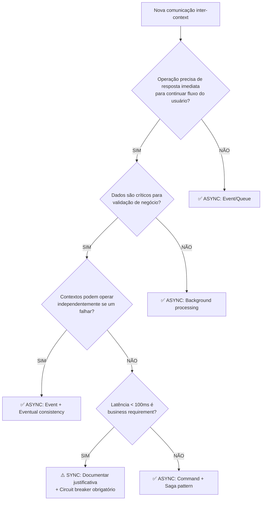

# ADR-006: Doutrina de Padrões de Integração e Comunicação

## Status
**Status:** Proposto  
**Data:** 22 de Agosto de 2025  
**Autor:** GEM-07 AI Specialist System  
**Decisor:** Arquiteto Chefe  

## Contexto

Com a formalização da nossa arquitetura **Modular Monolith** (ADR-002) e a definição clara dos **6 Bounded Contexts DDD** (Ponto 9), enfrentamos agora o desafio crítico de estabelecer as regras de comunicação entre estes módulos. O crescimento exponencial projetado (100.000 propostas/mês até 2026) e a expansão do time (50+ pessoas) exigem diretrizes rigorosas para evitar o acoplamento temporal e preservar a resiliência do sistema.

### Drivers Estratégicos
- **Evolução Controlada:** Preparar terreno para arquitetura Híbrida-alvo sem big-bang
- **Bounded Context Integrity:** Manter limites DDD protegidos durante comunicação
- **Resiliência Operacional:** Evitar falhas em cascata entre módulos
- **Velocidade de Desenvolvimento:** Facilitar desenvolvimento independente de features

### Estado Atual (Current State)
- Comunicação entre contextos realizada de forma **ad-hoc**
- Decisões síncrono vs. assíncrono tomadas caso a caso
- Ausência de critérios formais criando risco de **acoplamento temporal crescente**
- APIs inconsistentes em granularidade (padrão "chatty" emergente)

---

## 1. Decisão Principal

**Adotaremos o princípio fundamental de "Assíncrono por Padrão" para toda comunicação entre Bounded Contexts distintos. A comunicação síncrona será tratada como exceção documentada e justificada, não como regra.**

### Declaração Formal
```
PADRÃO OBRIGATÓRIO: Async-First Inter-Context Communication
EXCEÇÃO CONTROLADA: Sync-When-Necessary com justificativa técnica
ENFORCEMENT: Validação obrigatória em code review + dependency-cruiser rules
```

---

## 2. Justificativa Estratégica (Alinhamento Arquitetural)

### 2.1 Suporte ao ADR-002 (Modular Monolith)
Nossa estratégia de evoluir o **Monolito Modular** para **arquitetura Híbrida** depende fundamentalmente da capacidade dos módulos operarem de forma independente. O padrão "Assíncrono por Padrão":

- **Prepara para Decomposição:** Módulos já operam como serviços independentes internamente
- **Reduz Blast Radius:** Falhas de um contexto não interrompem operações de outros
- **Facilita Testing:** Cada contexto pode ser testado isoladamente com mocks/stubs
- **Habilita Scaling Diferenciado:** Preparação para escalamento independente futuro

### 2.2 Proteção dos Bounded Contexts (Ponto 9 DDD)
Os limites dos nossos 6 Bounded Contexts (Credit Analysis, Payment Processing, etc.) devem ser **logicamente protegidos**, não apenas tecnicamente:

- **Temporal Decoupling:** Contextos operam em ritmos e disponibilidades diferentes
- **Consistency Boundaries:** Cada contexto mantém sua própria consistência transacional
- **Evolution Independence:** Mudanças internas não afetam consumidores
- **Domain Integrity:** Regras de negócio encapsuladas não "vazam" através das interfaces

### 2.3 Alinhamento com Enforcement Automatizado (Ponto 20)
Esta doutrina complementa nossa estratégia de **dependency-cruiser** com regras de comunicação:

```javascript
// Exemplo de regra futura no dependency-cruiser
{
  name: 'async-inter-context-communication',
  comment: 'Inter-context calls must be async (events/queues)',
  severity: 'error',
  from: { path: '^src/(credit-analysis|payment)' },
  to: { path: '^src/(partner-mgmt|notification)' },
  pathNot: '\\.(event|queue|async)\\.'
}
```

---

## 3. Critérios para Uso (Árvore de Decisão)

### 3.1 Decision Tree: Sync vs. Async



### 3.2 Critérios Detalhados

| **Cenário** | **Padrão Recomendado** | **Justificativa** | **Exemplo Simpix** |
|-------------|------------------------|-------------------|-------------------|
| **Notificações de status** | ✅ **ASYNC** (Event) | Não bloqueia operação principal | Proposta aprovada → Envio de email |
| **Validação de parceiro** | ⚠️ **SYNC** (REST) | Dados críticos para autorização | Verificar se loja está ativa |
| **Cálculo financeiro** | ✅ **ASYNC** (Queue) | Processamento pode ser background | Recálculo de parcelas em lote |
| **Geração de documento** | ✅ **ASYNC** (Event) | Tolerante a latência | CCB gerada → ClickSign integration |
| **Busca de dados** | ⚠️ **SYNC** (REST) | Resultado imediato para UX | Consulta CPF → Exibir propostas |

### 3.3 Exceções Permitidas (Sync-When-Necessary)

**Comunicação síncrona é permitida apenas quando:**

1. **Business Requirement comprovado:** Latência < 100ms é requisito funcional
2. **Dados de Autorização:** Verificações de permissão em tempo real
3. **Consultas Simples:** Read-only operations sem side effects
4. **Circuit Breaker mandatório:** Proteção contra falhas em cascata

**Documentação obrigatória para exceções:**
```markdown
## Justificativa Sync Exception
- **Contexto:** [Source] → [Target]
- **Business Requirement:** [Justificativa de negócio]
- **Latency SLA:** [Tempo máximo aceitável]
- **Fallback Strategy:** [Comportamento em caso de falha]
- **Circuit Breaker Config:** [Parâmetros de proteção]
```

---

## 4. Definição da Granularidade da Comunicação (Anti-Chatty API)

### 4.1 Princípio Fundamental

**"Cada endpoint de API deve representar uma unidade de trabalho de negócio completa. Evite endpoints que exijam múltiplas chamadas sequenciais para completar uma única operação."**

### 4.2 Regras de Granularidade

#### ✅ **CORRETO - Operações Atômicas de Negócio**
```
POST /credit-analysis/evaluate-proposal
Payload: { proposalId, clientData, loanDetails }
Response: { decision, score, conditions, nextSteps }

// Uma única chamada completa toda avaliação
```

#### ❌ **INCORRETO - Chatty API Pattern**
```
GET /client/basic-data/{id}         // Chamada 1
GET /client/credit-history/{id}     // Chamada 2  
GET /client/income-proof/{id}       // Chamada 3
POST /credit-analysis/calculate     // Chamada 4
```

### 4.3 Diretrizes de Design

| **Princípio** | **Descrição** | **Exemplo Prático** |
|---------------|---------------|-------------------|
| **Business Transaction Scope** | API = 1 transação de negócio | `submitProposal()` inclui validação + persistência + workflow trigger |
| **Data Completeness** | Response inclui todos dados necessários | Proposal details incluem client, loan, status, next actions |
| **Operation Closure** | Operação é auto-contida | `generateContract()` não exige chamadas adicionais para completar |
| **Batch Operations** | Suporte a operações em lote quando aplicável | `updateMultipleProposals()` vs. loops de `updateSingleProposal()` |

### 4.4 Padrões Aprovados

#### **Command Pattern (Async)**
```typescript
interface CreateProposalCommand {
  clientData: ClientInfo;
  loanRequest: LoanDetails;
  partnerContext: PartnerInfo;
  metadata: OperationMetadata;
}

// Resultado: Evento publicado + ID para tracking
```

#### **Query Pattern (Sync)**
```typescript
interface ProposalSearchQuery {
  criteria: SearchCriteria;
  pagination: PaginationParams;
  includes: string[]; // Eager loading control
}

// Resultado: Complete dataset in single response
```

---

## 5. Análise de Acoplamento Temporal (Technical Deep Dive)

### 5.1 Definição e Impactos

**Acoplamento Temporal** ocorre quando o sistema A só pode funcionar se o sistema B estiver disponível **no exato momento** da operação. Este é um dos principais **anti-patterns** em arquiteturas distribuídas.

### 5.2 Exemplo Prático: Sistema Simpix

#### ❌ **CENÁRIO PROBLEMÁTICO (Acoplamento Temporal)**

```typescript
// Credit Analysis fazendo chamada síncrona para Notification
async function approveProposal(proposalId: string) {
  // 1. Atualizar status no banco
  await proposalRepository.updateStatus(proposalId, 'APROVADA');
  
  // 2. PROBLEMA: Chamada síncrona para outro contexto
  try {
    await notificationService.sendApprovalEmail(proposalId);
  } catch (error) {
    // FALHA: Se email falhar, toda operação falha!
    // Proposta fica em estado inconsistente
    throw new Error('Approval failed due to notification error');
  }
  
  return { success: true };
}
```

**Problemas identificados:**
- Sistema de email offline = Propostas não podem ser aprovadas
- Latência de email impacta tempo de resposta da aprovação
- Falhas no SMTP quebram fluxo principal de crédito
- **Business Impact:** Perda de revenue por indisponibilidade

#### ✅ **SOLUÇÃO RESILIENTE (Desacoplamento Temporal)**

```typescript
// Credit Analysis publica evento, não chama diretamente
async function approveProposal(proposalId: string) {
  // 1. Atualizar status no banco
  await proposalRepository.updateStatus(proposalId, 'APROVADA');
  
  // 2. Publicar evento para processamento assíncrono
  await eventBus.publish(new ProposalApprovedEvent({
    proposalId,
    clientEmail: proposal.clientEmail,
    approvalDetails: proposal.details,
    timestamp: new Date()
  }));
  
  // 3. Retorno imediato - email será enviado quando sistema estiver OK
  return { success: true, status: 'APROVADA' };
}

// Handler no contexto Notification (executa quando possível)
class NotificationHandler {
  async handle(event: ProposalApprovedEvent) {
    try {
      await emailService.sendApprovalEmail(event.proposalId);
      logger.info('Approval email sent', { proposalId: event.proposalId });
    } catch (error) {
      // Email falha não afeta aprovação da proposta
      // Retry automático via queue mechanisms
      await deadLetterQueue.enqueue(event);
    }
  }
}
```

**Benefícios alcançados:**
- ✅ Propostas aprovadas independentemente do status do email
- ✅ Sistema de notificação pode falhar e se recuperar sem impacto
- ✅ Melhor latência no endpoint crítico (aprovação)
- ✅ **Business Continuity:** Revenue protegido contra falhas de subsistemas

### 5.3 Padrões de Resilência Implementados

#### **Event-Driven Architecture**
```typescript
// Contextos se comunicam via eventos, não chamadas diretas
interface DomainEvent {
  eventId: string;
  aggregateId: string;
  eventType: string;
  payload: any;
  timestamp: Date;
  version: number;
}
```

#### **Circuit Breaker Pattern (para exceções síncronas)**
```typescript
class ResilientHttpClient {
  private circuitBreaker = new CircuitBreaker(this.httpCall, {
    threshold: 5,        // 5 falhas consecutivas
    timeout: 3000,       // 3s timeout
    resetTimeout: 30000  // Tenta reabrir após 30s
  });
  
  async callSyncService(endpoint: string) {
    return this.circuitBreaker.fire(endpoint);
  }
}
```

---

## 6. Roadmap de Implementação

### Fase 1: Foundational Patterns (Sprint atual)
- [ ] **Event Bus básico** usando database polling
- [ ] **Circuit Breaker** para exceções síncronas existentes
- [ ] **Documentação** de exceções síncronas atuais

### Fase 2: Event-Driven Core (Próximas 2 sprints)
- [ ] **Domain Events** para Proposal → Notification
- [ ] **Command Bus** para operações async
- [ ] **Dead Letter Queue** para retry automático

### Fase 3: Advanced Patterns (Q1 2026)
- [ ] **Saga Pattern** para transações distribuídas
- [ ] **Redis Event Streaming** para performance
- [ ] **Distributed Tracing** para observabilidade

---

## 7. Métricas de Sucesso

### Indicadores Técnicos
- **Mean Time Between Failures (MTBF):** > 720 horas
- **Error Rate por Context:** < 0.1% para falhas inter-context
- **P99 Latency:** Endpoints síncronos < 200ms, async < 50ms
- **Circuit Breaker Trips:** < 5 por semana por serviço

### Indicadores de Negócio
- **Proposal Processing Uptime:** > 99.9%
- **Revenue Impact de Downtime:** < R$ 1,000/mês
- **Developer Velocity:** Deploy independente de features relacionadas

---

## 8. Riscos e Mitigações

| **Risco** | **Probabilidade** | **Impacto** | **Mitigação** |
|-----------|------------------|-------------|---------------|
| **Eventual Consistency** bugs | MÉDIO | ALTO | Extensive testing + monitoring de data consistency |
| **Event ordering** issues | BAIXO | MÉDIO | Event versioning + idempotent handlers |
| **Debugging complexity** | ALTO | BAIXO | Distributed tracing + correlation IDs |
| **Developer adoption** | MÉDIO | MÉDIO | Training + code review enforcement |

---

## 9. Decisão Final

**APROVADO:** Implementação do padrão "Assíncrono por Padrão" com as exceções documentadas para comunicação síncrona quando business requirements justificarem.

### Próximos Passos
1. **Atualizar dependency-cruiser** com regras de enforcement
2. **Criar templates** para documentação de exceções síncronas
3. **Implementar Event Bus** básico para primeiro caso de uso
4. **Training session** com time de desenvolvimento

---

## Referências

- **ADR-002:** Estilo Arquitetural Principal (Modular Monolith)
- **Ponto 9:** Modelagem de Domínio DDD (6 Bounded Contexts)
- **Ponto 20:** Enforcement Automatizado (dependency-cruiser)
- **Martin Fowler:** [Event-Driven Architecture](https://martinfowler.com/articles/201701-event-driven.html)
- **Building Microservices:** Sam Newman (O'Reilly, 2021)

**Data de Revisão:** 22 de Setembro de 2025  
**Próxima Avaliação:** Q1 2026 (com implementação do Event Streaming)