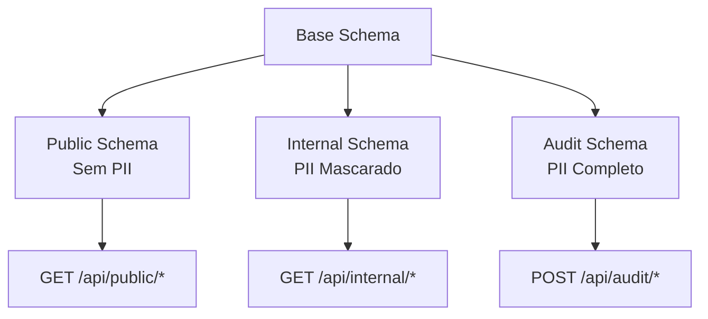

# ADR-008: Estratégia de Contrato de Dados e Segurança de Payloads

**Data:** 22/08/2025  
**Status:** Aprovado  
**Autores:** GEM 02 (Dev Specialist), GEM 07 (AI Specialist)  
**Decisor:** Arquiteto Chefe

---

## 1. Contexto

### 1.1 Situação Atual

O sistema Simpix processa dados altamente sensíveis (PII - Personally Identifiable Information) incluindo:
- Dados pessoais: CPF, RG, data de nascimento, endereço completo
- Dados financeiros: contas bancárias, rendimentos, histórico de crédito
- Dados contratuais: valores, taxas, condições de pagamento

**Problema Crítico Identificado:** As APIs atuais expõem dados PII completos em endpoints GET, violando princípios fundamentais de segurança e compliance (LGPD, PCI-DSS).

### 1.2 Drivers de Decisão

1. **Compliance Regulatório** - LGPD exige proteção de dados pessoais
2. **Segurança por Design** - Minimizar superfície de ataque
3. **Princípio do Menor Privilégio** - Expor apenas dados necessários
4. **Auditabilidade** - Rastrear acesso a dados sensíveis
5. **Performance** - Reduzir payload de respostas

### 1.3 Requisitos Não-Funcionais Relacionados

- **NFR-SEC-01:** 100% dos dados PII devem ser protegidos (P0)
- **NFR-SEC-02:** Zero vulnerabilidades críticas em produção
- **NFR-PERF-01:** Respostas API < 200ms (p95)

---

## 2. Decisão

### 2.1 Declaração da Decisão

**Adotaremos uma estratégia de "Zero-PII em GETs" com validação Zod obrigatória na borda de todas as APIs.**

Dados PII sensíveis **NUNCA** devem ser expostos em respostas GET. Em vez disso, usaremos:
- **Identificadores opacos** para referências
- **Dados mascarados** quando visualização parcial for necessária
- **Endpoints dedicados com auditoria** para acesso completo quando justificado

### 2.2 Políticas Mandatórias

```typescript
// ❌ PROIBIDO - Expõe PII completo
GET /api/clientes/123
{
  "cpf": "123.456.789-00",  // NUNCA!
  "rg": "12.345.678-9"       // NUNCA!
}

// ✅ CORRETO - Dados mascarados
GET /api/clientes/123
{
  "id": "client_abc123",
  "cpfMasked": "***.***.789-**",
  "rgMasked": "**.***.**8-*"
}

// ✅ CORRETO - Endpoint auditado para dados completos
POST /api/clientes/123/pii-access
Authorization: Bearer <token-with-elevated-privileges>
X-Audit-Reason: "Verificação KYC"
{
  "fields": ["cpf", "rg"],
  "justification": "Processo de formalização #4567"
}
```

---

## 3. Repositório Centralizado de Schemas

### 3.1 Estrutura Organizacional

```typescript
// shared/schema.ts - Fonte única de verdade
export const schemas = {
  // Schemas de entrada (requests)
  input: {
    createProposal: createProposalSchema,
    updateClient: updateClientSchema,
  },
  
  // Schemas de saída (responses)
  output: {
    proposalPublic: proposalPublicSchema,    // Sem PII
    proposalInternal: proposalInternalSchema, // Com PII mascarado
    proposalAudit: proposalAuditSchema,      // Completo (auditado)
  },
  
  // Schemas compartilhados
  common: {
    paginationParams: paginationSchema,
    errorResponse: errorResponseSchema,
  }
};
```

### 3.2 Hierarquia de Schemas



---

## 4. Estratégia de Validação na Borda

### 4.1 Validação de Request (Fail-Fast)

```typescript
// server/middleware/validation.ts
export const validateRequest = (schema: ZodSchema) => {
  return async (req: Request, res: Response, next: NextFunction) => {
    try {
      // Validação ANTES de qualquer processamento
      const validated = await schema.parseAsync(req.body);
      req.validatedBody = validated;
      next();
    } catch (error) {
      if (error instanceof z.ZodError) {
        // Resposta padronizada RFC 7807
        return res.status(400).json({
          type: "/errors/validation-failed",
          title: "Validation Failed",
          status: 400,
          detail: "Request body validation failed",
          errors: error.errors.map(e => ({
            field: e.path.join('.'),
            message: e.message,
            code: e.code
          }))
        });
      }
      next(error);
    }
  };
};

// Uso em rotas
router.post('/api/proposals',
  validateRequest(schemas.input.createProposal), // PRIMEIRA linha do handler
  async (req, res) => {
    const data = req.validatedBody; // Já validado e tipado
    // ... processamento
  }
);
```

### 4.2 Validação de Response

```typescript
// server/middleware/response-validation.ts
export const validateResponse = (schema: ZodSchema) => {
  return async (data: any): Promise<any> => {
    // Remove campos não definidos no schema
    const validated = await schema.parseAsync(data);
    
    // Auditoria de campos removidos
    const removed = Object.keys(data).filter(
      key => !(key in validated)
    );
    
    if (removed.length > 0) {
      logger.warn('Response sanitization removed fields', {
        removed,
        endpoint: req.originalUrl
      });
    }
    
    return validated;
  };
};
```

---

## 5. Tratamento de Dados PII

### 5.1 Classificação de Dados

| **Categoria** | **Campos** | **Tratamento GET** | **Tratamento POST/PUT** |
|---------------|------------|-------------------|------------------------|
| **PII Crítico** | CPF, RG, CNH | Sempre mascarado | Validado + Criptografado |
| **PII Sensível** | Nome completo, endereço | Parcialmente mascarado | Validado |
| **PII Financeiro** | Conta bancária, salário | Nunca exposto | Validado + Auditado |
| **PII Público** | Nome social, cidade | Pode ser exposto | Validado |

### 5.2 Funções de Mascaramento

```typescript
// shared/utils/pii-masking.ts
export const maskCPF = (cpf: string): string => {
  // Input: 123.456.789-00
  // Output: ***.***.789-**
  const clean = cpf.replace(/\D/g, '');
  return `***.***.${ clean.slice(6, 9)}-**`;
};

export const maskRG = (rg: string): string => {
  // Input: 12.345.678-9
  // Output: **.***.**8-*
  const parts = rg.split('-');
  const digits = parts[0].replace(/\D/g, '');
  return `**.***.**${digits.slice(-1)}-*`;
};

export const maskBankAccount = (account: string): string => {
  // Input: 12345-6
  // Output: ****5-6
  const parts = account.split('-');
  return `****${parts[0].slice(-1)}-${parts[1]}`;
};

export const maskName = (name: string): string => {
  // Input: João da Silva Santos
  // Output: João S.
  const parts = name.split(' ');
  if (parts.length <= 1) return name;
  return `${parts[0]} ${parts[parts.length - 1][0]}.`;
};
```

### 5.3 Endpoints de Acesso Auditado

```typescript
// server/routes/audit-access.ts
router.post('/api/audit/pii-access',
  requireRole(['ADMIN', 'COMPLIANCE']),
  auditMiddleware,
  rateLimitStrict, // Max 10 req/min
  async (req: AuthenticatedRequest, res) => {
    const { resourceId, fields, justification } = req.body;
    
    // Log de auditoria ANTES do acesso
    await auditLogger.log({
      event: 'PII_ACCESS_REQUEST',
      userId: req.user.id,
      resourceId,
      fields,
      justification,
      timestamp: new Date(),
      ip: req.ip
    });
    
    // Verificar permissões granulares
    const allowed = await checkPIIPermissions(req.user, fields);
    if (!allowed) {
      return res.status(403).json({ 
        error: 'Insufficient privileges for requested PII fields' 
      });
    }
    
    // Buscar dados com timeout curto
    const data = await fetchPIIData(resourceId, fields, {
      timeout: 5000,
      audit: true
    });
    
    // Log de auditoria APÓS o acesso
    await auditLogger.log({
      event: 'PII_ACCESS_GRANTED',
      userId: req.user.id,
      resourceId,
      fieldsAccessed: Object.keys(data),
      timestamp: new Date()
    });
    
    // Resposta com TTL curto
    res.setHeader('Cache-Control', 'no-store, max-age=0');
    res.json({
      data,
      accessId: generateAccessId(), // Para rastreamento
      expiresIn: 300 // 5 minutos
    });
  }
);
```

---

## 6. Evolução de Schema e Compatibilidade

### 6.1 Regras de Evolução

1. **Adições são sempre opcionais**
   ```typescript
   // ✅ CORRETO - Campo novo opcional
   const schemaV2 = schemaV1.extend({
     newField: z.string().optional()
   });
   
   // ❌ ERRADO - Campo novo obrigatório quebra compatibilidade
   const schemaV2 = schemaV1.extend({
     newField: z.string() // Sem .optional()
   });
   ```

2. **Remoções via deprecação gradual**
   ```typescript
   // Passo 1: Marcar como deprecated
   const schema = z.object({
     oldField: z.string().optional(), // @deprecated Use newField
     newField: z.string().optional()
   });
   
   // Passo 2: Após 3 meses, remover
   const schema = z.object({
     newField: z.string().optional()
   });
   ```

3. **Transformações são versionadas**
   ```typescript
   // v1/proposals - formato antigo
   // v2/proposals - formato novo
   // Coexistem por período de transição
   ```

### 6.2 Schema Registry

```typescript
// shared/schema-registry.ts
export const SchemaRegistry = {
  versions: {
    '1.0.0': schemasV1,
    '1.1.0': schemasV1_1,
    '2.0.0': schemasV2
  },
  
  current: '2.0.0',
  minimum: '1.1.0', // Versão mínima suportada
  
  migrate(data: any, fromVersion: string, toVersion: string) {
    // Lógica de migração entre versões
    const migrations = this.getMigrationPath(fromVersion, toVersion);
    return migrations.reduce((acc, migration) => 
      migration(acc), data
    );
  }
};
```

---

## 7. Implementação e Enforcement

### 7.1 Checklist de Implementação

- [ ] Criar diretório `shared/schemas/` com estrutura modular
- [ ] Implementar funções de mascaramento em `shared/utils/pii-masking.ts`
- [ ] Adicionar middleware de validação em todas as rotas
- [ ] Refatorar endpoints GET para remover PII
- [ ] Criar endpoints de auditoria para acesso PII
- [ ] Configurar logs de auditoria estruturados
- [ ] Adicionar testes de validação de schema
- [ ] Documentar schemas no OpenAPI

### 7.2 Automação e CI/CD

```yaml
# .github/workflows/schema-validation.yml
name: Schema Validation
on: [push, pull_request]

jobs:
  validate:
    steps:
      - name: Validate Zod Schemas
        run: npm run validate:schemas
        
      - name: Check PII Exposure
        run: npm run audit:pii
        
      - name: Schema Compatibility Check
        run: npm run test:schema-compat
        
      - name: Generate OpenAPI from Zod
        run: npm run generate:openapi
```

### 7.3 Scripts NPM

```json
{
  "scripts": {
    "validate:schemas": "tsx scripts/validate-schemas.ts",
    "audit:pii": "tsx scripts/audit-pii-exposure.ts",
    "test:schema-compat": "vitest run src/schemas/**/*.test.ts",
    "generate:openapi": "tsx scripts/zod-to-openapi.ts"
  }
}
```

---

## 8. Consequências

### 8.1 Positivas

- ✅ **Compliance garantido** com LGPD e PCI-DSS
- ✅ **Segurança elevada** - Redução drástica de superfície de ataque
- ✅ **Performance melhorada** - Payloads menores
- ✅ **Auditabilidade completa** - Todo acesso PII rastreado
- ✅ **Type-safety** - Validação compile-time e runtime
- ✅ **Evolução controlada** - Compatibilidade garantida

### 8.2 Negativas

- ⚠️ **Complexidade inicial** - Refatoração de endpoints existentes
- ⚠️ **Overhead de desenvolvimento** - Schemas adicionais para manter
- ⚠️ **Latência em acessos PII** - Endpoint auditado mais lento

### 8.3 Mitigações

1. **Ferramentas de geração** - Automatizar criação de schemas
2. **Caching inteligente** - Cache de dados mascarados
3. **Treinamento da equipe** - Workshops sobre segurança de dados

---

## 9. Decisões Relacionadas

- **ADR-001:** Azure Landing Zone - Define infraestrutura de segurança
- **ADR-004:** Error Handling - Padrão RFC 7807 para erros
- **ADR-007:** API Style Guide - Padrões REST e convenções
- **ADR-009:** [Futuro] Criptografia de Dados em Repouso

---

## 10. Referências

- [OWASP API Security Top 10](https://owasp.org/www-project-api-security/)
- [LGPD - Lei Geral de Proteção de Dados](http://www.planalto.gov.br/ccivil_03/_ato2015-2018/2018/lei/L13709.htm)
- [PCI DSS v4.0](https://www.pcisecuritystandards.org/)
- [Zod Documentation](https://zod.dev/)
- [JSON Schema Specification](https://json-schema.org/)

---

## 11. Notas de Revisão

**Aprovado por:** Arquiteto Chefe  
**Data de Aprovação:** 22/08/2025  
**Próxima Revisão:** Q1 2026  
**Modificações:** Versão inicial - Formalização completa da estratégia de contratos de dados