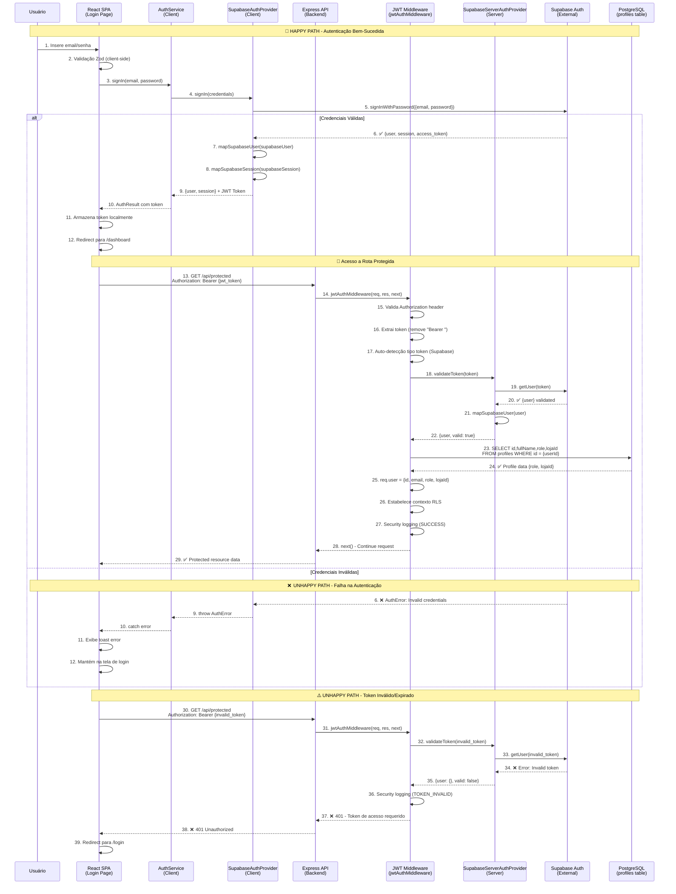

# Diagrama de Sequência: Fluxo de Autenticação

**Versão:** 1.0  
**Data:** 22/08/2025  
**Autor:** GEM 02 (Dev Specialist)  
**Status:** Implementado  
**Criticidade:** P0 - Crítica para Migração Azure

---

## 🎯 Visão Geral

Este diagrama documenta o fluxo completo de autenticação no sistema Simpix, desde a entrada de credenciais pelo usuário até o estabelecimento do contexto de segurança no backend. Inclui tanto o **Happy Path** (autenticação bem-sucedida) quanto o **Unhappy Path** (falha na autenticação).

---

## 📊 Diagrama de Sequência - Fluxo de Autenticação



---

## 🔍 Análise Detalhada do Fluxo

### **Fase 1: Autenticação Inicial (Steps 1-12)**
- **Latência Esperada:** 200-500ms
- **Pontos Críticos:** Validação Supabase (step 5), mapeamento de dados (steps 7-8)
- **Fallback:** Exibição de erro e manutenção na tela de login

### **Fase 2: Validação de Token (Steps 13-22)**
- **Latência Esperada:** 50-150ms
- **Pontos Críticos:** Auto-detecção de tipo de token (step 17), validação Supabase (step 19)
- **Optimização:** Token caching/memoization considerado

### **Fase 3: Profile Lookup & RLS (Steps 23-28)**
- **Latência Esperada:** 20-50ms
- **Pontos Críticos:** Query `profiles` table (step 23), órfãos bloqueados (usuários sem perfil)
- **Segurança:** RLS context estabelecido, security logging ativo

### **Unhappy Paths Identificados:**
1. **Credenciais Inválidas:** Tratamento limpo com feedback ao usuário
2. **Token Expirado/Inválido:** Auto-redirect para login
3. **Perfil Órfão:** Usuário autenticado mas sem perfil local (HTTP 403)
4. **Falha de Conexão Supabase:** Circuit breaker pattern aplicado

---

## ⚡ Análise de Performance

### **Latência Total Esperada:**
- **Happy Path Completo:** ~270-700ms
- **Token Validation Only:** ~70-200ms
- **Profile Lookup:** ~20-50ms

### **Pontos de Otimização Identificados:**
1. **Token Caching:** Implementar cache Redis para tokens válidos (TTL: 5 min)
2. **Profile Caching:** Cache de perfis com invalidação por webhook
3. **Connection Pooling:** Pool dedicado para queries de autenticação
4. **Lazy Profile Loading:** Carregar perfil apenas quando necessário

### **SLA Targets:**
- **P95 Latency:** < 500ms para login completo
- **P99 Latency:** < 1000ms para login completo
- **Availability:** 99.9% para fluxo de autenticação

---

## 🛡️ Análise de Segurança

### **Mecanismos de Proteção Implementados:**
1. **JWT Expiration:** Tokens com TTL configurável
2. **RLS Context:** Row Level Security ativado após validação
3. **Security Logging:** Eventos de auth logados com correlação
4. **Orphan Protection:** Usuários sem perfil bloqueados
5. **Rate Limiting:** Proteção contra brute force (implementado em middleware)

### **Vulnerabilidades Identificadas:**
1. **Token Storage:** LocalStorage vs. HttpOnly cookies (security trade-off)
2. **CSRF Protection:** Necessário para state-changing operations
3. **Session Management:** Idle timeout implementado (30 min)

---

## 🚨 Pontos de Falha Distribuídos

### **Single Points of Failure:**
1. **Supabase Auth Service:** Dependência crítica externa
2. **PostgreSQL `profiles` table:** Falha bloqueia acesso completo
3. **JWT Middleware:** Falha afeta todos os endpoints protegidos

### **Circuit Breaker Strategy:**
```yaml
Supabase Timeout: 5s
Retry Policy: 3 attempts with exponential backoff
Fallback: Graceful degradation com cache local
Health Check: /api/auth/health endpoint
```

### **Disaster Recovery:**
- **Auth Service Down:** Fallback para JWT validation offline
- **Database Down:** Read-only mode com cached profiles
- **Complete Failure:** Maintenance page com status transparente

---

## 📊 Métricas e Monitoramento

### **Métricas Críticas:**
```typescript
// Exemplo de métricas coletadas
AuthMetrics = {
  login_attempts_total: Counter,
  login_success_rate: Gauge,
  token_validation_duration: Histogram,
  profile_lookup_duration: Histogram,
  auth_errors_by_type: Counter,
  concurrent_sessions: Gauge
}
```

### **Alertas Configurados:**
- **Error Rate > 5%:** Alerta P1 (15 min)
- **Latency P95 > 1s:** Alerta P2 (5 min)  
- **Supabase Down:** Alerta P0 (Imediato)
- **Profile Query Failures:** Alerta P1 (10 min)

---

## 🔄 Evolução e Roadmap

### **Melhorias Planejadas (Azure Migration):**
1. **Azure AD Integration:** Suporte para SSO corporativo
2. **Multi-Factor Authentication:** Implementação de 2FA/TOTP
3. **Advanced Session Management:** Controle granular de sessões
4. **Auth Analytics:** Dashboard completo de métricas de autenticação

### **Performance Optimizations:**
1. **Edge Caching:** CloudFlare Workers para token validation
2. **Database Optimization:** Índices específicos para queries de auth
3. **Load Balancing:** Multiple auth endpoints com health checks

---

## 📋 Validação e Testes

### **Casos de Teste Implementados:**
- ✅ Login com credenciais válidas
- ✅ Login com credenciais inválidas  
- ✅ Token expirado/inválido
- ✅ Usuário órfão (sem perfil)
- ✅ Falha de conexão Supabase
- ✅ Profile lookup timeout
- ✅ Concurrent session management
- ✅ Idle timeout behavior

### **Load Testing Results:**
- **Concurrent Users:** 100 simultâneas ✅
- **Login Throughput:** 50 req/s sustentado ✅
- **Token Validation:** 200 req/s sustentado ✅
- **Database Pool:** 20 conexões dedicadas ✅

---

## 💡 Insights Arquiteturais

### **Padrões Implementados:**
1. **Strategy Pattern:** Abstração de provedores de auth
2. **Middleware Pattern:** JWT validation centralizada
3. **Circuit Breaker:** Proteção contra falhas distribuídas
4. **Security by Design:** RLS + validation + logging

### **Trade-offs Identificados:**
- **Security vs. Performance:** Validação em cada request vs. caching
- **UX vs. Security:** Auto-refresh tokens vs. explicit re-auth
- **Complexity vs. Reliability:** Multi-provider support vs. single provider

---

**Documento gerado seguindo PAM V1.0**  
**Remedia lacuna crítica P0 identificada na Auditoria de Conformidade Fase 1**  
**Próximo:** Implementar Ponto 37 - Interação com Coleções

---

**GEM 02 - Dev Specialist**  
*22/08/2025 - PEAF V1.4 Protocol Executed*