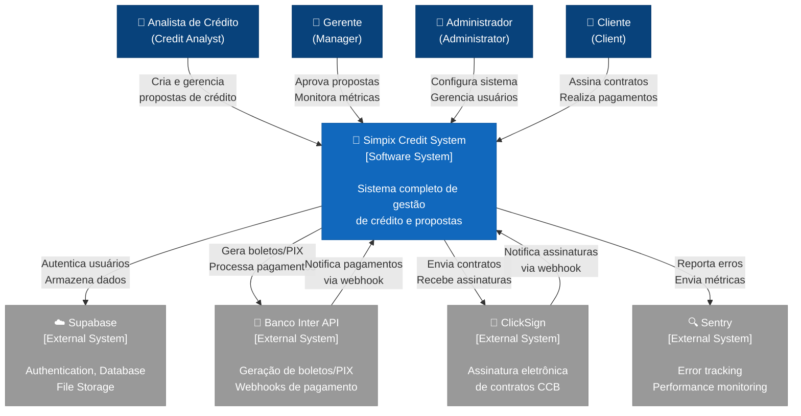

# C4 Model - Level 1: System Context Diagram
**Sistema:** Simpix Credit Management System  
**Data:** 21/08/2025  
**Versão:** 1.0 AS-IS

---

## 📊 Diagrama de Contexto



---

## 📝 Descrição dos Elementos

### **Pessoas (Users)**

| Ator | Descrição | Principais Interações |
|------|-----------|----------------------|
| **Analista de Crédito** | Usuário principal do sistema | Cria propostas, analisa clientes, acompanha pagamentos |
| **Gerente** | Supervisor das operações | Aprova propostas, monitora KPIs, gerencia equipe |
| **Administrador** | Responsável técnico | Configura tabelas comerciais, gerencia acessos |
| **Cliente** | Beneficiário do crédito | Assina contratos, realiza pagamentos |

### **Sistema Principal**

| Sistema | Tecnologia | Responsabilidades |
|---------|------------|-------------------|
| **Simpix Credit System** | React + Express + PostgreSQL | - Gestão completa de propostas<br/>- Workflow de aprovação<br/>- Geração de contratos<br/>- Processamento de pagamentos<br/>- Relatórios e métricas |

### **Sistemas Externos**

| Sistema | Tipo | Integração | Criticidade |
|---------|------|------------|-------------|
| **Supabase** | PaaS | REST API + SDK | 🔴 Crítica |
| **Banco Inter** | API Bancária | REST + OAuth 2.0 | 🔴 Crítica |
| **ClickSign** | Assinatura Digital | REST API | 🟡 Alta |
| **Sentry** | Observabilidade | SDK | 🟢 Média |

---

## 🔄 Fluxos de Dados Principais

### **1. Fluxo de Autenticação**
```
Usuário → Simpix → Supabase Auth → JWT Token → Simpix
```

### **2. Fluxo de Proposta**
```
Analista → Cria Proposta → PostgreSQL → Gerente Aprova → Status Update
```

### **3. Fluxo de Pagamento**
```
Simpix → Banco Inter API → Boleto/PIX → Cliente Paga → Webhook → Simpix
```

### **4. Fluxo de Contrato**
```
Proposta Aprovada → PDF Generation → ClickSign → Cliente Assina → Webhook → Simpix
```

---

## 🚨 Pontos de Atenção

### **Dependências Críticas:**
1. **Supabase** - Single point of failure para auth e dados
2. **Banco Inter** - Sem fallback para processamento de pagamentos
3. **Sincronização** - Webhooks sem retry mechanism robusto

### **Riscos Identificados:**
- Acoplamento forte com Supabase
- Falta de cache layer para APIs externas
- Ausência de circuit breakers em algumas integrações

---

## 📊 Métricas de Contexto

| Métrica | Valor Atual | Meta |
|---------|-------------|------|
| Usuários Ativos | ~50 | 200+ |
| Propostas/Dia | ~30 | 100+ |
| Integrações Externas | 4 | 6-8 |
| Disponibilidade | 98% | 99.9% |

---

## 🔮 Evolução Planejada (TO-BE)

### **Fase 1 - Desacoplamento:**
- Abstrair Supabase com Repository Pattern
- Implementar cache layer com Redis
- Adicionar circuit breakers

### **Fase 2 - Resiliência:**
- Message queue para webhooks
- Backup payment provider
- Multi-region deployment

### **Fase Final - Azure:**
- Migração para Azure AD (Auth)
- Azure SQL Database
- Azure Service Bus
- Azure Monitor

---

**Próximo:** [C4 Level 2 - Container Diagram](./c4-level2-container.md)