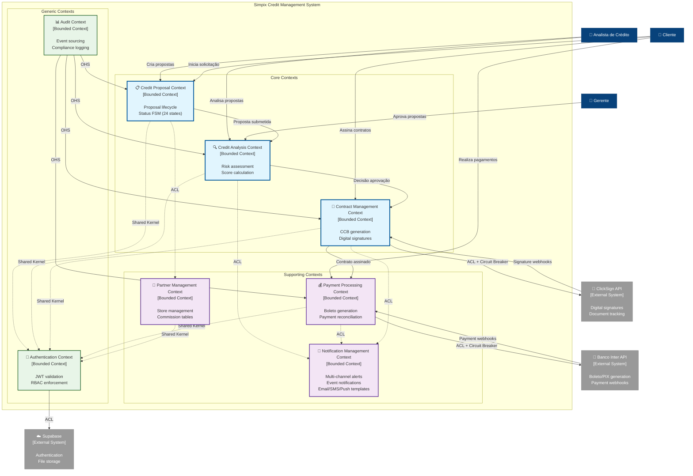

# C4 Model - Level 1: System Context Diagram
**Sistema:** Simpix Credit Management System  
**Data:** 26/08/2025  
**Versão:** 1.1 P0-REMEDIATED  
**Status:** Thread 3.3 Remediation Complete

---

## 📊 Diagrama de Contexto



---

## 📝 Descrição dos Elementos

### **Pessoas (Users)**

| Ator | Descrição | Principais Interações |
|------|-----------|----------------------|
| **Analista de Crédito** | Usuário principal do sistema | Cria propostas, analisa clientes, acompanha pagamentos |
| **Gerente** | Supervisor das operações | Aprova propostas, monitora KPIs, gerencia equipe |
| **Administrador** | Responsável técnico | Configura tabelas comerciais, gerencia acessos |
| **Cliente** | Beneficiário do crédito | Assina contratos, realiza pagamentos |

### **Bounded Contexts (DDD Architecture)**

#### **Core Contexts (Diferencial Competitivo)**
| Context | Aggregate Root | Responsabilidades |
|---------|---------------|-------------------|
| **Credit Proposal** | Proposta | - Lifecycle completo da proposta<br/>- Status FSM (24 estados)<br/>- Validação de regras de negócio |
| **Credit Analysis** | Análise | - Cálculo de score automático<br/>- Decisão de aprovação/rejeição<br/>- Motor de políticas de crédito |
| **Contract Management** | Contrato | - Geração automatizada de CCB<br/>- Integração ClickSign<br/>- Tracking de assinaturas |

#### **Supporting Contexts (Suporte Necessário)**
| Context | Aggregate Root | Responsabilidades |
|---------|---------------|-------------------|
| **Payment Processing** | Pagamento | - Integração Banco Inter<br/>- Geração de boletos<br/>- Reconciliação de pagamentos |
| **Partner Management** | Parceiro | - Gestão de lojas parceiras<br/>- Tabelas comerciais<br/>- Cálculo de comissões |
| **Notification Management** | Notificação | - Comunicação multicanal<br/>- Event-driven notifications<br/>- Templates personalizados<br/>- Email/SMS/Push delivery |

#### **Generic Contexts (Commodities)**
| Context | Aggregate Root | Responsabilidades |
|---------|---------------|-------------------|
| **Authentication** | Usuário | - JWT validation<br/>- RBAC enforcement<br/>- Session management |
| **Audit** | AuditEvent | - Event sourcing<br/>- Compliance logging<br/>- Immutable audit trail |

### **Sistemas Externos**

| Sistema | Tipo | Integração | Criticidade |
|---------|------|------------|-------------|
| **Supabase** | PaaS | REST API + SDK | 🔴 Crítica |
| **Banco Inter** | API Bancária | REST + OAuth 2.0 | 🔴 Crítica |
| **ClickSign** | Assinatura Digital | REST API | 🟡 Alta |
| **Sentry** | Observabilidade | SDK | 🟢 Média |

---

## 🔄 Fluxos de Dados Principais

### **1. Fluxo Inter-Context (Customer/Supplier)**
```
Credit Proposal Context → Credit Analysis Context → Contract Management Context → Payment Processing Context
```

### **2. Fluxo de Autenticação (Shared Kernel)**
```
Authentication Context ←→ All Bounded Contexts (JWT + RBAC)
```

### **3. Fluxo de Auditoria (Open Host Service)**
```
Audit Context ← All Core Contexts (Event Sourcing)
```

### **4. Fluxo de Integração Externa (ACL Pattern)**
```
Contract Management Context ↔ ClickSign API (Circuit Breaker)
Payment Processing Context ↔ Banco Inter API (Circuit Breaker)
```

---

## 🚨 Pontos de Atenção

### **Context Integration Patterns:**
1. **Customer/Supplier** - Core contexts seguem fluxo linear de valor
2. **Anti-Corruption Layer (ACL)** - Protege bounded contexts de APIs externas
3. **Shared Kernel** - Authentication e domain primitives compartilhados
4. **Open Host Service** - Audit context fornece APIs padronizadas

### **Riscos Arquiteturais Identificados:**
- **Context Boundaries** - Potencial vazamento entre bounded contexts
- **Integration Failures** - Circuit breakers podem isolar contexts críticos
- **Event Consistency** - Domain events devem manter consistência eventual

---

## 📊 Métricas de Contexto

| Métrica | Valor Atual | Meta |
|---------|-------------|------|
| Usuários Ativos | ~50 | 200+ |
| Propostas/Dia | ~30 | 100+ |
| Integrações Externas | 4 | 6-8 |
| Disponibilidade | 98% | 99.9% |

---

## 🔮 Evolução Planejada (TO-BE)

### **Fase 1 - Desacoplamento:**
- Abstrair Supabase com Repository Pattern
- Implementar cache layer com Redis
- Adicionar circuit breakers

### **Fase 2 - Resiliência:**
- Message queue para webhooks
- Backup payment provider
- Multi-region deployment

### **Fase Final - Azure (DDD Preservado):**
- **Authentication Context** → Azure AD integration
- **All Contexts** → Azure SQL Database com schema separation
- **Inter-Context Communication** → Azure Service Bus
- **Audit Context** → Azure Monitor + Event Sourcing

---

**Próximo:** [C4 Level 2 - Container Diagram](./c4-level2-container.md)