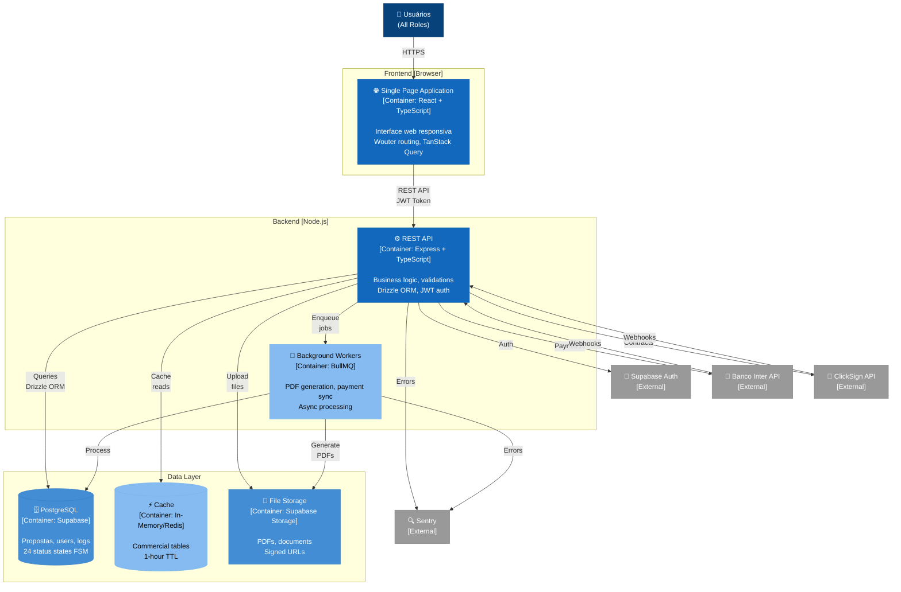

# C4 Model - Level 2: Container Diagram
**Sistema:** Simpix Credit Management System  
**Data:** 21/08/2025  
**Versão:** 1.0 AS-IS

---

## 📊 Diagrama de Containers



---

## 📦 Descrição dos Containers

### **Frontend Container**

| Container | Tecnologia | Responsabilidades | Portas |
|-----------|------------|-------------------|---------|
| **SPA** | React 18 + TypeScript | - Renderização de UI<br/>- Gerenciamento de estado local<br/>- Cache de queries (TanStack)<br/>- Validação de formulários | :5000 (dev) |

**Principais Bibliotecas:**
- Wouter (routing)
- TanStack Query (server state)
- React Hook Form + Zod
- Tailwind CSS + shadcn/ui

### **Backend Containers**

| Container | Tecnologia | Responsabilidades | Portas |
|-----------|------------|-------------------|---------|
| **REST API** | Express + TypeScript | - Autenticação/Autorização<br/>- Business logic<br/>- Validação de dados<br/>- Integração com externos | :5000 |
| **Workers** | BullMQ + Redis | - Geração de PDFs<br/>- Sincronização de pagamentos<br/>- Processamento assíncrono<br/>- Retry logic | N/A |

**Segurança Implementada:**
- Helmet (headers)
- Rate limiting (2 tiers)
- CSRF protection
- Input sanitization
- JWT validation

### **Data Containers**

| Container | Tecnologia | Responsabilidades | Dados |
|-----------|------------|-------------------|--------|
| **PostgreSQL** | Supabase Postgres | - Persistência principal<br/>- Transações ACID<br/>- Row Level Security | ~50 tables |
| **Cache** | In-Memory/Redis | - Cache L2 para queries<br/>- Session storage<br/>- Rate limit counters | TTL: 1h |
| **File Storage** | Supabase Storage | - Documentos PDF<br/>- Contratos assinados<br/>- Avatares | ~10GB |

---

## 🔄 Fluxos de Comunicação

### **1. Fluxo Síncrono (Request/Response)**
```
Browser → SPA → API → Database → API → SPA → Browser
         JWT  REST  SQL       JSON  React
```

### **2. Fluxo Assíncrono (Background Jobs)**
```
API → BullMQ Queue → Worker → Database
    → Redis Store  → Process → Update Status
```

### **3. Fluxo de Webhooks**
```
External Service → API Webhook Endpoint → Validation → Database
(Inter/ClickSign)  (POST /webhooks/*)     (HMAC)      (Update)
```

---

## 🏗️ Arquitetura de Deployment (AS-IS)

### **Ambiente Atual - Replit**
```
┌─────────────────────────────────────┐
│         Replit Container            │
│  ┌─────────┐  ┌─────────┐          │
│  │   SPA   │  │   API   │          │
│  │  :5000  │←→│  :5000  │          │
│  └─────────┘  └─────────┘          │
│       ↓           ↓                 │
└───────┼───────────┼─────────────────┘
        ↓           ↓
   [Supabase]  [External APIs]
```

### **Configuração de Módulos**

| Módulo | Localização | Padrão |
|--------|-------------|---------|
| **Auth** | `server/lib/jwt-auth-middleware.ts` | JWT + Supabase |
| **Database** | `server/lib/database.ts` | Drizzle ORM |
| **Logging** | `server/lib/logger.ts` | Winston + Correlation |
| **Config** | `server/lib/config.ts` | Centralized secrets |
| **Queue** | `server/lib/queue/` | BullMQ patterns |

---

## 📊 Métricas por Container

| Container | CPU | Memory | Requests/min | P99 Latency |
|-----------|-----|--------|--------------|-------------|
| **SPA** | 5% | 50MB | N/A | N/A |
| **API** | 15% | 200MB | ~100 | 200ms |
| **Workers** | 20% | 150MB | ~10 jobs | 5s |
| **Database** | 10% | 500MB | ~500 | 50ms |

---

## 🚨 Gargalos Identificados

### **Performance:**
1. Falta de connection pooling otimizado
2. Queries N+1 em algumas rotas
3. PDF generation síncrona em alguns casos

### **Segurança:**
1. Secrets ainda parcialmente hardcoded
2. Falta de API Gateway
3. Ausência de WAF

### **Resiliência:**
1. Single point of failure (Replit)
2. Sem health checks granulares
3. Circuit breakers parciais

---

## 🔮 Evolução Planejada

### **Fase 1 - Containerização:**
```yaml
Containers:
  - frontend: Docker (nginx + React)
  - api: Docker (Node.js)
  - workers: Docker (Node.js)
  - database: Managed PostgreSQL
```

### **Fase 2 - Orquestração:**
```yaml
Platform: Kubernetes
Services:
  - Ingress Controller
  - Service Mesh (Istio)
  - Horizontal Pod Autoscaler
```

### **Fase Final - Azure Native:**
```yaml
Services:
  - Azure Container Apps
  - Azure SQL Database
  - Azure Service Bus
  - Azure Key Vault
```

---

**Próximo:** [C4 Level 3 - Component Diagram](./c4-level3-component.md)