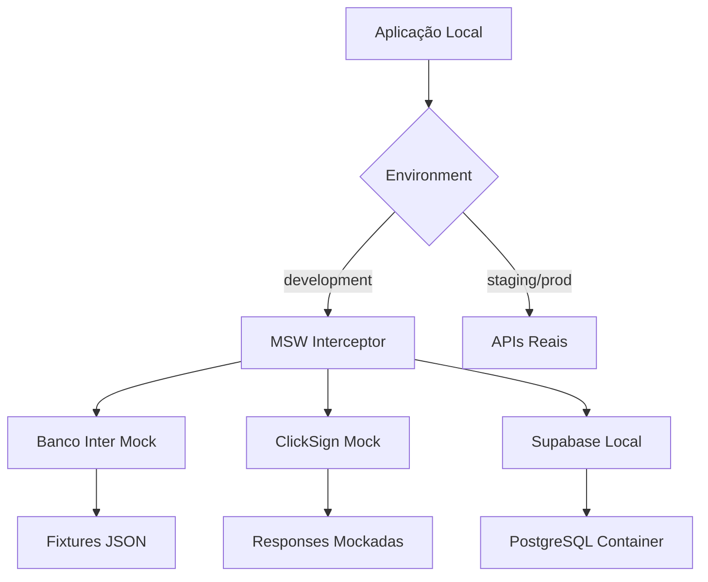

# Estratégia de Ambiente de Desenvolvimento Local (Developer Experience)

**Status:** Proposto  
**Data:** 22/08/2025  
**Autor:** GEM-02 Dev Specialist  
**Tipo:** Documento Estratégico  
**Criticidade:** P0 - Crítica para Produtividade da Equipe

---

## 📋 Sumário Executivo

Este documento estabelece a estratégia mandatória para padronização do ambiente de desenvolvimento local do sistema Simpix, focando em eliminar inconsistências entre ambientes, acelerar o onboarding de desenvolvedores e maximizar a produtividade da equipe através de uma Developer Experience (DX) de excelência.

---

## 🎯 1. Decisão

**Adotaremos o padrão Dev Containers (usando `devcontainer.json`) como nossa estratégia mandatória para padronização do ambiente de desenvolvimento local, complementado por automação via Make/Task e documentação interativa.**

### Declaração Formal
```
PADRÃO OBRIGATÓRIO: Dev Containers + VS Code
ENFORCEMENT: Verificação automática em CI/CD
APLICAÇÃO: Imediata para novos desenvolvedores
MIGRAÇÃO: Progressiva para equipe existente (30 dias)
```

---

## 🔍 2. Justificativa

### 2.1 Problemas Atuais (Análise Forense)

| Problema | Impacto | Frequência |
|----------|---------|------------|
| "Funciona na minha máquina" | Alto - Atrasos em deploys | Diário |
| Onboarding lento (2-3 dias) | Alto - Perda de produtividade | Por contratação |
| Versões inconsistentes de Node/DB | Crítico - Bugs em produção | Semanal |
| Configuração manual de secrets | Médio - Riscos de segurança | Por desenvolvedor |
| Dependências externas não mockadas | Alto - Bloqueios em desenvolvimento | Diário |

### 2.2 Benefícios da Solução

1. **Reprodutibilidade Total:** Ambiente idêntico para todos os desenvolvedores
2. **Onboarding em < 30 minutos:** Setup automatizado com um clique
3. **Isolamento de Dependências:** Containers garantem versões consistentes
4. **Segurança por Design:** Secrets gerenciados centralmente
5. **Produtividade Aumentada:** Foco em código, não em configuração

### 2.3 Análise Comparativa

| Solução | Prós | Contras | Decisão |
|---------|------|---------|---------|
| **Dev Containers** | Padronização total, integração VS Code, reprodutível | Requer Docker | ✅ ESCOLHIDA |
| Vagrant | Multiplataforma | Pesado, lento | ❌ |
| Docker Compose apenas | Flexível | Sem integração IDE | ❌ |
| Scripts bash | Simples | Não reprodutível | ❌ |

---

## 🛠️ 3. Ferramentas Padronizadas

### 3.1 Stack Base do Container

```dockerfile
# Base image
FROM mcr.microsoft.com/devcontainers/typescript-node:1-20-bullseye

# Versões mandatórias
NODE_VERSION=20.11.0
PNPM_VERSION=8.15.0
POSTGRESQL_VERSION=15
REDIS_VERSION=7.2
```

### 3.2 Ferramentas de Desenvolvimento

| Categoria | Ferramenta | Versão | Justificativa |
|-----------|------------|--------|---------------|
| **Runtime** | Node.js | 20.11.0 LTS | Estabilidade e performance |
| **Package Manager** | pnpm | 8.15.0 | Eficiência de espaço |
| **Database** | PostgreSQL | 15 | Compatível com Supabase |
| **Cache** | Redis | 7.2 | Para BullMQ |
| **ORM CLI** | Drizzle Kit | latest | Migrations |
| **API Testing** | Bruno | latest | Substituir Postman |
| **Shell** | zsh + oh-my-zsh | latest | Produtividade |
| **Git Hooks** | Husky | 9.0.0 | Qualidade de código |
| **Linting** | ESLint + Prettier | latest | Padronização |

### 3.3 Extensões VS Code Obrigatórias

```json
{
  "extensions": [
    "dbaeumer.vscode-eslint",
    "esbenp.prettier-vscode",
    "prisma.prisma",
    "bradlc.vscode-tailwindcss",
    "streetsidesoftware.code-spell-checker",
    "streetsidesoftware.code-spell-checker-portuguese-brazilian",
    "eamodio.gitlens",
    "usernamehw.errorlens",
    "yoavbls.pretty-ts-errors",
    "orta.vscode-jest",
    "ms-vscode.vscode-typescript-next"
  ]
}
```

---

## 🔄 4. Estratégia para Simular Dependências Externas

### 4.1 Arquitetura de Mocking



### 4.2 Implementação com MSW (Mock Service Worker)

```typescript
// mocks/handlers/banco-inter.ts
export const bancoInterHandlers = [
  rest.post('*/oauth/v2/token', (req, res, ctx) => {
    return res(ctx.json({
      access_token: 'mock-token-dev',
      token_type: 'Bearer',
      expires_in: 3600
    }))
  }),
  
  rest.post('*/banking/v2/boleto', (req, res, ctx) => {
    return res(ctx.json({
      nossoNumero: 'MOCK00000001',
      codigoBarras: '00000.00000 00000.000000 00000.000000 0 00000000000000',
      linhaDigitavel: '00000000000000000000000000000000000000000000000'
    }))
  })
]
```

### 4.3 Estratégia de Dados de Teste

| Tipo de Dado | Estratégia | Ferramenta |
|--------------|------------|------------|
| **Dados Transacionais** | Fixtures regeneráveis | Factory.ts + Faker.js |
| **Documentos** | PDFs template | pdf-lib |
| **Webhooks** | Servidor local | Express mock server |
| **Emails** | Captura local | MailHog container |
| **SMS** | Log console | Console interceptor |

### 4.4 Feature Flags para Desenvolvimento

```typescript
// config/features.development.ts
export const developmentFeatures = {
  'use-mock-apis': true,
  'skip-email-verification': true,
  'enable-debug-panel': true,
  'show-sql-queries': true,
  'bypass-rate-limits': true,
  'enable-hot-reload': true
}
```

---

## 📚 5. Documentação de Onboarding Técnico

### 5.1 Processo de Onboarding (< 30 minutos)

```markdown
## 🚀 Quick Start - Novo Desenvolvedor

### Pré-requisitos (10 min)
1. [ ] Instalar Docker Desktop
2. [ ] Instalar VS Code
3. [ ] Instalar extensão "Dev Containers" no VS Code

### Setup Inicial (15 min)
1. [ ] Clonar repositório
   ```bash
   git clone https://github.com/simpix/simpix-app.git
   cd simpix-app
   ```

2. [ ] Abrir no VS Code
   ```bash
   code .
   ```

3. [ ] Quando aparecer prompt: "Reopen in Container" → Click
   (Ou Cmd+Shift+P → "Dev Containers: Reopen in Container")

4. [ ] Aguardar build do container (primeira vez ~10 min)

5. [ ] Container pronto! Terminal já configurado com:
   - Node 20.11.0
   - PostgreSQL 15 rodando
   - Redis rodando
   - Todas as dependências instaladas

### Verificação (5 min)
1. [ ] Rodar testes
   ```bash
   pnpm test
   ```

2. [ ] Iniciar aplicação
   ```bash
   pnpm dev
   ```

3. [ ] Acessar http://localhost:5000

✅ **Pronto para desenvolver!**
```

### 5.2 Comandos Disponíveis no Container

```makefile
# Makefile incluído no container
help:           ## Mostra todos os comandos disponíveis
setup:          ## Setup inicial do ambiente
dev:            ## Inicia servidor de desenvolvimento
test:           ## Roda todos os testes
test:watch:     ## Roda testes em modo watch
db:migrate:     ## Roda migrations do banco
db:seed:        ## Popula banco com dados de teste
mock:start:     ## Inicia servidores mock
lint:           ## Roda linting
format:         ## Formata código
clean:          ## Limpa arquivos temporários
```

### 5.3 Troubleshooting Automatizado

```typescript
// scripts/doctor.ts
export async function runHealthCheck() {
  const checks = [
    { name: 'Node Version', check: () => process.version === 'v20.11.0' },
    { name: 'PostgreSQL', check: () => canConnectToDb() },
    { name: 'Redis', check: () => canConnectToRedis() },
    { name: 'Env Variables', check: () => validateEnvVars() },
    { name: 'Disk Space', check: () => hasSufficientSpace() }
  ]
  
  for (const check of checks) {
    const result = await check.check()
    console.log(`${result ? '✅' : '❌'} ${check.name}`)
  }
}
```

---

## 📊 6. Métricas de Eficácia do Desenvolvedor (DevEx/SPACE)

### 6.1 Framework SPACE Adaptado

| Dimensão | Métrica | Meta | Medição |
|----------|---------|------|---------|
| **Satisfaction** | Developer NPS | > 8.0 | Quarterly survey |
| **Performance** | PRs merged/week | > 5 | GitHub Analytics |
| **Activity** | Commits/day | > 3 | Git hooks |
| **Communication** | Code review time | < 4h | GitHub API |
| **Efficiency** | Build time | < 2min | CI/CD metrics |

### 6.2 Métricas Específicas de DX

```typescript
// metrics/dx-metrics.ts
export interface DXMetrics {
  // Onboarding
  timeToFirstCommit: number        // Meta: < 1 dia
  timeToFirstPR: number            // Meta: < 3 dias
  onboardingCompletionRate: number // Meta: 100%
  
  // Produtividade
  localBuildTime: number           // Meta: < 30s
  testExecutionTime: number        // Meta: < 2min
  hotReloadTime: number            // Meta: < 2s
  
  // Qualidade
  environmentDriftIncidents: number // Meta: 0
  worksOnMyMachineIssues: number   // Meta: 0
  dependencyConflicts: number       // Meta: 0
  
  // Satisfação
  developerHappinessScore: number   // Meta: > 4.5/5
  toolingSatisfaction: number       // Meta: > 4.0/5
  documentationQuality: number      // Meta: > 4.0/5
}
```

### 6.3 Dashboard de Monitoramento

```yaml
# .github/workflows/dx-metrics.yml
name: DX Metrics Collection

on:
  schedule:
    - cron: '0 0 * * 1' # Weekly
  workflow_dispatch:

jobs:
  collect-metrics:
    runs-on: ubuntu-latest
    steps:
      - name: Collect onboarding metrics
        run: |
          echo "Time to first commit: $(calculate_ttfc)"
          echo "Environment setup success rate: $(calculate_setup_rate)"
          
      - name: Collect productivity metrics
        run: |
          echo "Average local build time: $(measure_build_time)"
          echo "Test execution time: $(measure_test_time)"
          
      - name: Send to monitoring
        run: |
          curl -X POST $METRICS_ENDPOINT \
            -H "Content-Type: application/json" \
            -d @metrics.json
```

### 6.4 OKRs de Developer Experience

```markdown
## Q4 2025 - OKRs de DX

### Objective: Alcançar excelência em Developer Experience

**KR1:** Reduzir tempo de onboarding de 3 dias para 30 minutos
- Baseline: 3 dias
- Target: 30 minutos
- Medição: Tempo do git clone ao primeiro commit

**KR2:** Eliminar 100% dos "funciona na minha máquina"
- Baseline: 5 incidentes/mês
- Target: 0 incidentes
- Medição: Tickets taggeados como environment-issue

**KR3:** Alcançar NPS > 8.0 na satisfação dos desenvolvedores
- Baseline: 6.5
- Target: 8.0+
- Medição: Survey trimestral

**KR4:** Reduzir tempo de CI/CD em 50%
- Baseline: 12 minutos
- Target: 6 minutos
- Medição: GitHub Actions metrics
```

---

## 🚀 7. Roadmap de Implementação

### Fase 1: Fundação (Semana 1-2)
- [ ] Criar `devcontainer.json` base
- [ ] Configurar Docker Compose para serviços
- [ ] Implementar MSW handlers básicos
- [ ] Documentar processo de setup

### Fase 2: Automação (Semana 3-4)
- [ ] Scripts de automação (Makefile)
- [ ] Health checks automatizados
- [ ] Feature flags para desenvolvimento
- [ ] CI/CD integration tests

### Fase 3: Adoção (Semana 5-6)
- [ ] Treinamento da equipe
- [ ] Migração progressiva
- [ ] Coleta de feedback
- [ ] Ajustes baseados em uso real

### Fase 4: Otimização (Contínuo)
- [ ] Monitoramento de métricas DX
- [ ] Melhorias incrementais
- [ ] Atualização de dependências
- [ ] Expansão de mocks

---

## 📝 8. Anexos

### 8.1 Exemplo de devcontainer.json

```json
{
  "name": "Simpix Development",
  "dockerComposeFile": "docker-compose.yml",
  "service": "app",
  "workspaceFolder": "/workspace",
  
  "features": {
    "ghcr.io/devcontainers/features/git:1": {},
    "ghcr.io/devcontainers/features/github-cli:1": {},
    "ghcr.io/devcontainers/features/node:1": {
      "version": "20.11.0",
      "nodeGypDependencies": true
    }
  },
  
  "customizations": {
    "vscode": {
      "extensions": [
        "dbaeumer.vscode-eslint",
        "esbenp.prettier-vscode"
      ],
      "settings": {
        "editor.formatOnSave": true,
        "editor.codeActionsOnSave": {
          "source.fixAll.eslint": true
        }
      }
    }
  },
  
  "postCreateCommand": "pnpm install && pnpm db:migrate",
  "remoteUser": "node"
}
```

### 8.2 Estrutura de Mocks Proposta

```
mocks/
├── handlers/
│   ├── banco-inter.ts
│   ├── clicksign.ts
│   ├── supabase.ts
│   └── index.ts
├── fixtures/
│   ├── proposals.json
│   ├── users.json
│   └── documents.json
├── factories/
│   ├── proposal.factory.ts
│   ├── user.factory.ts
│   └── document.factory.ts
└── server.ts
```

---

## ✅ 9. Critérios de Sucesso

| Critério | Meta | Prazo |
|----------|------|-------|
| Tempo de setup novo dev | < 30 min | 30 dias |
| Taxa de adoção | 100% | 60 dias |
| Redução de bugs de ambiente | 100% | 90 dias |
| Satisfação da equipe | > 8/10 | 90 dias |
| ROI em produtividade | > 20% | 120 dias |

---

**Assinatura:** GEM-02 Dev Specialist  
**Data:** 22/08/2025  
**Status:** Aguardando aprovação do Arquiteto Chefe  
**Próxima Revisão:** 30 dias após implementação