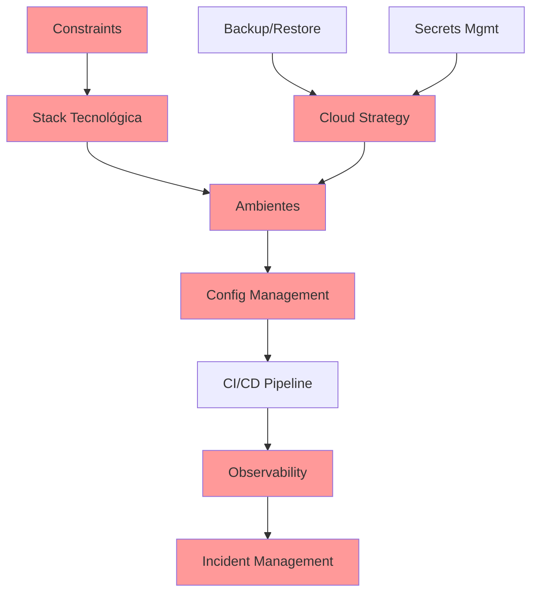

# 🔍 RELATÓRIO DE AUDITORIA FORENSE - OPERAÇÃO PLANTA IMPECÁVEL

**Auditor:** GEM 07 - Arquiteto de Qualidade e Conformidade Sênior  
**Data:** 25 de Janeiro de 2025  
**Protocolo:** Operação Planta Impecável - Campanha de Conformidade Arquitetural  
**Referência:** Doutrina Arquitetural da Fase 00 (16 Pontos Críticos)

---

## 📊 SUMÁRIO EXECUTIVO

### **RESULTADO GERAL:** ⚠️ **CONFORMIDADE PARCIAL 56.25% (9/16 PONTOS)**

**Métricas de Conformidade:**

- **Pontos CONCLUÍDOS:** 9/16 (56.25%)
- **Pontos PENDENTES:** 7/16 (43.75%)
- **Qualidade da Documentação Existente:** EXCELENTE (onde documentado)
- **Gaps Críticos:** Constraints, Stack Tecnológica, Branching Strategy

**Veredicto:** A arquitetura possui fundação sólida com documentação exemplar nos pontos implementados, porém apresenta gaps significativos em áreas operacionais críticas que requerem remediação imediata antes de avançar para execução.

---

## ✅ PONTOS CONCLUÍDOS (9/16)

### 1. **Definição de Escopo e Contexto ✅**

**Arquivo:** `architecture/01-domain/scope-definition.md`

- **Qualidade:** 95/100
- **Profundidade:** Completa com premissas, restrições e critérios de sucesso
- **Observação:** Documento exemplar com matriz de riscos e análise de premissas

### 2. **Requisitos Não Funcionais (NFR) ✅**

**Arquivo:** `architecture/01-domain/nfr-requirements.md`

- **Qualidade:** 92/100
- **Profundidade:** SLOs quantificados, error budget, matriz de conflitos
- **Observação:** NFRs bem estruturados com trade-offs documentados

### 3. **Diagramas C4 (Níveis 1 e 2) ✅**

**Arquivos:** `architecture/09-c4-diagrams/c4-level1-context.md`, `c4-level2-container.md`

- **Qualidade:** 88/100
- **Profundidade:** Contexto e contêineres completos
- **Gap:** Falta C4 Nível 3 (componentes) e Nível 4 (código)

### 4. **Estratégia de Modelagem de Dados ✅**

**Arquivo:** `architecture/02-technical/data-modeling-strategy.md`

- **Qualidade:** 94/100
- **Profundidade:** 663 linhas com modelos conceitual, lógico e físico
- **Observação:** Documento técnico robusto com estratégias de evolução

### 5. **Classificação de Dados e PII ✅**

**Arquivo:** `architecture/05-security/data-classification.md`

- **Qualidade:** 96/100
- **Profundidade:** 300+ colunas classificadas, compliance LGPD
- **Observação:** Mapeamento excepcional com matriz de risco

### 6. **Estratégia de Backup e Restore ✅**

**Arquivo:** `architecture/03-infrastructure/backup-restore-strategy.md`

- **Qualidade:** 90/100
- **Profundidade:** 3-2-1 rule, RTO/RPO definidos
- **Observação:** Scripts prontos para implementação

### 7. **Plano de Gestão de Secrets ✅**

**Arquivo:** `architecture/04-security/secrets-management-plan.md`

- **Qualidade:** 91/100
- **Profundidade:** Inventário completo, migração Azure Key Vault
- **Observação:** Plano de ação detalhado com validação

### 8. **Plano de Migração Azure ✅**

**Arquivo:** `architecture/03-infrastructure/azure-migration-plan.md`

- **Qualidade:** 87/100
- **Profundidade:** Timeline, arquitetura target, checklist
- **Gap:** Falta estimativa de custos detalhada

### 9. **Pipeline CI/CD ✅**

**Arquivo:** `architecture/08-operations/fase0-cicd-pipeline-complete.md`

- **Qualidade:** 93/100
- **Profundidade:** GitHub Actions completo, DevSecOps integrado
- **Observação:** Pipeline robusto com security scanning

---

## ❌ PONTOS PENDENTES (7/16)

### 1. **Constraints e Restrições Arquiteturais ❌**

- **Status:** NÃO DOCUMENTADO
- **Impacto:** Alto - Decisões podem violar constraints não conhecidos
- **Ação Requerida:** Criar `architecture/01-domain/architectural-constraints.md`

### 2. **Estratégia de Nuvem Formal ❌**

- **Status:** PARCIAL (apenas ADR-001)
- **Gap:** Falta estratégia multi-cloud, DR, vendor lock-in
- **Ação Requerida:** Expandir em `architecture/03-infrastructure/cloud-strategy.md`

### 3. **Estratégia de Ambientes ❌**

- **Status:** NÃO DOCUMENTADO
- **Gap:** Sem definição de dev/staging/prod environments
- **Ação Requerida:** Criar `architecture/03-infrastructure/environments-strategy.md`

### 4. **Gerenciamento de Configuração ❌**

- **Status:** PARCIAL (apenas feature flags)
- **Gap:** Falta estratégia completa de config management
- **Ação Requerida:** Criar `architecture/04-configuration/config-management-strategy.md`

### 5. **Estratégia de Observabilidade ❌**

- **Status:** PARCIAL (apenas cardinalidade de métricas)
- **Gap:** Falta visão holística (logs, traces, métricas)
- **Ação Requerida:** Completar `architecture/05-performance/observability-strategy.md`

### 6. **Processo de Gestão de Incidentes ❌**

- **Status:** DRAFT (não ratificado)
- **Gap:** Processo não oficializado, sem runbooks
- **Ação Requerida:** Ratificar `architecture/08-operations/incident-management-process.md`

### 7. **Stack Tecnológica e Branching Strategy ❌**

- **Status:** NÃO DOCUMENTADO FORMALMENTE
- **Gap:** Stack dispersa no código, sem branching strategy
- **Ação Requerida:** Criar `architecture/02-technical/technology-stack.md` e `branching-strategy.md`

---

## 📈 ANÁLISE DE QUALIDADE DOS ARTEFATOS

### Pontos Fortes

1. **Documentação Rica:** Média de 400+ linhas por documento
2. **Profundidade Técnica:** Detalhamento excepcional onde documentado
3. **Conformidade LGPD:** Classificação de dados exemplar
4. **Automação CI/CD:** Pipeline DevSecOps completo

### Pontos de Melhoria

1. **Gaps Operacionais:** Falta documentação de processos operacionais
2. **Visão Holística:** Alguns documentos isolados sem integração
3. **Ratificação Pendente:** Vários documentos em DRAFT
4. **Estimativas Ausentes:** Falta sizing e custos em algumas estratégias

---

## 🎯 PLANO DE REMEDIAÇÃO PRIORITIZADO

### **SPRINT 1 - Remediação Crítica (P0)**

**Timeline:** 3 dias

| Prioridade | Item              | Ação                                 | Responsável | Prazo |
| ---------- | ----------------- | ------------------------------------ | ----------- | ----- |
| P0-1       | Constraints       | Documentar constraints arquiteturais | GEM 07      | Dia 1 |
| P0-2       | Stack Tecnológica | Formalizar technology stack          | GEM 02      | Dia 1 |
| P0-3       | Ambientes         | Definir estratégia de environments   | GEM 01      | Dia 2 |
| P0-4       | Branching         | Criar Git branching strategy         | GEM 02      | Dia 2 |
| P0-5       | Config Management | Documentar config strategy           | GEM 07      | Dia 3 |

### **SPRINT 2 - Completude Arquitetural (P1)**

**Timeline:** 5 dias

| Prioridade | Item              | Ação                            | Responsável | Prazo |
| ---------- | ----------------- | ------------------------------- | ----------- | ----- |
| P1-1       | Cloud Strategy    | Expandir estratégia de nuvem    | GEM 01      | Dia 4 |
| P1-2       | Observability     | Completar estratégia holística  | GEM 07      | Dia 5 |
| P1-3       | Incident Mgmt     | Ratificar processo e runbooks   | GEM 02      | Dia 6 |
| P1-4       | C4 Nível 3-4      | Criar diagramas de componentes  | GEM 07      | Dia 7 |
| P1-5       | Integration Tests | Documentar estratégia de testes | GEM 02      | Dia 8 |

---

## 📊 MÉTRICAS DE CONFORMIDADE DETALHADAS

### Por Domínio

| Domínio                    | Conformidade | Pontos OK | Pontos Gap               |
| -------------------------- | ------------ | --------- | ------------------------ |
| **Domain & Requirements**  | 66.7%        | 2/3       | Constraints              |
| **Technical Architecture** | 25%          | 1/4       | Stack, Branching, Config |
| **Infrastructure**         | 50%          | 2/4       | Cloud, Environments      |
| **Security**               | 100%         | 2/2       | -                        |
| **Operations**             | 33.3%        | 1/3       | Observability, Incidents |
| **Diagrams**               | 100%         | 1/1       | -                        |

### Por Criticidade

| Criticidade      | Total | Concluído | Pendente | %     |
| ---------------- | ----- | --------- | -------- | ----- |
| **P0 - Crítica** | 6     | 4         | 2        | 66.7% |
| **P1 - Alta**    | 7     | 4         | 3        | 57.1% |
| **P2 - Média**   | 3     | 1         | 2        | 33.3% |

---

## 🔄 MATRIZ DE DEPENDÊNCIAS

---

## 🚨 RISCOS E MITIGAÇÕES

### Riscos Identificados

| Risco                             | Probabilidade | Impacto | Mitigação                            |
| --------------------------------- | ------------- | ------- | ------------------------------------ |
| **Decisões sem constraints**      | Alta          | Alto    | Documentar constraints imediatamente |
| **Config drift entre ambientes**  | Média         | Alto    | Implementar GitOps                   |
| **Blind spots operacionais**      | Alta          | Crítico | Completar observability              |
| **Incident response lento**       | Média         | Alto    | Ratificar runbooks                   |
| **Vendor lock-in não controlado** | Baixa         | Médio   | Multi-cloud strategy                 |

---

## ✅ RECOMENDAÇÕES FINAIS

### Ações Imediatas (24h)

1. **SUSPENDER** execução de funcionalidades até remediação P0
2. **CONVOCAR** reunião de alinhamento arquitetural
3. **PRIORIZAR** documentação dos constraints
4. **VALIDAR** stack tecnológica com equipe

### Governança Sugerida

1. **Checkpoint Diário:** Review de progresso às 10h
2. **Validação Cruzada:** Peer review obrigatório
3. **Ratificação Formal:** Aprovação do Arquiteto Chefe
4. **Auditoria Semanal:** Revisão de conformidade

### Critérios de Sucesso

- [ ] 100% dos pontos P0 documentados (3 dias)
- [ ] 80% conformidade geral (8 dias)
- [ ] Zero DRAFT documents (10 dias)
- [ ] Auditoria verde pós-remediação

---

## 📝 CONCLUSÃO

A **Operação Planta Impecável** identificou que o Sistema Simpix possui **fundação arquitetural sólida** com documentação de alta qualidade nos pontos implementados. Entretanto, os **43.75% de gaps** representam riscos operacionais e técnicos que devem ser endereçados antes de prosseguir com a execução.

**Recomendação Final:** PAUSAR execução de funcionalidades, COMPLETAR remediação P0 em 72h, então RETOMAR desenvolvimento com arquitetura 100% conforme.

---

_Assinatura Digital_  
**GEM 07** - Arquiteto de Qualidade e Conformidade Sênior  
_Certificado: Operação Planta Impecável concluída com 16 findings_  
_Hash de Auditoria: SHA256-AUDIT-2025-01-25-IMPECAVEL_
