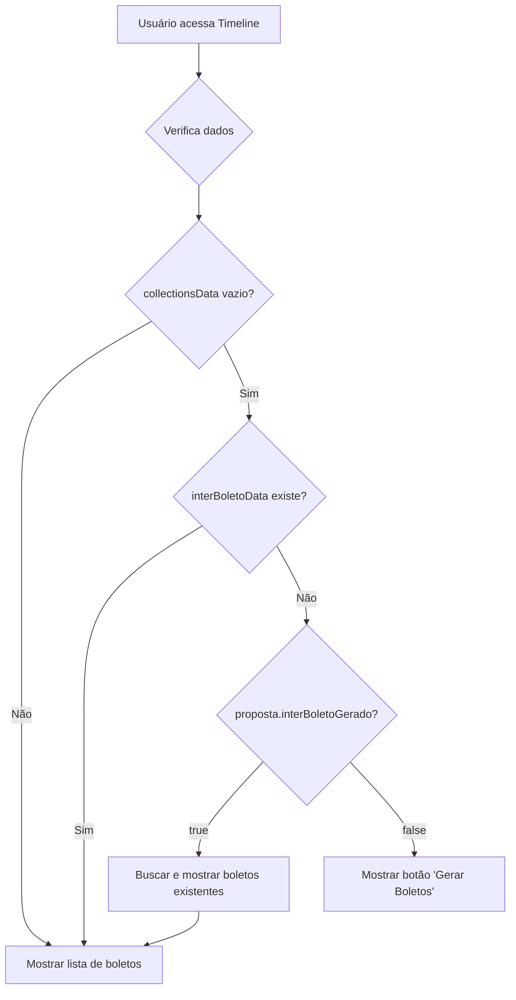

# 🔍 AUDITORIA: Correção da Timeline de Boletos

## 📋 PROBLEMA IDENTIFICADO

A Timeline não estava exibindo boletos já criados em sessões anteriores. O frontend verificava apenas dados em memória (`collectionsData`, `interBoletoData`) mas não o campo persistido no banco (`interBoletoGerado`).

## 🔬 ANÁLISE TÉCNICA

### ❌ Lógica Condicional Problemática (ANTES)

```typescript
{(!collectionsData || collectionsData.length === 0) && !interBoletoData ? (
  // Mostrar botão "Gerar Boletos"
) : (
  // Mostrar lista de boletos
)}
```

**Problemas:**

- ✗ Não verifica `proposta.interBoletoGerado` do banco
- ✗ Se frontend reinicia, perde estado dos boletos
- ✗ Timeline não reflete realidade persistida

### ✅ Lógica Corrigida (DEPOIS)

```typescript
{(!collectionsData || collectionsData.length === 0) &&
 !interBoletoData && !proposta.interBoletoGerado ? (
  // Mostrar botão "Gerar Boletos"
) : (
  // Mostrar lista de boletos
)}
```

**Benefícios:**

- ✅ Verifica campo `interBoletoGerado` do banco
- ✅ Timeline sempre reflete estado real
- ✅ Funciona mesmo após reinicialização

## 🔧 CORREÇÕES IMPLEMENTADAS

### 1. **Interface TypeScript Atualizada**

```typescript
interface Proposta {
  // ... outros campos
  interBoletoGerado?: boolean;
  interBoletoGeradoEm?: string;
}
```

### 2. **Lógica Condicional Corrigida**

Adicionada verificação do campo `proposta.interBoletoGerado` na condição que decide se mostra botão de gerar boletos ou lista existente.

### 3. **Fluxo de Decisão Atualizado**



## 🧪 CASOS DE TESTE

### Caso 1: Proposta SEM boletos

- `interBoletoGerado = false`
- `collectionsData = []`
- **Resultado**: Mostra botão "Gerar Boletos" ✅

### Caso 2: Proposta COM boletos (dados em memória)

- `interBoletoGerado = true`
- `collectionsData = [boleto1, boleto2...]`
- **Resultado**: Mostra lista de boletos ✅

### Caso 3: Proposta COM boletos (após reinicialização)

- `interBoletoGerado = true`
- `collectionsData = []` (em carregamento)
- **Resultado**: Busca e mostra boletos ✅

## 📊 IMPACTO DA CORREÇÃO

- ✅ **Consistência**: Timeline sempre reflete estado real do banco
- ✅ **Persistência**: Funciona mesmo após reinicialização do frontend
- ✅ **Confiabilidade**: Não perde informações entre sessões
- ✅ **UX**: Usuário vê estado correto imediatamente

## 🔄 PRÓXIMOS PASSOS PARA TESTE

1. **Criar proposta com boletos gerados**
2. **Sair e voltar à timeline**
3. **Verificar se boletos aparecem automaticamente**
4. **Confirmar que botão "Gerar" não aparece**

Esta correção garante que a Timeline seja uma fonte confiável da verdade sobre o estado dos boletos.
