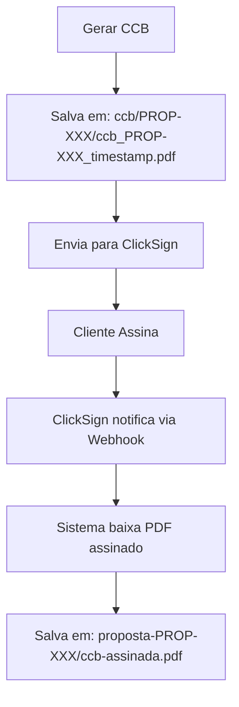

# 📁 FLUXO DE ARMAZENAMENTO DO CCB - ONDE CADA ARQUIVO VAI

## **1️⃣ AO GERAR CCB (Documento Original)**

### **📍 Local de Armazenamento:**
- **Bucket:** `documents` (Supabase Storage)
- **Caminho:** `ccb/{proposalId}/{fileName}`
- **Exemplo Real:** `ccb/PROP-1753476064646-PRM20HF/ccb_PROP-1753476064646-PRM20HF_1754680510169.pdf`

### **📋 Detalhes Técnicos:**
```javascript
// Arquivo: server/services/ccbGenerationService.ts
// Linha: 311-312

const fileName = `ccb_${proposalId}_${Date.now()}.pdf`;
const filePath = `ccb/${proposalId}/${fileName}`;

// Upload para Supabase Storage
await supabaseAdmin.storage
  .from("documents")  // ← BUCKET
  .upload(filePath, pdfBytes, {
    contentType: "application/pdf",
    upsert: true,
  });
```

### **🗄️ Banco de Dados:**
```sql
UPDATE propostas SET
  ccb_gerado = true,
  caminho_ccb = 'ccb/PROP-XXX/ccb_PROP-XXX_timestamp.pdf',
  ccb_gerado_em = NOW()
```

### **📂 Estrutura no Storage:**
```
documents/
├── ccb/
│   ├── PROP-1753476064646-PRM20HF/
│   │   ├── ccb_PROP-1753476064646-PRM20HF_1754680510169.pdf (original)
│   │   ├── ccb_PROP-1753476064646-PRM20HF_1754680520000.pdf (regenerado)
│   │   └── ...
│   ├── PROP-2025-001/
│   │   └── ccb_PROP-2025-001_1754680600000.pdf
│   └── ...
```

---

## **2️⃣ AO ASSINAR NO CLICKSIGN (Documento Assinado)**

### **📍 Local de Armazenamento:**
- **Bucket:** `documents` (mesmo bucket)
- **Caminho:** `proposta-{proposalId}/ccb-assinada.pdf`
- **Exemplo Real:** `proposta-PROP-1753476064646-PRM20HF/ccb-assinada.pdf`

### **📋 Processo de Assinatura:**

1. **CCB é enviado para ClickSign**
   - Upload do PDF original
   - Criação do envelope de assinatura
   - Geração do link de assinatura

2. **Cliente assina no ClickSign**
   - Assinatura eletrônica aplicada
   - PDF assinado gerado pelo ClickSign

3. **Webhook recebe notificação**
   - ClickSign envia evento `document.signed`
   - Sistema baixa o PDF assinado
   - Armazena no Supabase Storage

### **🗄️ Banco de Dados (após assinatura):**
```sql
UPDATE propostas SET
  ccb_assinado = true,
  caminho_ccb_assinado = 'proposta-PROP-XXX/ccb-assinada.pdf',
  ccb_assinado_em = NOW(),
  clicksign_document_id = 'doc-uuid-from-clicksign'
```

### **📂 Estrutura Final no Storage:**
```
documents/
├── ccb/
│   └── PROP-1753476064646-PRM20HF/
│       └── ccb_PROP-1753476064646-PRM20HF_1754680510169.pdf (ORIGINAL)
├── proposta-PROP-1753476064646-PRM20HF/
│   ├── ccb-assinada.pdf (ASSINADO)
│   ├── outros-documentos.pdf
│   └── ...
```

---

## **🔄 FLUXO COMPLETO**



---

## **📦 RESUMO DOS CAMINHOS**

| Etapa | Bucket | Caminho | Exemplo |
|-------|--------|---------|---------|
| **CCB Gerado** | `documents` | `ccb/{proposalId}/{fileName}` | `ccb/PROP-123/ccb_PROP-123_1754680510169.pdf` |
| **CCB Assinado** | `documents` | `proposta-{proposalId}/ccb-assinada.pdf` | `proposta-PROP-123/ccb-assinada.pdf` |

---

## **🔐 ACESSO AOS ARQUIVOS**

### **Para CCB Original (não assinado):**
```javascript
// Gerar URL temporária (1 hora)
const { data } = await supabase.storage
  .from("documents")
  .createSignedUrl(`ccb/${proposalId}/${fileName}`, 3600);
```

### **Para CCB Assinado:**
```javascript
// Gerar URL temporária (1 hora)
const { data } = await supabase.storage
  .from("documents")
  .createSignedUrl(`proposta-${proposalId}/ccb-assinada.pdf`, 3600);
```

---

## **⚙️ CONFIGURAÇÃO DO BUCKET**

- **Nome:** `documents`
- **Tipo:** PRIVADO (não público)
- **Política RLS:** Habilitada
- **Acesso:** Apenas via URLs assinadas temporárias
- **Expiração URLs:** 1 hora (3600 segundos)

---

## **🎯 PONTOS IMPORTANTES**

1. **Mesmo bucket, pastas diferentes:**
   - Original: pasta `ccb/`
   - Assinado: pasta `proposta-`

2. **Nomenclatura padronizada:**
   - Original: `ccb_{proposalId}_{timestamp}.pdf`
   - Assinado: `ccb-assinada.pdf`

3. **Segurança:**
   - Bucket privado
   - URLs temporárias
   - RLS (Row Level Security) ativo

4. **Rastreabilidade:**
   - Timestamps nos nomes dos arquivos originais
   - Campos no banco indicam caminhos e datas