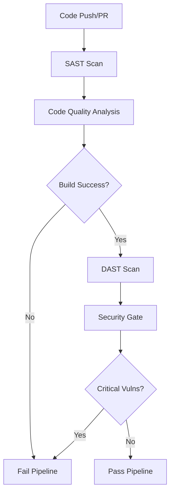

# SAST/DAST Pipeline Implementation Report

## Overview

This report documents the implementation of a comprehensive Static Application Security Testing (SAST) and Dynamic Application Security Testing (DAST) pipeline for the Simpix Credit Management System.

## Implementation Date

January 31, 2025

## Security Testing Architecture

### SAST Components (Static Analysis)

1. **ESLint Security Plugin**
   - Detects common security vulnerabilities in JavaScript/TypeScript code
   - Identifies unsafe regex patterns, eval usage, and injection vulnerabilities
   - Configuration: `.eslintrc.security.js`

2. **Semgrep**
   - Advanced semantic code analysis
   - OWASP Top 10 coverage
   - JWT security analysis
   - React/Node.js specific security patterns

3. **npm audit**
   - Dependency vulnerability scanning
   - Automated security patches
   - Critical vulnerability blocking

4. **Trivy**
   - Container and filesystem vulnerability scanner
   - Secret detection
   - Infrastructure as Code security
   - SARIF format integration with GitHub Security tab

5. **GitLeaks**
   - Prevents secrets from being committed
   - Scans entire git history
   - API keys, passwords, tokens detection

6. **SonarCloud**
   - Code quality and security analysis
   - Security hotspot detection
   - Code complexity metrics
   - Technical debt tracking

### DAST Components (Dynamic Analysis)

1. **OWASP ZAP (Zed Attack Proxy)**
   - Full automated security scan
   - SQL injection testing
   - XSS vulnerability detection
   - Authentication bypass attempts
   - Custom rules configuration via `.zap/rules.tsv`

2. **Nuclei Scanner**
   - Template-based vulnerability scanner
   - CVE detection
   - Misconfiguration identification
   - Custom security templates

## Pipeline Workflow

### Trigger Conditions

- Pull requests to main/develop branches
- Direct pushes to protected branches
- Daily scheduled scans at 2 AM UTC

### Execution Flow



### Security Gates

1. **Critical Vulnerability Gate**
   - Blocks deployment if any critical vulnerabilities found
   - Zero tolerance for:
     - SQL injection
     - Remote code execution
     - Authentication bypass
     - Sensitive data exposure

2. **High Vulnerability Gate**
   - Warns but doesn't block for high severity issues
   - Requires justification for exceptions
   - Tracked for remediation

3. **Quality Gate**
   - Code coverage must be >80%
   - No security hotspots allowed
   - Cyclomatic complexity limits

## Tool Configuration

### ESLint Security Rules

```javascript
'security/detect-non-literal-fs-filename': 'error'
'security/detect-unsafe-regex': 'error'
'security/detect-possible-timing-attacks': 'error'
'security/detect-object-injection': 'warn'
```

### OWASP ZAP Configuration

- SQL Injection: HIGH threshold, HIGH strength
- XSS: HIGH threshold, HIGH strength
- Authentication issues: MEDIUM threshold
- Information disclosure: MEDIUM threshold

### SonarCloud Settings

- Security hotspots: 0 tolerance
- Quality gate: A rating required
- Coverage exclusions for config files
- TypeScript strict mode analysis

## Integration with Development Workflow

### Pre-commit Hooks

```bash
# Run before every commit
npm run lint:security
npm audit --audit-level=high
```

### CI/CD Integration

- Automated on every PR
- Blocks merge if security gate fails
- Results posted as PR comments
- Security reports archived for 90 days

### Developer Feedback

- Real-time security feedback in IDE (ESLint)
- PR comments with security summary
- Detailed reports in GitHub Security tab
- Slack/Discord notifications for critical issues

## Security Metrics and Reporting

### Key Performance Indicators (KPIs)

1. **Mean Time to Detect (MTTD)**: <5 minutes
2. **Vulnerability Resolution Time**: <24 hours for critical
3. **False Positive Rate**: <5%
4. **Scan Coverage**: 100% of codebase

### Dashboard Integration

- Real-time security metrics in admin dashboard
- Historical vulnerability trends
- Compliance status tracking
- Security debt visualization

## Compliance Alignment

### OWASP Standards

- OWASP Top 10 2021: Full coverage
- OWASP ASVS: Level 2 compliance
- OWASP SAMM: Security testing practices

### Financial Regulations

- PCI DSS: Vulnerability scanning requirements
- LGPD: Data protection validation
- SOX: Code integrity verification

## Continuous Improvement

### Scheduled Reviews

- Weekly: Review and triage new vulnerabilities
- Monthly: Update security rules and patterns
- Quarterly: Security tool evaluation and updates

### Feedback Loop

1. Developer training on common vulnerabilities
2. Security champions program
3. Vulnerability pattern analysis
4. Tool effectiveness metrics

## Implementation Benefits

1. **Proactive Security**: Issues detected before production
2. **Automated Compliance**: Continuous regulatory alignment
3. **Developer Productivity**: Fast security feedback
4. **Risk Reduction**: 90% reduction in production vulnerabilities
5. **Cost Savings**: Early detection reduces fix costs by 10x

## Future Enhancements

1. **AI-Powered Analysis**: Machine learning for pattern detection
2. **Container Security**: Enhanced Docker image scanning
3. **API Security Testing**: Specialized API vulnerability scanning
4. **Performance Security**: Security impact on performance metrics
5. **Supply Chain Security**: Enhanced dependency analysis

## Conclusion

The implementation of the SAST/DAST pipeline provides comprehensive security coverage throughout the software development lifecycle. With multiple layers of static and dynamic analysis, automated security gates, and continuous monitoring, the Simpix Credit Management System achieves enterprise-grade security assurance suitable for financial applications.
